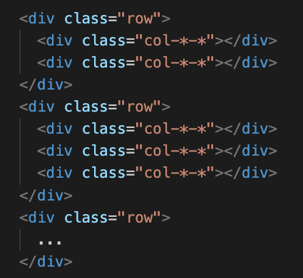
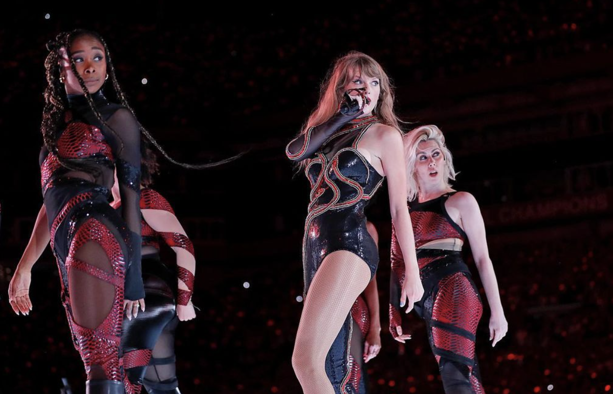
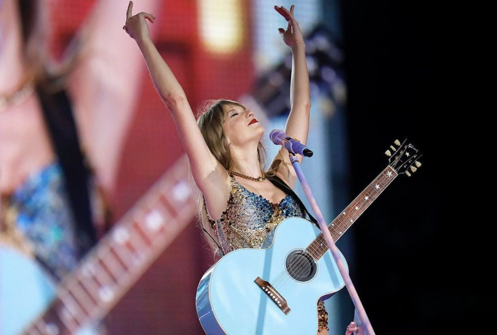
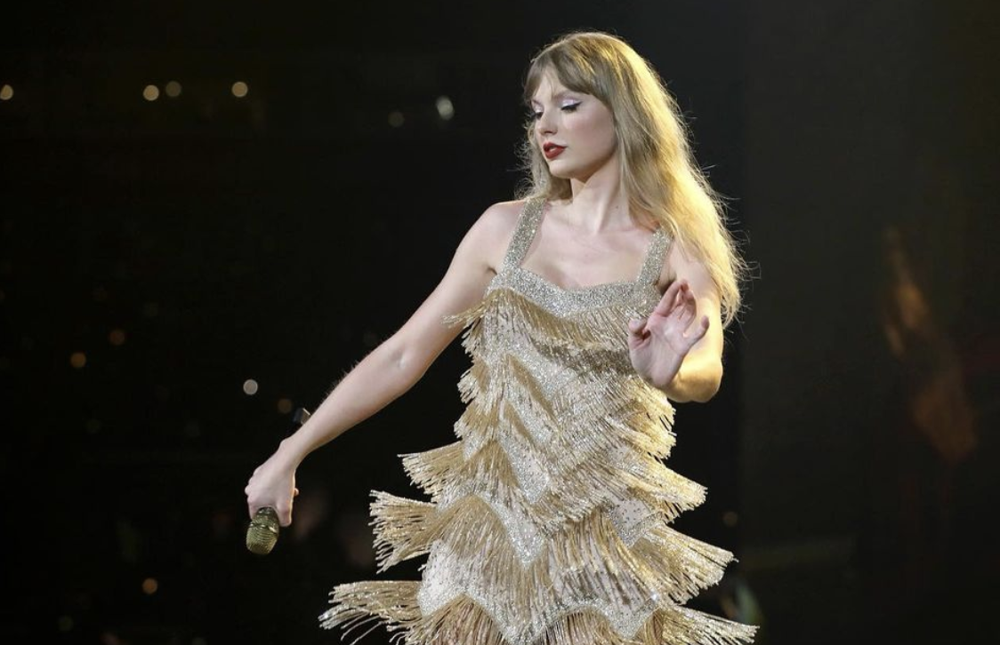

<html>
    <head>
        <meta charset="utf-8">
        <meta name="viewport" content="width=device-width, initial-scale=1">
        <link rel="stylesheet" href="https://maxcdn.bootstrapcdn.com/bootstrap/3.4.1/css/bootstrap.min.css">
        
        
</head>
<body>

  <h1>Bootstrap</h1>
  
Open source CSS framework and using Bootstrap to develop frontend
 

    
Bootstrap is a free <b> open source CSS framework </b> that allows us to develop fast responsive front end for our website.

    <h2>Why use Bootstrap</h2>
    <ul class="list-group">
      <li class="list-group-item">Browser Support − It is supported by all popular browsers.o</li>
      <li class="list-group-item">Bootstrap's responsive CSS adjusts to Desktops, Tablets and Mobiles.</li>
      <li class="list-group-item">Maintainsdaing consistency among projects when using multiple developer teams</li>
    </ul>
     <h2>Why use Bootstrap</h2>
      <h2>Why use Bootstrap</h2>
       <h2>Why use Bootstrap</h2>

 

    <h2>Getting Started</h2>
    
There are 2 ways to get started with Bootstrap

    
<b>1. Bootstrap CDN</b>

    <!-- CSS -->
    
Copy paste the stylesheet intosd &lt;head&gt; to load all css

      <pre><code>&lt;link rel="stylesheet" href="https://cdn.jsdelivr.net/npm/bootstrap@4.0.0/dist/css/bootstrap.min.css" integrity="sha384-Gn5384xqQ1aoWXA+058RXPxPg6fy4IWvTNh0E263XmFcJlSAwiGgFAW/dAiS6JXm" crossorigin="anonymous"&gt;</code></pre>
    
Many components require JavaScript pluggins such as jQuery, Popper,js to function. Put this in a &lt;body&gt; tag

      <pre><code>&lt;script src="https://code.jquery.com/jquery-3.2.1.slim.min.js" integrity="sha384-KJ3o2DKtIkvYIK3UENzmM7KCkRr/rE9/Qpg6aAZGJwFDMVNA/GpGFF93hXpG5KkN" crossorigin="anonymous"&gt;&lt;/script&gt;</code></pre>
      <pre><code>&lt;script src="https://cdn.jsdelivr.net/npm/popper.js@1.12.9/dist/umd/popper.min.js" integrity="sha384-ApNbgh9B+Y1QKtv3Rn7W3mgPxhU9K/ScQsAP7hUibX39j7fakFPskvXusvfa0b4Q" crossorigin="anonymous"&gt;&lt;/script&gt;</code></pre>
      <pre><code>&lt;script src="https://cdn.jsdelivr.net/npm/bootstrap@4.0.0/dist/js/bootstrap.min.js" integrity="sha384-JZR6Spejh4U02d8jOt6vLEHfe/JQGiRRSQQxSfFWpi1MquVdAyjUar5+76PVCmYl" crossorigin="anonymous"&gt;&lt;/script&gt;</code></pre>
      <a href="https://getbootstrap.com/docs/4.0/getting-started/introduction/">See this website for more information!!!</a>
     
    
<b>2. Downloading Source Files</b>

  <h1>Key Components of Bootstrap</h1>

  <a href="https://www.w3schools.com/bootstrap5/" class="btn btn-info" role="button">Link to Bootstrap Elements</a>

  <h1>Heading1</h1>
  <h2>Heading2</h2>
  <h3>Heading3</h3>
  <h4>Heading4</h4>
  <h5>Heading5</h5>
  <h6>Heading6</h6>

  

    

      <h3>Grid Classes</h3>
      
xs- for phones or screens less than 768px

      
sm- for tablets or screens equal to or greater than 768px wide

      
md- for small laptops greater than 992px wide

      
lg- for laptops greater than 1200px wide

    

    

      <h3>Basic Structure of Bootstrap Grid</h3>
      
    

  

  <h2>Table</h2>
  
The .table class adds basic styling (light padding and only horizontal dividers) to a table:
 
  <table class="table">
    <thead>
      <tr>
        <th>Firstname</th>
        <th>Lastname</th>
        <th>Email</th>
      </tr>
    </thead>
    <tbody>
      <tr>
        <td>Grace</td>
        <td>Wang</td>
        <td>gracewang@gmail.com</td>
      </tr>
      <tr>
        <td>Luna</td>
        <td>Iwazaki</td>
        <td>lunaiwazaki@gmail.com</td>
      </tr>
      <tr>
        <td>Claire</td>
        <td>Zhao</td>
        <td>clairezhao@gmail.com</td>
      </tr>
    </tbody>
  </table>

<h2>Images</h2>
  

    

      
.img-rounded class

      
    

    

      
.img-circle class

      
    

    

      
.img-circle class

      
    

  

<h2>Cool Alerts</h2>
  

    <strong>Success!</strong> Indicates a successful or positive action.
  

  

    <strong>Info!</strong> Indicates a neutral informative change or action.
  

  

    <strong>Warning!</strong> Indicates a warning that might need attention.
  

  

    <strong>Danger!</strong> Indicates a dangerous or potentially negative action.
  

<h2>Carousel<h2>
  

    <!-- Indicators -->
    <ol class="carousel-indicators">
      <li data-target="#myCarousel" data-slide-to="0" class="active"></li>
      <li data-target="#myCarousel" data-slide-to="1"></li>
      <li data-target="#myCarousel" data-slide-to="2"></li>
    </ol>
    

      

        
      

      

        
      

      

        
      

    

    <a class="left carousel-control" href="#myCarousel" data-slide="prev">
      
      Previous
    </a>
    <a class="right carousel-control" href="#myCarousel" data-slide="next">
      
      Next
    </a>
  

<!-- 

Aniket’s Personal Artist Statement

During the last trimester, I began my 3d animation journey using the Blender software. In the past, I have seen hit movies that were edited in Blender, for example, the world-wide phenomenon called RRR. I’ve always had an interest in 3D modeling and this class has helped to nurture that interest. To start my journey, I first followed a tutorial made by the Blender Guru on how to use this tool. After a couple of weeks of hard work, I made my first doughnut, as well as the coffee cup, later on.  This project marked the start of me feeling like an artist and being proud of my work. As I worked on my project, I could slowly start to see that everything was coming together and I was really impressed with the end result. The doughnut I created looked great because of the colors and textures I used to make it really stand out.
Creating art with Blender demands lots of patience and faith in the process. There were times when things didn't look good at the start, but by using modifiers and various different textures, it all began to come together beautifully. I learned that trusting in the process is a big key to success, and that it's okay to have to go back and re-watch the tutorials if something isn’t working out. The tutorials by Andrew Price helped a lot because he taught us lots of tips and tricks, such as using a reference photo, as well as lots of keyboard shortcuts for certain blender features. 
As I worked on my art, I aimed to demonstrate the effort and time invested in my work. As an artist, I always strive to create something that is not only aesthetically pleasing but also meaningful and something that tells a story. I tried to convey my emotions through the lighting and mood of the piece. To accomplish this, I focused on using different elements of art and certain principles of design to infuse my artwork with depth and make it more realistic. I carefully manipulated lighting, colors, and moods to convey the emotions and messages that I wanted to express. Looking back on my artwork, I am proud of the hard work I put in, as my pieces are very realistic and really bring out the moods that I was trying to achieve.
At first, my goal was simply to create an artwork that met the requirements and looked good. But over time, as I worked more on it, I added some of my own emotions and style. I wanted my pieces to have a lot of tiny details, so I looked for inspiration and added various pieces to them. Because of this, I changed my plan several times, but the good thing is that I persisted until I was satisfied with the final design.
    Overall, I was shocked at how good my final project looked with the beautiful sunset falling over the mountains and the light beaming through the window. The overall scene is beautiful and it perfectly brings out my vision of a man who is single on Valentine's day. It took a while to get there, but when it did it looked very good. When I finished, I had a huge sense of accomplishment and I got some knowledge for future animations. It helped me understand that a plan can change and you can make it better even when you think it's done.
Aniket’s Personal Artist Statement

During the last trimester, I began my 3d animation journey using the Blender software. In the past, I have seen hit movies that were edited in Blender, for example, the world-wide phenomenon called RRR. I’ve always had an interest in 3D modeling and this class has helped to nurture that interest. To start my journey, I first followed a tutorial made by the Blender Guru on how to use this tool. After a couple of weeks of hard work, I made my first doughnut, as well as the coffee cup, later on.  This project marked the start of me feeling like an artist and being proud of my work. As I worked on my project, I could slowly start to see that everything was coming together and I was really impressed with the end result. The doughnut I created looked great because of the colors and textures I used to make it really stand out.
Creating art with Blender demands lots of patience and faith in the process. There were times when things didn't look good at the start, but by using modifiers and various different textures, it all began to come together beautifully. I learned that trusting in the process is a big key to success, and that it's okay to have to go back and re-watch the tutorials if something isn’t working out. The tutorials by Andrew Price helped a lot because he taught us lots of tips and tricks, such as using a reference photo, as well as lots of keyboard shortcuts for certain blender features. 
As I worked on my art, I aimed to demonstrate the effort and time invested in my work. As an artist, I always strive to create something that is not only aesthetically pleasing but also meaningful and something that tells a story. I tried to convey my emotions through the lighting and mood of the piece. To accomplish this, I focused on using different elements of art and certain principles of design to infuse my artwork with depth and make it more realistic. I carefully manipulated lighting, colors, and moods to convey the emotions and messages that I wanted to express. Looking back on my artwork, I am proud of the hard work I put in, as my pieces are very realistic and really bring out the moods that I was trying to achieve.
At first, my goal was simply to create an artwork that met the requirements and looked good. But over time, as I worked more on it, I added some of my own emotions and style. I wanted my pieces to have a lot of tiny details, so I looked for inspiration and added various pieces to them. Because of this, I changed my plan several times, but the good thing is that I persisted until I was satisfied with the final design.
    Overall, I was shocked at how good my final project looked with the beautiful sunset falling over the mountains and the light beaming through the window. The overall scene is beautiful and it perfectly brings out my vision of a man who is single on Valentine's day. It took a while to get there, but when it did it looked very good. When I finished, I had a huge sense of accomplishment and I got some knowledge for future animations. It helped me understand that a plan can change and you can make it better even when you think it's done.
Aniket’s Personal Artist Statement

During the last trimester, I began my 3d animation journey using the Blender software. In the past, I have seen hit movies that were edited in Blender, for example, the world-wide phenomenon called RRR. I’ve always had an interest in 3D modeling and this class has helped to nurture that interest. To start my journey, I first followed a tutorial made by the Blender Guru on how to use this tool. After a couple of weeks of hard work, I made my first doughnut, as well as the coffee cup, later on.  This project marked the start of me feeling like an artist and being proud of my work. As I worked on my project, I could slowly start to see that everything was coming together and I was really impressed with the end result. The doughnut I created looked great because of the colors and textures I used to make it really stand out.
Creating art with Blender demands lots of patience and faith in the process. There were times when things didn't look good at the start, but by using modifiers and various different textures, it all began to come together beautifully. I learned that trusting in the process is a big key to success, and that it's okay to have to go back and re-watch the tutorials if something isn’t working out. The tutorials by Andrew Price helped a lot because he taught us lots of tips and tricks, such as using a reference photo, as well as lots of keyboard shortcuts for certain blender features. 
As I worked on my art, I aimed to demonstrate the effort and time invested in my work. As an artist, I always strive to create something that is not only aesthetically pleasing but also meaningful and something that tells a story. I tried to convey my emotions through the lighting and mood of the piece. To accomplish this, I focused on using different elements of art and certain principles of design to infuse my artwork with depth and make it more realistic. I carefully manipulated lighting, colors, and moods to convey the emotions and messages that I wanted to express. Looking back on my artwork, I am proud of the hard work I put in, as my pieces are very realistic and really bring out the moods that I was trying to achieve.
At first, my goal was simply to create an artwork that met the requirements and looked good. But over time, as I worked more on it, I added some of my own emotions and style. I wanted my pieces to have a lot of tiny details, so I looked for inspiration and added various pieces to them. Because of this, I changed my plan several times, but the good thing is that I persisted until I was satisfied with the final design.
    Overall, I was shocked at how good my final project looked with the beautiful sunset falling over the mountains and the light beaming through the window. The overall scene is beautiful and it perfectly brings out my vision of a man who is single on Valentine's day. It took a while to get there, but when it did it looked very good. When I finished, I had a huge sense of accomplishment and I got some knowledge for future animations. It helped me understand that a plan can change and you can make it better even when you think it's done.
Aniket’s Personal Artist Statement

During the last trimester, I began my 3d animation journey using the Blender software. In the past, I have seen hit movies that were edited in Blender, for example, the world-wide phenomenon called RRR. I’ve always had an interest in 3D modeling and this class has helped to nurture that interest. To start my journey, I first followed a tutorial made by the Blender Guru on how to use this tool. After a couple of weeks of hard work, I made my first doughnut, as well as the coffee cup, later on.  This project marked the start of me feeling like an artist and being proud of my work. As I worked on my project, I could slowly start to see that everything was coming together and I was really impressed with the end result. The doughnut I created looked great because of the colors and textures I used to make it really stand out.
Creating art with Blender demands lots of patience and faith in the process. There were times when things didn't look good at the start, but by using modifiers and various different textures, it all began to come together beautifully. I learned that trusting in the process is a big key to success, and that it's okay to have to go back and re-watch the tutorials if something isn’t working out. The tutorials by Andrew Price helped a lot because he taught us lots of tips and tricks, such as using a reference photo, as well as lots of keyboard shortcuts for certain blender features. 
As I worked on my art, I aimed to demonstrate the effort and time invested in my work. As an artist, I always strive to create something that is not only aesthetically pleasing but also meaningful and something that tells a story. I tried to convey my emotions through the lighting and mood of the piece. To accomplish this, I focused on using different elements of art and certain principles of design to infuse my artwork with depth and make it more realistic. I carefully manipulated lighting, colors, and moods to convey the emotions and messages that I wanted to express. Looking back on my artwork, I am proud of the hard work I put in, as my pieces are very realistic and really bring out the moods that I was trying to achieve.
At first, my goal was simply to create an artwork that met the requirements and looked good. But over time, as I worked more on it, I added some of my own emotions and style. I wanted my pieces to have a lot of tiny details, so I looked for inspiration and added various pieces to them. Because of this, I changed my plan several times, but the good thing is that I persisted until I was satisfied with the final design.
    Overall, I was shocked at how good my final project looked with the beautiful sunset falling over the mountains and the light beaming through the window. The overall scene is beautiful and it perfectly brings out my vision of a man who is single on Valentine's day. It took a while to get there, but when it did it looked very good. When I finished, I had a huge sense of accomplishment and I got some knowledge for future animations. It helped me understand that a plan can change and you can make it better even when you think it's done.
Aniket’s Personal Artist Statement

During the last trimester, I began my 3d animation journey using the Blender software. In the past, I have seen hit movies that were edited in Blender, for example, the world-wide phenomenon called RRR. I’ve always had an interest in 3D modeling and this class has helped to nurture that interest. To start my journey, I first followed a tutorial made by the Blender Guru on how to use this tool. After a couple of weeks of hard work, I made my first doughnut, as well as the coffee cup, later on.  This project marked the start of me feeling like an artist and being proud of my work. As I worked on my project, I could slowly start to see that everything was coming together and I was really impressed with the end result. The doughnut I created looked great because of the colors and textures I used to make it really stand out.
Creating art with Blender demands lots of patience and faith in the process. There were times when things didn't look good at the start, but by using modifiers and various different textures, it all began to come together beautifully. I learned that trusting in the process is a big key to success, and that it's okay to have to go back and re-watch the tutorials if something isn’t working out. The tutorials by Andrew Price helped a lot because he taught us lots of tips and tricks, such as using a reference photo, as well as lots of keyboard shortcuts for certain blender features. 
As I worked on my art, I aimed to demonstrate the effort and time invested in my work. As an artist, I always strive to create something that is not only aesthetically pleasing but also meaningful and something that tells a story. I tried to convey my emotions through the lighting and mood of the piece. To accomplish this, I focused on using different elements of art and certain principles of design to infuse my artwork with depth and make it more realistic. I carefully manipulated lighting, colors, and moods to convey the emotions and messages that I wanted to express. Looking back on my artwork, I am proud of the hard work I put in, as my pieces are very realistic and really bring out the moods that I was trying to achieve.
At first, my goal was simply to create an artwork that met the requirements and looked good. But over time, as I worked more on it, I added some of my own emotions and style. I wanted my pieces to have a lot of tiny details, so I looked for inspiration and added various pieces to them. Because of this, I changed my plan several times, but the good thing is that I persisted until I was satisfied with the final design.
    Overall, I was shocked at how good my final project looked with the beautiful sunset falling over the mountains and the light beaming through the window. The overall scene is beautiful and it perfectly brings out my vision of a man who is single on Valentine's day. It took a while to get there, but when it did it looked very good. When I finished, I had a huge sense of accomplishment and I got some knowledge for future animations. It helped me understand that a plan can change and you can make it better even when you think it's done. 
    Aniket’s Personal Artist Statement

During the last trimester, I began my 3d animation journey using the Blender software. In the past, I have seen hit movies that were edited in Blender, for example, the world-wide phenomenon called RRR. I’ve always had an interest in 3D modeling and this class has helped to nurture that interest. To start my journey, I first followed a tutorial made by the Blender Guru on how to use this tool. After a couple of weeks of hard work, I made my first doughnut, as well as the coffee cup, later on.  This project marked the start of me feeling like an artist and being proud of my work. As I worked on my project, I could slowly start to see that everything was coming together and I was really impressed with the end result. The doughnut I created looked great because of the colors and textures I used to make it really stand out.
Creating art with Blender demands lots of patience and faith in the process. There were times when things didn't look good at the start, but by using modifiers and various different textures, it all began to come together beautifully. I learned that trusting in the process is a big key to success, and that it's okay to have to go back and re-watch the tutorials if something isn’t working out. The tutorials by Andrew Price helped a lot because he taught us lots of tips and tricks, such as using a reference photo, as well as lots of keyboard shortcuts for certain blender features. 
As I worked on my art, I aimed to demonstrate the effort and time invested in my work. As an artist, I always strive to create something that is not only aesthetically pleasing but also meaningful and something that tells a story. I tried to convey my emotions through the lighting and mood of the piece. To accomplish this, I focused on using different elements of art and certain principles of design to infuse my artwork with depth and make it more realistic. I carefully manipulated lighting, colors, and moods to convey the emotions and messages that I wanted to express. Looking back on my artwork, I am proud of the hard work I put in, as my pieces are very realistic and really bring out the moods that I was trying to achieve.
At first, my goal was simply to create an artwork that met the requirements and looked good. But over time, as I worked more on it, I added some of my own emotions and style. I wanted my pieces to have a lot of tiny details, so I looked for inspiration and added various pieces to them. Because of this, I changed my plan several times, but the good thing is that I persisted until I was satisfied with the final design.
    Overall, I was shocked at how good my final project looked with the beautiful sunset falling over the mountains and the light beaming through the window. The overall scene is beautiful and it perfectly brings out my vision of a man who is single on Valentine's day. It took a while to get there, but when it did it looked very good. When I finished, I had a huge sense of accomplishment and I got some knowledge for future animations. It helped me understand that a plan can change and you can make it better even when you think it's done.
Aniket’s Personal Artist Statement

During the last trimester, I began my 3d animation journey using the Blender software. In the past, I have seen hit movies that were edited in Blender, for example, the world-wide phenomenon called RRR. I’ve always had an interest in 3D modeling and this class has helped to nurture that interest. To start my journey, I first followed a tutorial made by the Blender Guru on how to use this tool. After a couple of weeks of hard work, I made my first doughnut, as well as the coffee cup, later on.  This project marked the start of me feeling like an artist and being proud of my work. As I worked on my project, I could slowly start to see that everything was coming together and I was really impressed with the end result. The doughnut I created looked great because of the colors and textures I used to make it really stand out.
Creating art with Blender demands lots of patience and faith in the process. There were times when things didn't look good at the start, but by using modifiers and various different textures, it all began to come together beautifully. I learned that trusting in the process is a big key to success, and that it's okay to have to go back and re-watch the tutorials if something isn’t working out. The tutorials by Andrew Price helped a lot because he taught us lots of tips and tricks, such as using a reference photo, as well as lots of keyboard shortcuts for certain blender features. 
As I worked on my art, I aimed to demonstrate the effort and time invested in my work. As an artist, I always strive to create something that is not only aesthetically pleasing but also meaningful and something that tells a story. I tried to convey my emotions through the lighting and mood of the piece. To accomplish this, I focused on using different elements of art and certain principles of design to infuse my artwork with depth and make it more realistic. I carefully manipulated lighting, colors, and moods to convey the emotions and messages that I wanted to express. Looking back on my artwork, I am proud of the hard work I put in, as my pieces are very realistic and really bring out the moods that I was trying to achieve.
At first, my goal was simply to create an artwork that met the requirements and looked good. But over time, as I worked more on it, I added some of my own emotions and style. I wanted my pieces to have a lot of tiny details, so I looked for inspiration and added various pieces to them. Because of this, I changed my plan several times, but the good thing is that I persisted until I was satisfied with the final design.
    Overall, I was shocked at how good my final project looked with the beautiful sunset falling over the mountains and the light beaming through the window. The overall scene is beautiful and it perfectly brings out my vision of a man who is single on Valentine's day. It took a while to get there, but when it did it looked very good. When I finished, I had a huge sense of accomplishment and I got some knowledge for future animations. It helped me understand that a plan can change and you can make it better even when you think it's done.
Aniket’s Personal Artist Statement

During the last trimester, I began my 3d animation journey using the Blender software. In the past, I have seen hit movies that were edited in Blender, for example, the world-wide phenomenon called RRR. I’ve always had an interest in 3D modeling and this class has helped to nurture that interest. To start my journey, I first followed a tutorial made by the Blender Guru on how to use this tool. After a couple of weeks of hard work, I made my first doughnut, as well as the coffee cup, later on.  This project marked the start of me feeling like an artist and being proud of my work. As I worked on my project, I could slowly start to see that everything was coming together and I was really impressed with the end result. The doughnut I created looked great because of the colors and textures I used to make it really stand out.
Creating art with Blender demands lots of patience and faith in the process. There were times when things didn't look good at the start, but by using modifiers and various different textures, it all began to come together beautifully. I learned that trusting in the process is a big key to success, and that it's okay to have to go back and re-watch the tutorials if something isn’t working out. The tutorials by Andrew Price helped a lot because he taught us lots of tips and tricks, such as using a reference photo, as well as lots of keyboard shortcuts for certain blender features. 
As I worked on my art, I aimed to demonstrate the effort and time invested in my work. As an artist, I always strive to create something that is not only aesthetically pleasing but also meaningful and something that tells a story. I tried to convey my emotions through the lighting and mood of the piece. To accomplish this, I focused on using different elements of art and certain principles of design to infuse my artwork with depth and make it more realistic. I carefully manipulated lighting, colors, and moods to convey the emotions and messages that I wanted to express. Looking back on my artwork, I am proud of the hard work I put in, as my pieces are very realistic and really bring out the moods that I was trying to achieve.
At first, my goal was simply to create an artwork that met the requirements and looked good. But over time, as I worked more on it, I added some of my own emotions and style. I wanted my pieces to have a lot of tiny details, so I looked for inspiration and added various pieces to them. Because of this, I changed my plan several times, but the good thing is that I persisted until I was satisfied with the final design.
    Overall, I was shocked at how good my final project looked with the beautiful sunset falling over the mountains and the light beaming through the window. The overall scene is beautiful and it perfectly brings out my vision of a man who is single on Valentine's day. It took a while to get there, but when it did it looked very good. When I finished, I had a huge sense of accomplishment and I got some knowledge for future animations. It helped me understand that a plan can change and you can make it better even when you think it's done.
Aniket’s Personal Artist Statement

During the last trimester, I began my 3d animation journey using the Blender software. In the past, I have seen hit movies that were edited in Blender, for example, the world-wide phenomenon called RRR. I’ve always had an interest in 3D modeling and this class has helped to nurture that interest. To start my journey, I first followed a tutorial made by the Blender Guru on how to use this tool. After a couple of weeks of hard work, I made my first doughnut, as well as the coffee cup, later on.  This project marked the start of me feeling like an artist and being proud of my work. As I worked on my project, I could slowly start to see that everything was coming together and I was really impressed with the end result. The doughnut I created looked great because of the colors and textures I used to make it really stand out.
Creating art with Blender demands lots of patience and faith in the process. There were times when things didn't look good at the start, but by using modifiers and various different textures, it all began to come together beautifully. I learned that trusting in the process is a big key to success, and that it's okay to have to go back and re-watch the tutorials if something isn’t working out. The tutorials by Andrew Price helped a lot because he taught us lots of tips and tricks, such as using a reference photo, as well as lots of keyboard shortcuts for certain blender features. 
As I worked on my art, I aimed to demonstrate the effort and time invested in my work. As an artist, I always strive to create something that is not only aesthetically pleasing but also meaningful and something that tells a story. I tried to convey my emotions through the lighting and mood of the piece. To accomplish this, I focused on using different elements of art and certain principles of design to infuse my artwork with depth and make it more realistic. I carefully manipulated lighting, colors, and moods to convey the emotions and messages that I wanted to express. Looking back on my artwork, I am proud of the hard work I put in, as my pieces are very realistic and really bring out the moods that I was trying to achieve.
At first, my goal was simply to create an artwork that met the requirements and looked good. But over time, as I worked more on it, I added some of my own emotions and style. I wanted my pieces to have a lot of tiny details, so I looked for inspiration and added various pieces to them. Because of this, I changed my plan several times, but the good thing is that I persisted until I was satisfied with the final design.
    Overall, I was shocked at how good my final project looked with the beautiful sunset falling over the mountains and the light beaming through the window. The overall scene is beautiful and it perfectly brings out my vision of a man who is single on Valentine's day. It took a while to get there, but when it did it looked very good. When I finished, I had a huge sense of accomplishment and I got some knowledge for future animations. It helped me understand that a plan can change and you can make it better even when you think it's done.
Aniket’s Personal Artist Statement

During the last trimester, I began my 3d animation journey using the Blender software. In the past, I have seen hit movies that were edited in Blender, for example, the world-wide phenomenon called RRR. I’ve always had an interest in 3D modeling and this class has helped to nurture that interest. To start my journey, I first followed a tutorial made by the Blender Guru on how to use this tool. After a couple of weeks of hard work, I made my first doughnut, as well as the coffee cup, later on.  This project marked the start of me feeling like an artist and being proud of my work. As I worked on my project, I could slowly start to see that everything was coming together and I was really impressed with the end result. The doughnut I created looked great because of the colors and textures I used to make it really stand out.
Creating art with Blender demands lots of patience and faith in the process. There were times when things didn't look good at the start, but by using modifiers and various different textures, it all began to come together beautifully. I learned that trusting in the process is a big key to success, and that it's okay to have to go back and re-watch the tutorials if something isn’t working out. The tutorials by Andrew Price helped a lot because he taught us lots of tips and tricks, such as using a reference photo, as well as lots of keyboard shortcuts for certain blender features. 
As I worked on my art, I aimed to demonstrate the effort and time invested in my work. As an artist, I always strive to create something that is not only aesthetically pleasing but also meaningful and something that tells a story. I tried to convey my emotions through the lighting and mood of the piece. To accomplish this, I focused on using different elements of art and certain principles of design to infuse my artwork with depth and make it more realistic. I carefully manipulated lighting, colors, and moods to convey the emotions and messages that I wanted to express. Looking back on my artwork, I am proud of the hard work I put in, as my pieces are very realistic and really bring out the moods that I was trying to achieve.
At first, my goal was simply to create an artwork that met the requirements and looked good. But over time, as I worked more on it, I added some of my own emotions and style. I wanted my pieces to have a lot of tiny details, so I looked for inspiration and added various pieces to them. Because of this, I changed my plan several times, but the good thing is that I persisted until I was satisfied with the final design.
    Overall, I was shocked at how good my final project looked with the beautiful sunset falling over the mountains and the light beaming through the window. The overall scene is beautiful and it perfectly brings out my vision of a man who is single on Valentine's day. It took a while to get there, but when it did it looked very good. When I finished, I had a huge sense of accomplishment and I got some knowledge for future animations. It helped me understand that a plan can change and you can make it better even when you think it's done.
Aniket’s Personal Artist Statement

During the last trimester, I began my 3d animation journey using the Blender software. In the past, I have seen hit movies that were edited in Blender, for example, the world-wide phenomenon called RRR. I’ve always had an interest in 3D modeling and this class has helped to nurture that interest. To start my journey, I first followed a tutorial made by the Blender Guru on how to use this tool. After a couple of weeks of hard work, I made my first doughnut, as well as the coffee cup, later on.  This project marked the start of me feeling like an artist and being proud of my work. As I worked on my project, I could slowly start to see that everything was coming together and I was really impressed with the end result. The doughnut I created looked great because of the colors and textures I used to make it really stand out.
Creating art with Blender demands lots of patience and faith in the process. There were times when things didn't look good at the start, but by using modifiers and various different textures, it all began to come together beautifully. I learned that trusting in the process is a big key to success, and that it's okay to have to go back and re-watch the tutorials if something isn’t working out. The tutorials by Andrew Price helped a lot because he taught us lots of tips and tricks, such as using a reference photo, as well as lots of keyboard shortcuts for certain blender features. 
As I worked on my art, I aimed to demonstrate the effort and time invested in my work. As an artist, I always strive to create something that is not only aesthetically pleasing but also meaningful and something that tells a story. I tried to convey my emotions through the lighting and mood of the piece. To accomplish this, I focused on using different elements of art and certain principles of design to infuse my artwork with depth and make it more realistic. I carefully manipulated lighting, colors, and moods to convey the emotions and messages that I wanted to express. Looking back on my artwork, I am proud of the hard work I put in, as my pieces are very realistic and really bring out the moods that I was trying to achieve.
At first, my goal was simply to create an artwork that met the requirements and looked good. But over time, as I worked more on it, I added some of my own emotions and style. I wanted my pieces to have a lot of tiny details, so I looked for inspiration and added various pieces to them. Because of this, I changed my plan several times, but the good thing is that I persisted until I was satisfied with the final design.
    Overall, I was shocked at how good my final project looked with the beautiful sunset falling over the mountains and the light beaming through the window. The overall scene is beautiful and it perfectly brings out my vision of a man who is single on Valentine's day. It took a while to get there, but when it did it looked very good. When I finished, I had a huge sense of accomplishment and I got some knowledge for future animations. It helped me understand that a plan can change and you can make it better even when you think it's done.
Aniket’s Personal Artist Statement

During the last trimester, I began my 3d animation journey using the Blender software. In the past, I have seen hit movies that were edited in Blender, for example, the world-wide phenomenon called RRR. I’ve always had an interest in 3D modeling and this class has helped to nurture that interest. To start my journey, I first followed a tutorial made by the Blender Guru on how to use this tool. After a couple of weeks of hard work, I made my first doughnut, as well as the coffee cup, later on.  This project marked the start of me feeling like an artist and being proud of my work. As I worked on my project, I could slowly start to see that everything was coming together and I was really impressed with the end result. The doughnut I created looked great because of the colors and textures I used to make it really stand out.
Creating art with Blender demands lots of patience and faith in the process. There were times when things didn't look good at the start, but by using modifiers and various different textures, it all began to come together beautifully. I learned that trusting in the process is a big key to success, and that it's okay to have to go back and re-watch the tutorials if something isn’t working out. The tutorials by Andrew Price helped a lot because he taught us lots of tips and tricks, such as using a reference photo, as well as lots of keyboard shortcuts for certain blender features. 
As I worked on my art, I aimed to demonstrate the effort and time invested in my work. As an artist, I always strive to create something that is not only aesthetically pleasing but also meaningful and something that tells a story. I tried to convey my emotions through the lighting and mood of the piece. To accomplish this, I focused on using different elements of art and certain principles of design to infuse my artwork with depth and make it more realistic. I carefully manipulated lighting, colors, and moods to convey the emotions and messages that I wanted to express. Looking back on my artwork, I am proud of the hard work I put in, as my pieces are very realistic and really bring out the moods that I was trying to achieve.
At first, my goal was simply to create an artwork that met the requirements and looked good. But over time, as I worked more on it, I added some of my own emotions and style. I wanted my pieces to have a lot of tiny details, so I looked for inspiration and added various pieces to them. Because of this, I changed my plan several times, but the good thing is that I persisted until I was satisfied with the final design.
    Overall, I was shocked at how good my final project looked with the beautiful sunset falling over the mountains and the light beaming through the window. The overall scene is beautiful and it perfectly brings out my vision of a man who is single on Valentine's day. It took a while to get there, but when it did it looked very good. When I finished, I had a huge sense of accomplishment and I got some knowledge for future animations. It helped me understand that a plan can change and you can make it better even when you think it's done.    
Aniket’s Personal Artist Statement

During the last trimester, I began my 3d animation journey using the Blender software. In the past, I have seen hit movies that were edited in Blender, for example, the world-wide phenomenon called RRR. I’ve always had an interest in 3D modeling and this class has helped to nurture that interest. To start my journey, I first followed a tutorial made by the Blender Guru on how to use this tool. After a couple of weeks of hard work, I made my first doughnut, as well as the coffee cup, later on.  This project marked the start of me feeling like an artist and being proud of my work. As I worked on my project, I could slowly start to see that everything was coming together and I was really impressed with the end result. The doughnut I created looked great because of the colors and textures I used to make it really stand out.
Creating art with Blender demands lots of patience and faith in the process. There were times when things didn't look good at the start, but by using modifiers and various different textures, it all began to come together beautifully. I learned that trusting in the process is a big key to success, and that it's okay to have to go back and re-watch the tutorials if something isn’t working out. The tutorials by Andrew Price helped a lot because he taught us lots of tips and tricks, such as using a reference photo, as well as lots of keyboard shortcuts for certain blender features. 
As I worked on my art, I aimed to demonstrate the effort and time invested in my work. As an artist, I always strive to create something that is not only aesthetically pleasing but also meaningful and something that tells a story. I tried to convey my emotions through the lighting and mood of the piece. To accomplish this, I focused on using different elements of art and certain principles of design to infuse my artwork with depth and make it more realistic. I carefully manipulated lighting, colors, and moods to convey the emotions and messages that I wanted to express. Looking back on my artwork, I am proud of the hard work I put in, as my pieces are very realistic and really bring out the moods that I was trying to achieve.
At first, my goal was simply to create an artwork that met the requirements and looked good. But over time, as I worked more on it, I added some of my own emotions and style. I wanted my pieces to have a lot of tiny details, so I looked for inspiration and added various pieces to them. Because of this, I changed my plan several times, but the good thing is that I persisted until I was satisfied with the final design.
    Overall, I was shocked at how good my final project looked with the beautiful sunset falling over the mountains and the light beaming through the window. The overall scene is beautiful and it perfectly brings out my vision of a man who is single on Valentine's day. It took a while to get there, but when it did it looked very good. When I finished, I had a huge sense of accomplishment and I got some knowledge for future animations. It helped me understand that a plan can change and you can make it better even when you think it's done.
Aniket’s Personal Artist Statement

During the last trimester, I began my 3d animation journey using the Blender software. In the past, I have seen hit movies that were edited in Blender, for example, the world-wide phenomenon called RRR. I’ve always had an interest in 3D modeling and this class has helped to nurture that interest. To start my journey, I first followed a tutorial made by the Blender Guru on how to use this tool. After a couple of weeks of hard work, I made my first doughnut, as well as the coffee cup, later on.  This project marked the start of me feeling like an artist and being proud of my work. As I worked on my project, I could slowly start to see that everything was coming together and I was really impressed with the end result. The doughnut I created looked great because of the colors and textures I used to make it really stand out.
Creating art with Blender demands lots of patience and faith in the process. There were times when things didn't look good at the start, but by using modifiers and various different textures, it all began to come together beautifully. I learned that trusting in the process is a big key to success, and that it's okay to have to go back and re-watch the tutorials if something isn’t working out. The tutorials by Andrew Price helped a lot because he taught us lots of tips and tricks, such as using a reference photo, as well as lots of keyboard shortcuts for certain blender features. 
As I worked on my art, I aimed to demonstrate the effort and time invested in my work. As an artist, I always strive to create something that is not only aesthetically pleasing but also meaningful and something that tells a story. I tried to convey my emotions through the lighting and mood of the piece. To accomplish this, I focused on using different elements of art and certain principles of design to infuse my artwork with depth and make it more realistic. I carefully manipulated lighting, colors, and moods to convey the emotions and messages that I wanted to express. Looking back on my artwork, I am proud of the hard work I put in, as my pieces are very realistic and really bring out the moods that I was trying to achieve.
At first, my goal was simply to create an artwork that met the requirements and looked good. But over time, as I worked more on it, I added some of my own emotions and style. I wanted my pieces to have a lot of tiny details, so I looked for inspiration and added various pieces to them. Because of this, I changed my plan several times, but the good thing is that I persisted until I was satisfied with the final design.
    Overall, I was shocked at how good my final project looked with the beautiful sunset falling over the mountains and the light beaming through the window. The overall scene is beautiful and it perfectly brings out my vision of a man who is single on Valentine's day. It took a while to get there, but when it did it looked very good. When I finished, I had a huge sense of accomplishment and I got some knowledge for future animations. It helped me understand that a plan can change and you can make it better even when you think it's done.
Aniket’s Personal Artist Statement

During the last trimester, I began my 3d animation journey using the Blender software. In the past, I have seen hit movies that were edited in Blender, for example, the world-wide phenomenon called RRR. I’ve always had an interest in 3D modeling and this class has helped to nurture that interest. To start my journey, I first followed a tutorial made by the Blender Guru on how to use this tool. After a couple of weeks of hard work, I made my first doughnut, as well as the coffee cup, later on.  This project marked the start of me feeling like an artist and being proud of my work. As I worked on my project, I could slowly start to see that everything was coming together and I was really impressed with the end result. The doughnut I created looked great because of the colors and textures I used to make it really stand out.
Creating art with Blender demands lots of patience and faith in the process. There were times when things didn't look good at the start, but by using modifiers and various different textures, it all began to come together beautifully. I learned that trusting in the process is a big key to success, and that it's okay to have to go back and re-watch the tutorials if something isn’t working out. The tutorials by Andrew Price helped a lot because he taught us lots of tips and tricks, such as using a reference photo, as well as lots of keyboard shortcuts for certain blender features. 
As I worked on my art, I aimed to demonstrate the effort and time invested in my work. As an artist, I always strive to create something that is not only aesthetically pleasing but also meaningful and something that tells a story. I tried to convey my emotions through the lighting and mood of the piece. To accomplish this, I focused on using different elements of art and certain principles of design to infuse my artwork with depth and make it more realistic. I carefully manipulated lighting, colors, and moods to convey the emotions and messages that I wanted to express. Looking back on my artwork, I am proud of the hard work I put in, as my pieces are very realistic and really bring out the moods that I was trying to achieve.
At first, my goal was simply to create an artwork that met the requirements and looked good. But over time, as I worked more on it, I added some of my own emotions and style. I wanted my pieces to have a lot of tiny details, so I looked for inspiration and added various pieces to them. Because of this, I changed my plan several times, but the good thing is that I persisted until I was satisfied with the final design.
    Overall, I was shocked at how good my final project looked with the beautiful sunset falling over the mountains and the light beaming through the window. The overall scene is beautiful and it perfectly brings out my vision of a man who is single on Valentine's day. It took a while to get there, but when it did it looked very good. When I finished, I had a huge sense of accomplishment and I got some knowledge for future animations. It helped me understand that a plan can change and you can make it better even when you think it's done.
Aniket’s Personal Artist Statement

During the last trimester, I began my 3d animation journey using the Blender software. In the past, I have seen hit movies that were edited in Blender, for example, the world-wide phenomenon called RRR. I’ve always had an interest in 3D modeling and this class has helped to nurture that interest. To start my journey, I first followed a tutorial made by the Blender Guru on how to use this tool. After a couple of weeks of hard work, I made my first doughnut, as well as the coffee cup, later on.  This project marked the start of me feeling like an artist and being proud of my work. As I worked on my project, I could slowly start to see that everything was coming together and I was really impressed with the end result. The doughnut I created looked great because of the colors and textures I used to make it really stand out.
Creating art with Blender demands lots of patience and faith in the process. There were times when things didn't look good at the start, but by using modifiers and various different textures, it all began to come together beautifully. I learned that trusting in the process is a big key to success, and that it's okay to have to go back and re-watch the tutorials if something isn’t working out. The tutorials by Andrew Price helped a lot because he taught us lots of tips and tricks, such as using a reference photo, as well as lots of keyboard shortcuts for certain blender features. 
As I worked on my art, I aimed to demonstrate the effort and time invested in my work. As an artist, I always strive to create something that is not only aesthetically pleasing but also meaningful and something that tells a story. I tried to convey my emotions through the lighting and mood of the piece. To accomplish this, I focused on using different elements of art and certain principles of design to infuse my artwork with depth and make it more realistic. I carefully manipulated lighting, colors, and moods to convey the emotions and messages that I wanted to express. Looking back on my artwork, I am proud of the hard work I put in, as my pieces are very realistic and really bring out the moods that I was trying to achieve.
At first, my goal was simply to create an artwork that met the requirements and looked good. But over time, as I worked more on it, I added some of my own emotions and style. I wanted my pieces to have a lot of tiny details, so I looked for inspiration and added various pieces to them. Because of this, I changed my plan several times, but the good thing is that I persisted until I was satisfied with the final design.
    Overall, I was shocked at how good my final project looked with the beautiful sunset falling over the mountains and the light beaming through the window. The overall scene is beautiful and it perfectly brings out my vision of a man who is single on Valentine's day. It took a while to get there, but when it did it looked very good. When I finished, I had a huge sense of accomplishment and I got some knowledge for future animations. It helped me understand that a plan can change and you can make it better even when you think it's done.
Aniket’s Personal Artist Statement

During the last trimester, I began my 3d animation journey using the Blender software. In the past, I have seen hit movies that were edited in Blender, for example, the world-wide phenomenon called RRR. I’ve always had an interest in 3D modeling and this class has helped to nurture that interest. To start my journey, I first followed a tutorial made by the Blender Guru on how to use this tool. After a couple of weeks of hard work, I made my first doughnut, as well as the coffee cup, later on.  This project marked the start of me feeling like an artist and being proud of my work. As I worked on my project, I could slowly start to see that everything was coming together and I was really impressed with the end result. The doughnut I created looked great because of the colors and textures I used to make it really stand out.
Creating art with Blender demands lots of patience and faith in the process. There were times when things didn't look good at the start, but by using modifiers and various different textures, it all began to come together beautifully. I learned that trusting in the process is a big key to success, and that it's okay to have to go back and re-watch the tutorials if something isn’t working out. The tutorials by Andrew Price helped a lot because he taught us lots of tips and tricks, such as using a reference photo, as well as lots of keyboard shortcuts for certain blender features. 
As I worked on my art, I aimed to demonstrate the effort and time invested in my work. As an artist, I always strive to create something that is not only aesthetically pleasing but also meaningful and something that tells a story. I tried to convey my emotions through the lighting and mood of the piece. To accomplish this, I focused on using different elements of art and certain principles of design to infuse my artwork with depth and make it more realistic. I carefully manipulated lighting, colors, and moods to convey the emotions and messages that I wanted to express. Looking back on my artwork, I am proud of the hard work I put in, as my pieces are very realistic and really bring out the moods that I was trying to achieve.
At first, my goal was simply to create an artwork that met the requirements and looked good. But over time, as I worked more on it, I added some of my own emotions and style. I wanted my pieces to have a lot of tiny details, so I looked for inspiration and added various pieces to them. Because of this, I changed my plan several times, but the good thing is that I persisted until I was satisfied with the final design.
    Overall, I was shocked at how good my final project looked with the beautiful sunset falling over the mountains and the light beaming through the window. The overall scene is beautiful and it perfectly brings out my vision of a man who is single on Valentine's day. It took a while to get there, but when it did it looked very good. When I finished, I had a huge sense of accomplishment and I got some knowledge for future animations. It helped me understand that a plan can change and you can make it better even when you think it's done.
Aniket’s Personal Artist Statement

During the last trimester, I began my 3d animation journey using the Blender software. In the past, I have seen hit movies that were edited in Blender, for example, the world-wide phenomenon called RRR. I’ve always had an interest in 3D modeling and this class has helped to nurture that interest. To start my journey, I first followed a tutorial made by the Blender Guru on how to use this tool. After a couple of weeks of hard work, I made my first doughnut, as well as the coffee cup, later on.  This project marked the start of me feeling like an artist and being proud of my work. As I worked on my project, I could slowly start to see that everything was coming together and I was really impressed with the end result. The doughnut I created looked great because of the colors and textures I used to make it really stand out.
Creating art with Blender demands lots of patience and faith in the process. There were times when things didn't look good at the start, but by using modifiers and various different textures, it all began to come together beautifully. I learned that trusting in the process is a big key to success, and that it's okay to have to go back and re-watch the tutorials if something isn’t working out. The tutorials by Andrew Price helped a lot because he taught us lots of tips and tricks, such as using a reference photo, as well as lots of keyboard shortcuts for certain blender features. 
As I worked on my art, I aimed to demonstrate the effort and time invested in my work. As an artist, I always strive to create something that is not only aesthetically pleasing but also meaningful and something that tells a story. I tried to convey my emotions through the lighting and mood of the piece. To accomplish this, I focused on using different elements of art and certain principles of design to infuse my artwork with depth and make it more realistic. I carefully manipulated lighting, colors, and moods to convey the emotions and messages that I wanted to express. Looking back on my artwork, I am proud of the hard work I put in, as my pieces are very realistic and really bring out the moods that I was trying to achieve.
At first, my goal was simply to create an artwork that met the requirements and looked good. But over time, as I worked more on it, I added some of my own emotions and style. I wanted my pieces to have a lot of tiny details, so I looked for inspiration and added various pieces to them. Because of this, I changed my plan several times, but the good thing is that I persisted until I was satisfied with the final design.
    Overall, I was shocked at how good my final project looked with the beautiful sunset falling over the mountains and the light beaming through the window. The overall scene is beautiful and it perfectly brings out my vision of a man who is single on Valentine's day. It took a while to get there, but when it did it looked very good. When I finished, I had a huge sense of accomplishment and I got some knowledge for future animations. It helped me understand that a plan can change and you can make it better even when you think it's done.
Aniket’s Personal Artist Statement

During the last trimester, I began my 3d animation journey using the Blender software. In the past, I have seen hit movies that were edited in Blender, for example, the world-wide phenomenon called RRR. I’ve always had an interest in 3D modeling and this class has helped to nurture that interest. To start my journey, I first followed a tutorial made by the Blender Guru on how to use this tool. After a couple of weeks of hard work, I made my first doughnut, as well as the coffee cup, later on.  This project marked the start of me feeling like an artist and being proud of my work. As I worked on my project, I could slowly start to see that everything was coming together and I was really impressed with the end result. The doughnut I created looked great because of the colors and textures I used to make it really stand out.
Creating art with Blender demands lots of patience and faith in the process. There were times when things didn't look good at the start, but by using modifiers and various different textures, it all began to come together beautifully. I learned that trusting in the process is a big key to success, and that it's okay to have to go back and re-watch the tutorials if something isn’t working out. The tutorials by Andrew Price helped a lot because he taught us lots of tips and tricks, such as using a reference photo, as well as lots of keyboard shortcuts for certain blender features. 
As I worked on my art, I aimed to demonstrate the effort and time invested in my work. As an artist, I always strive to create something that is not only aesthetically pleasing but also meaningful and something that tells a story. I tried to convey my emotions through the lighting and mood of the piece. To accomplish this, I focused on using different elements of art and certain principles of design to infuse my artwork with depth and make it more realistic. I carefully manipulated lighting, colors, and moods to convey the emotions and messages that I wanted to express. Looking back on my artwork, I am proud of the hard work I put in, as my pieces are very realistic and really bring out the moods that I was trying to achieve.
At first, my goal was simply to create an artwork that met the requirements and looked good. But over time, as I worked more on it, I added some of my own emotions and style. I wanted my pieces to have a lot of tiny details, so I looked for inspiration and added various pieces to them. Because of this, I changed my plan several times, but the good thing is that I persisted until I was satisfied with the final design.
    Overall, I was shocked at how good my final project looked with the beautiful sunset falling over the mountains and the light beaming through the window. The overall scene is beautiful and it perfectly brings out my vision of a man who is single on Valentine's day. It took a while to get there, but when it did it looked very good. When I finished, I had a huge sense of accomplishment and I got some knowledge for future animations. It helped me understand that a plan can change and you can make it better even when you think it's done.
Aniket’s Personal Artist Statement

During the last trimester, I began my 3d animation journey using the Blender software. In the past, I have seen hit movies that were edited in Blender, for example, the world-wide phenomenon called RRR. I’ve always had an interest in 3D modeling and this class has helped to nurture that interest. To start my journey, I first followed a tutorial made by the Blender Guru on how to use this tool. After a couple of weeks of hard work, I made my first doughnut, as well as the coffee cup, later on.  This project marked the start of me feeling like an artist and being proud of my work. As I worked on my project, I could slowly start to see that everything was coming together and I was really impressed with the end result. The doughnut I created looked great because of the colors and textures I used to make it really stand out.
Creating art with Blender demands lots of patience and faith in the process. There were times when things didn't look good at the start, but by using modifiers and various different textures, it all began to come together beautifully. I learned that trusting in the process is a big key to success, and that it's okay to have to go back and re-watch the tutorials if something isn’t working out. The tutorials by Andrew Price helped a lot because he taught us lots of tips and tricks, such as using a reference photo, as well as lots of keyboard shortcuts for certain blender features. 
As I worked on my art, I aimed to demonstrate the effort and time invested in my work. As an artist, I always strive to create something that is not only aesthetically pleasing but also meaningful and something that tells a story. I tried to convey my emotions through the lighting and mood of the piece. To accomplish this, I focused on using different elements of art and certain principles of design to infuse my artwork with depth and make it more realistic. I carefully manipulated lighting, colors, and moods to convey the emotions and messages that I wanted to express. Looking back on my artwork, I am proud of the hard work I put in, as my pieces are very realistic and really bring out the moods that I was trying to achieve.
At first, my goal was simply to create an artwork that met the requirements and looked good. But over time, as I worked more on it, I added some of my own emotions and style. I wanted my pieces to have a lot of tiny details, so I looked for inspiration and added various pieces to them. Because of this, I changed my plan several times, but the good thing is that I persisted until I was satisfied with the final design.
    Overall, I was shocked at how good my final project looked with the beautiful sunset falling over the mountains and the light beaming through the window. The overall scene is beautiful and it perfectly brings out my vision of a man who is single on Valentine's day. It took a while to get there, but when it did it looked very good. When I finished, I had a huge sense of accomplishment and I got some knowledge for future animations. It helped me understand that a plan can change and you can make it better even when you think it's done.
Aniket’s Personal Artist Statement

During the last trimester, I began my 3d animation journey using the Blender software. In the past, I have seen hit movies that were edited in Blender, for example, the world-wide phenomenon called RRR. I’ve always had an interest in 3D modeling and this class has helped to nurture that interest. To start my journey, I first followed a tutorial made by the Blender Guru on how to use this tool. After a couple of weeks of hard work, I made my first doughnut, as well as the coffee cup, later on.  This project marked the start of me feeling like an artist and being proud of my work. As I worked on my project, I could slowly start to see that everything was coming together and I was really impressed with the end result. The doughnut I created looked great because of the colors and textures I used to make it really stand out.
Creating art with Blender demands lots of patience and faith in the process. There were times when things didn't look good at the start, but by using modifiers and various different textures, it all began to come together beautifully. I learned that trusting in the process is a big key to success, and that it's okay to have to go back and re-watch the tutorials if something isn’t working out. The tutorials by Andrew Price helped a lot because he taught us lots of tips and tricks, such as using a reference photo, as well as lots of keyboard shortcuts for certain blender features. 
As I worked on my art, I aimed to demonstrate the effort and time invested in my work. As an artist, I always strive to create something that is not only aesthetically pleasing but also meaningful and something that tells a story. I tried to convey my emotions through the lighting and mood of the piece. To accomplish this, I focused on using different elements of art and certain principles of design to infuse my artwork with depth and make it more realistic. I carefully manipulated lighting, colors, and moods to convey the emotions and messages that I wanted to express. Looking back on my artwork, I am proud of the hard work I put in, as my pieces are very realistic and really bring out the moods that I was trying to achieve.
At first, my goal was simply to create an artwork that met the requirements and looked good. But over time, as I worked more on it, I added some of my own emotions and style. I wanted my pieces to have a lot of tiny details, so I looked for inspiration and added various pieces to them. Because of this, I changed my plan several times, but the good thing is that I persisted until I was satisfied with the final design.
    Overall, I was shocked at how good my final project looked with the beautiful sunset falling over the mountains and the light beaming through the window. The overall scene is beautiful and it perfectly brings out my vision of a man who is single on Valentine's day. It took a while to get there, but when it did it looked very good. When I finished, I had a huge sense of accomplishment and I got some knowledge for future animations. It helped me understand that a plan can change and you can make it better even when you think it's done.
Aniket’s Personal Artist Statement

During the last trimester, I began my 3d animation journey using the Blender software. In the past, I have seen hit movies that were edited in Blender, for example, the world-wide phenomenon called RRR. I’ve always had an interest in 3D modeling and this class has helped to nurture that interest. To start my journey, I first followed a tutorial made by the Blender Guru on how to use this tool. After a couple of weeks of hard work, I made my first doughnut, as well as the coffee cup, later on.  This project marked the start of me feeling like an artist and being proud of my work. As I worked on my project, I could slowly start to see that everything was coming together and I was really impressed with the end result. The doughnut I created looked great because of the colors and textures I used to make it really stand out.
Creating art with Blender demands lots of patience and faith in the process. There were times when things didn't look good at the start, but by using modifiers and various different textures, it all began to come together beautifully. I learned that trusting in the process is a big key to success, and that it's okay to have to go back and re-watch the tutorials if something isn’t working out. The tutorials by Andrew Price helped a lot because he taught us lots of tips and tricks, such as using a reference photo, as well as lots of keyboard shortcuts for certain blender features. 
As I worked on my art, I aimed to demonstrate the effort and time invested in my work. As an artist, I always strive to create something that is not only aesthetically pleasing but also meaningful and something that tells a story. I tried to convey my emotions through the lighting and mood of the piece. To accomplish this, I focused on using different elements of art and certain principles of design to infuse my artwork with depth and make it more realistic. I carefully manipulated lighting, colors, and moods to convey the emotions and messages that I wanted to express. Looking back on my artwork, I am proud of the hard work I put in, as my pieces are very realistic and really bring out the moods that I was trying to achieve.
At first, my goal was simply to create an artwork that met the requirements and looked good. But over time, as I worked more on it, I added some of my own emotions and style. I wanted my pieces to have a lot of tiny details, so I looked for inspiration and added various pieces to them. Because of this, I changed my plan several times, but the good thing is that I persisted until I was satisfied with the final design.
    Overall, I was shocked at how good my final project looked with the beautiful sunset falling over the mountains and the light beaming through the window. The overall scene is beautiful and it perfectly brings out my vision of a man who is single on Valentine's day. It took a while to get there, but when it did it looked very good. When I finished, I had a huge sense of accomplishment and I got some knowledge for future animations. It helped me understand that a plan can change and you can make it better even when you think it's done.
Aniket’s Personal Artist Statement

During the last trimester, I began my 3d animation journey using the Blender software. In the past, I have seen hit movies that were edited in Blender, for example, the world-wide phenomenon called RRR. I’ve always had an interest in 3D modeling and this class has helped to nurture that interest. To start my journey, I first followed a tutorial made by the Blender Guru on how to use this tool. After a couple of weeks of hard work, I made my first doughnut, as well as the coffee cup, later on.  This project marked the start of me feeling like an artist and being proud of my work. As I worked on my project, I could slowly start to see that everything was coming together and I was really impressed with the end result. The doughnut I created looked great because of the colors and textures I used to make it really stand out.
Creating art with Blender demands lots of patience and faith in the process. There were times when things didn't look good at the start, but by using modifiers and various different textures, it all began to come together beautifully. I learned that trusting in the process is a big key to success, and that it's okay to have to go back and re-watch the tutorials if something isn’t working out. The tutorials by Andrew Price helped a lot because he taught us lots of tips and tricks, such as using a reference photo, as well as lots of keyboard shortcuts for certain blender features. 
As I worked on my art, I aimed to demonstrate the effort and time invested in my work. As an artist, I always strive to create something that is not only aesthetically pleasing but also meaningful and something that tells a story. I tried to convey my emotions through the lighting and mood of the piece. To accomplish this, I focused on using different elements of art and certain principles of design to infuse my artwork with depth and make it more realistic. I carefully manipulated lighting, colors, and moods to convey the emotions and messages that I wanted to express. Looking back on my artwork, I am proud of the hard work I put in, as my pieces are very realistic and really bring out the moods that I was trying to achieve.
At first, my goal was simply to create an artwork that met the requirements and looked good. But over time, as I worked more on it, I added some of my own emotions and style. I wanted my pieces to have a lot of tiny details, so I looked for inspiration and added various pieces to them. Because of this, I changed my plan several times, but the good thing is that I persisted until I was satisfied with the final design.
    Overall, I was shocked at how good my final project looked with the beautiful sunset falling over the mountains and the light beaming through the window. The overall scene is beautiful and it perfectly brings out my vision of a man who is single on Valentine's day. It took a while to get there, but when it did it looked very good. When I finished, I had a huge sense of accomplishment and I got some knowledge for future animations. It helped me understand that a plan can change and you can make it better even when you think it's done.
Aniket’s Personal Artist Statement

During the last trimester, I began my 3d animation journey using the Blender software. In the past, I have seen hit movies that were edited in Blender, for example, the world-wide phenomenon called RRR. I’ve always had an interest in 3D modeling and this class has helped to nurture that interest. To start my journey, I first followed a tutorial made by the Blender Guru on how to use this tool. After a couple of weeks of hard work, I made my first doughnut, as well as the coffee cup, later on.  This project marked the start of me feeling like an artist and being proud of my work. As I worked on my project, I could slowly start to see that everything was coming together and I was really impressed with the end result. The doughnut I created looked great because of the colors and textures I used to make it really stand out.
Creating art with Blender demands lots of patience and faith in the process. There were times when things didn't look good at the start, but by using modifiers and various different textures, it all began to come together beautifully. I learned that trusting in the process is a big key to success, and that it's okay to have to go back and re-watch the tutorials if something isn’t working out. The tutorials by Andrew Price helped a lot because he taught us lots of tips and tricks, such as using a reference photo, as well as lots of keyboard shortcuts for certain blender features. 
As I worked on my art, I aimed to demonstrate the effort and time invested in my work. As an artist, I always strive to create something that is not only aesthetically pleasing but also meaningful and something that tells a story. I tried to convey my emotions through the lighting and mood of the piece. To accomplish this, I focused on using different elements of art and certain principles of design to infuse my artwork with depth and make it more realistic. I carefully manipulated lighting, colors, and moods to convey the emotions and messages that I wanted to express. Looking back on my artwork, I am proud of the hard work I put in, as my pieces are very realistic and really bring out the moods that I was trying to achieve.
At first, my goal was simply to create an artwork that met the requirements and looked good. But over time, as I worked more on it, I added some of my own emotions and style. I wanted my pieces to have a lot of tiny details, so I looked for inspiration and added various pieces to them. Because of this, I changed my plan several times, but the good thing is that I persisted until I was satisfied with the final design.
    Overall, I was shocked at how good my final project looked with the beautiful sunset falling over the mountains and the light beaming through the window. The overall scene is beautiful and it perfectly brings out my vision of a man who is single on Valentine's day. It took a while to get there, but when it did it looked very good. When I finished, I had a huge sense of accomplishment and I got some knowledge for future animations. It helped me understand that a plan can change and you can make it better even when you think it's done.
Aniket’s Personal Artist Statement

During the last trimester, I began my 3d animation journey using the Blender software. In the past, I have seen hit movies that were edited in Blender, for example, the world-wide phenomenon called RRR. I’ve always had an interest in 3D modeling and this class has helped to nurture that interest. To start my journey, I first followed a tutorial made by the Blender Guru on how to use this tool. After a couple of weeks of hard work, I made my first doughnut, as well as the coffee cup, later on.  This project marked the start of me feeling like an artist and being proud of my work. As I worked on my project, I could slowly start to see that everything was coming together and I was really impressed with the end result. The doughnut I created looked great because of the colors and textures I used to make it really stand out.
Creating art with Blender demands lots of patience and faith in the process. There were times when things didn't look good at the start, but by using modifiers and various different textures, it all began to come together beautifully. I learned that trusting in the process is a big key to success, and that it's okay to have to go back and re-watch the tutorials if something isn’t working out. The tutorials by Andrew Price helped a lot because he taught us lots of tips and tricks, such as using a reference photo, as well as lots of keyboard shortcuts for certain blender features. 
As I worked on my art, I aimed to demonstrate the effort and time invested in my work. As an artist, I always strive to create something that is not only aesthetically pleasing but also meaningful and something that tells a story. I tried to convey my emotions through the lighting and mood of the piece. To accomplish this, I focused on using different elements of art and certain principles of design to infuse my artwork with depth and make it more realistic. I carefully manipulated lighting, colors, and moods to convey the emotions and messages that I wanted to express. Looking back on my artwork, I am proud of the hard work I put in, as my pieces are very realistic and really bring out the moods that I was trying to achieve.
At first, my goal was simply to create an artwork that met the requirements and looked good. But over time, as I worked more on it, I added some of my own emotions and style. I wanted my pieces to have a lot of tiny details, so I looked for inspiration and added various pieces to them. Because of this, I changed my plan several times, but the good thing is that I persisted until I was satisfied with the final design.
    Overall, I was shocked at how good my final project looked with the beautiful sunset falling over the mountains and the light beaming through the window. The overall scene is beautiful and it perfectly brings out my vision of a man who is single on Valentine's day. It took a while to get there, but when it did it looked very good. When I finished, I had a huge sense of accomplishment and I got some knowledge for future animations. It helped me understand that a plan can change and you can make it better even when you think it's done.
Aniket’s Personal Artist Statement

During the last trimester, I began my 3d animation journey using the Blender software. In the past, I have seen hit movies that were edited in Blender, for example, the world-wide phenomenon called RRR. I’ve always had an interest in 3D modeling and this class has helped to nurture that interest. To start my journey, I first followed a tutorial made by the Blender Guru on how to use this tool. After a couple of weeks of hard work, I made my first doughnut, as well as the coffee cup, later on.  This project marked the start of me feeling like an artist and being proud of my work. As I worked on my project, I could slowly start to see that everything was coming together and I was really impressed with the end result. The doughnut I created looked great because of the colors and textures I used to make it really stand out.
Creating art with Blender demands lots of patience and faith in the process. There were times when things didn't look good at the start, but by using modifiers and various different textures, it all began to come together beautifully. I learned that trusting in the process is a big key to success, and that it's okay to have to go back and re-watch the tutorials if something isn’t working out. The tutorials by Andrew Price helped a lot because he taught us lots of tips and tricks, such as using a reference photo, as well as lots of keyboard shortcuts for certain blender features. 
As I worked on my art, I aimed to demonstrate the effort and time invested in my work. As an artist, I always strive to create something that is not only aesthetically pleasing but also meaningful and something that tells a story. I tried to convey my emotions through the lighting and mood of the piece. To accomplish this, I focused on using different elements of art and certain principles of design to infuse my artwork with depth and make it more realistic. I carefully manipulated lighting, colors, and moods to convey the emotions and messages that I wanted to express. Looking back on my artwork, I am proud of the hard work I put in, as my pieces are very realistic and really bring out the moods that I was trying to achieve.
At first, my goal was simply to create an artwork that met the requirements and looked good. But over time, as I worked more on it, I added some of my own emotions and style. I wanted my pieces to have a lot of tiny details, so I looked for inspiration and added various pieces to them. Because of this, I changed my plan several times, but the good thing is that I persisted until I was satisfied with the final design.
    Overall, I was shocked at how good my final project looked with the beautiful sunset falling over the mountains and the light beaming through the window. The overall scene is beautiful and it perfectly brings out my vision of a man who is single on Valentine's day. It took a while to get there, but when it did it looked very good. When I finished, I had a huge sense of accomplishment and I got some knowledge for future animations. It helped me understand that a plan can change and you can make it better even when you think it's done.
Aniket’s Personal Artist Statement

During the last trimester, I began my 3d animation journey using the Blender software. In the past, I have seen hit movies that were edited in Blender, for example, the world-wide phenomenon called RRR. I’ve always had an interest in 3D modeling and this class has helped to nurture that interest. To start my journey, I first followed a tutorial made by the Blender Guru on how to use this tool. After a couple of weeks of hard work, I made my first doughnut, as well as the coffee cup, later on.  This project marked the start of me feeling like an artist and being proud of my work. As I worked on my project, I could slowly start to see that everything was coming together and I was really impressed with the end result. The doughnut I created looked great because of the colors and textures I used to make it really stand out.
Creating art with Blender demands lots of patience and faith in the process. There were times when things didn't look good at the start, but by using modifiers and various different textures, it all began to come together beautifully. I learned that trusting in the process is a big key to success, and that it's okay to have to go back and re-watch the tutorials if something isn’t working out. The tutorials by Andrew Price helped a lot because he taught us lots of tips and tricks, such as using a reference photo, as well as lots of keyboard shortcuts for certain blender features. 
As I worked on my art, I aimed to demonstrate the effort and time invested in my work. As an artist, I always strive to create something that is not only aesthetically pleasing but also meaningful and something that tells a story. I tried to convey my emotions through the lighting and mood of the piece. To accomplish this, I focused on using different elements of art and certain principles of design to infuse my artwork with depth and make it more realistic. I carefully manipulated lighting, colors, and moods to convey the emotions and messages that I wanted to express. Looking back on my artwork, I am proud of the hard work I put in, as my pieces are very realistic and really bring out the moods that I was trying to achieve.
At first, my goal was simply to create an artwork that met the requirements and looked good. But over time, as I worked more on it, I added some of my own emotions and style. I wanted my pieces to have a lot of tiny details, so I looked for inspiration and added various pieces to them. Because of this, I changed my plan several times, but the good thing is that I persisted until I was satisfied with the final design.
    Overall, I was shocked at how good my final project looked with the beautiful sunset falling over the mountains and the light beaming through the window. The overall scene is beautiful and it perfectly brings out my vision of a man who is single on Valentine's day. It took a while to get there, but when it did it looked very good. When I finished, I had a huge sense of accomplishment and I got some knowledge for future animations. It helped me understand that a plan can change and you can make it better even when you think it's done.
Aniket’s Personal Artist Statement

During the last trimester, I began my 3d animation journey using the Blender software. In the past, I have seen hit movies that were edited in Blender, for example, the world-wide phenomenon called RRR. I’ve always had an interest in 3D modeling and this class has helped to nurture that interest. To start my journey, I first followed a tutorial made by the Blender Guru on how to use this tool. After a couple of weeks of hard work, I made my first doughnut, as well as the coffee cup, later on.  This project marked the start of me feeling like an artist and being proud of my work. As I worked on my project, I could slowly start to see that everything was coming together and I was really impressed with the end result. The doughnut I created looked great because of the colors and textures I used to make it really stand out.
Creating art with Blender demands lots of patience and faith in the process. There were times when things didn't look good at the start, but by using modifiers and various different textures, it all began to come together beautifully. I learned that trusting in the process is a big key to success, and that it's okay to have to go back and re-watch the tutorials if something isn’t working out. The tutorials by Andrew Price helped a lot because he taught us lots of tips and tricks, such as using a reference photo, as well as lots of keyboard shortcuts for certain blender features. 
As I worked on my art, I aimed to demonstrate the effort and time invested in my work. As an artist, I always strive to create something that is not only aesthetically pleasing but also meaningful and something that tells a story. I tried to convey my emotions through the lighting and mood of the piece. To accomplish this, I focused on using different elements of art and certain principles of design to infuse my artwork with depth and make it more realistic. I carefully manipulated lighting, colors, and moods to convey the emotions and messages that I wanted to express. Looking back on my artwork, I am proud of the hard work I put in, as my pieces are very realistic and really bring out the moods that I was trying to achieve.
At first, my goal was simply to create an artwork that met the requirements and looked good. But over time, as I worked more on it, I added some of my own emotions and style. I wanted my pieces to have a lot of tiny details, so I looked for inspiration and added various pieces to them. Because of this, I changed my plan several times, but the good thing is that I persisted until I was satisfied with the final design.
    Overall, I was shocked at how good my final project looked with the beautiful sunset falling over the mountains and the light beaming through the window. The overall scene is beautiful and it perfectly brings out my vision of a man who is single on Valentine's day. It took a while to get there, but when it did it looked very good. When I finished, I had a huge sense of accomplishment and I got some knowledge for future animations. It helped me understand that a plan can change and you can make it better even when you think it's done.

Aniket’s Personal Artist Statement

During the last trimester, I began my 3d animation journey using the Blender software. In the past, I have seen hit movies that were edited in Blender, for example, the world-wide phenomenon called RRR. I’ve always had an interest in 3D modeling and this class has helped to nurture that interest. To start my journey, I first followed a tutorial made by the Blender Guru on how to use this tool. After a couple of weeks of hard work, I made my first doughnut, as well as the coffee cup, later on.  This project marked the start of me feeling like an artist and being proud of my work. As I worked on my project, I could slowly start to see that everything was coming together and I was really impressed with the end result. The doughnut I created looked great because of the colors and textures I used to make it really stand out.
Creating art with Blender demands lots of patience and faith in the process. There were times when things didn't look good at the start, but by using modifiers and various different textures, it all began to come together beautifully. I learned that trusting in the process is a big key to success, and that it's okay to have to go back and re-watch the tutorials if something isn’t working out. The tutorials by Andrew Price helped a lot because he taught us lots of tips and tricks, such as using a reference photo, as well as lots of keyboard shortcuts for certain blender features. 
As I worked on my art, I aimed to demonstrate the effort and time invested in my work. As an artist, I always strive to create something that is not only aesthetically pleasing but also meaningful and something that tells a story. I tried to convey my emotions through the lighting and mood of the piece. To accomplish this, I focused on using different elements of art and certain principles of design to infuse my artwork with depth and make it more realistic. I carefully manipulated lighting, colors, and moods to convey the emotions and messages that I wanted to express. Looking back on my artwork, I am proud of the hard work I put in, as my pieces are very realistic and really bring out the moods that I was trying to achieve.
At first, my goal was simply to create an artwork that met the requirements and looked good. But over time, as I worked more on it, I added some of my own emotions and style. I wanted my pieces to have a lot of tiny details, so I looked for inspiration and added various pieces to them. Because of this, I changed my plan several times, but the good thing is that I persisted until I was satisfied with the final design.
    Overall, I was shocked at how good my final project looked with the beautiful sunset falling over the mountains and the light beaming through the window. The overall scene is beautiful and it perfectly brings out my vision of a man who is single on Valentine's day. It took a while to get there, but when it did it looked very good. When I finished, I had a huge sense of accomplishment and I got some knowledge for future animations. It helped me understand that a plan can change and you can make it better even when you think it's done.
Aniket’s Personal Artist Statement

During the last trimester, I began my 3d animation journey using the Blender software. In the past, I have seen hit movies that were edited in Blender, for example, the world-wide phenomenon called RRR. I’ve always had an interest in 3D modeling and this class has helped to nurture that interest. To start my journey, I first followed a tutorial made by the Blender Guru on how to use this tool. After a couple of weeks of hard work, I made my first doughnut, as well as the coffee cup, later on.  This project marked the start of me feeling like an artist and being proud of my work. As I worked on my project, I could slowly start to see that everything was coming together and I was really impressed with the end result. The doughnut I created looked great because of the colors and textures I used to make it really stand out.
Creating art with Blender demands lots of patience and faith in the process. There were times when things didn't look good at the start, but by using modifiers and various different textures, it all began to come together beautifully. I learned that trusting in the process is a big key to success, and that it's okay to have to go back and re-watch the tutorials if something isn’t working out. The tutorials by Andrew Price helped a lot because he taught us lots of tips and tricks, such as using a reference photo, as well as lots of keyboard shortcuts for certain blender features. 
As I worked on my art, I aimed to demonstrate the effort and time invested in my work. As an artist, I always strive to create something that is not only aesthetically pleasing but also meaningful and something that tells a story. I tried to convey my emotions through the lighting and mood of the piece. To accomplish this, I focused on using different elements of art and certain principles of design to infuse my artwork with depth and make it more realistic. I carefully manipulated lighting, colors, and moods to convey the emotions and messages that I wanted to express. Looking back on my artwork, I am proud of the hard work I put in, as my pieces are very realistic and really bring out the moods that I was trying to achieve.
At first, my goal was simply to create an artwork that met the requirements and looked good. But over time, as I worked more on it, I added some of my own emotions and style. I wanted my pieces to have a lot of tiny details, so I looked for inspiration and added various pieces to them. Because of this, I changed my plan several times, but the good thing is that I persisted until I was satisfied with the final design.
    Overall, I was shocked at how good my final project looked with the beautiful sunset falling over the mountains and the light beaming through the window. The overall scene is beautiful and it perfectly brings out my vision of a man who is single on Valentine's day. It took a while to get there, but when it did it looked very good. When I finished, I had a huge sense of accomplishment and I got some knowledge for future animations. It helped me understand that a plan can change and you can make it better even when you think it's done.
Aniket’s Personal Artist Statement

During the last trimester, I began my 3d animation journey using the Blender software. In the past, I have seen hit movies that were edited in Blender, for example, the world-wide phenomenon called RRR. I’ve always had an interest in 3D modeling and this class has helped to nurture that interest. To start my journey, I first followed a tutorial made by the Blender Guru on how to use this tool. After a couple of weeks of hard work, I made my first doughnut, as well as the coffee cup, later on.  This project marked the start of me feeling like an artist and being proud of my work. As I worked on my project, I could slowly start to see that everything was coming together and I was really impressed with the end result. The doughnut I created looked great because of the colors and textures I used to make it really stand out.
Creating art with Blender demands lots of patience and faith in the process. There were times when things didn't look good at the start, but by using modifiers and various different textures, it all began to come together beautifully. I learned that trusting in the process is a big key to success, and that it's okay to have to go back and re-watch the tutorials if something isn’t working out. The tutorials by Andrew Price helped a lot because he taught us lots of tips and tricks, such as using a reference photo, as well as lots of keyboard shortcuts for certain blender features. 
As I worked on my art, I aimed to demonstrate the effort and time invested in my work. As an artist, I always strive to create something that is not only aesthetically pleasing but also meaningful and something that tells a story. I tried to convey my emotions through the lighting and mood of the piece. To accomplish this, I focused on using different elements of art and certain principles of design to infuse my artwork with depth and make it more realistic. I carefully manipulated lighting, colors, and moods to convey the emotions and messages that I wanted to express. Looking back on my artwork, I am proud of the hard work I put in, as my pieces are very realistic and really bring out the moods that I was trying to achieve.
At first, my goal was simply to create an artwork that met the requirements and looked good. But over time, as I worked more on it, I added some of my own emotions and style. I wanted my pieces to have a lot of tiny details, so I looked for inspiration and added various pieces to them. Because of this, I changed my plan several times, but the good thing is that I persisted until I was satisfied with the final design.
    Overall, I was shocked at how good my final project looked with the beautiful sunset falling over the mountains and the light beaming through the window. The overall scene is beautiful and it perfectly brings out my vision of a man who is single on Valentine's day. It took a while to get there, but when it did it looked very good. When I finished, I had a huge sense of accomplishment and I got some knowledge for future animations. It helped me understand that a plan can change and you can make it better even when you think it's done.
Aniket’s Personal Artist Statement

During the last trimester, I began my 3d animation journey using the Blender software. In the past, I have seen hit movies that were edited in Blender, for example, the world-wide phenomenon called RRR. I’ve always had an interest in 3D modeling and this class has helped to nurture that interest. To start my journey, I first followed a tutorial made by the Blender Guru on how to use this tool. After a couple of weeks of hard work, I made my first doughnut, as well as the coffee cup, later on.  This project marked the start of me feeling like an artist and being proud of my work. As I worked on my project, I could slowly start to see that everything was coming together and I was really impressed with the end result. The doughnut I created looked great because of the colors and textures I used to make it really stand out.
Creating art with Blender demands lots of patience and faith in the process. There were times when things didn't look good at the start, but by using modifiers and various different textures, it all began to come together beautifully. I learned that trusting in the process is a big key to success, and that it's okay to have to go back and re-watch the tutorials if something isn’t working out. The tutorials by Andrew Price helped a lot because he taught us lots of tips and tricks, such as using a reference photo, as well as lots of keyboard shortcuts for certain blender features. 
As I worked on my art, I aimed to demonstrate the effort and time invested in my work. As an artist, I always strive to create something that is not only aesthetically pleasing but also meaningful and something that tells a story. I tried to convey my emotions through the lighting and mood of the piece. To accomplish this, I focused on using different elements of art and certain principles of design to infuse my artwork with depth and make it more realistic. I carefully manipulated lighting, colors, and moods to convey the emotions and messages that I wanted to express. Looking back on my artwork, I am proud of the hard work I put in, as my pieces are very realistic and really bring out the moods that I was trying to achieve.
At first, my goal was simply to create an artwork that met the requirements and looked good. But over time, as I worked more on it, I added some of my own emotions and style. I wanted my pieces to have a lot of tiny details, so I looked for inspiration and added various pieces to them. Because of this, I changed my plan several times, but the good thing is that I persisted until I was satisfied with the final design.
    Overall, I was shocked at how good my final project looked with the beautiful sunset falling over the mountains and the light beaming through the window. The overall scene is beautiful and it perfectly brings out my vision of a man who is single on Valentine's day. It took a while to get there, but when it did it looked very good. When I finished, I had a huge sense of accomplishment and I got some knowledge for future animations. It helped me understand that a plan can change and you can make it better even when you think it's done.
Aniket’s Personal Artist Statement

During the last trimester, I began my 3d animation journey using the Blender software. In the past, I have seen hit movies that were edited in Blender, for example, the world-wide phenomenon called RRR. I’ve always had an interest in 3D modeling and this class has helped to nurture that interest. To start my journey, I first followed a tutorial made by the Blender Guru on how to use this tool. After a couple of weeks of hard work, I made my first doughnut, as well as the coffee cup, later on.  This project marked the start of me feeling like an artist and being proud of my work. As I worked on my project, I could slowly start to see that everything was coming together and I was really impressed with the end result. The doughnut I created looked great because of the colors and textures I used to make it really stand out.
Creating art with Blender demands lots of patience and faith in the process. There were times when things didn't look good at the start, but by using modifiers and various different textures, it all began to come together beautifully. I learned that trusting in the process is a big key to success, and that it's okay to have to go back and re-watch the tutorials if something isn’t working out. The tutorials by Andrew Price helped a lot because he taught us lots of tips and tricks, such as using a reference photo, as well as lots of keyboard shortcuts for certain blender features. 
As I worked on my art, I aimed to demonstrate the effort and time invested in my work. As an artist, I always strive to create something that is not only aesthetically pleasing but also meaningful and something that tells a story. I tried to convey my emotions through the lighting and mood of the piece. To accomplish this, I focused on using different elements of art and certain principles of design to infuse my artwork with depth and make it more realistic. I carefully manipulated lighting, colors, and moods to convey the emotions and messages that I wanted to express. Looking back on my artwork, I am proud of the hard work I put in, as my pieces are very realistic and really bring out the moods that I was trying to achieve.
At first, my goal was simply to create an artwork that met the requirements and looked good. But over time, as I worked more on it, I added some of my own emotions and style. I wanted my pieces to have a lot of tiny details, so I looked for inspiration and added various pieces to them. Because of this, I changed my plan several times, but the good thing is that I persisted until I was satisfied with the final design.
    Overall, I was shocked at how good my final project looked with the beautiful sunset falling over the mountains and the light beaming through the window. The overall scene is beautiful and it perfectly brings out my vision of a man who is single on Valentine's day. It took a while to get there, but when it did it looked very good. When I finished, I had a huge sense of accomplishment and I got some knowledge for future animations. It helped me understand that a plan can change and you can make it better even when you think it's done. 
    Aniket’s Personal Artist Statement

During the last trimester, I began my 3d animation journey using the Blender software. In the past, I have seen hit movies that were edited in Blender, for example, the world-wide phenomenon called RRR. I’ve always had an interest in 3D modeling and this class has helped to nurture that interest. To start my journey, I first followed a tutorial made by the Blender Guru on how to use this tool. After a couple of weeks of hard work, I made my first doughnut, as well as the coffee cup, later on.  This project marked the start of me feeling like an artist and being proud of my work. As I worked on my project, I could slowly start to see that everything was coming together and I was really impressed with the end result. The doughnut I created looked great because of the colors and textures I used to make it really stand out.
Creating art with Blender demands lots of patience and faith in the process. There were times when things didn't look good at the start, but by using modifiers and various different textures, it all began to come together beautifully. I learned that trusting in the process is a big key to success, and that it's okay to have to go back and re-watch the tutorials if something isn’t working out. The tutorials by Andrew Price helped a lot because he taught us lots of tips and tricks, such as using a reference photo, as well as lots of keyboard shortcuts for certain blender features. 
As I worked on my art, I aimed to demonstrate the effort and time invested in my work. As an artist, I always strive to create something that is not only aesthetically pleasing but also meaningful and something that tells a story. I tried to convey my emotions through the lighting and mood of the piece. To accomplish this, I focused on using different elements of art and certain principles of design to infuse my artwork with depth and make it more realistic. I carefully manipulated lighting, colors, and moods to convey the emotions and messages that I wanted to express. Looking back on my artwork, I am proud of the hard work I put in, as my pieces are very realistic and really bring out the moods that I was trying to achieve.
At first, my goal was simply to create an artwork that met the requirements and looked good. But over time, as I worked more on it, I added some of my own emotions and style. I wanted my pieces to have a lot of tiny details, so I looked for inspiration and added various pieces to them. Because of this, I changed my plan several times, but the good thing is that I persisted until I was satisfied with the final design.
    Overall, I was shocked at how good my final project looked with the beautiful sunset falling over the mountains and the light beaming through the window. The overall scene is beautiful and it perfectly brings out my vision of a man who is single on Valentine's day. It took a while to get there, but when it did it looked very good. When I finished, I had a huge sense of accomplishment and I got some knowledge for future animations. It helped me understand that a plan can change and you can make it better even when you think it's done.
Aniket’s Personal Artist Statement

During the last trimester, I began my 3d animation journey using the Blender software. In the past, I have seen hit movies that were edited in Blender, for example, the world-wide phenomenon called RRR. I’ve always had an interest in 3D modeling and this class has helped to nurture that interest. To start my journey, I first followed a tutorial made by the Blender Guru on how to use this tool. After a couple of weeks of hard work, I made my first doughnut, as well as the coffee cup, later on.  This project marked the start of me feeling like an artist and being proud of my work. As I worked on my project, I could slowly start to see that everything was coming together and I was really impressed with the end result. The doughnut I created looked great because of the colors and textures I used to make it really stand out.
Creating art with Blender demands lots of patience and faith in the process. There were times when things didn't look good at the start, but by using modifiers and various different textures, it all began to come together beautifully. I learned that trusting in the process is a big key to success, and that it's okay to have to go back and re-watch the tutorials if something isn’t working out. The tutorials by Andrew Price helped a lot because he taught us lots of tips and tricks, such as using a reference photo, as well as lots of keyboard shortcuts for certain blender features. 
As I worked on my art, I aimed to demonstrate the effort and time invested in my work. As an artist, I always strive to create something that is not only aesthetically pleasing but also meaningful and something that tells a story. I tried to convey my emotions through the lighting and mood of the piece. To accomplish this, I focused on using different elements of art and certain principles of design to infuse my artwork with depth and make it more realistic. I carefully manipulated lighting, colors, and moods to convey the emotions and messages that I wanted to express. Looking back on my artwork, I am proud of the hard work I put in, as my pieces are very realistic and really bring out the moods that I was trying to achieve.
At first, my goal was simply to create an artwork that met the requirements and looked good. But over time, as I worked more on it, I added some of my own emotions and style. I wanted my pieces to have a lot of tiny details, so I looked for inspiration and added various pieces to them. Because of this, I changed my plan several times, but the good thing is that I persisted until I was satisfied with the final design.
    Overall, I was shocked at how good my final project looked with the beautiful sunset falling over the mountains and the light beaming through the window. The overall scene is beautiful and it perfectly brings out my vision of a man who is single on Valentine's day. It took a while to get there, but when it did it looked very good. When I finished, I had a huge sense of accomplishment and I got some knowledge for future animations. It helped me understand that a plan can change and you can make it better even when you think it's done.
Aniket’s Personal Artist Statement

During the last trimester, I began my 3d animation journey using the Blender software. In the past, I have seen hit movies that were edited in Blender, for example, the world-wide phenomenon called RRR. I’ve always had an interest in 3D modeling and this class has helped to nurture that interest. To start my journey, I first followed a tutorial made by the Blender Guru on how to use this tool. After a couple of weeks of hard work, I made my first doughnut, as well as the coffee cup, later on.  This project marked the start of me feeling like an artist and being proud of my work. As I worked on my project, I could slowly start to see that everything was coming together and I was really impressed with the end result. The doughnut I created looked great because of the colors and textures I used to make it really stand out.
Creating art with Blender demands lots of patience and faith in the process. There were times when things didn't look good at the start, but by using modifiers and various different textures, it all began to come together beautifully. I learned that trusting in the process is a big key to success, and that it's okay to have to go back and re-watch the tutorials if something isn’t working out. The tutorials by Andrew Price helped a lot because he taught us lots of tips and tricks, such as using a reference photo, as well as lots of keyboard shortcuts for certain blender features. 
As I worked on my art, I aimed to demonstrate the effort and time invested in my work. As an artist, I always strive to create something that is not only aesthetically pleasing but also meaningful and something that tells a story. I tried to convey my emotions through the lighting and mood of the piece. To accomplish this, I focused on using different elements of art and certain principles of design to infuse my artwork with depth and make it more realistic. I carefully manipulated lighting, colors, and moods to convey the emotions and messages that I wanted to express. Looking back on my artwork, I am proud of the hard work I put in, as my pieces are very realistic and really bring out the moods that I was trying to achieve.
At first, my goal was simply to create an artwork that met the requirements and looked good. But over time, as I worked more on it, I added some of my own emotions and style. I wanted my pieces to have a lot of tiny details, so I looked for inspiration and added various pieces to them. Because of this, I changed my plan several times, but the good thing is that I persisted until I was satisfied with the final design.
    Overall, I was shocked at how good my final project looked with the beautiful sunset falling over the mountains and the light beaming through the window. The overall scene is beautiful and it perfectly brings out my vision of a man who is single on Valentine's day. It took a while to get there, but when it did it looked very good. When I finished, I had a huge sense of accomplishment and I got some knowledge for future animations. It helped me understand that a plan can change and you can make it better even when you think it's done.
Aniket’s Personal Artist Statement

During the last trimester, I began my 3d animation journey using the Blender software. In the past, I have seen hit movies that were edited in Blender, for example, the world-wide phenomenon called RRR. I’ve always had an interest in 3D modeling and this class has helped to nurture that interest. To start my journey, I first followed a tutorial made by the Blender Guru on how to use this tool. After a couple of weeks of hard work, I made my first doughnut, as well as the coffee cup, later on.  This project marked the start of me feeling like an artist and being proud of my work. As I worked on my project, I could slowly start to see that everything was coming together and I was really impressed with the end result. The doughnut I created looked great because of the colors and textures I used to make it really stand out.
Creating art with Blender demands lots of patience and faith in the process. There were times when things didn't look good at the start, but by using modifiers and various different textures, it all began to come together beautifully. I learned that trusting in the process is a big key to success, and that it's okay to have to go back and re-watch the tutorials if something isn’t working out. The tutorials by Andrew Price helped a lot because he taught us lots of tips and tricks, such as using a reference photo, as well as lots of keyboard shortcuts for certain blender features. 
As I worked on my art, I aimed to demonstrate the effort and time invested in my work. As an artist, I always strive to create something that is not only aesthetically pleasing but also meaningful and something that tells a story. I tried to convey my emotions through the lighting and mood of the piece. To accomplish this, I focused on using different elements of art and certain principles of design to infuse my artwork with depth and make it more realistic. I carefully manipulated lighting, colors, and moods to convey the emotions and messages that I wanted to express. Looking back on my artwork, I am proud of the hard work I put in, as my pieces are very realistic and really bring out the moods that I was trying to achieve.
At first, my goal was simply to create an artwork that met the requirements and looked good. But over time, as I worked more on it, I added some of my own emotions and style. I wanted my pieces to have a lot of tiny details, so I looked for inspiration and added various pieces to them. Because of this, I changed my plan several times, but the good thing is that I persisted until I was satisfied with the final design.
    Overall, I was shocked at how good my final project looked with the beautiful sunset falling over the mountains and the light beaming through the window. The overall scene is beautiful and it perfectly brings out my vision of a man who is single on Valentine's day. It took a while to get there, but when it did it looked very good. When I finished, I had a huge sense of accomplishment and I got some knowledge for future animations. It helped me understand that a plan can change and you can make it better even when you think it's done.
Aniket’s Personal Artist Statement

During the last trimester, I began my 3d animation journey using the Blender software. In the past, I have seen hit movies that were edited in Blender, for example, the world-wide phenomenon called RRR. I’ve always had an interest in 3D modeling and this class has helped to nurture that interest. To start my journey, I first followed a tutorial made by the Blender Guru on how to use this tool. After a couple of weeks of hard work, I made my first doughnut, as well as the coffee cup, later on.  This project marked the start of me feeling like an artist and being proud of my work. As I worked on my project, I could slowly start to see that everything was coming together and I was really impressed with the end result. The doughnut I created looked great because of the colors and textures I used to make it really stand out.
Creating art with Blender demands lots of patience and faith in the process. There were times when things didn't look good at the start, but by using modifiers and various different textures, it all began to come together beautifully. I learned that trusting in the process is a big key to success, and that it's okay to have to go back and re-watch the tutorials if something isn’t working out. The tutorials by Andrew Price helped a lot because he taught us lots of tips and tricks, such as using a reference photo, as well as lots of keyboard shortcuts for certain blender features. 
As I worked on my art, I aimed to demonstrate the effort and time invested in my work. As an artist, I always strive to create something that is not only aesthetically pleasing but also meaningful and something that tells a story. I tried to convey my emotions through the lighting and mood of the piece. To accomplish this, I focused on using different elements of art and certain principles of design to infuse my artwork with depth and make it more realistic. I carefully manipulated lighting, colors, and moods to convey the emotions and messages that I wanted to express. Looking back on my artwork, I am proud of the hard work I put in, as my pieces are very realistic and really bring out the moods that I was trying to achieve.
At first, my goal was simply to create an artwork that met the requirements and looked good. But over time, as I worked more on it, I added some of my own emotions and style. I wanted my pieces to have a lot of tiny details, so I looked for inspiration and added various pieces to them. Because of this, I changed my plan several times, but the good thing is that I persisted until I was satisfied with the final design.
    Overall, I was shocked at how good my final project looked with the beautiful sunset falling over the mountains and the light beaming through the window. The overall scene is beautiful and it perfectly brings out my vision of a man who is single on Valentine's day. It took a while to get there, but when it did it looked very good. When I finished, I had a huge sense of accomplishment and I got some knowledge for future animations. It helped me understand that a plan can change and you can make it better even when you think it's done.
Aniket’s Personal Artist Statement

During the last trimester, I began my 3d animation journey using the Blender software. In the past, I have seen hit movies that were edited in Blender, for example, the world-wide phenomenon called RRR. I’ve always had an interest in 3D modeling and this class has helped to nurture that interest. To start my journey, I first followed a tutorial made by the Blender Guru on how to use this tool. After a couple of weeks of hard work, I made my first doughnut, as well as the coffee cup, later on.  This project marked the start of me feeling like an artist and being proud of my work. As I worked on my project, I could slowly start to see that everything was coming together and I was really impressed with the end result. The doughnut I created looked great because of the colors and textures I used to make it really stand out.
Creating art with Blender demands lots of patience and faith in the process. There were times when things didn't look good at the start, but by using modifiers and various different textures, it all began to come together beautifully. I learned that trusting in the process is a big key to success, and that it's okay to have to go back and re-watch the tutorials if something isn’t working out. The tutorials by Andrew Price helped a lot because he taught us lots of tips and tricks, such as using a reference photo, as well as lots of keyboard shortcuts for certain blender features. 
As I worked on my art, I aimed to demonstrate the effort and time invested in my work. As an artist, I always strive to create something that is not only aesthetically pleasing but also meaningful and something that tells a story. I tried to convey my emotions through the lighting and mood of the piece. To accomplish this, I focused on using different elements of art and certain principles of design to infuse my artwork with depth and make it more realistic. I carefully manipulated lighting, colors, and moods to convey the emotions and messages that I wanted to express. Looking back on my artwork, I am proud of the hard work I put in, as my pieces are very realistic and really bring out the moods that I was trying to achieve.
At first, my goal was simply to create an artwork that met the requirements and looked good. But over time, as I worked more on it, I added some of my own emotions and style. I wanted my pieces to have a lot of tiny details, so I looked for inspiration and added various pieces to them. Because of this, I changed my plan several times, but the good thing is that I persisted until I was satisfied with the final design.
    Overall, I was shocked at how good my final project looked with the beautiful sunset falling over the mountains and the light beaming through the window. The overall scene is beautiful and it perfectly brings out my vision of a man who is single on Valentine's day. It took a while to get there, but when it did it looked very good. When I finished, I had a huge sense of accomplishment and I got some knowledge for future animations. It helped me understand that a plan can change and you can make it better even when you think it's done.
Aniket’s Personal Artist Statement

During the last trimester, I began my 3d animation journey using the Blender software. In the past, I have seen hit movies that were edited in Blender, for example, the world-wide phenomenon called RRR. I’ve always had an interest in 3D modeling and this class has helped to nurture that interest. To start my journey, I first followed a tutorial made by the Blender Guru on how to use this tool. After a couple of weeks of hard work, I made my first doughnut, as well as the coffee cup, later on.  This project marked the start of me feeling like an artist and being proud of my work. As I worked on my project, I could slowly start to see that everything was coming together and I was really impressed with the end result. The doughnut I created looked great because of the colors and textures I used to make it really stand out.
Creating art with Blender demands lots of patience and faith in the process. There were times when things didn't look good at the start, but by using modifiers and various different textures, it all began to come together beautifully. I learned that trusting in the process is a big key to success, and that it's okay to have to go back and re-watch the tutorials if something isn’t working out. The tutorials by Andrew Price helped a lot because he taught us lots of tips and tricks, such as using a reference photo, as well as lots of keyboard shortcuts for certain blender features. 
As I worked on my art, I aimed to demonstrate the effort and time invested in my work. As an artist, I always strive to create something that is not only aesthetically pleasing but also meaningful and something that tells a story. I tried to convey my emotions through the lighting and mood of the piece. To accomplish this, I focused on using different elements of art and certain principles of design to infuse my artwork with depth and make it more realistic. I carefully manipulated lighting, colors, and moods to convey the emotions and messages that I wanted to express. Looking back on my artwork, I am proud of the hard work I put in, as my pieces are very realistic and really bring out the moods that I was trying to achieve.
At first, my goal was simply to create an artwork that met the requirements and looked good. But over time, as I worked more on it, I added some of my own emotions and style. I wanted my pieces to have a lot of tiny details, so I looked for inspiration and added various pieces to them. Because of this, I changed my plan several times, but the good thing is that I persisted until I was satisfied with the final design.
    Overall, I was shocked at how good my final project looked with the beautiful sunset falling over the mountains and the light beaming through the window. The overall scene is beautiful and it perfectly brings out my vision of a man who is single on Valentine's day. It took a while to get there, but when it did it looked very good. When I finished, I had a huge sense of accomplishment and I got some knowledge for future animations. It helped me understand that a plan can change and you can make it better even when you think it's done.    
Aniket’s Personal Artist Statement

During the last trimester, I began my 3d animation journey using the Blender software. In the past, I have seen hit movies that were edited in Blender, for example, the world-wide phenomenon called RRR. I’ve always had an interest in 3D modeling and this class has helped to nurture that interest. To start my journey, I first followed a tutorial made by the Blender Guru on how to use this tool. After a couple of weeks of hard work, I made my first doughnut, as well as the coffee cup, later on.  This project marked the start of me feeling like an artist and being proud of my work. As I worked on my project, I could slowly start to see that everything was coming together and I was really impressed with the end result. The doughnut I created looked great because of the colors and textures I used to make it really stand out.
Creating art with Blender demands lots of patience and faith in the process. There were times when things didn't look good at the start, but by using modifiers and various different textures, it all began to come together beautifully. I learned that trusting in the process is a big key to success, and that it's okay to have to go back and re-watch the tutorials if something isn’t working out. The tutorials by Andrew Price helped a lot because he taught us lots of tips and tricks, such as using a reference photo, as well as lots of keyboard shortcuts for certain blender features. 
As I worked on my art, I aimed to demonstrate the effort and time invested in my work. As an artist, I always strive to create something that is not only aesthetically pleasing but also meaningful and something that tells a story. I tried to convey my emotions through the lighting and mood of the piece. To accomplish this, I focused on using different elements of art and certain principles of design to infuse my artwork with depth and make it more realistic. I carefully manipulated lighting, colors, and moods to convey the emotions and messages that I wanted to express. Looking back on my artwork, I am proud of the hard work I put in, as my pieces are very realistic and really bring out the moods that I was trying to achieve.
At first, my goal was simply to create an artwork that met the requirements and looked good. But over time, as I worked more on it, I added some of my own emotions and style. I wanted my pieces to have a lot of tiny details, so I looked for inspiration and added various pieces to them. Because of this, I changed my plan several times, but the good thing is that I persisted until I was satisfied with the final design.
    Overall, I was shocked at how good my final project looked with the beautiful sunset falling over the mountains and the light beaming through the window. The overall scene is beautiful and it perfectly brings out my vision of a man who is single on Valentine's day. It took a while to get there, but when it did it looked very good. When I finished, I had a huge sense of accomplishment and I got some knowledge for future animations. It helped me understand that a plan can change and you can make it better even when you think it's done.
Aniket’s Personal Artist Statement

During the last trimester, I began my 3d animation journey using the Blender software. In the past, I have seen hit movies that were edited in Blender, for example, the world-wide phenomenon called RRR. I’ve always had an interest in 3D modeling and this class has helped to nurture that interest. To start my journey, I first followed a tutorial made by the Blender Guru on how to use this tool. After a couple of weeks of hard work, I made my first doughnut, as well as the coffee cup, later on.  This project marked the start of me feeling like an artist and being proud of my work. As I worked on my project, I could slowly start to see that everything was coming together and I was really impressed with the end result. The doughnut I created looked great because of the colors and textures I used to make it really stand out.
Creating art with Blender demands lots of patience and faith in the process. There were times when things didn't look good at the start, but by using modifiers and various different textures, it all began to come together beautifully. I learned that trusting in the process is a big key to success, and that it's okay to have to go back and re-watch the tutorials if something isn’t working out. The tutorials by Andrew Price helped a lot because he taught us lots of tips and tricks, such as using a reference photo, as well as lots of keyboard shortcuts for certain blender features. 
As I worked on my art, I aimed to demonstrate the effort and time invested in my work. As an artist, I always strive to create something that is not only aesthetically pleasing but also meaningful and something that tells a story. I tried to convey my emotions through the lighting and mood of the piece. To accomplish this, I focused on using different elements of art and certain principles of design to infuse my artwork with depth and make it more realistic. I carefully manipulated lighting, colors, and moods to convey the emotions and messages that I wanted to express. Looking back on my artwork, I am proud of the hard work I put in, as my pieces are very realistic and really bring out the moods that I was trying to achieve.
At first, my goal was simply to create an artwork that met the requirements and looked good. But over time, as I worked more on it, I added some of my own emotions and style. I wanted my pieces to have a lot of tiny details, so I looked for inspiration and added various pieces to them. Because of this, I changed my plan several times, but the good thing is that I persisted until I was satisfied with the final design.
    Overall, I was shocked at how good my final project looked with the beautiful sunset falling over the mountains and the light beaming through the window. The overall scene is beautiful and it perfectly brings out my vision of a man who is single on Valentine's day. It took a while to get there, but when it did it looked very good. When I finished, I had a huge sense of accomplishment and I got some knowledge for future animations. It helped me understand that a plan can change and you can make it better even when you think it's done.
Aniket’s Personal Artist Statement

During the last trimester, I began my 3d animation journey using the Blender software. In the past, I have seen hit movies that were edited in Blender, for example, the world-wide phenomenon called RRR. I’ve always had an interest in 3D modeling and this class has helped to nurture that interest. To start my journey, I first followed a tutorial made by the Blender Guru on how to use this tool. After a couple of weeks of hard work, I made my first doughnut, as well as the coffee cup, later on.  This project marked the start of me feeling like an artist and being proud of my work. As I worked on my project, I could slowly start to see that everything was coming together and I was really impressed with the end result. The doughnut I created looked great because of the colors and textures I used to make it really stand out.
Creating art with Blender demands lots of patience and faith in the process. There were times when things didn't look good at the start, but by using modifiers and various different textures, it all began to come together beautifully. I learned that trusting in the process is a big key to success, and that it's okay to have to go back and re-watch the tutorials if something isn’t working out. The tutorials by Andrew Price helped a lot because he taught us lots of tips and tricks, such as using a reference photo, as well as lots of keyboard shortcuts for certain blender features. 
As I worked on my art, I aimed to demonstrate the effort and time invested in my work. As an artist, I always strive to create something that is not only aesthetically pleasing but also meaningful and something that tells a story. I tried to convey my emotions through the lighting and mood of the piece. To accomplish this, I focused on using different elements of art and certain principles of design to infuse my artwork with depth and make it more realistic. I carefully manipulated lighting, colors, and moods to convey the emotions and messages that I wanted to express. Looking back on my artwork, I am proud of the hard work I put in, as my pieces are very realistic and really bring out the moods that I was trying to achieve.
At first, my goal was simply to create an artwork that met the requirements and looked good. But over time, as I worked more on it, I added some of my own emotions and style. I wanted my pieces to have a lot of tiny details, so I looked for inspiration and added various pieces to them. Because of this, I changed my plan several times, but the good thing is that I persisted until I was satisfied with the final design.
    Overall, I was shocked at how good my final project looked with the beautiful sunset falling over the mountains and the light beaming through the window. The overall scene is beautiful and it perfectly brings out my vision of a man who is single on Valentine's day. It took a while to get there, but when it did it looked very good. When I finished, I had a huge sense of accomplishment and I got some knowledge for future animations. It helped me understand that a plan can change and you can make it better even when you think it's done.
Aniket’s Personal Artist Statement

During the last trimester, I began my 3d animation journey using the Blender software. In the past, I have seen hit movies that were edited in Blender, for example, the world-wide phenomenon called RRR. I’ve always had an interest in 3D modeling and this class has helped to nurture that interest. To start my journey, I first followed a tutorial made by the Blender Guru on how to use this tool. After a couple of weeks of hard work, I made my first doughnut, as well as the coffee cup, later on.  This project marked the start of me feeling like an artist and being proud of my work. As I worked on my project, I could slowly start to see that everything was coming together and I was really impressed with the end result. The doughnut I created looked great because of the colors and textures I used to make it really stand out.
Creating art with Blender demands lots of patience and faith in the process. There were times when things didn't look good at the start, but by using modifiers and various different textures, it all began to come together beautifully. I learned that trusting in the process is a big key to success, and that it's okay to have to go back and re-watch the tutorials if something isn’t working out. The tutorials by Andrew Price helped a lot because he taught us lots of tips and tricks, such as using a reference photo, as well as lots of keyboard shortcuts for certain blender features. 
As I worked on my art, I aimed to demonstrate the effort and time invested in my work. As an artist, I always strive to create something that is not only aesthetically pleasing but also meaningful and something that tells a story. I tried to convey my emotions through the lighting and mood of the piece. To accomplish this, I focused on using different elements of art and certain principles of design to infuse my artwork with depth and make it more realistic. I carefully manipulated lighting, colors, and moods to convey the emotions and messages that I wanted to express. Looking back on my artwork, I am proud of the hard work I put in, as my pieces are very realistic and really bring out the moods that I was trying to achieve.
At first, my goal was simply to create an artwork that met the requirements and looked good. But over time, as I worked more on it, I added some of my own emotions and style. I wanted my pieces to have a lot of tiny details, so I looked for inspiration and added various pieces to them. Because of this, I changed my plan several times, but the good thing is that I persisted until I was satisfied with the final design.
    Overall, I was shocked at how good my final project looked with the beautiful sunset falling over the mountains and the light beaming through the window. The overall scene is beautiful and it perfectly brings out my vision of a man who is single on Valentine's day. It took a while to get there, but when it did it looked very good. When I finished, I had a huge sense of accomplishment and I got some knowledge for future animations. It helped me understand that a plan can change and you can make it better even when you think it's done.
Aniket’s Personal Artist Statement

During the last trimester, I began my 3d animation journey using the Blender software. In the past, I have seen hit movies that were edited in Blender, for example, the world-wide phenomenon called RRR. I’ve always had an interest in 3D modeling and this class has helped to nurture that interest. To start my journey, I first followed a tutorial made by the Blender Guru on how to use this tool. After a couple of weeks of hard work, I made my first doughnut, as well as the coffee cup, later on.  This project marked the start of me feeling like an artist and being proud of my work. As I worked on my project, I could slowly start to see that everything was coming together and I was really impressed with the end result. The doughnut I created looked great because of the colors and textures I used to make it really stand out.
Creating art with Blender demands lots of patience and faith in the process. There were times when things didn't look good at the start, but by using modifiers and various different textures, it all began to come together beautifully. I learned that trusting in the process is a big key to success, and that it's okay to have to go back and re-watch the tutorials if something isn’t working out. The tutorials by Andrew Price helped a lot because he taught us lots of tips and tricks, such as using a reference photo, as well as lots of keyboard shortcuts for certain blender features. 
As I worked on my art, I aimed to demonstrate the effort and time invested in my work. As an artist, I always strive to create something that is not only aesthetically pleasing but also meaningful and something that tells a story. I tried to convey my emotions through the lighting and mood of the piece. To accomplish this, I focused on using different elements of art and certain principles of design to infuse my artwork with depth and make it more realistic. I carefully manipulated lighting, colors, and moods to convey the emotions and messages that I wanted to express. Looking back on my artwork, I am proud of the hard work I put in, as my pieces are very realistic and really bring out the moods that I was trying to achieve.
At first, my goal was simply to create an artwork that met the requirements and looked good. But over time, as I worked more on it, I added some of my own emotions and style. I wanted my pieces to have a lot of tiny details, so I looked for inspiration and added various pieces to them. Because of this, I changed my plan several times, but the good thing is that I persisted until I was satisfied with the final design.
    Overall, I was shocked at how good my final project looked with the beautiful sunset falling over the mountains and the light beaming through the window. The overall scene is beautiful and it perfectly brings out my vision of a man who is single on Valentine's day. It took a while to get there, but when it did it looked very good. When I finished, I had a huge sense of accomplishment and I got some knowledge for future animations. It helped me understand that a plan can change and you can make it better even when you think it's done.
Aniket’s Personal Artist Statement

During the last trimester, I began my 3d animation journey using the Blender software. In the past, I have seen hit movies that were edited in Blender, for example, the world-wide phenomenon called RRR. I’ve always had an interest in 3D modeling and this class has helped to nurture that interest. To start my journey, I first followed a tutorial made by the Blender Guru on how to use this tool. After a couple of weeks of hard work, I made my first doughnut, as well as the coffee cup, later on.  This project marked the start of me feeling like an artist and being proud of my work. As I worked on my project, I could slowly start to see that everything was coming together and I was really impressed with the end result. The doughnut I created looked great because of the colors and textures I used to make it really stand out.
Creating art with Blender demands lots of patience and faith in the process. There were times when things didn't look good at the start, but by using modifiers and various different textures, it all began to come together beautifully. I learned that trusting in the process is a big key to success, and that it's okay to have to go back and re-watch the tutorials if something isn’t working out. The tutorials by Andrew Price helped a lot because he taught us lots of tips and tricks, such as using a reference photo, as well as lots of keyboard shortcuts for certain blender features. 
As I worked on my art, I aimed to demonstrate the effort and time invested in my work. As an artist, I always strive to create something that is not only aesthetically pleasing but also meaningful and something that tells a story. I tried to convey my emotions through the lighting and mood of the piece. To accomplish this, I focused on using different elements of art and certain principles of design to infuse my artwork with depth and make it more realistic. I carefully manipulated lighting, colors, and moods to convey the emotions and messages that I wanted to express. Looking back on my artwork, I am proud of the hard work I put in, as my pieces are very realistic and really bring out the moods that I was trying to achieve.
At first, my goal was simply to create an artwork that met the requirements and looked good. But over time, as I worked more on it, I added some of my own emotions and style. I wanted my pieces to have a lot of tiny details, so I looked for inspiration and added various pieces to them. Because of this, I changed my plan several times, but the good thing is that I persisted until I was satisfied with the final design.
    Overall, I was shocked at how good my final project looked with the beautiful sunset falling over the mountains and the light beaming through the window. The overall scene is beautiful and it perfectly brings out my vision of a man who is single on Valentine's day. It took a while to get there, but when it did it looked very good. When I finished, I had a huge sense of accomplishment and I got some knowledge for future animations. It helped me understand that a plan can change and you can make it better even when you think it's done.
Aniket’s Personal Artist Statement

During the last trimester, I began my 3d animation journey using the Blender software. In the past, I have seen hit movies that were edited in Blender, for example, the world-wide phenomenon called RRR. I’ve always had an interest in 3D modeling and this class has helped to nurture that interest. To start my journey, I first followed a tutorial made by the Blender Guru on how to use this tool. After a couple of weeks of hard work, I made my first doughnut, as well as the coffee cup, later on.  This project marked the start of me feeling like an artist and being proud of my work. As I worked on my project, I could slowly start to see that everything was coming together and I was really impressed with the end result. The doughnut I created looked great because of the colors and textures I used to make it really stand out.
Creating art with Blender demands lots of patience and faith in the process. There were times when things didn't look good at the start, but by using modifiers and various different textures, it all began to come together beautifully. I learned that trusting in the process is a big key to success, and that it's okay to have to go back and re-watch the tutorials if something isn’t working out. The tutorials by Andrew Price helped a lot because he taught us lots of tips and tricks, such as using a reference photo, as well as lots of keyboard shortcuts for certain blender features. 
As I worked on my art, I aimed to demonstrate the effort and time invested in my work. As an artist, I always strive to create something that is not only aesthetically pleasing but also meaningful and something that tells a story. I tried to convey my emotions through the lighting and mood of the piece. To accomplish this, I focused on using different elements of art and certain principles of design to infuse my artwork with depth and make it more realistic. I carefully manipulated lighting, colors, and moods to convey the emotions and messages that I wanted to express. Looking back on my artwork, I am proud of the hard work I put in, as my pieces are very realistic and really bring out the moods that I was trying to achieve.
At first, my goal was simply to create an artwork that met the requirements and looked good. But over time, as I worked more on it, I added some of my own emotions and style. I wanted my pieces to have a lot of tiny details, so I looked for inspiration and added various pieces to them. Because of this, I changed my plan several times, but the good thing is that I persisted until I was satisfied with the final design.
    Overall, I was shocked at how good my final project looked with the beautiful sunset falling over the mountains and the light beaming through the window. The overall scene is beautiful and it perfectly brings out my vision of a man who is single on Valentine's day. It took a while to get there, but when it did it looked very good. When I finished, I had a huge sense of accomplishment and I got some knowledge for future animations. It helped me understand that a plan can change and you can make it better even when you think it's done.
Aniket’s Personal Artist Statement

During the last trimester, I began my 3d animation journey using the Blender software. In the past, I have seen hit movies that were edited in Blender, for example, the world-wide phenomenon called RRR. I’ve always had an interest in 3D modeling and this class has helped to nurture that interest. To start my journey, I first followed a tutorial made by the Blender Guru on how to use this tool. After a couple of weeks of hard work, I made my first doughnut, as well as the coffee cup, later on.  This project marked the start of me feeling like an artist and being proud of my work. As I worked on my project, I could slowly start to see that everything was coming together and I was really impressed with the end result. The doughnut I created looked great because of the colors and textures I used to make it really stand out.
Creating art with Blender demands lots of patience and faith in the process. There were times when things didn't look good at the start, but by using modifiers and various different textures, it all began to come together beautifully. I learned that trusting in the process is a big key to success, and that it's okay to have to go back and re-watch the tutorials if something isn’t working out. The tutorials by Andrew Price helped a lot because he taught us lots of tips and tricks, such as using a reference photo, as well as lots of keyboard shortcuts for certain blender features. 
As I worked on my art, I aimed to demonstrate the effort and time invested in my work. As an artist, I always strive to create something that is not only aesthetically pleasing but also meaningful and something that tells a story. I tried to convey my emotions through the lighting and mood of the piece. To accomplish this, I focused on using different elements of art and certain principles of design to infuse my artwork with depth and make it more realistic. I carefully manipulated lighting, colors, and moods to convey the emotions and messages that I wanted to express. Looking back on my artwork, I am proud of the hard work I put in, as my pieces are very realistic and really bring out the moods that I was trying to achieve.
At first, my goal was simply to create an artwork that met the requirements and looked good. But over time, as I worked more on it, I added some of my own emotions and style. I wanted my pieces to have a lot of tiny details, so I looked for inspiration and added various pieces to them. Because of this, I changed my plan several times, but the good thing is that I persisted until I was satisfied with the final design.
    Overall, I was shocked at how good my final project looked with the beautiful sunset falling over the mountains and the light beaming through the window. The overall scene is beautiful and it perfectly brings out my vision of a man who is single on Valentine's day. It took a while to get there, but when it did it looked very good. When I finished, I had a huge sense of accomplishment and I got some knowledge for future animations. It helped me understand that a plan can change and you can make it better even when you think it's done.
Aniket’s Personal Artist Statement

During the last trimester, I began my 3d animation journey using the Blender software. In the past, I have seen hit movies that were edited in Blender, for example, the world-wide phenomenon called RRR. I’ve always had an interest in 3D modeling and this class has helped to nurture that interest. To start my journey, I first followed a tutorial made by the Blender Guru on how to use this tool. After a couple of weeks of hard work, I made my first doughnut, as well as the coffee cup, later on.  This project marked the start of me feeling like an artist and being proud of my work. As I worked on my project, I could slowly start to see that everything was coming together and I was really impressed with the end result. The doughnut I created looked great because of the colors and textures I used to make it really stand out.
Creating art with Blender demands lots of patience and faith in the process. There were times when things didn't look good at the start, but by using modifiers and various different textures, it all began to come together beautifully. I learned that trusting in the process is a big key to success, and that it's okay to have to go back and re-watch the tutorials if something isn’t working out. The tutorials by Andrew Price helped a lot because he taught us lots of tips and tricks, such as using a reference photo, as well as lots of keyboard shortcuts for certain blender features. 
As I worked on my art, I aimed to demonstrate the effort and time invested in my work. As an artist, I always strive to create something that is not only aesthetically pleasing but also meaningful and something that tells a story. I tried to convey my emotions through the lighting and mood of the piece. To accomplish this, I focused on using different elements of art and certain principles of design to infuse my artwork with depth and make it more realistic. I carefully manipulated lighting, colors, and moods to convey the emotions and messages that I wanted to express. Looking back on my artwork, I am proud of the hard work I put in, as my pieces are very realistic and really bring out the moods that I was trying to achieve.
At first, my goal was simply to create an artwork that met the requirements and looked good. But over time, as I worked more on it, I added some of my own emotions and style. I wanted my pieces to have a lot of tiny details, so I looked for inspiration and added various pieces to them. Because of this, I changed my plan several times, but the good thing is that I persisted until I was satisfied with the final design.
    Overall, I was shocked at how good my final project looked with the beautiful sunset falling over the mountains and the light beaming through the window. The overall scene is beautiful and it perfectly brings out my vision of a man who is single on Valentine's day. It took a while to get there, but when it did it looked very good. When I finished, I had a huge sense of accomplishment and I got some knowledge for future animations. It helped me understand that a plan can change and you can make it better even when you think it's done.
Aniket’s Personal Artist Statement

During the last trimester, I began my 3d animation journey using the Blender software. In the past, I have seen hit movies that were edited in Blender, for example, the world-wide phenomenon called RRR. I’ve always had an interest in 3D modeling and this class has helped to nurture that interest. To start my journey, I first followed a tutorial made by the Blender Guru on how to use this tool. After a couple of weeks of hard work, I made my first doughnut, as well as the coffee cup, later on.  This project marked the start of me feeling like an artist and being proud of my work. As I worked on my project, I could slowly start to see that everything was coming together and I was really impressed with the end result. The doughnut I created looked great because of the colors and textures I used to make it really stand out.
Creating art with Blender demands lots of patience and faith in the process. There were times when things didn't look good at the start, but by using modifiers and various different textures, it all began to come together beautifully. I learned that trusting in the process is a big key to success, and that it's okay to have to go back and re-watch the tutorials if something isn’t working out. The tutorials by Andrew Price helped a lot because he taught us lots of tips and tricks, such as using a reference photo, as well as lots of keyboard shortcuts for certain blender features. 
As I worked on my art, I aimed to demonstrate the effort and time invested in my work. As an artist, I always strive to create something that is not only aesthetically pleasing but also meaningful and something that tells a story. I tried to convey my emotions through the lighting and mood of the piece. To accomplish this, I focused on using different elements of art and certain principles of design to infuse my artwork with depth and make it more realistic. I carefully manipulated lighting, colors, and moods to convey the emotions and messages that I wanted to express. Looking back on my artwork, I am proud of the hard work I put in, as my pieces are very realistic and really bring out the moods that I was trying to achieve.
At first, my goal was simply to create an artwork that met the requirements and looked good. But over time, as I worked more on it, I added some of my own emotions and style. I wanted my pieces to have a lot of tiny details, so I looked for inspiration and added various pieces to them. Because of this, I changed my plan several times, but the good thing is that I persisted until I was satisfied with the final design.
    Overall, I was shocked at how good my final project looked with the beautiful sunset falling over the mountains and the light beaming through the window. The overall scene is beautiful and it perfectly brings out my vision of a man who is single on Valentine's day. It took a while to get there, but when it did it looked very good. When I finished, I had a huge sense of accomplishment and I got some knowledge for future animations. It helped me understand that a plan can change and you can make it better even when you think it's done.
Aniket’s Personal Artist Statement

During the last trimester, I began my 3d animation journey using the Blender software. In the past, I have seen hit movies that were edited in Blender, for example, the world-wide phenomenon called RRR. I’ve always had an interest in 3D modeling and this class has helped to nurture that interest. To start my journey, I first followed a tutorial made by the Blender Guru on how to use this tool. After a couple of weeks of hard work, I made my first doughnut, as well as the coffee cup, later on.  This project marked the start of me feeling like an artist and being proud of my work. As I worked on my project, I could slowly start to see that everything was coming together and I was really impressed with the end result. The doughnut I created looked great because of the colors and textures I used to make it really stand out.
Creating art with Blender demands lots of patience and faith in the process. There were times when things didn't look good at the start, but by using modifiers and various different textures, it all began to come together beautifully. I learned that trusting in the process is a big key to success, and that it's okay to have to go back and re-watch the tutorials if something isn’t working out. The tutorials by Andrew Price helped a lot because he taught us lots of tips and tricks, such as using a reference photo, as well as lots of keyboard shortcuts for certain blender features. 
As I worked on my art, I aimed to demonstrate the effort and time invested in my work. As an artist, I always strive to create something that is not only aesthetically pleasing but also meaningful and something that tells a story. I tried to convey my emotions through the lighting and mood of the piece. To accomplish this, I focused on using different elements of art and certain principles of design to infuse my artwork with depth and make it more realistic. I carefully manipulated lighting, colors, and moods to convey the emotions and messages that I wanted to express. Looking back on my artwork, I am proud of the hard work I put in, as my pieces are very realistic and really bring out the moods that I was trying to achieve.
At first, my goal was simply to create an artwork that met the requirements and looked good. But over time, as I worked more on it, I added some of my own emotions and style. I wanted my pieces to have a lot of tiny details, so I looked for inspiration and added various pieces to them. Because of this, I changed my plan several times, but the good thing is that I persisted until I was satisfied with the final design.
    Overall, I was shocked at how good my final project looked with the beautiful sunset falling over the mountains and the light beaming through the window. The overall scene is beautiful and it perfectly brings out my vision of a man who is single on Valentine's day. It took a while to get there, but when it did it looked very good. When I finished, I had a huge sense of accomplishment and I got some knowledge for future animations. It helped me understand that a plan can change and you can make it better even when you think it's done.
Aniket’s Personal Artist Statement

During the last trimester, I began my 3d animation journey using the Blender software. In the past, I have seen hit movies that were edited in Blender, for example, the world-wide phenomenon called RRR. I’ve always had an interest in 3D modeling and this class has helped to nurture that interest. To start my journey, I first followed a tutorial made by the Blender Guru on how to use this tool. After a couple of weeks of hard work, I made my first doughnut, as well as the coffee cup, later on.  This project marked the start of me feeling like an artist and being proud of my work. As I worked on my project, I could slowly start to see that everything was coming together and I was really impressed with the end result. The doughnut I created looked great because of the colors and textures I used to make it really stand out.
Creating art with Blender demands lots of patience and faith in the process. There were times when things didn't look good at the start, but by using modifiers and various different textures, it all began to come together beautifully. I learned that trusting in the process is a big key to success, and that it's okay to have to go back and re-watch the tutorials if something isn’t working out. The tutorials by Andrew Price helped a lot because he taught us lots of tips and tricks, such as using a reference photo, as well as lots of keyboard shortcuts for certain blender features. 
As I worked on my art, I aimed to demonstrate the effort and time invested in my work. As an artist, I always strive to create something that is not only aesthetically pleasing but also meaningful and something that tells a story. I tried to convey my emotions through the lighting and mood of the piece. To accomplish this, I focused on using different elements of art and certain principles of design to infuse my artwork with depth and make it more realistic. I carefully manipulated lighting, colors, and moods to convey the emotions and messages that I wanted to express. Looking back on my artwork, I am proud of the hard work I put in, as my pieces are very realistic and really bring out the moods that I was trying to achieve.
At first, my goal was simply to create an artwork that met the requirements and looked good. But over time, as I worked more on it, I added some of my own emotions and style. I wanted my pieces to have a lot of tiny details, so I looked for inspiration and added various pieces to them. Because of this, I changed my plan several times, but the good thing is that I persisted until I was satisfied with the final design.
    Overall, I was shocked at how good my final project looked with the beautiful sunset falling over the mountains and the light beaming through the window. The overall scene is beautiful and it perfectly brings out my vision of a man who is single on Valentine's day. It took a while to get there, but when it did it looked very good. When I finished, I had a huge sense of accomplishment and I got some knowledge for future animations. It helped me understand that a plan can change and you can make it better even when you think it's done.
Aniket’s Personal Artist Statement

During the last trimester, I began my 3d animation journey using the Blender software. In the past, I have seen hit movies that were edited in Blender, for example, the world-wide phenomenon called RRR. I’ve always had an interest in 3D modeling and this class has helped to nurture that interest. To start my journey, I first followed a tutorial made by the Blender Guru on how to use this tool. After a couple of weeks of hard work, I made my first doughnut, as well as the coffee cup, later on.  This project marked the start of me feeling like an artist and being proud of my work. As I worked on my project, I could slowly start to see that everything was coming together and I was really impressed with the end result. The doughnut I created looked great because of the colors and textures I used to make it really stand out.
Creating art with Blender demands lots of patience and faith in the process. There were times when things didn't look good at the start, but by using modifiers and various different textures, it all began to come together beautifully. I learned that trusting in the process is a big key to success, and that it's okay to have to go back and re-watch the tutorials if something isn’t working out. The tutorials by Andrew Price helped a lot because he taught us lots of tips and tricks, such as using a reference photo, as well as lots of keyboard shortcuts for certain blender features. 
As I worked on my art, I aimed to demonstrate the effort and time invested in my work. As an artist, I always strive to create something that is not only aesthetically pleasing but also meaningful and something that tells a story. I tried to convey my emotions through the lighting and mood of the piece. To accomplish this, I focused on using different elements of art and certain principles of design to infuse my artwork with depth and make it more realistic. I carefully manipulated lighting, colors, and moods to convey the emotions and messages that I wanted to express. Looking back on my artwork, I am proud of the hard work I put in, as my pieces are very realistic and really bring out the moods that I was trying to achieve.
At first, my goal was simply to create an artwork that met the requirements and looked good. But over time, as I worked more on it, I added some of my own emotions and style. I wanted my pieces to have a lot of tiny details, so I looked for inspiration and added various pieces to them. Because of this, I changed my plan several times, but the good thing is that I persisted until I was satisfied with the final design.
    Overall, I was shocked at how good my final project looked with the beautiful sunset falling over the mountains and the light beaming through the window. The overall scene is beautiful and it perfectly brings out my vision of a man who is single on Valentine's day. It took a while to get there, but when it did it looked very good. When I finished, I had a huge sense of accomplishment and I got some knowledge for future animations. It helped me understand that a plan can change and you can make it better even when you think it's done.
Aniket’s Personal Artist Statement

During the last trimester, I began my 3d animation journey using the Blender software. In the past, I have seen hit movies that were edited in Blender, for example, the world-wide phenomenon called RRR. I’ve always had an interest in 3D modeling and this class has helped to nurture that interest. To start my journey, I first followed a tutorial made by the Blender Guru on how to use this tool. After a couple of weeks of hard work, I made my first doughnut, as well as the coffee cup, later on.  This project marked the start of me feeling like an artist and being proud of my work. As I worked on my project, I could slowly start to see that everything was coming together and I was really impressed with the end result. The doughnut I created looked great because of the colors and textures I used to make it really stand out.
Creating art with Blender demands lots of patience and faith in the process. There were times when things didn't look good at the start, but by using modifiers and various different textures, it all began to come together beautifully. I learned that trusting in the process is a big key to success, and that it's okay to have to go back and re-watch the tutorials if something isn’t working out. The tutorials by Andrew Price helped a lot because he taught us lots of tips and tricks, such as using a reference photo, as well as lots of keyboard shortcuts for certain blender features. 
As I worked on my art, I aimed to demonstrate the effort and time invested in my work. As an artist, I always strive to create something that is not only aesthetically pleasing but also meaningful and something that tells a story. I tried to convey my emotions through the lighting and mood of the piece. To accomplish this, I focused on using different elements of art and certain principles of design to infuse my artwork with depth and make it more realistic. I carefully manipulated lighting, colors, and moods to convey the emotions and messages that I wanted to express. Looking back on my artwork, I am proud of the hard work I put in, as my pieces are very realistic and really bring out the moods that I was trying to achieve.
At first, my goal was simply to create an artwork that met the requirements and looked good. But over time, as I worked more on it, I added some of my own emotions and style. I wanted my pieces to have a lot of tiny details, so I looked for inspiration and added various pieces to them. Because of this, I changed my plan several times, but the good thing is that I persisted until I was satisfied with the final design.
    Overall, I was shocked at how good my final project looked with the beautiful sunset falling over the mountains and the light beaming through the window. The overall scene is beautiful and it perfectly brings out my vision of a man who is single on Valentine's day. It took a while to get there, but when it did it looked very good. When I finished, I had a huge sense of accomplishment and I got some knowledge for future animations. It helped me understand that a plan can change and you can make it better even when you think it's done.
Aniket’s Personal Artist Statement

During the last trimester, I began my 3d animation journey using the Blender software. In the past, I have seen hit movies that were edited in Blender, for example, the world-wide phenomenon called RRR. I’ve always had an interest in 3D modeling and this class has helped to nurture that interest. To start my journey, I first followed a tutorial made by the Blender Guru on how to use this tool. After a couple of weeks of hard work, I made my first doughnut, as well as the coffee cup, later on.  This project marked the start of me feeling like an artist and being proud of my work. As I worked on my project, I could slowly start to see that everything was coming together and I was really impressed with the end result. The doughnut I created looked great because of the colors and textures I used to make it really stand out.
Creating art with Blender demands lots of patience and faith in the process. There were times when things didn't look good at the start, but by using modifiers and various different textures, it all began to come together beautifully. I learned that trusting in the process is a big key to success, and that it's okay to have to go back and re-watch the tutorials if something isn’t working out. The tutorials by Andrew Price helped a lot because he taught us lots of tips and tricks, such as using a reference photo, as well as lots of keyboard shortcuts for certain blender features. 
As I worked on my art, I aimed to demonstrate the effort and time invested in my work. As an artist, I always strive to create something that is not only aesthetically pleasing but also meaningful and something that tells a story. I tried to convey my emotions through the lighting and mood of the piece. To accomplish this, I focused on using different elements of art and certain principles of design to infuse my artwork with depth and make it more realistic. I carefully manipulated lighting, colors, and moods to convey the emotions and messages that I wanted to express. Looking back on my artwork, I am proud of the hard work I put in, as my pieces are very realistic and really bring out the moods that I was trying to achieve.
At first, my goal was simply to create an artwork that met the requirements and looked good. But over time, as I worked more on it, I added some of my own emotions and style. I wanted my pieces to have a lot of tiny details, so I looked for inspiration and added various pieces to them. Because of this, I changed my plan several times, but the good thing is that I persisted until I was satisfied with the final design.
    Overall, I was shocked at how good my final project looked with the beautiful sunset falling over the mountains and the light beaming through the window. The overall scene is beautiful and it perfectly brings out my vision of a man who is single on Valentine's day. It took a while to get there, but when it did it looked very good. When I finished, I had a huge sense of accomplishment and I got some knowledge for future animations. It helped me understand that a plan can change and you can make it better even when you think it's done.
Aniket’s Personal Artist Statement

During the last trimester, I began my 3d animation journey using the Blender software. In the past, I have seen hit movies that were edited in Blender, for example, the world-wide phenomenon called RRR. I’ve always had an interest in 3D modeling and this class has helped to nurture that interest. To start my journey, I first followed a tutorial made by the Blender Guru on how to use this tool. After a couple of weeks of hard work, I made my first doughnut, as well as the coffee cup, later on.  This project marked the start of me feeling like an artist and being proud of my work. As I worked on my project, I could slowly start to see that everything was coming together and I was really impressed with the end result. The doughnut I created looked great because of the colors and textures I used to make it really stand out.
Creating art with Blender demands lots of patience and faith in the process. There were times when things didn't look good at the start, but by using modifiers and various different textures, it all began to come together beautifully. I learned that trusting in the process is a big key to success, and that it's okay to have to go back and re-watch the tutorials if something isn’t working out. The tutorials by Andrew Price helped a lot because he taught us lots of tips and tricks, such as using a reference photo, as well as lots of keyboard shortcuts for certain blender features. 
As I worked on my art, I aimed to demonstrate the effort and time invested in my work. As an artist, I always strive to create something that is not only aesthetically pleasing but also meaningful and something that tells a story. I tried to convey my emotions through the lighting and mood of the piece. To accomplish this, I focused on using different elements of art and certain principles of design to infuse my artwork with depth and make it more realistic. I carefully manipulated lighting, colors, and moods to convey the emotions and messages that I wanted to express. Looking back on my artwork, I am proud of the hard work I put in, as my pieces are very realistic and really bring out the moods that I was trying to achieve.
At first, my goal was simply to create an artwork that met the requirements and looked good. But over time, as I worked more on it, I added some of my own emotions and style. I wanted my pieces to have a lot of tiny details, so I looked for inspiration and added various pieces to them. Because of this, I changed my plan several times, but the good thing is that I persisted until I was satisfied with the final design.
    Overall, I was shocked at how good my final project looked with the beautiful sunset falling over the mountains and the light beaming through the window. The overall scene is beautiful and it perfectly brings out my vision of a man who is single on Valentine's day. It took a while to get there, but when it did it looked very good. When I finished, I had a huge sense of accomplishment and I got some knowledge for future animations. It helped me understand that a plan can change and you can make it better even when you think it's done.

During the last trimester, I began my 3d animation journey using the Blender software. In the past, I have seen hit movies that were edited in Blender, for example, the world-wide phenomenon called RRR. I’ve always had an interest in 3D modeling and this class has helped to nurture that interest. To start my journey, I first followed a tutorial made by the Blender Guru on how to use this tool. After a couple of weeks of hard work, I made my first doughnut, as well as the coffee cup, later on.  This project marked the start of me feeling like an artist and being proud of my work. As I worked on my project, I could slowly start to see that everything was coming together and I was really impressed with the end result. The doughnut I created looked great because of the colors and textures I used to make it really stand out.
Creating art with Blender demands lots of patience and faith in the process. There were times when things didn't look good at the start, but by using modifiers and various different textures, it all began to come together beautifully. I learned that trusting in the process is a big key to success, and that it's okay to have to go back and re-watch the tutorials if something isn’t working out. The tutorials by Andrew Price helped a lot because he taught us lots of tips and tricks, such as using a reference photo, as well as lots of keyboard shortcuts for certain blender features. 
As I worked on my art, I aimed to demonstrate the effort and time invested in my work. As an artist, I always strive to create something that is not only aesthetically pleasing but also meaningful and something that tells a story. I tried to convey my emotions through the lighting and mood of the piece. To accomplish this, I focused on using different elements of art and certain principles of design to infuse my artwork with depth and make it more realistic. I carefully manipulated lighting, colors, and moods to convey the emotions and messages that I wanted to express. Looking back on my artwork, I am proud of the hard work I put in, as my pieces are very realistic and really bring out the moods that I was trying to achieve.
At first, my goal was simply to create an artwork that met the requirements and looked good. But over time, as I worked more on it, I added some of my own emotions and style. I wanted my pieces to have a lot of tiny details, so I looked for inspiration and added various pieces to them. Because of this, I changed my plan several times, but the good thing is that I persisted until I was satisfied with the final design.
    Overall, I was shocked at how good my final project looked with the beautiful sunset falling over the mountains and the light beaming through the window. The overall scene is beautiful and it perfectly brings out my vision of a man who is single on Valentine's day. It took a while to get there, but when it did it looked very good. When I finished, I had a huge sense of accomplishment and I got some knowledge for future animations. It helped me understand that a plan can change and you can make it better even when you think it's done.
Aniket’s Personal Artist Statement

During the last trimester, I began my 3d animation journey using the Blender software. In the past, I have seen hit movies that were edited in Blender, for example, the world-wide phenomenon called RRR. I’ve always had an interest in 3D modeling and this class has helped to nurture that interest. To start my journey, I first followed a tutorial made by the Blender Guru on how to use this tool. After a couple of weeks of hard work, I made my first doughnut, as well as the coffee cup, later on.  This project marked the start of me feeling like an artist and being proud of my work. As I worked on my project, I could slowly start to see that everything was coming together and I was really impressed with the end result. The doughnut I created looked great because of the colors and textures I used to make it really stand out.
Creating art with Blender demands lots of patience and faith in the process. There were times when things didn't look good at the start, but by using modifiers and various different textures, it all began to come together beautifully. I learned that trusting in the process is a big key to success, and that it's okay to have to go back and re-watch the tutorials if something isn’t working out. The tutorials by Andrew Price helped a lot because he taught us lots of tips and tricks, such as using a reference photo, as well as lots of keyboard shortcuts for certain blender features. 
As I worked on my art, I aimed to demonstrate the effort and time invested in my work. As an artist, I always strive to create something that is not only aesthetically pleasing but also meaningful and something that tells a story. I tried to convey my emotions through the lighting and mood of the piece. To accomplish this, I focused on using different elements of art and certain principles of design to infuse my artwork with depth and make it more realistic. I carefully manipulated lighting, colors, and moods to convey the emotions and messages that I wanted to express. Looking back on my artwork, I am proud of the hard work I put in, as my pieces are very realistic and really bring out the moods that I was trying to achieve.
At first, my goal was simply to create an artwork that met the requirements and looked good. But over time, as I worked more on it, I added some of my own emotions and style. I wanted my pieces to have a lot of tiny details, so I looked for inspiration and added various pieces to them. Because of this, I changed my plan several times, but the good thing is that I persisted until I was satisfied with the final design.
    Overall, I was shocked at how good my final project looked with the beautiful sunset falling over the mountains and the light beaming through the window. The overall scene is beautiful and it perfectly brings out my vision of a man who is single on Valentine's day. It took a while to get there, but when it did it looked very good. When I finished, I had a huge sense of accomplishment and I got some knowledge for future animations. It helped me understand that a plan can change and you can make it better even when you think it's done.
Aniket’s Personal Artist Statement

During the last trimester, I began my 3d animation journey using the Blender software. In the past, I have seen hit movies that were edited in Blender, for example, the world-wide phenomenon called RRR. I’ve always had an interest in 3D modeling and this class has helped to nurture that interest. To start my journey, I first followed a tutorial made by the Blender Guru on how to use this tool. After a couple of weeks of hard work, I made my first doughnut, as well as the coffee cup, later on.  This project marked the start of me feeling like an artist and being proud of my work. As I worked on my project, I could slowly start to see that everything was coming together and I was really impressed with the end result. The doughnut I created looked great because of the colors and textures I used to make it really stand out.
Creating art with Blender demands lots of patience and faith in the process. There were times when things didn't look good at the start, but by using modifiers and various different textures, it all began to come together beautifully. I learned that trusting in the process is a big key to success, and that it's okay to have to go back and re-watch the tutorials if something isn’t working out. The tutorials by Andrew Price helped a lot because he taught us lots of tips and tricks, such as using a reference photo, as well as lots of keyboard shortcuts for certain blender features. 
As I worked on my art, I aimed to demonstrate the effort and time invested in my work. As an artist, I always strive to create something that is not only aesthetically pleasing but also meaningful and something that tells a story. I tried to convey my emotions through the lighting and mood of the piece. To accomplish this, I focused on using different elements of art and certain principles of design to infuse my artwork with depth and make it more realistic. I carefully manipulated lighting, colors, and moods to convey the emotions and messages that I wanted to express. Looking back on my artwork, I am proud of the hard work I put in, as my pieces are very realistic and really bring out the moods that I was trying to achieve.
At first, my goal was simply to create an artwork that met the requirements and looked good. But over time, as I worked more on it, I added some of my own emotions and style. I wanted my pieces to have a lot of tiny details, so I looked for inspiration and added various pieces to them. Because of this, I changed my plan several times, but the good thing is that I persisted until I was satisfied with the final design.
    Overall, I was shocked at how good my final project looked with the beautiful sunset falling over the mountains and the light beaming through the window. The overall scene is beautiful and it perfectly brings out my vision of a man who is single on Valentine's day. It took a while to get there, but when it did it looked very good. When I finished, I had a huge sense of accomplishment and I got some knowledge for future animations. It helped me understand that a plan can change and you can make it better even when you think it's done.
Aniket’s Personal Artist Statement

During the last trimester, I began my 3d animation journey using the Blender software. In the past, I have seen hit movies that were edited in Blender, for example, the world-wide phenomenon called RRR. I’ve always had an interest in 3D modeling and this class has helped to nurture that interest. To start my journey, I first followed a tutorial made by the Blender Guru on how to use this tool. After a couple of weeks of hard work, I made my first doughnut, as well as the coffee cup, later on.  This project marked the start of me feeling like an artist and being proud of my work. As I worked on my project, I could slowly start to see that everything was coming together and I was really impressed with the end result. The doughnut I created looked great because of the colors and textures I used to make it really stand out.
Creating art with Blender demands lots of patience and faith in the process. There were times when things didn't look good at the start, but by using modifiers and various different textures, it all began to come together beautifully. I learned that trusting in the process is a big key to success, and that it's okay to have to go back and re-watch the tutorials if something isn’t working out. The tutorials by Andrew Price helped a lot because he taught us lots of tips and tricks, such as using a reference photo, as well as lots of keyboard shortcuts for certain blender features. 
As I worked on my art, I aimed to demonstrate the effort and time invested in my work. As an artist, I always strive to create something that is not only aesthetically pleasing but also meaningful and something that tells a story. I tried to convey my emotions through the lighting and mood of the piece. To accomplish this, I focused on using different elements of art and certain principles of design to infuse my artwork with depth and make it more realistic. I carefully manipulated lighting, colors, and moods to convey the emotions and messages that I wanted to express. Looking back on my artwork, I am proud of the hard work I put in, as my pieces are very realistic and really bring out the moods that I was trying to achieve.
At first, my goal was simply to create an artwork that met the requirements and looked good. But over time, as I worked more on it, I added some of my own emotions and style. I wanted my pieces to have a lot of tiny details, so I looked for inspiration and added various pieces to them. Because of this, I changed my plan several times, but the good thing is that I persisted until I was satisfied with the final design.
    Overall, I was shocked at how good my final project looked with the beautiful sunset falling over the mountains and the light beaming through the window. The overall scene is beautiful and it perfectly brings out my vision of a man who is single on Valentine's day. It took a while to get there, but when it did it looked very good. When I finished, I had a huge sense of accomplishment and I got some knowledge for future animations. It helped me understand that a plan can change and you can make it better even when you think it's done.
Aniket’s Personal Artist Statement

During the last trimester, I began my 3d animation journey using the Blender software. In the past, I have seen hit movies that were edited in Blender, for example, the world-wide phenomenon called RRR. I’ve always had an interest in 3D modeling and this class has helped to nurture that interest. To start my journey, I first followed a tutorial made by the Blender Guru on how to use this tool. After a couple of weeks of hard work, I made my first doughnut, as well as the coffee cup, later on.  This project marked the start of me feeling like an artist and being proud of my work. As I worked on my project, I could slowly start to see that everything was coming together and I was really impressed with the end result. The doughnut I created looked great because of the colors and textures I used to make it really stand out.
Creating art with Blender demands lots of patience and faith in the process. There were times when things didn't look good at the start, but by using modifiers and various different textures, it all began to come together beautifully. I learned that trusting in the process is a big key to success, and that it's okay to have to go back and re-watch the tutorials if something isn’t working out. The tutorials by Andrew Price helped a lot because he taught us lots of tips and tricks, such as using a reference photo, as well as lots of keyboard shortcuts for certain blender features. 
As I worked on my art, I aimed to demonstrate the effort and time invested in my work. As an artist, I always strive to create something that is not only aesthetically pleasing but also meaningful and something that tells a story. I tried to convey my emotions through the lighting and mood of the piece. To accomplish this, I focused on using different elements of art and certain principles of design to infuse my artwork with depth and make it more realistic. I carefully manipulated lighting, colors, and moods to convey the emotions and messages that I wanted to express. Looking back on my artwork, I am proud of the hard work I put in, as my pieces are very realistic and really bring out the moods that I was trying to achieve.
At first, my goal was simply to create an artwork that met the requirements and looked good. But over time, as I worked more on it, I added some of my own emotions and style. I wanted my pieces to have a lot of tiny details, so I looked for inspiration and added various pieces to them. Because of this, I changed my plan several times, but the good thing is that I persisted until I was satisfied with the final design.
    Overall, I was shocked at how good my final project looked with the beautiful sunset falling over the mountains and the light beaming through the window. The overall scene is beautiful and it perfectly brings out my vision of a man who is single on Valentine's day. It took a while to get there, but when it did it looked very good. When I finished, I had a huge sense of accomplishment and I got some knowledge for future animations. It helped me understand that a plan can change and you can make it better even when you think it's done. 
    Aniket’s Personal Artist Statement

During the last trimester, I began my 3d animation journey using the Blender software. In the past, I have seen hit movies that were edited in Blender, for example, the world-wide phenomenon called RRR. I’ve always had an interest in 3D modeling and this class has helped to nurture that interest. To start my journey, I first followed a tutorial made by the Blender Guru on how to use this tool. After a couple of weeks of hard work, I made my first doughnut, as well as the coffee cup, later on.  This project marked the start of me feeling like an artist and being proud of my work. As I worked on my project, I could slowly start to see that everything was coming together and I was really impressed with the end result. The doughnut I created looked great because of the colors and textures I used to make it really stand out.
Creating art with Blender demands lots of patience and faith in the process. There were times when things didn't look good at the start, but by using modifiers and various different textures, it all began to come together beautifully. I learned that trusting in the process is a big key to success, and that it's okay to have to go back and re-watch the tutorials if something isn’t working out. The tutorials by Andrew Price helped a lot because he taught us lots of tips and tricks, such as using a reference photo, as well as lots of keyboard shortcuts for certain blender features. 
As I worked on my art, I aimed to demonstrate the effort and time invested in my work. As an artist, I always strive to create something that is not only aesthetically pleasing but also meaningful and something that tells a story. I tried to convey my emotions through the lighting and mood of the piece. To accomplish this, I focused on using different elements of art and certain principles of design to infuse my artwork with depth and make it more realistic. I carefully manipulated lighting, colors, and moods to convey the emotions and messages that I wanted to express. Looking back on my artwork, I am proud of the hard work I put in, as my pieces are very realistic and really bring out the moods that I was trying to achieve.
At first, my goal was simply to create an artwork that met the requirements and looked good. But over time, as I worked more on it, I added some of my own emotions and style. I wanted my pieces to have a lot of tiny details, so I looked for inspiration and added various pieces to them. Because of this, I changed my plan several times, but the good thing is that I persisted until I was satisfied with the final design.
    Overall, I was shocked at how good my final project looked with the beautiful sunset falling over the mountains and the light beaming through the window. The overall scene is beautiful and it perfectly brings out my vision of a man who is single on Valentine's day. It took a while to get there, but when it did it looked very good. When I finished, I had a huge sense of accomplishment and I got some knowledge for future animations. It helped me understand that a plan can change and you can make it better even when you think it's done.
Aniket’s Personal Artist Statement

During the last trimester, I began my 3d animation journey using the Blender software. In the past, I have seen hit movies that were edited in Blender, for example, the world-wide phenomenon called RRR. I’ve always had an interest in 3D modeling and this class has helped to nurture that interest. To start my journey, I first followed a tutorial made by the Blender Guru on how to use this tool. After a couple of weeks of hard work, I made my first doughnut, as well as the coffee cup, later on.  This project marked the start of me feeling like an artist and being proud of my work. As I worked on my project, I could slowly start to see that everything was coming together and I was really impressed with the end result. The doughnut I created looked great because of the colors and textures I used to make it really stand out.
Creating art with Blender demands lots of patience and faith in the process. There were times when things didn't look good at the start, but by using modifiers and various different textures, it all began to come together beautifully. I learned that trusting in the process is a big key to success, and that it's okay to have to go back and re-watch the tutorials if something isn’t working out. The tutorials by Andrew Price helped a lot because he taught us lots of tips and tricks, such as using a reference photo, as well as lots of keyboard shortcuts for certain blender features. 
As I worked on my art, I aimed to demonstrate the effort and time invested in my work. As an artist, I always strive to create something that is not only aesthetically pleasing but also meaningful and something that tells a story. I tried to convey my emotions through the lighting and mood of the piece. To accomplish this, I focused on using different elements of art and certain principles of design to infuse my artwork with depth and make it more realistic. I carefully manipulated lighting, colors, and moods to convey the emotions and messages that I wanted to express. Looking back on my artwork, I am proud of the hard work I put in, as my pieces are very realistic and really bring out the moods that I was trying to achieve.
At first, my goal was simply to create an artwork that met the requirements and looked good. But over time, as I worked more on it, I added some of my own emotions and style. I wanted my pieces to have a lot of tiny details, so I looked for inspiration and added various pieces to them. Because of this, I changed my plan several times, but the good thing is that I persisted until I was satisfied with the final design.
    Overall, I was shocked at how good my final project looked with the beautiful sunset falling over the mountains and the light beaming through the window. The overall scene is beautiful and it perfectly brings out my vision of a man who is single on Valentine's day. It took a while to get there, but when it did it looked very good. When I finished, I had a huge sense of accomplishment and I got some knowledge for future animations. It helped me understand that a plan can change and you can make it better even when you think it's done.
Aniket’s Personal Artist Statement

During the last trimester, I began my 3d animation journey using the Blender software. In the past, I have seen hit movies that were edited in Blender, for example, the world-wide phenomenon called RRR. I’ve always had an interest in 3D modeling and this class has helped to nurture that interest. To start my journey, I first followed a tutorial made by the Blender Guru on how to use this tool. After a couple of weeks of hard work, I made my first doughnut, as well as the coffee cup, later on.  This project marked the start of me feeling like an artist and being proud of my work. As I worked on my project, I could slowly start to see that everything was coming together and I was really impressed with the end result. The doughnut I created looked great because of the colors and textures I used to make it really stand out.
Creating art with Blender demands lots of patience and faith in the process. There were times when things didn't look good at the start, but by using modifiers and various different textures, it all began to come together beautifully. I learned that trusting in the process is a big key to success, and that it's okay to have to go back and re-watch the tutorials if something isn’t working out. The tutorials by Andrew Price helped a lot because he taught us lots of tips and tricks, such as using a reference photo, as well as lots of keyboard shortcuts for certain blender features. 
As I worked on my art, I aimed to demonstrate the effort and time invested in my work. As an artist, I always strive to create something that is not only aesthetically pleasing but also meaningful and something that tells a story. I tried to convey my emotions through the lighting and mood of the piece. To accomplish this, I focused on using different elements of art and certain principles of design to infuse my artwork with depth and make it more realistic. I carefully manipulated lighting, colors, and moods to convey the emotions and messages that I wanted to express. Looking back on my artwork, I am proud of the hard work I put in, as my pieces are very realistic and really bring out the moods that I was trying to achieve.
At first, my goal was simply to create an artwork that met the requirements and looked good. But over time, as I worked more on it, I added some of my own emotions and style. I wanted my pieces to have a lot of tiny details, so I looked for inspiration and added various pieces to them. Because of this, I changed my plan several times, but the good thing is that I persisted until I was satisfied with the final design.
    Overall, I was shocked at how good my final project looked with the beautiful sunset falling over the mountains and the light beaming through the window. The overall scene is beautiful and it perfectly brings out my vision of a man who is single on Valentine's day. It took a while to get there, but when it did it looked very good. When I finished, I had a huge sense of accomplishment and I got some knowledge for future animations. It helped me understand that a plan can change and you can make it better even when you think it's done.
Aniket’s Personal Artist Statement

During the last trimester, I began my 3d animation journey using the Blender software. In the past, I have seen hit movies that were edited in Blender, for example, the world-wide phenomenon called RRR. I’ve always had an interest in 3D modeling and this class has helped to nurture that interest. To start my journey, I first followed a tutorial made by the Blender Guru on how to use this tool. After a couple of weeks of hard work, I made my first doughnut, as well as the coffee cup, later on.  This project marked the start of me feeling like an artist and being proud of my work. As I worked on my project, I could slowly start to see that everything was coming together and I was really impressed with the end result. The doughnut I created looked great because of the colors and textures I used to make it really stand out.
Creating art with Blender demands lots of patience and faith in the process. There were times when things didn't look good at the start, but by using modifiers and various different textures, it all began to come together beautifully. I learned that trusting in the process is a big key to success, and that it's okay to have to go back and re-watch the tutorials if something isn’t working out. The tutorials by Andrew Price helped a lot because he taught us lots of tips and tricks, such as using a reference photo, as well as lots of keyboard shortcuts for certain blender features. 
As I worked on my art, I aimed to demonstrate the effort and time invested in my work. As an artist, I always strive to create something that is not only aesthetically pleasing but also meaningful and something that tells a story. I tried to convey my emotions through the lighting and mood of the piece. To accomplish this, I focused on using different elements of art and certain principles of design to infuse my artwork with depth and make it more realistic. I carefully manipulated lighting, colors, and moods to convey the emotions and messages that I wanted to express. Looking back on my artwork, I am proud of the hard work I put in, as my pieces are very realistic and really bring out the moods that I was trying to achieve.
At first, my goal was simply to create an artwork that met the requirements and looked good. But over time, as I worked more on it, I added some of my own emotions and style. I wanted my pieces to have a lot of tiny details, so I looked for inspiration and added various pieces to them. Because of this, I changed my plan several times, but the good thing is that I persisted until I was satisfied with the final design.
    Overall, I was shocked at how good my final project looked with the beautiful sunset falling over the mountains and the light beaming through the window. The overall scene is beautiful and it perfectly brings out my vision of a man who is single on Valentine's day. It took a while to get there, but when it did it looked very good. When I finished, I had a huge sense of accomplishment and I got some knowledge for future animations. It helped me understand that a plan can change and you can make it better even when you think it's done.
Aniket’s Personal Artist Statement

During the last trimester, I began my 3d animation journey using the Blender software. In the past, I have seen hit movies that were edited in Blender, for example, the world-wide phenomenon called RRR. I’ve always had an interest in 3D modeling and this class has helped to nurture that interest. To start my journey, I first followed a tutorial made by the Blender Guru on how to use this tool. After a couple of weeks of hard work, I made my first doughnut, as well as the coffee cup, later on.  This project marked the start of me feeling like an artist and being proud of my work. As I worked on my project, I could slowly start to see that everything was coming together and I was really impressed with the end result. The doughnut I created looked great because of the colors and textures I used to make it really stand out.
Creating art with Blender demands lots of patience and faith in the process. There were times when things didn't look good at the start, but by using modifiers and various different textures, it all began to come together beautifully. I learned that trusting in the process is a big key to success, and that it's okay to have to go back and re-watch the tutorials if something isn’t working out. The tutorials by Andrew Price helped a lot because he taught us lots of tips and tricks, such as using a reference photo, as well as lots of keyboard shortcuts for certain blender features. 
As I worked on my art, I aimed to demonstrate the effort and time invested in my work. As an artist, I always strive to create something that is not only aesthetically pleasing but also meaningful and something that tells a story. I tried to convey my emotions through the lighting and mood of the piece. To accomplish this, I focused on using different elements of art and certain principles of design to infuse my artwork with depth and make it more realistic. I carefully manipulated lighting, colors, and moods to convey the emotions and messages that I wanted to express. Looking back on my artwork, I am proud of the hard work I put in, as my pieces are very realistic and really bring out the moods that I was trying to achieve.
At first, my goal was simply to create an artwork that met the requirements and looked good. But over time, as I worked more on it, I added some of my own emotions and style. I wanted my pieces to have a lot of tiny details, so I looked for inspiration and added various pieces to them. Because of this, I changed my plan several times, but the good thing is that I persisted until I was satisfied with the final design.
    Overall, I was shocked at how good my final project looked with the beautiful sunset falling over the mountains and the light beaming through the window. The overall scene is beautiful and it perfectly brings out my vision of a man who is single on Valentine's day. It took a while to get there, but when it did it looked very good. When I finished, I had a huge sense of accomplishment and I got some knowledge for future animations. It helped me understand that a plan can change and you can make it better even when you think it's done.
Aniket’s Personal Artist Statement

During the last trimester, I began my 3d animation journey using the Blender software. In the past, I have seen hit movies that were edited in Blender, for example, the world-wide phenomenon called RRR. I’ve always had an interest in 3D modeling and this class has helped to nurture that interest. To start my journey, I first followed a tutorial made by the Blender Guru on how to use this tool. After a couple of weeks of hard work, I made my first doughnut, as well as the coffee cup, later on.  This project marked the start of me feeling like an artist and being proud of my work. As I worked on my project, I could slowly start to see that everything was coming together and I was really impressed with the end result. The doughnut I created looked great because of the colors and textures I used to make it really stand out.
Creating art with Blender demands lots of patience and faith in the process. There were times when things didn't look good at the start, but by using modifiers and various different textures, it all began to come together beautifully. I learned that trusting in the process is a big key to success, and that it's okay to have to go back and re-watch the tutorials if something isn’t working out. The tutorials by Andrew Price helped a lot because he taught us lots of tips and tricks, such as using a reference photo, as well as lots of keyboard shortcuts for certain blender features. 
As I worked on my art, I aimed to demonstrate the effort and time invested in my work. As an artist, I always strive to create something that is not only aesthetically pleasing but also meaningful and something that tells a story. I tried to convey my emotions through the lighting and mood of the piece. To accomplish this, I focused on using different elements of art and certain principles of design to infuse my artwork with depth and make it more realistic. I carefully manipulated lighting, colors, and moods to convey the emotions and messages that I wanted to express. Looking back on my artwork, I am proud of the hard work I put in, as my pieces are very realistic and really bring out the moods that I was trying to achieve.
At first, my goal was simply to create an artwork that met the requirements and looked good. But over time, as I worked more on it, I added some of my own emotions and style. I wanted my pieces to have a lot of tiny details, so I looked for inspiration and added various pieces to them. Because of this, I changed my plan several times, but the good thing is that I persisted until I was satisfied with the final design.
    Overall, I was shocked at how good my final project looked with the beautiful sunset falling over the mountains and the light beaming through the window. The overall scene is beautiful and it perfectly brings out my vision of a man who is single on Valentine's day. It took a while to get there, but when it did it looked very good. When I finished, I had a huge sense of accomplishment and I got some knowledge for future animations. It helped me understand that a plan can change and you can make it better even when you think it's done.
Aniket’s Personal Artist Statement

During the last trimester, I began my 3d animation journey using the Blender software. In the past, I have seen hit movies that were edited in Blender, for example, the world-wide phenomenon called RRR. I’ve always had an interest in 3D modeling and this class has helped to nurture that interest. To start my journey, I first followed a tutorial made by the Blender Guru on how to use this tool. After a couple of weeks of hard work, I made my first doughnut, as well as the coffee cup, later on.  This project marked the start of me feeling like an artist and being proud of my work. As I worked on my project, I could slowly start to see that everything was coming together and I was really impressed with the end result. The doughnut I created looked great because of the colors and textures I used to make it really stand out.
Creating art with Blender demands lots of patience and faith in the process. There were times when things didn't look good at the start, but by using modifiers and various different textures, it all began to come together beautifully. I learned that trusting in the process is a big key to success, and that it's okay to have to go back and re-watch the tutorials if something isn’t working out. The tutorials by Andrew Price helped a lot because he taught us lots of tips and tricks, such as using a reference photo, as well as lots of keyboard shortcuts for certain blender features. 
As I worked on my art, I aimed to demonstrate the effort and time invested in my work. As an artist, I always strive to create something that is not only aesthetically pleasing but also meaningful and something that tells a story. I tried to convey my emotions through the lighting and mood of the piece. To accomplish this, I focused on using different elements of art and certain principles of design to infuse my artwork with depth and make it more realistic. I carefully manipulated lighting, colors, and moods to convey the emotions and messages that I wanted to express. Looking back on my artwork, I am proud of the hard work I put in, as my pieces are very realistic and really bring out the moods that I was trying to achieve.
At first, my goal was simply to create an artwork that met the requirements and looked good. But over time, as I worked more on it, I added some of my own emotions and style. I wanted my pieces to have a lot of tiny details, so I looked for inspiration and added various pieces to them. Because of this, I changed my plan several times, but the good thing is that I persisted until I was satisfied with the final design.
    Overall, I was shocked at how good my final project looked with the beautiful sunset falling over the mountains and the light beaming through the window. The overall scene is beautiful and it perfectly brings out my vision of a man who is single on Valentine's day. It took a while to get there, but when it did it looked very good. When I finished, I had a huge sense of accomplishment and I got some knowledge for future animations. It helped me understand that a plan can change and you can make it better even when you think it's done.    
Aniket’s Personal Artist Statement

During the last trimester, I began my 3d animation journey using the Blender software. In the past, I have seen hit movies that were edited in Blender, for example, the world-wide phenomenon called RRR. I’ve always had an interest in 3D modeling and this class has helped to nurture that interest. To start my journey, I first followed a tutorial made by the Blender Guru on how to use this tool. After a couple of weeks of hard work, I made my first doughnut, as well as the coffee cup, later on.  This project marked the start of me feeling like an artist and being proud of my work. As I worked on my project, I could slowly start to see that everything was coming together and I was really impressed with the end result. The doughnut I created looked great because of the colors and textures I used to make it really stand out.
Creating art with Blender demands lots of patience and faith in the process. There were times when things didn't look good at the start, but by using modifiers and various different textures, it all began to come together beautifully. I learned that trusting in the process is a big key to success, and that it's okay to have to go back and re-watch the tutorials if something isn’t working out. The tutorials by Andrew Price helped a lot because he taught us lots of tips and tricks, such as using a reference photo, as well as lots of keyboard shortcuts for certain blender features. 
As I worked on my art, I aimed to demonstrate the effort and time invested in my work. As an artist, I always strive to create something that is not only aesthetically pleasing but also meaningful and something that tells a story. I tried to convey my emotions through the lighting and mood of the piece. To accomplish this, I focused on using different elements of art and certain principles of design to infuse my artwork with depth and make it more realistic. I carefully manipulated lighting, colors, and moods to convey the emotions and messages that I wanted to express. Looking back on my artwork, I am proud of the hard work I put in, as my pieces are very realistic and really bring out the moods that I was trying to achieve.
At first, my goal was simply to create an artwork that met the requirements and looked good. But over time, as I worked more on it, I added some of my own emotions and style. I wanted my pieces to have a lot of tiny details, so I looked for inspiration and added various pieces to them. Because of this, I changed my plan several times, but the good thing is that I persisted until I was satisfied with the final design.
    Overall, I was shocked at how good my final project looked with the beautiful sunset falling over the mountains and the light beaming through the window. The overall scene is beautiful and it perfectly brings out my vision of a man who is single on Valentine's day. It took a while to get there, but when it did it looked very good. When I finished, I had a huge sense of accomplishment and I got some knowledge for future animations. It helped me understand that a plan can change and you can make it better even when you think it's done.
Aniket’s Personal Artist Statement

During the last trimester, I began my 3d animation journey using the Blender software. In the past, I have seen hit movies that were edited in Blender, for example, the world-wide phenomenon called RRR. I’ve always had an interest in 3D modeling and this class has helped to nurture that interest. To start my journey, I first followed a tutorial made by the Blender Guru on how to use this tool. After a couple of weeks of hard work, I made my first doughnut, as well as the coffee cup, later on.  This project marked the start of me feeling like an artist and being proud of my work. As I worked on my project, I could slowly start to see that everything was coming together and I was really impressed with the end result. The doughnut I created looked great because of the colors and textures I used to make it really stand out.
Creating art with Blender demands lots of patience and faith in the process. There were times when things didn't look good at the start, but by using modifiers and various different textures, it all began to come together beautifully. I learned that trusting in the process is a big key to success, and that it's okay to have to go back and re-watch the tutorials if something isn’t working out. The tutorials by Andrew Price helped a lot because he taught us lots of tips and tricks, such as using a reference photo, as well as lots of keyboard shortcuts for certain blender features. 
As I worked on my art, I aimed to demonstrate the effort and time invested in my work. As an artist, I always strive to create something that is not only aesthetically pleasing but also meaningful and something that tells a story. I tried to convey my emotions through the lighting and mood of the piece. To accomplish this, I focused on using different elements of art and certain principles of design to infuse my artwork with depth and make it more realistic. I carefully manipulated lighting, colors, and moods to convey the emotions and messages that I wanted to express. Looking back on my artwork, I am proud of the hard work I put in, as my pieces are very realistic and really bring out the moods that I was trying to achieve.
At first, my goal was simply to create an artwork that met the requirements and looked good. But over time, as I worked more on it, I added some of my own emotions and style. I wanted my pieces to have a lot of tiny details, so I looked for inspiration and added various pieces to them. Because of this, I changed my plan several times, but the good thing is that I persisted until I was satisfied with the final design.
    Overall, I was shocked at how good my final project looked with the beautiful sunset falling over the mountains and the light beaming through the window. The overall scene is beautiful and it perfectly brings out my vision of a man who is single on Valentine's day. It took a while to get there, but when it did it looked very good. When I finished, I had a huge sense of accomplishment and I got some knowledge for future animations. It helped me understand that a plan can change and you can make it better even when you think it's done.
Aniket’s Personal Artist Statement

During the last trimester, I began my 3d animation journey using the Blender software. In the past, I have seen hit movies that were edited in Blender, for example, the world-wide phenomenon called RRR. I’ve always had an interest in 3D modeling and this class has helped to nurture that interest. To start my journey, I first followed a tutorial made by the Blender Guru on how to use this tool. After a couple of weeks of hard work, I made my first doughnut, as well as the coffee cup, later on.  This project marked the start of me feeling like an artist and being proud of my work. As I worked on my project, I could slowly start to see that everything was coming together and I was really impressed with the end result. The doughnut I created looked great because of the colors and textures I used to make it really stand out.
Creating art with Blender demands lots of patience and faith in the process. There were times when things didn't look good at the start, but by using modifiers and various different textures, it all began to come together beautifully. I learned that trusting in the process is a big key to success, and that it's okay to have to go back and re-watch the tutorials if something isn’t working out. The tutorials by Andrew Price helped a lot because he taught us lots of tips and tricks, such as using a reference photo, as well as lots of keyboard shortcuts for certain blender features. 
As I worked on my art, I aimed to demonstrate the effort and time invested in my work. As an artist, I always strive to create something that is not only aesthetically pleasing but also meaningful and something that tells a story. I tried to convey my emotions through the lighting and mood of the piece. To accomplish this, I focused on using different elements of art and certain principles of design to infuse my artwork with depth and make it more realistic. I carefully manipulated lighting, colors, and moods to convey the emotions and messages that I wanted to express. Looking back on my artwork, I am proud of the hard work I put in, as my pieces are very realistic and really bring out the moods that I was trying to achieve.
At first, my goal was simply to create an artwork that met the requirements and looked good. But over time, as I worked more on it, I added some of my own emotions and style. I wanted my pieces to have a lot of tiny details, so I looked for inspiration and added various pieces to them. Because of this, I changed my plan several times, but the good thing is that I persisted until I was satisfied with the final design.
    Overall, I was shocked at how good my final project looked with the beautiful sunset falling over the mountains and the light beaming through the window. The overall scene is beautiful and it perfectly brings out my vision of a man who is single on Valentine's day. It took a while to get there, but when it did it looked very good. When I finished, I had a huge sense of accomplishment and I got some knowledge for future animations. It helped me understand that a plan can change and you can make it better even when you think it's done.
Aniket’s Personal Artist Statement

During the last trimester, I began my 3d animation journey using the Blender software. In the past, I have seen hit movies that were edited in Blender, for example, the world-wide phenomenon called RRR. I’ve always had an interest in 3D modeling and this class has helped to nurture that interest. To start my journey, I first followed a tutorial made by the Blender Guru on how to use this tool. After a couple of weeks of hard work, I made my first doughnut, as well as the coffee cup, later on.  This project marked the start of me feeling like an artist and being proud of my work. As I worked on my project, I could slowly start to see that everything was coming together and I was really impressed with the end result. The doughnut I created looked great because of the colors and textures I used to make it really stand out.
Creating art with Blender demands lots of patience and faith in the process. There were times when things didn't look good at the start, but by using modifiers and various different textures, it all began to come together beautifully. I learned that trusting in the process is a big key to success, and that it's okay to have to go back and re-watch the tutorials if something isn’t working out. The tutorials by Andrew Price helped a lot because he taught us lots of tips and tricks, such as using a reference photo, as well as lots of keyboard shortcuts for certain blender features. 
As I worked on my art, I aimed to demonstrate the effort and time invested in my work. As an artist, I always strive to create something that is not only aesthetically pleasing but also meaningful and something that tells a story. I tried to convey my emotions through the lighting and mood of the piece. To accomplish this, I focused on using different elements of art and certain principles of design to infuse my artwork with depth and make it more realistic. I carefully manipulated lighting, colors, and moods to convey the emotions and messages that I wanted to express. Looking back on my artwork, I am proud of the hard work I put in, as my pieces are very realistic and really bring out the moods that I was trying to achieve.
At first, my goal was simply to create an artwork that met the requirements and looked good. But over time, as I worked more on it, I added some of my own emotions and style. I wanted my pieces to have a lot of tiny details, so I looked for inspiration and added various pieces to them. Because of this, I changed my plan several times, but the good thing is that I persisted until I was satisfied with the final design.
    Overall, I was shocked at how good my final project looked with the beautiful sunset falling over the mountains and the light beaming through the window. The overall scene is beautiful and it perfectly brings out my vision of a man who is single on Valentine's day. It took a while to get there, but when it did it looked very good. When I finished, I had a huge sense of accomplishment and I got some knowledge for future animations. It helped me understand that a plan can change and you can make it better even when you think it's done.
Aniket’s Personal Artist Statement

During the last trimester, I began my 3d animation journey using the Blender software. In the past, I have seen hit movies that were edited in Blender, for example, the world-wide phenomenon called RRR. I’ve always had an interest in 3D modeling and this class has helped to nurture that interest. To start my journey, I first followed a tutorial made by the Blender Guru on how to use this tool. After a couple of weeks of hard work, I made my first doughnut, as well as the coffee cup, later on.  This project marked the start of me feeling like an artist and being proud of my work. As I worked on my project, I could slowly start to see that everything was coming together and I was really impressed with the end result. The doughnut I created looked great because of the colors and textures I used to make it really stand out.
Creating art with Blender demands lots of patience and faith in the process. There were times when things didn't look good at the start, but by using modifiers and various different textures, it all began to come together beautifully. I learned that trusting in the process is a big key to success, and that it's okay to have to go back and re-watch the tutorials if something isn’t working out. The tutorials by Andrew Price helped a lot because he taught us lots of tips and tricks, such as using a reference photo, as well as lots of keyboard shortcuts for certain blender features. 
As I worked on my art, I aimed to demonstrate the effort and time invested in my work. As an artist, I always strive to create something that is not only aesthetically pleasing but also meaningful and something that tells a story. I tried to convey my emotions through the lighting and mood of the piece. To accomplish this, I focused on using different elements of art and certain principles of design to infuse my artwork with depth and make it more realistic. I carefully manipulated lighting, colors, and moods to convey the emotions and messages that I wanted to express. Looking back on my artwork, I am proud of the hard work I put in, as my pieces are very realistic and really bring out the moods that I was trying to achieve.
At first, my goal was simply to create an artwork that met the requirements and looked good. But over time, as I worked more on it, I added some of my own emotions and style. I wanted my pieces to have a lot of tiny details, so I looked for inspiration and added various pieces to them. Because of this, I changed my plan several times, but the good thing is that I persisted until I was satisfied with the final design.
    Overall, I was shocked at how good my final project looked with the beautiful sunset falling over the mountains and the light beaming through the window. The overall scene is beautiful and it perfectly brings out my vision of a man who is single on Valentine's day. It took a while to get there, but when it did it looked very good. When I finished, I had a huge sense of accomplishment and I got some knowledge for future animations. It helped me understand that a plan can change and you can make it better even when you think it's done.
Aniket’s Personal Artist Statement

During the last trimester, I began my 3d animation journey using the Blender software. In the past, I have seen hit movies that were edited in Blender, for example, the world-wide phenomenon called RRR. I’ve always had an interest in 3D modeling and this class has helped to nurture that interest. To start my journey, I first followed a tutorial made by the Blender Guru on how to use this tool. After a couple of weeks of hard work, I made my first doughnut, as well as the coffee cup, later on.  This project marked the start of me feeling like an artist and being proud of my work. As I worked on my project, I could slowly start to see that everything was coming together and I was really impressed with the end result. The doughnut I created looked great because of the colors and textures I used to make it really stand out.
Creating art with Blender demands lots of patience and faith in the process. There were times when things didn't look good at the start, but by using modifiers and various different textures, it all began to come together beautifully. I learned that trusting in the process is a big key to success, and that it's okay to have to go back and re-watch the tutorials if something isn’t working out. The tutorials by Andrew Price helped a lot because he taught us lots of tips and tricks, such as using a reference photo, as well as lots of keyboard shortcuts for certain blender features. 
As I worked on my art, I aimed to demonstrate the effort and time invested in my work. As an artist, I always strive to create something that is not only aesthetically pleasing but also meaningful and something that tells a story. I tried to convey my emotions through the lighting and mood of the piece. To accomplish this, I focused on using different elements of art and certain principles of design to infuse my artwork with depth and make it more realistic. I carefully manipulated lighting, colors, and moods to convey the emotions and messages that I wanted to express. Looking back on my artwork, I am proud of the hard work I put in, as my pieces are very realistic and really bring out the moods that I was trying to achieve.
At first, my goal was simply to create an artwork that met the requirements and looked good. But over time, as I worked more on it, I added some of my own emotions and style. I wanted my pieces to have a lot of tiny details, so I looked for inspiration and added various pieces to them. Because of this, I changed my plan several times, but the good thing is that I persisted until I was satisfied with the final design.
    Overall, I was shocked at how good my final project looked with the beautiful sunset falling over the mountains and the light beaming through the window. The overall scene is beautiful and it perfectly brings out my vision of a man who is single on Valentine's day. It took a while to get there, but when it did it looked very good. When I finished, I had a huge sense of accomplishment and I got some knowledge for future animations. It helped me understand that a plan can change and you can make it better even when you think it's done.
Aniket’s Personal Artist Statement

During the last trimester, I began my 3d animation journey using the Blender software. In the past, I have seen hit movies that were edited in Blender, for example, the world-wide phenomenon called RRR. I’ve always had an interest in 3D modeling and this class has helped to nurture that interest. To start my journey, I first followed a tutorial made by the Blender Guru on how to use this tool. After a couple of weeks of hard work, I made my first doughnut, as well as the coffee cup, later on.  This project marked the start of me feeling like an artist and being proud of my work. As I worked on my project, I could slowly start to see that everything was coming together and I was really impressed with the end result. The doughnut I created looked great because of the colors and textures I used to make it really stand out.
Creating art with Blender demands lots of patience and faith in the process. There were times when things didn't look good at the start, but by using modifiers and various different textures, it all began to come together beautifully. I learned that trusting in the process is a big key to success, and that it's okay to have to go back and re-watch the tutorials if something isn’t working out. The tutorials by Andrew Price helped a lot because he taught us lots of tips and tricks, such as using a reference photo, as well as lots of keyboard shortcuts for certain blender features. 
As I worked on my art, I aimed to demonstrate the effort and time invested in my work. As an artist, I always strive to create something that is not only aesthetically pleasing but also meaningful and something that tells a story. I tried to convey my emotions through the lighting and mood of the piece. To accomplish this, I focused on using different elements of art and certain principles of design to infuse my artwork with depth and make it more realistic. I carefully manipulated lighting, colors, and moods to convey the emotions and messages that I wanted to express. Looking back on my artwork, I am proud of the hard work I put in, as my pieces are very realistic and really bring out the moods that I was trying to achieve.
At first, my goal was simply to create an artwork that met the requirements and looked good. But over time, as I worked more on it, I added some of my own emotions and style. I wanted my pieces to have a lot of tiny details, so I looked for inspiration and added various pieces to them. Because of this, I changed my plan several times, but the good thing is that I persisted until I was satisfied with the final design.
    Overall, I was shocked at how good my final project looked with the beautiful sunset falling over the mountains and the light beaming through the window. The overall scene is beautiful and it perfectly brings out my vision of a man who is single on Valentine's day. It took a while to get there, but when it did it looked very good. When I finished, I had a huge sense of accomplishment and I got some knowledge for future animations. It helped me understand that a plan can change and you can make it better even when you think it's done.
Aniket’s Personal Artist Statement

During the last trimester, I began my 3d animation journey using the Blender software. In the past, I have seen hit movies that were edited in Blender, for example, the world-wide phenomenon called RRR. I’ve always had an interest in 3D modeling and this class has helped to nurture that interest. To start my journey, I first followed a tutorial made by the Blender Guru on how to use this tool. After a couple of weeks of hard work, I made my first doughnut, as well as the coffee cup, later on.  This project marked the start of me feeling like an artist and being proud of my work. As I worked on my project, I could slowly start to see that everything was coming together and I was really impressed with the end result. The doughnut I created looked great because of the colors and textures I used to make it really stand out.
Creating art with Blender demands lots of patience and faith in the process. There were times when things didn't look good at the start, but by using modifiers and various different textures, it all began to come together beautifully. I learned that trusting in the process is a big key to success, and that it's okay to have to go back and re-watch the tutorials if something isn’t working out. The tutorials by Andrew Price helped a lot because he taught us lots of tips and tricks, such as using a reference photo, as well as lots of keyboard shortcuts for certain blender features. 
As I worked on my art, I aimed to demonstrate the effort and time invested in my work. As an artist, I always strive to create something that is not only aesthetically pleasing but also meaningful and something that tells a story. I tried to convey my emotions through the lighting and mood of the piece. To accomplish this, I focused on using different elements of art and certain principles of design to infuse my artwork with depth and make it more realistic. I carefully manipulated lighting, colors, and moods to convey the emotions and messages that I wanted to express. Looking back on my artwork, I am proud of the hard work I put in, as my pieces are very realistic and really bring out the moods that I was trying to achieve.
At first, my goal was simply to create an artwork that met the requirements and looked good. But over time, as I worked more on it, I added some of my own emotions and style. I wanted my pieces to have a lot of tiny details, so I looked for inspiration and added various pieces to them. Because of this, I changed my plan several times, but the good thing is that I persisted until I was satisfied with the final design.
    Overall, I was shocked at how good my final project looked with the beautiful sunset falling over the mountains and the light beaming through the window. The overall scene is beautiful and it perfectly brings out my vision of a man who is single on Valentine's day. It took a while to get there, but when it did it looked very good. When I finished, I had a huge sense of accomplishment and I got some knowledge for future animations. It helped me understand that a plan can change and you can make it better even when you think it's done.
Aniket’s Personal Artist Statement

During the last trimester, I began my 3d animation journey using the Blender software. In the past, I have seen hit movies that were edited in Blender, for example, the world-wide phenomenon called RRR. I’ve always had an interest in 3D modeling and this class has helped to nurture that interest. To start my journey, I first followed a tutorial made by the Blender Guru on how to use this tool. After a couple of weeks of hard work, I made my first doughnut, as well as the coffee cup, later on.  This project marked the start of me feeling like an artist and being proud of my work. As I worked on my project, I could slowly start to see that everything was coming together and I was really impressed with the end result. The doughnut I created looked great because of the colors and textures I used to make it really stand out.
Creating art with Blender demands lots of patience and faith in the process. There were times when things didn't look good at the start, but by using modifiers and various different textures, it all began to come together beautifully. I learned that trusting in the process is a big key to success, and that it's okay to have to go back and re-watch the tutorials if something isn’t working out. The tutorials by Andrew Price helped a lot because he taught us lots of tips and tricks, such as using a reference photo, as well as lots of keyboard shortcuts for certain blender features. 
As I worked on my art, I aimed to demonstrate the effort and time invested in my work. As an artist, I always strive to create something that is not only aesthetically pleasing but also meaningful and something that tells a story. I tried to convey my emotions through the lighting and mood of the piece. To accomplish this, I focused on using different elements of art and certain principles of design to infuse my artwork with depth and make it more realistic. I carefully manipulated lighting, colors, and moods to convey the emotions and messages that I wanted to express. Looking back on my artwork, I am proud of the hard work I put in, as my pieces are very realistic and really bring out the moods that I was trying to achieve.
At first, my goal was simply to create an artwork that met the requirements and looked good. But over time, as I worked more on it, I added some of my own emotions and style. I wanted my pieces to have a lot of tiny details, so I looked for inspiration and added various pieces to them. Because of this, I changed my plan several times, but the good thing is that I persisted until I was satisfied with the final design.
    Overall, I was shocked at how good my final project looked with the beautiful sunset falling over the mountains and the light beaming through the window. The overall scene is beautiful and it perfectly brings out my vision of a man who is single on Valentine's day. It took a while to get there, but when it did it looked very good. When I finished, I had a huge sense of accomplishment and I got some knowledge for future animations. It helped me understand that a plan can change and you can make it better even when you think it's done.
Aniket’s Personal Artist Statement

During the last trimester, I began my 3d animation journey using the Blender software. In the past, I have seen hit movies that were edited in Blender, for example, the world-wide phenomenon called RRR. I’ve always had an interest in 3D modeling and this class has helped to nurture that interest. To start my journey, I first followed a tutorial made by the Blender Guru on how to use this tool. After a couple of weeks of hard work, I made my first doughnut, as well as the coffee cup, later on.  This project marked the start of me feeling like an artist and being proud of my work. As I worked on my project, I could slowly start to see that everything was coming together and I was really impressed with the end result. The doughnut I created looked great because of the colors and textures I used to make it really stand out.
Creating art with Blender demands lots of patience and faith in the process. There were times when things didn't look good at the start, but by using modifiers and various different textures, it all began to come together beautifully. I learned that trusting in the process is a big key to success, and that it's okay to have to go back and re-watch the tutorials if something isn’t working out. The tutorials by Andrew Price helped a lot because he taught us lots of tips and tricks, such as using a reference photo, as well as lots of keyboard shortcuts for certain blender features. 
As I worked on my art, I aimed to demonstrate the effort and time invested in my work. As an artist, I always strive to create something that is not only aesthetically pleasing but also meaningful and something that tells a story. I tried to convey my emotions through the lighting and mood of the piece. To accomplish this, I focused on using different elements of art and certain principles of design to infuse my artwork with depth and make it more realistic. I carefully manipulated lighting, colors, and moods to convey the emotions and messages that I wanted to express. Looking back on my artwork, I am proud of the hard work I put in, as my pieces are very realistic and really bring out the moods that I was trying to achieve.
At first, my goal was simply to create an artwork that met the requirements and looked good. But over time, as I worked more on it, I added some of my own emotions and style. I wanted my pieces to have a lot of tiny details, so I looked for inspiration and added various pieces to them. Because of this, I changed my plan several times, but the good thing is that I persisted until I was satisfied with the final design.
    Overall, I was shocked at how good my final project looked with the beautiful sunset falling over the mountains and the light beaming through the window. The overall scene is beautiful and it perfectly brings out my vision of a man who is single on Valentine's day. It took a while to get there, but when it did it looked very good. When I finished, I had a huge sense of accomplishment and I got some knowledge for future animations. It helped me understand that a plan can change and you can make it better even when you think it's done.
Aniket’s Personal Artist Statement

During the last trimester, I began my 3d animation journey using the Blender software. In the past, I have seen hit movies that were edited in Blender, for example, the world-wide phenomenon called RRR. I’ve always had an interest in 3D modeling and this class has helped to nurture that interest. To start my journey, I first followed a tutorial made by the Blender Guru on how to use this tool. After a couple of weeks of hard work, I made my first doughnut, as well as the coffee cup, later on.  This project marked the start of me feeling like an artist and being proud of my work. As I worked on my project, I could slowly start to see that everything was coming together and I was really impressed with the end result. The doughnut I created looked great because of the colors and textures I used to make it really stand out.
Creating art with Blender demands lots of patience and faith in the process. There were times when things didn't look good at the start, but by using modifiers and various different textures, it all began to come together beautifully. I learned that trusting in the process is a big key to success, and that it's okay to have to go back and re-watch the tutorials if something isn’t working out. The tutorials by Andrew Price helped a lot because he taught us lots of tips and tricks, such as using a reference photo, as well as lots of keyboard shortcuts for certain blender features. 
As I worked on my art, I aimed to demonstrate the effort and time invested in my work. As an artist, I always strive to create something that is not only aesthetically pleasing but also meaningful and something that tells a story. I tried to convey my emotions through the lighting and mood of the piece. To accomplish this, I focused on using different elements of art and certain principles of design to infuse my artwork with depth and make it more realistic. I carefully manipulated lighting, colors, and moods to convey the emotions and messages that I wanted to express. Looking back on my artwork, I am proud of the hard work I put in, as my pieces are very realistic and really bring out the moods that I was trying to achieve.
At first, my goal was simply to create an artwork that met the requirements and looked good. But over time, as I worked more on it, I added some of my own emotions and style. I wanted my pieces to have a lot of tiny details, so I looked for inspiration and added various pieces to them. Because of this, I changed my plan several times, but the good thing is that I persisted until I was satisfied with the final design.
    Overall, I was shocked at how good my final project looked with the beautiful sunset falling over the mountains and the light beaming through the window. The overall scene is beautiful and it perfectly brings out my vision of a man who is single on Valentine's day. It took a while to get there, but when it did it looked very good. When I finished, I had a huge sense of accomplishment and I got some knowledge for future animations. It helped me understand that a plan can change and you can make it better even when you think it's done.
Aniket’s Personal Artist Statement

During the last trimester, I began my 3d animation journey using the Blender software. In the past, I have seen hit movies that were edited in Blender, for example, the world-wide phenomenon called RRR. I’ve always had an interest in 3D modeling and this class has helped to nurture that interest. To start my journey, I first followed a tutorial made by the Blender Guru on how to use this tool. After a couple of weeks of hard work, I made my first doughnut, as well as the coffee cup, later on.  This project marked the start of me feeling like an artist and being proud of my work. As I worked on my project, I could slowly start to see that everything was coming together and I was really impressed with the end result. The doughnut I created looked great because of the colors and textures I used to make it really stand out.
Creating art with Blender demands lots of patience and faith in the process. There were times when things didn't look good at the start, but by using modifiers and various different textures, it all began to come together beautifully. I learned that trusting in the process is a big key to success, and that it's okay to have to go back and re-watch the tutorials if something isn’t working out. The tutorials by Andrew Price helped a lot because he taught us lots of tips and tricks, such as using a reference photo, as well as lots of keyboard shortcuts for certain blender features. 
As I worked on my art, I aimed to demonstrate the effort and time invested in my work. As an artist, I always strive to create something that is not only aesthetically pleasing but also meaningful and something that tells a story. I tried to convey my emotions through the lighting and mood of the piece. To accomplish this, I focused on using different elements of art and certain principles of design to infuse my artwork with depth and make it more realistic. I carefully manipulated lighting, colors, and moods to convey the emotions and messages that I wanted to express. Looking back on my artwork, I am proud of the hard work I put in, as my pieces are very realistic and really bring out the moods that I was trying to achieve.
At first, my goal was simply to create an artwork that met the requirements and looked good. But over time, as I worked more on it, I added some of my own emotions and style. I wanted my pieces to have a lot of tiny details, so I looked for inspiration and added various pieces to them. Because of this, I changed my plan several times, but the good thing is that I persisted until I was satisfied with the final design.
    Overall, I was shocked at how good my final project looked with the beautiful sunset falling over the mountains and the light beaming through the window. The overall scene is beautiful and it perfectly brings out my vision of a man who is single on Valentine's day. It took a while to get there, but when it did it looked very good. When I finished, I had a huge sense of accomplishment and I got some knowledge for future animations. It helped me understand that a plan can change and you can make it better even when you think it's done.
Aniket’s Personal Artist Statement

During the last trimester, I began my 3d animation journey using the Blender software. In the past, I have seen hit movies that were edited in Blender, for example, the world-wide phenomenon called RRR. I’ve always had an interest in 3D modeling and this class has helped to nurture that interest. To start my journey, I first followed a tutorial made by the Blender Guru on how to use this tool. After a couple of weeks of hard work, I made my first doughnut, as well as the coffee cup, later on.  This project marked the start of me feeling like an artist and being proud of my work. As I worked on my project, I could slowly start to see that everything was coming together and I was really impressed with the end result. The doughnut I created looked great because of the colors and textures I used to make it really stand out.
Creating art with Blender demands lots of patience and faith in the process. There were times when things didn't look good at the start, but by using modifiers and various different textures, it all began to come together beautifully. I learned that trusting in the process is a big key to success, and that it's okay to have to go back and re-watch the tutorials if something isn’t working out. The tutorials by Andrew Price helped a lot because he taught us lots of tips and tricks, such as using a reference photo, as well as lots of keyboard shortcuts for certain blender features. 
As I worked on my art, I aimed to demonstrate the effort and time invested in my work. As an artist, I always strive to create something that is not only aesthetically pleasing but also meaningful and something that tells a story. I tried to convey my emotions through the lighting and mood of the piece. To accomplish this, I focused on using different elements of art and certain principles of design to infuse my artwork with depth and make it more realistic. I carefully manipulated lighting, colors, and moods to convey the emotions and messages that I wanted to express. Looking back on my artwork, I am proud of the hard work I put in, as my pieces are very realistic and really bring out the moods that I was trying to achieve.
At first, my goal was simply to create an artwork that met the requirements and looked good. But over time, as I worked more on it, I added some of my own emotions and style. I wanted my pieces to have a lot of tiny details, so I looked for inspiration and added various pieces to them. Because of this, I changed my plan several times, but the good thing is that I persisted until I was satisfied with the final design.
    Overall, I was shocked at how good my final project looked with the beautiful sunset falling over the mountains and the light beaming through the window. The overall scene is beautiful and it perfectly brings out my vision of a man who is single on Valentine's day. It took a while to get there, but when it did it looked very good. When I finished, I had a huge sense of accomplishment and I got some knowledge for future animations. It helped me understand that a plan can change and you can make it better even when you think it's done.
Aniket’s Personal Artist Statement

During the last trimester, I began my 3d animation journey using the Blender software. In the past, I have seen hit movies that were edited in Blender, for example, the world-wide phenomenon called RRR. I’ve always had an interest in 3D modeling and this class has helped to nurture that interest. To start my journey, I first followed a tutorial made by the Blender Guru on how to use this tool. After a couple of weeks of hard work, I made my first doughnut, as well as the coffee cup, later on.  This project marked the start of me feeling like an artist and being proud of my work. As I worked on my project, I could slowly start to see that everything was coming together and I was really impressed with the end result. The doughnut I created looked great because of the colors and textures I used to make it really stand out.
Creating art with Blender demands lots of patience and faith in the process. There were times when things didn't look good at the start, but by using modifiers and various different textures, it all began to come together beautifully. I learned that trusting in the process is a big key to success, and that it's okay to have to go back and re-watch the tutorials if something isn’t working out. The tutorials by Andrew Price helped a lot because he taught us lots of tips and tricks, such as using a reference photo, as well as lots of keyboard shortcuts for certain blender features. 
As I worked on my art, I aimed to demonstrate the effort and time invested in my work. As an artist, I always strive to create something that is not only aesthetically pleasing but also meaningful and something that tells a story. I tried to convey my emotions through the lighting and mood of the piece. To accomplish this, I focused on using different elements of art and certain principles of design to infuse my artwork with depth and make it more realistic. I carefully manipulated lighting, colors, and moods to convey the emotions and messages that I wanted to express. Looking back on my artwork, I am proud of the hard work I put in, as my pieces are very realistic and really bring out the moods that I was trying to achieve.
At first, my goal was simply to create an artwork that met the requirements and looked good. But over time, as I worked more on it, I added some of my own emotions and style. I wanted my pieces to have a lot of tiny details, so I looked for inspiration and added various pieces to them. Because of this, I changed my plan several times, but the good thing is that I persisted until I was satisfied with the final design.
    Overall, I was shocked at how good my final project looked with the beautiful sunset falling over the mountains and the light beaming through the window. The overall scene is beautiful and it perfectly brings out my vision of a man who is single on Valentine's day. It took a while to get there, but when it did it looked very good. When I finished, I had a huge sense of accomplishment and I got some knowledge for future animations. It helped me understand that a plan can change and you can make it better even when you think it's done.
Aniket’s Personal Artist Statement

During the last trimester, I began my 3d animation journey using the Blender software. In the past, I have seen hit movies that were edited in Blender, for example, the world-wide phenomenon called RRR. I’ve always had an interest in 3D modeling and this class has helped to nurture that interest. To start my journey, I first followed a tutorial made by the Blender Guru on how to use this tool. After a couple of weeks of hard work, I made my first doughnut, as well as the coffee cup, later on.  This project marked the start of me feeling like an artist and being proud of my work. As I worked on my project, I could slowly start to see that everything was coming together and I was really impressed with the end result. The doughnut I created looked great because of the colors and textures I used to make it really stand out.
Creating art with Blender demands lots of patience and faith in the process. There were times when things didn't look good at the start, but by using modifiers and various different textures, it all began to come together beautifully. I learned that trusting in the process is a big key to success, and that it's okay to have to go back and re-watch the tutorials if something isn’t working out. The tutorials by Andrew Price helped a lot because he taught us lots of tips and tricks, such as using a reference photo, as well as lots of keyboard shortcuts for certain blender features. 
As I worked on my art, I aimed to demonstrate the effort and time invested in my work. As an artist, I always strive to create something that is not only aesthetically pleasing but also meaningful and something that tells a story. I tried to convey my emotions through the lighting and mood of the piece. To accomplish this, I focused on using different elements of art and certain principles of design to infuse my artwork with depth and make it more realistic. I carefully manipulated lighting, colors, and moods to convey the emotions and messages that I wanted to express. Looking back on my artwork, I am proud of the hard work I put in, as my pieces are very realistic and really bring out the moods that I was trying to achieve.
At first, my goal was simply to create an artwork that met the requirements and looked good. But over time, as I worked more on it, I added some of my own emotions and style. I wanted my pieces to have a lot of tiny details, so I looked for inspiration and added various pieces to them. Because of this, I changed my plan several times, but the good thing is that I persisted until I was satisfied with the final design.
    Overall, I was shocked at how good my final project looked with the beautiful sunset falling over the mountains and the light beaming through the window. The overall scene is beautiful and it perfectly brings out my vision of a man who is single on Valentine's day. It took a while to get there, but when it did it looked very good. When I finished, I had a huge sense of accomplishment and I got some knowledge for future animations. It helped me understand that a plan can change and you can make it better even when you think it's done.
Aniket’s Personal Artist Statement

During the last trimester, I began my 3d animation journey using the Blender software. In the past, I have seen hit movies that were edited in Blender, for example, the world-wide phenomenon called RRR. I’ve always had an interest in 3D modeling and this class has helped to nurture that interest. To start my journey, I first followed a tutorial made by the Blender Guru on how to use this tool. After a couple of weeks of hard work, I made my first doughnut, as well as the coffee cup, later on.  This project marked the start of me feeling like an artist and being proud of my work. As I worked on my project, I could slowly start to see that everything was coming together and I was really impressed with the end result. The doughnut I created looked great because of the colors and textures I used to make it really stand out.
Creating art with Blender demands lots of patience and faith in the process. There were times when things didn't look good at the start, but by using modifiers and various different textures, it all began to come together beautifully. I learned that trusting in the process is a big key to success, and that it's okay to have to go back and re-watch the tutorials if something isn’t working out. The tutorials by Andrew Price helped a lot because he taught us lots of tips and tricks, such as using a reference photo, as well as lots of keyboard shortcuts for certain blender features. 
As I worked on my art, I aimed to demonstrate the effort and time invested in my work. As an artist, I always strive to create something that is not only aesthetically pleasing but also meaningful and something that tells a story. I tried to convey my emotions through the lighting and mood of the piece. To accomplish this, I focused on using different elements of art and certain principles of design to infuse my artwork with depth and make it more realistic. I carefully manipulated lighting, colors, and moods to convey the emotions and messages that I wanted to express. Looking back on my artwork, I am proud of the hard work I put in, as my pieces are very realistic and really bring out the moods that I was trying to achieve.
At first, my goal was simply to create an artwork that met the requirements and looked good. But over time, as I worked more on it, I added some of my own emotions and style. I wanted my pieces to have a lot of tiny details, so I looked for inspiration and added various pieces to them. Because of this, I changed my plan several times, but the good thing is that I persisted until I was satisfied with the final design.
    Overall, I was shocked at how good my final project looked with the beautiful sunset falling over the mountains and the light beaming through the window. The overall scene is beautiful and it perfectly brings out my vision of a man who is single on Valentine's day. It took a while to get there, but when it did it looked very good. When I finished, I had a huge sense of accomplishment and I got some knowledge for future animations. It helped me understand that a plan can change and you can make it better even when you think it's done.

Aniket’s Personal Artist Statement

During the last trimester, I began my 3d animation journey using the Blender software. In the past, I have seen hit movies that were edited in Blender, for example, the world-wide phenomenon called RRR. I’ve always had an interest in 3D modeling and this class has helped to nurture that interest. To start my journey, I first followed a tutorial made by the Blender Guru on how to use this tool. After a couple of weeks of hard work, I made my first doughnut, as well as the coffee cup, later on.  This project marked the start of me feeling like an artist and being proud of my work. As I worked on my project, I could slowly start to see that everything was coming together and I was really impressed with the end result. The doughnut I created looked great because of the colors and textures I used to make it really stand out.
Creating art with Blender demands lots of patience and faith in the process. There were times when things didn't look good at the start, but by using modifiers and various different textures, it all began to come together beautifully. I learned that trusting in the process is a big key to success, and that it's okay to have to go back and re-watch the tutorials if something isn’t working out. The tutorials by Andrew Price helped a lot because he taught us lots of tips and tricks, such as using a reference photo, as well as lots of keyboard shortcuts for certain blender features. 
As I worked on my art, I aimed to demonstrate the effort and time invested in my work. As an artist, I always strive to create something that is not only aesthetically pleasing but also meaningful and something that tells a story. I tried to convey my emotions through the lighting and mood of the piece. To accomplish this, I focused on using different elements of art and certain principles of design to infuse my artwork with depth and make it more realistic. I carefully manipulated lighting, colors, and moods to convey the emotions and messages that I wanted to express. Looking back on my artwork, I am proud of the hard work I put in, as my pieces are very realistic and really bring out the moods that I was trying to achieve.
At first, my goal was simply to create an artwork that met the requirements and looked good. But over time, as I worked more on it, I added some of my own emotions and style. I wanted my pieces to have a lot of tiny details, so I looked for inspiration and added various pieces to them. Because of this, I changed my plan several times, but the good thing is that I persisted until I was satisfied with the final design.
    Overall, I was shocked at how good my final project looked with the beautiful sunset falling over the mountains and the light beaming through the window. The overall scene is beautiful and it perfectly brings out my vision of a man who is single on Valentine's day. It took a while to get there, but when it did it looked very good. When I finished, I had a huge sense of accomplishment and I got some knowledge for future animations. It helped me understand that a plan can change and you can make it better even when you think it's done.
Aniket’s Personal Artist Statement

During the last trimester, I began my 3d animation journey using the Blender software. In the past, I have seen hit movies that were edited in Blender, for example, the world-wide phenomenon called RRR. I’ve always had an interest in 3D modeling and this class has helped to nurture that interest. To start my journey, I first followed a tutorial made by the Blender Guru on how to use this tool. After a couple of weeks of hard work, I made my first doughnut, as well as the coffee cup, later on.  This project marked the start of me feeling like an artist and being proud of my work. As I worked on my project, I could slowly start to see that everything was coming together and I was really impressed with the end result. The doughnut I created looked great because of the colors and textures I used to make it really stand out.
Creating art with Blender demands lots of patience and faith in the process. There were times when things didn't look good at the start, but by using modifiers and various different textures, it all began to come together beautifully. I learned that trusting in the process is a big key to success, and that it's okay to have to go back and re-watch the tutorials if something isn’t working out. The tutorials by Andrew Price helped a lot because he taught us lots of tips and tricks, such as using a reference photo, as well as lots of keyboard shortcuts for certain blender features. 
As I worked on my art, I aimed to demonstrate the effort and time invested in my work. As an artist, I always strive to create something that is not only aesthetically pleasing but also meaningful and something that tells a story. I tried to convey my emotions through the lighting and mood of the piece. To accomplish this, I focused on using different elements of art and certain principles of design to infuse my artwork with depth and make it more realistic. I carefully manipulated lighting, colors, and moods to convey the emotions and messages that I wanted to express. Looking back on my artwork, I am proud of the hard work I put in, as my pieces are very realistic and really bring out the moods that I was trying to achieve.
At first, my goal was simply to create an artwork that met the requirements and looked good. But over time, as I worked more on it, I added some of my own emotions and style. I wanted my pieces to have a lot of tiny details, so I looked for inspiration and added various pieces to them. Because of this, I changed my plan several times, but the good thing is that I persisted until I was satisfied with the final design.
    Overall, I was shocked at how good my final project looked with the beautiful sunset falling over the mountains and the light beaming through the window. The overall scene is beautiful and it perfectly brings out my vision of a man who is single on Valentine's day. It took a while to get there, but when it did it looked very good. When I finished, I had a huge sense of accomplishment and I got some knowledge for future animations. It helped me understand that a plan can change and you can make it better even when you think it's done.
Aniket’s Personal Artist Statement

During the last trimester, I began my 3d animation journey using the Blender software. In the past, I have seen hit movies that were edited in Blender, for example, the world-wide phenomenon called RRR. I’ve always had an interest in 3D modeling and this class has helped to nurture that interest. To start my journey, I first followed a tutorial made by the Blender Guru on how to use this tool. After a couple of weeks of hard work, I made my first doughnut, as well as the coffee cup, later on.  This project marked the start of me feeling like an artist and being proud of my work. As I worked on my project, I could slowly start to see that everything was coming together and I was really impressed with the end result. The doughnut I created looked great because of the colors and textures I used to make it really stand out.
Creating art with Blender demands lots of patience and faith in the process. There were times when things didn't look good at the start, but by using modifiers and various different textures, it all began to come together beautifully. I learned that trusting in the process is a big key to success, and that it's okay to have to go back and re-watch the tutorials if something isn’t working out. The tutorials by Andrew Price helped a lot because he taught us lots of tips and tricks, such as using a reference photo, as well as lots of keyboard shortcuts for certain blender features. 
As I worked on my art, I aimed to demonstrate the effort and time invested in my work. As an artist, I always strive to create something that is not only aesthetically pleasing but also meaningful and something that tells a story. I tried to convey my emotions through the lighting and mood of the piece. To accomplish this, I focused on using different elements of art and certain principles of design to infuse my artwork with depth and make it more realistic. I carefully manipulated lighting, colors, and moods to convey the emotions and messages that I wanted to express. Looking back on my artwork, I am proud of the hard work I put in, as my pieces are very realistic and really bring out the moods that I was trying to achieve.
At first, my goal was simply to create an artwork that met the requirements and looked good. But over time, as I worked more on it, I added some of my own emotions and style. I wanted my pieces to have a lot of tiny details, so I looked for inspiration and added various pieces to them. Because of this, I changed my plan several times, but the good thing is that I persisted until I was satisfied with the final design.
    Overall, I was shocked at how good my final project looked with the beautiful sunset falling over the mountains and the light beaming through the window. The overall scene is beautiful and it perfectly brings out my vision of a man who is single on Valentine's day. It took a while to get there, but when it did it looked very good. When I finished, I had a huge sense of accomplishment and I got some knowledge for future animations. It helped me understand that a plan can change and you can make it better even when you think it's done.
Aniket’s Personal Artist Statement

During the last trimester, I began my 3d animation journey using the Blender software. In the past, I have seen hit movies that were edited in Blender, for example, the world-wide phenomenon called RRR. I’ve always had an interest in 3D modeling and this class has helped to nurture that interest. To start my journey, I first followed a tutorial made by the Blender Guru on how to use this tool. After a couple of weeks of hard work, I made my first doughnut, as well as the coffee cup, later on.  This project marked the start of me feeling like an artist and being proud of my work. As I worked on my project, I could slowly start to see that everything was coming together and I was really impressed with the end result. The doughnut I created looked great because of the colors and textures I used to make it really stand out.
Creating art with Blender demands lots of patience and faith in the process. There were times when things didn't look good at the start, but by using modifiers and various different textures, it all began to come together beautifully. I learned that trusting in the process is a big key to success, and that it's okay to have to go back and re-watch the tutorials if something isn’t working out. The tutorials by Andrew Price helped a lot because he taught us lots of tips and tricks, such as using a reference photo, as well as lots of keyboard shortcuts for certain blender features. 
As I worked on my art, I aimed to demonstrate the effort and time invested in my work. As an artist, I always strive to create something that is not only aesthetically pleasing but also meaningful and something that tells a story. I tried to convey my emotions through the lighting and mood of the piece. To accomplish this, I focused on using different elements of art and certain principles of design to infuse my artwork with depth and make it more realistic. I carefully manipulated lighting, colors, and moods to convey the emotions and messages that I wanted to express. Looking back on my artwork, I am proud of the hard work I put in, as my pieces are very realistic and really bring out the moods that I was trying to achieve.
At first, my goal was simply to create an artwork that met the requirements and looked good. But over time, as I worked more on it, I added some of my own emotions and style. I wanted my pieces to have a lot of tiny details, so I looked for inspiration and added various pieces to them. Because of this, I changed my plan several times, but the good thing is that I persisted until I was satisfied with the final design.
    Overall, I was shocked at how good my final project looked with the beautiful sunset falling over the mountains and the light beaming through the window. The overall scene is beautiful and it perfectly brings out my vision of a man who is single on Valentine's day. It took a while to get there, but when it did it looked very good. When I finished, I had a huge sense of accomplishment and I got some knowledge for future animations. It helped me understand that a plan can change and you can make it better even when you think it's done.
Aniket’s Personal Artist Statement

During the last trimester, I began my 3d animation journey using the Blender software. In the past, I have seen hit movies that were edited in Blender, for example, the world-wide phenomenon called RRR. I’ve always had an interest in 3D modeling and this class has helped to nurture that interest. To start my journey, I first followed a tutorial made by the Blender Guru on how to use this tool. After a couple of weeks of hard work, I made my first doughnut, as well as the coffee cup, later on.  This project marked the start of me feeling like an artist and being proud of my work. As I worked on my project, I could slowly start to see that everything was coming together and I was really impressed with the end result. The doughnut I created looked great because of the colors and textures I used to make it really stand out.
Creating art with Blender demands lots of patience and faith in the process. There were times when things didn't look good at the start, but by using modifiers and various different textures, it all began to come together beautifully. I learned that trusting in the process is a big key to success, and that it's okay to have to go back and re-watch the tutorials if something isn’t working out. The tutorials by Andrew Price helped a lot because he taught us lots of tips and tricks, such as using a reference photo, as well as lots of keyboard shortcuts for certain blender features. 
As I worked on my art, I aimed to demonstrate the effort and time invested in my work. As an artist, I always strive to create something that is not only aesthetically pleasing but also meaningful and something that tells a story. I tried to convey my emotions through the lighting and mood of the piece. To accomplish this, I focused on using different elements of art and certain principles of design to infuse my artwork with depth and make it more realistic. I carefully manipulated lighting, colors, and moods to convey the emotions and messages that I wanted to express. Looking back on my artwork, I am proud of the hard work I put in, as my pieces are very realistic and really bring out the moods that I was trying to achieve.
At first, my goal was simply to create an artwork that met the requirements and looked good. But over time, as I worked more on it, I added some of my own emotions and style. I wanted my pieces to have a lot of tiny details, so I looked for inspiration and added various pieces to them. Because of this, I changed my plan several times, but the good thing is that I persisted until I was satisfied with the final design.
    Overall, I was shocked at how good my final project looked with the beautiful sunset falling over the mountains and the light beaming through the window. The overall scene is beautiful and it perfectly brings out my vision of a man who is single on Valentine's day. It took a while to get there, but when it did it looked very good. When I finished, I had a huge sense of accomplishment and I got some knowledge for future animations. It helped me understand that a plan can change and you can make it better even when you think it's done. 
    Aniket’s Personal Artist Statement

During the last trimester, I began my 3d animation journey using the Blender software. In the past, I have seen hit movies that were edited in Blender, for example, the world-wide phenomenon called RRR. I’ve always had an interest in 3D modeling and this class has helped to nurture that interest. To start my journey, I first followed a tutorial made by the Blender Guru on how to use this tool. After a couple of weeks of hard work, I made my first doughnut, as well as the coffee cup, later on.  This project marked the start of me feeling like an artist and being proud of my work. As I worked on my project, I could slowly start to see that everything was coming together and I was really impressed with the end result. The doughnut I created looked great because of the colors and textures I used to make it really stand out.
Creating art with Blender demands lots of patience and faith in the process. There were times when things didn't look good at the start, but by using modifiers and various different textures, it all began to come together beautifully. I learned that trusting in the process is a big key to success, and that it's okay to have to go back and re-watch the tutorials if something isn’t working out. The tutorials by Andrew Price helped a lot because he taught us lots of tips and tricks, such as using a reference photo, as well as lots of keyboard shortcuts for certain blender features. 
As I worked on my art, I aimed to demonstrate the effort and time invested in my work. As an artist, I always strive to create something that is not only aesthetically pleasing but also meaningful and something that tells a story. I tried to convey my emotions through the lighting and mood of the piece. To accomplish this, I focused on using different elements of art and certain principles of design to infuse my artwork with depth and make it more realistic. I carefully manipulated lighting, colors, and moods to convey the emotions and messages that I wanted to express. Looking back on my artwork, I am proud of the hard work I put in, as my pieces are very realistic and really bring out the moods that I was trying to achieve.
At first, my goal was simply to create an artwork that met the requirements and looked good. But over time, as I worked more on it, I added some of my own emotions and style. I wanted my pieces to have a lot of tiny details, so I looked for inspiration and added various pieces to them. Because of this, I changed my plan several times, but the good thing is that I persisted until I was satisfied with the final design.
    Overall, I was shocked at how good my final project looked with the beautiful sunset falling over the mountains and the light beaming through the window. The overall scene is beautiful and it perfectly brings out my vision of a man who is single on Valentine's day. It took a while to get there, but when it did it looked very good. When I finished, I had a huge sense of accomplishment and I got some knowledge for future animations. It helped me understand that a plan can change and you can make it better even when you think it's done.
Aniket’s Personal Artist Statement

During the last trimester, I began my 3d animation journey using the Blender software. In the past, I have seen hit movies that were edited in Blender, for example, the world-wide phenomenon called RRR. I’ve always had an interest in 3D modeling and this class has helped to nurture that interest. To start my journey, I first followed a tutorial made by the Blender Guru on how to use this tool. After a couple of weeks of hard work, I made my first doughnut, as well as the coffee cup, later on.  This project marked the start of me feeling like an artist and being proud of my work. As I worked on my project, I could slowly start to see that everything was coming together and I was really impressed with the end result. The doughnut I created looked great because of the colors and textures I used to make it really stand out.
Creating art with Blender demands lots of patience and faith in the process. There were times when things didn't look good at the start, but by using modifiers and various different textures, it all began to come together beautifully. I learned that trusting in the process is a big key to success, and that it's okay to have to go back and re-watch the tutorials if something isn’t working out. The tutorials by Andrew Price helped a lot because he taught us lots of tips and tricks, such as using a reference photo, as well as lots of keyboard shortcuts for certain blender features. 
As I worked on my art, I aimed to demonstrate the effort and time invested in my work. As an artist, I always strive to create something that is not only aesthetically pleasing but also meaningful and something that tells a story. I tried to convey my emotions through the lighting and mood of the piece. To accomplish this, I focused on using different elements of art and certain principles of design to infuse my artwork with depth and make it more realistic. I carefully manipulated lighting, colors, and moods to convey the emotions and messages that I wanted to express. Looking back on my artwork, I am proud of the hard work I put in, as my pieces are very realistic and really bring out the moods that I was trying to achieve.
At first, my goal was simply to create an artwork that met the requirements and looked good. But over time, as I worked more on it, I added some of my own emotions and style. I wanted my pieces to have a lot of tiny details, so I looked for inspiration and added various pieces to them. Because of this, I changed my plan several times, but the good thing is that I persisted until I was satisfied with the final design.
    Overall, I was shocked at how good my final project looked with the beautiful sunset falling over the mountains and the light beaming through the window. The overall scene is beautiful and it perfectly brings out my vision of a man who is single on Valentine's day. It took a while to get there, but when it did it looked very good. When I finished, I had a huge sense of accomplishment and I got some knowledge for future animations. It helped me understand that a plan can change and you can make it better even when you think it's done.
Aniket’s Personal Artist Statement

During the last trimester, I began my 3d animation journey using the Blender software. In the past, I have seen hit movies that were edited in Blender, for example, the world-wide phenomenon called RRR. I’ve always had an interest in 3D modeling and this class has helped to nurture that interest. To start my journey, I first followed a tutorial made by the Blender Guru on how to use this tool. After a couple of weeks of hard work, I made my first doughnut, as well as the coffee cup, later on.  This project marked the start of me feeling like an artist and being proud of my work. As I worked on my project, I could slowly start to see that everything was coming together and I was really impressed with the end result. The doughnut I created looked great because of the colors and textures I used to make it really stand out.
Creating art with Blender demands lots of patience and faith in the process. There were times when things didn't look good at the start, but by using modifiers and various different textures, it all began to come together beautifully. I learned that trusting in the process is a big key to success, and that it's okay to have to go back and re-watch the tutorials if something isn’t working out. The tutorials by Andrew Price helped a lot because he taught us lots of tips and tricks, such as using a reference photo, as well as lots of keyboard shortcuts for certain blender features. 
As I worked on my art, I aimed to demonstrate the effort and time invested in my work. As an artist, I always strive to create something that is not only aesthetically pleasing but also meaningful and something that tells a story. I tried to convey my emotions through the lighting and mood of the piece. To accomplish this, I focused on using different elements of art and certain principles of design to infuse my artwork with depth and make it more realistic. I carefully manipulated lighting, colors, and moods to convey the emotions and messages that I wanted to express. Looking back on my artwork, I am proud of the hard work I put in, as my pieces are very realistic and really bring out the moods that I was trying to achieve.
At first, my goal was simply to create an artwork that met the requirements and looked good. But over time, as I worked more on it, I added some of my own emotions and style. I wanted my pieces to have a lot of tiny details, so I looked for inspiration and added various pieces to them. Because of this, I changed my plan several times, but the good thing is that I persisted until I was satisfied with the final design.
    Overall, I was shocked at how good my final project looked with the beautiful sunset falling over the mountains and the light beaming through the window. The overall scene is beautiful and it perfectly brings out my vision of a man who is single on Valentine's day. It took a while to get there, but when it did it looked very good. When I finished, I had a huge sense of accomplishment and I got some knowledge for future animations. It helped me understand that a plan can change and you can make it better even when you think it's done.
Aniket’s Personal Artist Statement

During the last trimester, I began my 3d animation journey using the Blender software. In the past, I have seen hit movies that were edited in Blender, for example, the world-wide phenomenon called RRR. I’ve always had an interest in 3D modeling and this class has helped to nurture that interest. To start my journey, I first followed a tutorial made by the Blender Guru on how to use this tool. After a couple of weeks of hard work, I made my first doughnut, as well as the coffee cup, later on.  This project marked the start of me feeling like an artist and being proud of my work. As I worked on my project, I could slowly start to see that everything was coming together and I was really impressed with the end result. The doughnut I created looked great because of the colors and textures I used to make it really stand out.
Creating art with Blender demands lots of patience and faith in the process. There were times when things didn't look good at the start, but by using modifiers and various different textures, it all began to come together beautifully. I learned that trusting in the process is a big key to success, and that it's okay to have to go back and re-watch the tutorials if something isn’t working out. The tutorials by Andrew Price helped a lot because he taught us lots of tips and tricks, such as using a reference photo, as well as lots of keyboard shortcuts for certain blender features. 
As I worked on my art, I aimed to demonstrate the effort and time invested in my work. As an artist, I always strive to create something that is not only aesthetically pleasing but also meaningful and something that tells a story. I tried to convey my emotions through the lighting and mood of the piece. To accomplish this, I focused on using different elements of art and certain principles of design to infuse my artwork with depth and make it more realistic. I carefully manipulated lighting, colors, and moods to convey the emotions and messages that I wanted to express. Looking back on my artwork, I am proud of the hard work I put in, as my pieces are very realistic and really bring out the moods that I was trying to achieve.
At first, my goal was simply to create an artwork that met the requirements and looked good. But over time, as I worked more on it, I added some of my own emotions and style. I wanted my pieces to have a lot of tiny details, so I looked for inspiration and added various pieces to them. Because of this, I changed my plan several times, but the good thing is that I persisted until I was satisfied with the final design.
    Overall, I was shocked at how good my final project looked with the beautiful sunset falling over the mountains and the light beaming through the window. The overall scene is beautiful and it perfectly brings out my vision of a man who is single on Valentine's day. It took a while to get there, but when it did it looked very good. When I finished, I had a huge sense of accomplishment and I got some knowledge for future animations. It helped me understand that a plan can change and you can make it better even when you think it's done.
Aniket’s Personal Artist Statement

During the last trimester, I began my 3d animation journey using the Blender software. In the past, I have seen hit movies that were edited in Blender, for example, the world-wide phenomenon called RRR. I’ve always had an interest in 3D modeling and this class has helped to nurture that interest. To start my journey, I first followed a tutorial made by the Blender Guru on how to use this tool. After a couple of weeks of hard work, I made my first doughnut, as well as the coffee cup, later on.  This project marked the start of me feeling like an artist and being proud of my work. As I worked on my project, I could slowly start to see that everything was coming together and I was really impressed with the end result. The doughnut I created looked great because of the colors and textures I used to make it really stand out.
Creating art with Blender demands lots of patience and faith in the process. There were times when things didn't look good at the start, but by using modifiers and various different textures, it all began to come together beautifully. I learned that trusting in the process is a big key to success, and that it's okay to have to go back and re-watch the tutorials if something isn’t working out. The tutorials by Andrew Price helped a lot because he taught us lots of tips and tricks, such as using a reference photo, as well as lots of keyboard shortcuts for certain blender features. 
As I worked on my art, I aimed to demonstrate the effort and time invested in my work. As an artist, I always strive to create something that is not only aesthetically pleasing but also meaningful and something that tells a story. I tried to convey my emotions through the lighting and mood of the piece. To accomplish this, I focused on using different elements of art and certain principles of design to infuse my artwork with depth and make it more realistic. I carefully manipulated lighting, colors, and moods to convey the emotions and messages that I wanted to express. Looking back on my artwork, I am proud of the hard work I put in, as my pieces are very realistic and really bring out the moods that I was trying to achieve.
At first, my goal was simply to create an artwork that met the requirements and looked good. But over time, as I worked more on it, I added some of my own emotions and style. I wanted my pieces to have a lot of tiny details, so I looked for inspiration and added various pieces to them. Because of this, I changed my plan several times, but the good thing is that I persisted until I was satisfied with the final design.
    Overall, I was shocked at how good my final project looked with the beautiful sunset falling over the mountains and the light beaming through the window. The overall scene is beautiful and it perfectly brings out my vision of a man who is single on Valentine's day. It took a while to get there, but when it did it looked very good. When I finished, I had a huge sense of accomplishment and I got some knowledge for future animations. It helped me understand that a plan can change and you can make it better even when you think it's done.
Aniket’s Personal Artist Statement

During the last trimester, I began my 3d animation journey using the Blender software. In the past, I have seen hit movies that were edited in Blender, for example, the world-wide phenomenon called RRR. I’ve always had an interest in 3D modeling and this class has helped to nurture that interest. To start my journey, I first followed a tutorial made by the Blender Guru on how to use this tool. After a couple of weeks of hard work, I made my first doughnut, as well as the coffee cup, later on.  This project marked the start of me feeling like an artist and being proud of my work. As I worked on my project, I could slowly start to see that everything was coming together and I was really impressed with the end result. The doughnut I created looked great because of the colors and textures I used to make it really stand out.
Creating art with Blender demands lots of patience and faith in the process. There were times when things didn't look good at the start, but by using modifiers and various different textures, it all began to come together beautifully. I learned that trusting in the process is a big key to success, and that it's okay to have to go back and re-watch the tutorials if something isn’t working out. The tutorials by Andrew Price helped a lot because he taught us lots of tips and tricks, such as using a reference photo, as well as lots of keyboard shortcuts for certain blender features. 
As I worked on my art, I aimed to demonstrate the effort and time invested in my work. As an artist, I always strive to create something that is not only aesthetically pleasing but also meaningful and something that tells a story. I tried to convey my emotions through the lighting and mood of the piece. To accomplish this, I focused on using different elements of art and certain principles of design to infuse my artwork with depth and make it more realistic. I carefully manipulated lighting, colors, and moods to convey the emotions and messages that I wanted to express. Looking back on my artwork, I am proud of the hard work I put in, as my pieces are very realistic and really bring out the moods that I was trying to achieve.
At first, my goal was simply to create an artwork that met the requirements and looked good. But over time, as I worked more on it, I added some of my own emotions and style. I wanted my pieces to have a lot of tiny details, so I looked for inspiration and added various pieces to them. Because of this, I changed my plan several times, but the good thing is that I persisted until I was satisfied with the final design.
    Overall, I was shocked at how good my final project looked with the beautiful sunset falling over the mountains and the light beaming through the window. The overall scene is beautiful and it perfectly brings out my vision of a man who is single on Valentine's day. It took a while to get there, but when it did it looked very good. When I finished, I had a huge sense of accomplishment and I got some knowledge for future animations. It helped me understand that a plan can change and you can make it better even when you think it's done.
Aniket’s Personal Artist Statement

During the last trimester, I began my 3d animation journey using the Blender software. In the past, I have seen hit movies that were edited in Blender, for example, the world-wide phenomenon called RRR. I’ve always had an interest in 3D modeling and this class has helped to nurture that interest. To start my journey, I first followed a tutorial made by the Blender Guru on how to use this tool. After a couple of weeks of hard work, I made my first doughnut, as well as the coffee cup, later on.  This project marked the start of me feeling like an artist and being proud of my work. As I worked on my project, I could slowly start to see that everything was coming together and I was really impressed with the end result. The doughnut I created looked great because of the colors and textures I used to make it really stand out.
Creating art with Blender demands lots of patience and faith in the process. There were times when things didn't look good at the start, but by using modifiers and various different textures, it all began to come together beautifully. I learned that trusting in the process is a big key to success, and that it's okay to have to go back and re-watch the tutorials if something isn’t working out. The tutorials by Andrew Price helped a lot because he taught us lots of tips and tricks, such as using a reference photo, as well as lots of keyboard shortcuts for certain blender features. 
As I worked on my art, I aimed to demonstrate the effort and time invested in my work. As an artist, I always strive to create something that is not only aesthetically pleasing but also meaningful and something that tells a story. I tried to convey my emotions through the lighting and mood of the piece. To accomplish this, I focused on using different elements of art and certain principles of design to infuse my artwork with depth and make it more realistic. I carefully manipulated lighting, colors, and moods to convey the emotions and messages that I wanted to express. Looking back on my artwork, I am proud of the hard work I put in, as my pieces are very realistic and really bring out the moods that I was trying to achieve.
At first, my goal was simply to create an artwork that met the requirements and looked good. But over time, as I worked more on it, I added some of my own emotions and style. I wanted my pieces to have a lot of tiny details, so I looked for inspiration and added various pieces to them. Because of this, I changed my plan several times, but the good thing is that I persisted until I was satisfied with the final design.
    Overall, I was shocked at how good my final project looked with the beautiful sunset falling over the mountains and the light beaming through the window. The overall scene is beautiful and it perfectly brings out my vision of a man who is single on Valentine's day. It took a while to get there, but when it did it looked very good. When I finished, I had a huge sense of accomplishment and I got some knowledge for future animations. It helped me understand that a plan can change and you can make it better even when you think it's done.    
Aniket’s Personal Artist Statement

During the last trimester, I began my 3d animation journey using the Blender software. In the past, I have seen hit movies that were edited in Blender, for example, the world-wide phenomenon called RRR. I’ve always had an interest in 3D modeling and this class has helped to nurture that interest. To start my journey, I first followed a tutorial made by the Blender Guru on how to use this tool. After a couple of weeks of hard work, I made my first doughnut, as well as the coffee cup, later on.  This project marked the start of me feeling like an artist and being proud of my work. As I worked on my project, I could slowly start to see that everything was coming together and I was really impressed with the end result. The doughnut I created looked great because of the colors and textures I used to make it really stand out.
Creating art with Blender demands lots of patience and faith in the process. There were times when things didn't look good at the start, but by using modifiers and various different textures, it all began to come together beautifully. I learned that trusting in the process is a big key to success, and that it's okay to have to go back and re-watch the tutorials if something isn’t working out. The tutorials by Andrew Price helped a lot because he taught us lots of tips and tricks, such as using a reference photo, as well as lots of keyboard shortcuts for certain blender features. 
As I worked on my art, I aimed to demonstrate the effort and time invested in my work. As an artist, I always strive to create something that is not only aesthetically pleasing but also meaningful and something that tells a story. I tried to convey my emotions through the lighting and mood of the piece. To accomplish this, I focused on using different elements of art and certain principles of design to infuse my artwork with depth and make it more realistic. I carefully manipulated lighting, colors, and moods to convey the emotions and messages that I wanted to express. Looking back on my artwork, I am proud of the hard work I put in, as my pieces are very realistic and really bring out the moods that I was trying to achieve.
At first, my goal was simply to create an artwork that met the requirements and looked good. But over time, as I worked more on it, I added some of my own emotions and style. I wanted my pieces to have a lot of tiny details, so I looked for inspiration and added various pieces to them. Because of this, I changed my plan several times, but the good thing is that I persisted until I was satisfied with the final design.
    Overall, I was shocked at how good my final project looked with the beautiful sunset falling over the mountains and the light beaming through the window. The overall scene is beautiful and it perfectly brings out my vision of a man who is single on Valentine's day. It took a while to get there, but when it did it looked very good. When I finished, I had a huge sense of accomplishment and I got some knowledge for future animations. It helped me understand that a plan can change and you can make it better even when you think it's done.
Aniket’s Personal Artist Statement

During the last trimester, I began my 3d animation journey using the Blender software. In the past, I have seen hit movies that were edited in Blender, for example, the world-wide phenomenon called RRR. I’ve always had an interest in 3D modeling and this class has helped to nurture that interest. To start my journey, I first followed a tutorial made by the Blender Guru on how to use this tool. After a couple of weeks of hard work, I made my first doughnut, as well as the coffee cup, later on.  This project marked the start of me feeling like an artist and being proud of my work. As I worked on my project, I could slowly start to see that everything was coming together and I was really impressed with the end result. The doughnut I created looked great because of the colors and textures I used to make it really stand out.
Creating art with Blender demands lots of patience and faith in the process. There were times when things didn't look good at the start, but by using modifiers and various different textures, it all began to come together beautifully. I learned that trusting in the process is a big key to success, and that it's okay to have to go back and re-watch the tutorials if something isn’t working out. The tutorials by Andrew Price helped a lot because he taught us lots of tips and tricks, such as using a reference photo, as well as lots of keyboard shortcuts for certain blender features. 
As I worked on my art, I aimed to demonstrate the effort and time invested in my work. As an artist, I always strive to create something that is not only aesthetically pleasing but also meaningful and something that tells a story. I tried to convey my emotions through the lighting and mood of the piece. To accomplish this, I focused on using different elements of art and certain principles of design to infuse my artwork with depth and make it more realistic. I carefully manipulated lighting, colors, and moods to convey the emotions and messages that I wanted to express. Looking back on my artwork, I am proud of the hard work I put in, as my pieces are very realistic and really bring out the moods that I was trying to achieve.
At first, my goal was simply to create an artwork that met the requirements and looked good. But over time, as I worked more on it, I added some of my own emotions and style. I wanted my pieces to have a lot of tiny details, so I looked for inspiration and added various pieces to them. Because of this, I changed my plan several times, but the good thing is that I persisted until I was satisfied with the final design.
    Overall, I was shocked at how good my final project looked with the beautiful sunset falling over the mountains and the light beaming through the window. The overall scene is beautiful and it perfectly brings out my vision of a man who is single on Valentine's day. It took a while to get there, but when it did it looked very good. When I finished, I had a huge sense of accomplishment and I got some knowledge for future animations. It helped me understand that a plan can change and you can make it better even when you think it's done.
Aniket’s Personal Artist Statement

During the last trimester, I began my 3d animation journey using the Blender software. In the past, I have seen hit movies that were edited in Blender, for example, the world-wide phenomenon called RRR. I’ve always had an interest in 3D modeling and this class has helped to nurture that interest. To start my journey, I first followed a tutorial made by the Blender Guru on how to use this tool. After a couple of weeks of hard work, I made my first doughnut, as well as the coffee cup, later on.  This project marked the start of me feeling like an artist and being proud of my work. As I worked on my project, I could slowly start to see that everything was coming together and I was really impressed with the end result. The doughnut I created looked great because of the colors and textures I used to make it really stand out.
Creating art with Blender demands lots of patience and faith in the process. There were times when things didn't look good at the start, but by using modifiers and various different textures, it all began to come together beautifully. I learned that trusting in the process is a big key to success, and that it's okay to have to go back and re-watch the tutorials if something isn’t working out. The tutorials by Andrew Price helped a lot because he taught us lots of tips and tricks, such as using a reference photo, as well as lots of keyboard shortcuts for certain blender features. 
As I worked on my art, I aimed to demonstrate the effort and time invested in my work. As an artist, I always strive to create something that is not only aesthetically pleasing but also meaningful and something that tells a story. I tried to convey my emotions through the lighting and mood of the piece. To accomplish this, I focused on using different elements of art and certain principles of design to infuse my artwork with depth and make it more realistic. I carefully manipulated lighting, colors, and moods to convey the emotions and messages that I wanted to express. Looking back on my artwork, I am proud of the hard work I put in, as my pieces are very realistic and really bring out the moods that I was trying to achieve.
At first, my goal was simply to create an artwork that met the requirements and looked good. But over time, as I worked more on it, I added some of my own emotions and style. I wanted my pieces to have a lot of tiny details, so I looked for inspiration and added various pieces to them. Because of this, I changed my plan several times, but the good thing is that I persisted until I was satisfied with the final design.
    Overall, I was shocked at how good my final project looked with the beautiful sunset falling over the mountains and the light beaming through the window. The overall scene is beautiful and it perfectly brings out my vision of a man who is single on Valentine's day. It took a while to get there, but when it did it looked very good. When I finished, I had a huge sense of accomplishment and I got some knowledge for future animations. It helped me understand that a plan can change and you can make it better even when you think it's done.
Aniket’s Personal Artist Statement

During the last trimester, I began my 3d animation journey using the Blender software. In the past, I have seen hit movies that were edited in Blender, for example, the world-wide phenomenon called RRR. I’ve always had an interest in 3D modeling and this class has helped to nurture that interest. To start my journey, I first followed a tutorial made by the Blender Guru on how to use this tool. After a couple of weeks of hard work, I made my first doughnut, as well as the coffee cup, later on.  This project marked the start of me feeling like an artist and being proud of my work. As I worked on my project, I could slowly start to see that everything was coming together and I was really impressed with the end result. The doughnut I created looked great because of the colors and textures I used to make it really stand out.
Creating art with Blender demands lots of patience and faith in the process. There were times when things didn't look good at the start, but by using modifiers and various different textures, it all began to come together beautifully. I learned that trusting in the process is a big key to success, and that it's okay to have to go back and re-watch the tutorials if something isn’t working out. The tutorials by Andrew Price helped a lot because he taught us lots of tips and tricks, such as using a reference photo, as well as lots of keyboard shortcuts for certain blender features. 
As I worked on my art, I aimed to demonstrate the effort and time invested in my work. As an artist, I always strive to create something that is not only aesthetically pleasing but also meaningful and something that tells a story. I tried to convey my emotions through the lighting and mood of the piece. To accomplish this, I focused on using different elements of art and certain principles of design to infuse my artwork with depth and make it more realistic. I carefully manipulated lighting, colors, and moods to convey the emotions and messages that I wanted to express. Looking back on my artwork, I am proud of the hard work I put in, as my pieces are very realistic and really bring out the moods that I was trying to achieve.
At first, my goal was simply to create an artwork that met the requirements and looked good. But over time, as I worked more on it, I added some of my own emotions and style. I wanted my pieces to have a lot of tiny details, so I looked for inspiration and added various pieces to them. Because of this, I changed my plan several times, but the good thing is that I persisted until I was satisfied with the final design.
    Overall, I was shocked at how good my final project looked with the beautiful sunset falling over the mountains and the light beaming through the window. The overall scene is beautiful and it perfectly brings out my vision of a man who is single on Valentine's day. It took a while to get there, but when it did it looked very good. When I finished, I had a huge sense of accomplishment and I got some knowledge for future animations. It helped me understand that a plan can change and you can make it better even when you think it's done.
Aniket’s Personal Artist Statement

During the last trimester, I began my 3d animation journey using the Blender software. In the past, I have seen hit movies that were edited in Blender, for example, the world-wide phenomenon called RRR. I’ve always had an interest in 3D modeling and this class has helped to nurture that interest. To start my journey, I first followed a tutorial made by the Blender Guru on how to use this tool. After a couple of weeks of hard work, I made my first doughnut, as well as the coffee cup, later on.  This project marked the start of me feeling like an artist and being proud of my work. As I worked on my project, I could slowly start to see that everything was coming together and I was really impressed with the end result. The doughnut I created looked great because of the colors and textures I used to make it really stand out.
Creating art with Blender demands lots of patience and faith in the process. There were times when things didn't look good at the start, but by using modifiers and various different textures, it all began to come together beautifully. I learned that trusting in the process is a big key to success, and that it's okay to have to go back and re-watch the tutorials if something isn’t working out. The tutorials by Andrew Price helped a lot because he taught us lots of tips and tricks, such as using a reference photo, as well as lots of keyboard shortcuts for certain blender features. 
As I worked on my art, I aimed to demonstrate the effort and time invested in my work. As an artist, I always strive to create something that is not only aesthetically pleasing but also meaningful and something that tells a story. I tried to convey my emotions through the lighting and mood of the piece. To accomplish this, I focused on using different elements of art and certain principles of design to infuse my artwork with depth and make it more realistic. I carefully manipulated lighting, colors, and moods to convey the emotions and messages that I wanted to express. Looking back on my artwork, I am proud of the hard work I put in, as my pieces are very realistic and really bring out the moods that I was trying to achieve.
At first, my goal was simply to create an artwork that met the requirements and looked good. But over time, as I worked more on it, I added some of my own emotions and style. I wanted my pieces to have a lot of tiny details, so I looked for inspiration and added various pieces to them. Because of this, I changed my plan several times, but the good thing is that I persisted until I was satisfied with the final design.
    Overall, I was shocked at how good my final project looked with the beautiful sunset falling over the mountains and the light beaming through the window. The overall scene is beautiful and it perfectly brings out my vision of a man who is single on Valentine's day. It took a while to get there, but when it did it looked very good. When I finished, I had a huge sense of accomplishment and I got some knowledge for future animations. It helped me understand that a plan can change and you can make it better even when you think it's done.
Aniket’s Personal Artist Statement

During the last trimester, I began my 3d animation journey using the Blender software. In the past, I have seen hit movies that were edited in Blender, for example, the world-wide phenomenon called RRR. I’ve always had an interest in 3D modeling and this class has helped to nurture that interest. To start my journey, I first followed a tutorial made by the Blender Guru on how to use this tool. After a couple of weeks of hard work, I made my first doughnut, as well as the coffee cup, later on.  This project marked the start of me feeling like an artist and being proud of my work. As I worked on my project, I could slowly start to see that everything was coming together and I was really impressed with the end result. The doughnut I created looked great because of the colors and textures I used to make it really stand out.
Creating art with Blender demands lots of patience and faith in the process. There were times when things didn't look good at the start, but by using modifiers and various different textures, it all began to come together beautifully. I learned that trusting in the process is a big key to success, and that it's okay to have to go back and re-watch the tutorials if something isn’t working out. The tutorials by Andrew Price helped a lot because he taught us lots of tips and tricks, such as using a reference photo, as well as lots of keyboard shortcuts for certain blender features. 
As I worked on my art, I aimed to demonstrate the effort and time invested in my work. As an artist, I always strive to create something that is not only aesthetically pleasing but also meaningful and something that tells a story. I tried to convey my emotions through the lighting and mood of the piece. To accomplish this, I focused on using different elements of art and certain principles of design to infuse my artwork with depth and make it more realistic. I carefully manipulated lighting, colors, and moods to convey the emotions and messages that I wanted to express. Looking back on my artwork, I am proud of the hard work I put in, as my pieces are very realistic and really bring out the moods that I was trying to achieve.
At first, my goal was simply to create an artwork that met the requirements and looked good. But over time, as I worked more on it, I added some of my own emotions and style. I wanted my pieces to have a lot of tiny details, so I looked for inspiration and added various pieces to them. Because of this, I changed my plan several times, but the good thing is that I persisted until I was satisfied with the final design.
    Overall, I was shocked at how good my final project looked with the beautiful sunset falling over the mountains and the light beaming through the window. The overall scene is beautiful and it perfectly brings out my vision of a man who is single on Valentine's day. It took a while to get there, but when it did it looked very good. When I finished, I had a huge sense of accomplishment and I got some knowledge for future animations. It helped me understand that a plan can change and you can make it better even when you think it's done.
Aniket’s Personal Artist Statement

During the last trimester, I began my 3d animation journey using the Blender software. In the past, I have seen hit movies that were edited in Blender, for example, the world-wide phenomenon called RRR. I’ve always had an interest in 3D modeling and this class has helped to nurture that interest. To start my journey, I first followed a tutorial made by the Blender Guru on how to use this tool. After a couple of weeks of hard work, I made my first doughnut, as well as the coffee cup, later on.  This project marked the start of me feeling like an artist and being proud of my work. As I worked on my project, I could slowly start to see that everything was coming together and I was really impressed with the end result. The doughnut I created looked great because of the colors and textures I used to make it really stand out.
Creating art with Blender demands lots of patience and faith in the process. There were times when things didn't look good at the start, but by using modifiers and various different textures, it all began to come together beautifully. I learned that trusting in the process is a big key to success, and that it's okay to have to go back and re-watch the tutorials if something isn’t working out. The tutorials by Andrew Price helped a lot because he taught us lots of tips and tricks, such as using a reference photo, as well as lots of keyboard shortcuts for certain blender features. 
As I worked on my art, I aimed to demonstrate the effort and time invested in my work. As an artist, I always strive to create something that is not only aesthetically pleasing but also meaningful and something that tells a story. I tried to convey my emotions through the lighting and mood of the piece. To accomplish this, I focused on using different elements of art and certain principles of design to infuse my artwork with depth and make it more realistic. I carefully manipulated lighting, colors, and moods to convey the emotions and messages that I wanted to express. Looking back on my artwork, I am proud of the hard work I put in, as my pieces are very realistic and really bring out the moods that I was trying to achieve.
At first, my goal was simply to create an artwork that met the requirements and looked good. But over time, as I worked more on it, I added some of my own emotions and style. I wanted my pieces to have a lot of tiny details, so I looked for inspiration and added various pieces to them. Because of this, I changed my plan several times, but the good thing is that I persisted until I was satisfied with the final design.
    Overall, I was shocked at how good my final project looked with the beautiful sunset falling over the mountains and the light beaming through the window. The overall scene is beautiful and it perfectly brings out my vision of a man who is single on Valentine's day. It took a while to get there, but when it did it looked very good. When I finished, I had a huge sense of accomplishment and I got some knowledge for future animations. It helped me understand that a plan can change and you can make it better even when you think it's done.
Aniket’s Personal Artist Statement

During the last trimester, I began my 3d animation journey using the Blender software. In the past, I have seen hit movies that were edited in Blender, for example, the world-wide phenomenon called RRR. I’ve always had an interest in 3D modeling and this class has helped to nurture that interest. To start my journey, I first followed a tutorial made by the Blender Guru on how to use this tool. After a couple of weeks of hard work, I made my first doughnut, as well as the coffee cup, later on.  This project marked the start of me feeling like an artist and being proud of my work. As I worked on my project, I could slowly start to see that everything was coming together and I was really impressed with the end result. The doughnut I created looked great because of the colors and textures I used to make it really stand out.
Creating art with Blender demands lots of patience and faith in the process. There were times when things didn't look good at the start, but by using modifiers and various different textures, it all began to come together beautifully. I learned that trusting in the process is a big key to success, and that it's okay to have to go back and re-watch the tutorials if something isn’t working out. The tutorials by Andrew Price helped a lot because he taught us lots of tips and tricks, such as using a reference photo, as well as lots of keyboard shortcuts for certain blender features. 
As I worked on my art, I aimed to demonstrate the effort and time invested in my work. As an artist, I always strive to create something that is not only aesthetically pleasing but also meaningful and something that tells a story. I tried to convey my emotions through the lighting and mood of the piece. To accomplish this, I focused on using different elements of art and certain principles of design to infuse my artwork with depth and make it more realistic. I carefully manipulated lighting, colors, and moods to convey the emotions and messages that I wanted to express. Looking back on my artwork, I am proud of the hard work I put in, as my pieces are very realistic and really bring out the moods that I was trying to achieve.
At first, my goal was simply to create an artwork that met the requirements and looked good. But over time, as I worked more on it, I added some of my own emotions and style. I wanted my pieces to have a lot of tiny details, so I looked for inspiration and added various pieces to them. Because of this, I changed my plan several times, but the good thing is that I persisted until I was satisfied with the final design.
    Overall, I was shocked at how good my final project looked with the beautiful sunset falling over the mountains and the light beaming through the window. The overall scene is beautiful and it perfectly brings out my vision of a man who is single on Valentine's day. It took a while to get there, but when it did it looked very good. When I finished, I had a huge sense of accomplishment and I got some knowledge for future animations. It helped me understand that a plan can change and you can make it better even when you think it's done.
Aniket’s Personal Artist Statement

During the last trimester, I began my 3d animation journey using the Blender software. In the past, I have seen hit movies that were edited in Blender, for example, the world-wide phenomenon called RRR. I’ve always had an interest in 3D modeling and this class has helped to nurture that interest. To start my journey, I first followed a tutorial made by the Blender Guru on how to use this tool. After a couple of weeks of hard work, I made my first doughnut, as well as the coffee cup, later on.  This project marked the start of me feeling like an artist and being proud of my work. As I worked on my project, I could slowly start to see that everything was coming together and I was really impressed with the end result. The doughnut I created looked great because of the colors and textures I used to make it really stand out.
Creating art with Blender demands lots of patience and faith in the process. There were times when things didn't look good at the start, but by using modifiers and various different textures, it all began to come together beautifully. I learned that trusting in the process is a big key to success, and that it's okay to have to go back and re-watch the tutorials if something isn’t working out. The tutorials by Andrew Price helped a lot because he taught us lots of tips and tricks, such as using a reference photo, as well as lots of keyboard shortcuts for certain blender features. 
As I worked on my art, I aimed to demonstrate the effort and time invested in my work. As an artist, I always strive to create something that is not only aesthetically pleasing but also meaningful and something that tells a story. I tried to convey my emotions through the lighting and mood of the piece. To accomplish this, I focused on using different elements of art and certain principles of design to infuse my artwork with depth and make it more realistic. I carefully manipulated lighting, colors, and moods to convey the emotions and messages that I wanted to express. Looking back on my artwork, I am proud of the hard work I put in, as my pieces are very realistic and really bring out the moods that I was trying to achieve.
At first, my goal was simply to create an artwork that met the requirements and looked good. But over time, as I worked more on it, I added some of my own emotions and style. I wanted my pieces to have a lot of tiny details, so I looked for inspiration and added various pieces to them. Because of this, I changed my plan several times, but the good thing is that I persisted until I was satisfied with the final design.
    Overall, I was shocked at how good my final project looked with the beautiful sunset falling over the mountains and the light beaming through the window. The overall scene is beautiful and it perfectly brings out my vision of a man who is single on Valentine's day. It took a while to get there, but when it did it looked very good. When I finished, I had a huge sense of accomplishment and I got some knowledge for future animations. It helped me understand that a plan can change and you can make it better even when you think it's done.
Aniket’s Personal Artist Statement

During the last trimester, I began my 3d animation journey using the Blender software. In the past, I have seen hit movies that were edited in Blender, for example, the world-wide phenomenon called RRR. I’ve always had an interest in 3D modeling and this class has helped to nurture that interest. To start my journey, I first followed a tutorial made by the Blender Guru on how to use this tool. After a couple of weeks of hard work, I made my first doughnut, as well as the coffee cup, later on.  This project marked the start of me feeling like an artist and being proud of my work. As I worked on my project, I could slowly start to see that everything was coming together and I was really impressed with the end result. The doughnut I created looked great because of the colors and textures I used to make it really stand out.
Creating art with Blender demands lots of patience and faith in the process. There were times when things didn't look good at the start, but by using modifiers and various different textures, it all began to come together beautifully. I learned that trusting in the process is a big key to success, and that it's okay to have to go back and re-watch the tutorials if something isn’t working out. The tutorials by Andrew Price helped a lot because he taught us lots of tips and tricks, such as using a reference photo, as well as lots of keyboard shortcuts for certain blender features. 
As I worked on my art, I aimed to demonstrate the effort and time invested in my work. As an artist, I always strive to create something that is not only aesthetically pleasing but also meaningful and something that tells a story. I tried to convey my emotions through the lighting and mood of the piece. To accomplish this, I focused on using different elements of art and certain principles of design to infuse my artwork with depth and make it more realistic. I carefully manipulated lighting, colors, and moods to convey the emotions and messages that I wanted to express. Looking back on my artwork, I am proud of the hard work I put in, as my pieces are very realistic and really bring out the moods that I was trying to achieve.
At first, my goal was simply to create an artwork that met the requirements and looked good. But over time, as I worked more on it, I added some of my own emotions and style. I wanted my pieces to have a lot of tiny details, so I looked for inspiration and added various pieces to them. Because of this, I changed my plan several times, but the good thing is that I persisted until I was satisfied with the final design.
    Overall, I was shocked at how good my final project looked with the beautiful sunset falling over the mountains and the light beaming through the window. The overall scene is beautiful and it perfectly brings out my vision of a man who is single on Valentine's day. It took a while to get there, but when it did it looked very good. When I finished, I had a huge sense of accomplishment and I got some knowledge for future animations. It helped me understand that a plan can change and you can make it better even when you think it's done.
Aniket’s Personal Artist Statement

During the last trimester, I began my 3d animation journey using the Blender software. In the past, I have seen hit movies that were edited in Blender, for example, the world-wide phenomenon called RRR. I’ve always had an interest in 3D modeling and this class has helped to nurture that interest. To start my journey, I first followed a tutorial made by the Blender Guru on how to use this tool. After a couple of weeks of hard work, I made my first doughnut, as well as the coffee cup, later on.  This project marked the start of me feeling like an artist and being proud of my work. As I worked on my project, I could slowly start to see that everything was coming together and I was really impressed with the end result. The doughnut I created looked great because of the colors and textures I used to make it really stand out.
Creating art with Blender demands lots of patience and faith in the process. There were times when things didn't look good at the start, but by using modifiers and various different textures, it all began to come together beautifully. I learned that trusting in the process is a big key to success, and that it's okay to have to go back and re-watch the tutorials if something isn’t working out. The tutorials by Andrew Price helped a lot because he taught us lots of tips and tricks, such as using a reference photo, as well as lots of keyboard shortcuts for certain blender features. 
As I worked on my art, I aimed to demonstrate the effort and time invested in my work. As an artist, I always strive to create something that is not only aesthetically pleasing but also meaningful and something that tells a story. I tried to convey my emotions through the lighting and mood of the piece. To accomplish this, I focused on using different elements of art and certain principles of design to infuse my artwork with depth and make it more realistic. I carefully manipulated lighting, colors, and moods to convey the emotions and messages that I wanted to express. Looking back on my artwork, I am proud of the hard work I put in, as my pieces are very realistic and really bring out the moods that I was trying to achieve.
At first, my goal was simply to create an artwork that met the requirements and looked good. But over time, as I worked more on it, I added some of my own emotions and style. I wanted my pieces to have a lot of tiny details, so I looked for inspiration and added various pieces to them. Because of this, I changed my plan several times, but the good thing is that I persisted until I was satisfied with the final design.
    Overall, I was shocked at how good my final project looked with the beautiful sunset falling over the mountains and the light beaming through the window. The overall scene is beautiful and it perfectly brings out my vision of a man who is single on Valentine's day. It took a while to get there, but when it did it looked very good. When I finished, I had a huge sense of accomplishment and I got some knowledge for future animations. It helped me understand that a plan can change and you can make it better even when you think it's done.
Aniket’s Personal Artist Statement

During the last trimester, I began my 3d animation journey using the Blender software. In the past, I have seen hit movies that were edited in Blender, for example, the world-wide phenomenon called RRR. I’ve always had an interest in 3D modeling and this class has helped to nurture that interest. To start my journey, I first followed a tutorial made by the Blender Guru on how to use this tool. After a couple of weeks of hard work, I made my first doughnut, as well as the coffee cup, later on.  This project marked the start of me feeling like an artist and being proud of my work. As I worked on my project, I could slowly start to see that everything was coming together and I was really impressed with the end result. The doughnut I created looked great because of the colors and textures I used to make it really stand out.
Creating art with Blender demands lots of patience and faith in the process. There were times when things didn't look good at the start, but by using modifiers and various different textures, it all began to come together beautifully. I learned that trusting in the process is a big key to success, and that it's okay to have to go back and re-watch the tutorials if something isn’t working out. The tutorials by Andrew Price helped a lot because he taught us lots of tips and tricks, such as using a reference photo, as well as lots of keyboard shortcuts for certain blender features. 
As I worked on my art, I aimed to demonstrate the effort and time invested in my work. As an artist, I always strive to create something that is not only aesthetically pleasing but also meaningful and something that tells a story. I tried to convey my emotions through the lighting and mood of the piece. To accomplish this, I focused on using different elements of art and certain principles of design to infuse my artwork with depth and make it more realistic. I carefully manipulated lighting, colors, and moods to convey the emotions and messages that I wanted to express. Looking back on my artwork, I am proud of the hard work I put in, as my pieces are very realistic and really bring out the moods that I was trying to achieve.
At first, my goal was simply to create an artwork that met the requirements and looked good. But over time, as I worked more on it, I added some of my own emotions and style. I wanted my pieces to have a lot of tiny details, so I looked for inspiration and added various pieces to them. Because of this, I changed my plan several times, but the good thing is that I persisted until I was satisfied with the final design.
    Overall, I was shocked at how good my final project looked with the beautiful sunset falling over the mountains and the light beaming through the window. The overall scene is beautiful and it perfectly brings out my vision of a man who is single on Valentine's day. It took a while to get there, but when it did it looked very good. When I finished, I had a huge sense of accomplishment and I got some knowledge for future animations. It helped me understand that a plan can change and you can make it better even when you think it's done.
Aniket’s Personal Artist Statement

During the last trimester, I began my 3d animation journey using the Blender software. In the past, I have seen hit movies that were edited in Blender, for example, the world-wide phenomenon called RRR. I’ve always had an interest in 3D modeling and this class has helped to nurture that interest. To start my journey, I first followed a tutorial made by the Blender Guru on how to use this tool. After a couple of weeks of hard work, I made my first doughnut, as well as the coffee cup, later on.  This project marked the start of me feeling like an artist and being proud of my work. As I worked on my project, I could slowly start to see that everything was coming together and I was really impressed with the end result. The doughnut I created looked great because of the colors and textures I used to make it really stand out.
Creating art with Blender demands lots of patience and faith in the process. There were times when things didn't look good at the start, but by using modifiers and various different textures, it all began to come together beautifully. I learned that trusting in the process is a big key to success, and that it's okay to have to go back and re-watch the tutorials if something isn’t working out. The tutorials by Andrew Price helped a lot because he taught us lots of tips and tricks, such as using a reference photo, as well as lots of keyboard shortcuts for certain blender features. 
As I worked on my art, I aimed to demonstrate the effort and time invested in my work. As an artist, I always strive to create something that is not only aesthetically pleasing but also meaningful and something that tells a story. I tried to convey my emotions through the lighting and mood of the piece. To accomplish this, I focused on using different elements of art and certain principles of design to infuse my artwork with depth and make it more realistic. I carefully manipulated lighting, colors, and moods to convey the emotions and messages that I wanted to express. Looking back on my artwork, I am proud of the hard work I put in, as my pieces are very realistic and really bring out the moods that I was trying to achieve.
At first, my goal was simply to create an artwork that met the requirements and looked good. But over time, as I worked more on it, I added some of my own emotions and style. I wanted my pieces to have a lot of tiny details, so I looked for inspiration and added various pieces to them. Because of this, I changed my plan several times, but the good thing is that I persisted until I was satisfied with the final design.
    Overall, I was shocked at how good my final project looked with the beautiful sunset falling over the mountains and the light beaming through the window. The overall scene is beautiful and it perfectly brings out my vision of a man who is single on Valentine's day. It took a while to get there, but when it did it looked very good. When I finished, I had a huge sense of accomplishment and I got some knowledge for future animations. It helped me understand that a plan can change and you can make it better even when you think it's done.
Aniket’s Personal Artist Statement

During the last trimester, I began my 3d animation journey using the Blender software. In the past, I have seen hit movies that were edited in Blender, for example, the world-wide phenomenon called RRR. I’ve always had an interest in 3D modeling and this class has helped to nurture that interest. To start my journey, I first followed a tutorial made by the Blender Guru on how to use this tool. After a couple of weeks of hard work, I made my first doughnut, as well as the coffee cup, later on.  This project marked the start of me feeling like an artist and being proud of my work. As I worked on my project, I could slowly start to see that everything was coming together and I was really impressed with the end result. The doughnut I created looked great because of the colors and textures I used to make it really stand out.
Creating art with Blender demands lots of patience and faith in the process. There were times when things didn't look good at the start, but by using modifiers and various different textures, it all began to come together beautifully. I learned that trusting in the process is a big key to success, and that it's okay to have to go back and re-watch the tutorials if something isn’t working out. The tutorials by Andrew Price helped a lot because he taught us lots of tips and tricks, such as using a reference photo, as well as lots of keyboard shortcuts for certain blender features. 
As I worked on my art, I aimed to demonstrate the effort and time invested in my work. As an artist, I always strive to create something that is not only aesthetically pleasing but also meaningful and something that tells a story. I tried to convey my emotions through the lighting and mood of the piece. To accomplish this, I focused on using different elements of art and certain principles of design to infuse my artwork with depth and make it more realistic. I carefully manipulated lighting, colors, and moods to convey the emotions and messages that I wanted to express. Looking back on my artwork, I am proud of the hard work I put in, as my pieces are very realistic and really bring out the moods that I was trying to achieve.
At first, my goal was simply to create an artwork that met the requirements and looked good. But over time, as I worked more on it, I added some of my own emotions and style. I wanted my pieces to have a lot of tiny details, so I looked for inspiration and added various pieces to them. Because of this, I changed my plan several times, but the good thing is that I persisted until I was satisfied with the final design.
    Overall, I was shocked at how good my final project looked with the beautiful sunset falling over the mountains and the light beaming through the window. The overall scene is beautiful and it perfectly brings out my vision of a man who is single on Valentine's day. It took a while to get there, but when it did it looked very good. When I finished, I had a huge sense of accomplishment and I got some knowledge for future animations. It helped me understand that a plan can change and you can make it better even when you think it's done.
Aniket’s Personal Artist Statement

During the last trimester, I began my 3d animation journey using the Blender software. In the past, I have seen hit movies that were edited in Blender, for example, the world-wide phenomenon called RRR. I’ve always had an interest in 3D modeling and this class has helped to nurture that interest. To start my journey, I first followed a tutorial made by the Blender Guru on how to use this tool. After a couple of weeks of hard work, I made my first doughnut, as well as the coffee cup, later on.  This project marked the start of me feeling like an artist and being proud of my work. As I worked on my project, I could slowly start to see that everything was coming together and I was really impressed with the end result. The doughnut I created looked great because of the colors and textures I used to make it really stand out.
Creating art with Blender demands lots of patience and faith in the process. There were times when things didn't look good at the start, but by using modifiers and various different textures, it all began to come together beautifully. I learned that trusting in the process is a big key to success, and that it's okay to have to go back and re-watch the tutorials if something isn’t working out. The tutorials by Andrew Price helped a lot because he taught us lots of tips and tricks, such as using a reference photo, as well as lots of keyboard shortcuts for certain blender features. 
As I worked on my art, I aimed to demonstrate the effort and time invested in my work. As an artist, I always strive to create something that is not only aesthetically pleasing but also meaningful and something that tells a story. I tried to convey my emotions through the lighting and mood of the piece. To accomplish this, I focused on using different elements of art and certain principles of design to infuse my artwork with depth and make it more realistic. I carefully manipulated lighting, colors, and moods to convey the emotions and messages that I wanted to express. Looking back on my artwork, I am proud of the hard work I put in, as my pieces are very realistic and really bring out the moods that I was trying to achieve.
At first, my goal was simply to create an artwork that met the requirements and looked good. But over time, as I worked more on it, I added some of my own emotions and style. I wanted my pieces to have a lot of tiny details, so I looked for inspiration and added various pieces to them. Because of this, I changed my plan several times, but the good thing is that I persisted until I was satisfied with the final design.
    Overall, I was shocked at how good my final project looked with the beautiful sunset falling over the mountains and the light beaming through the window. The overall scene is beautiful and it perfectly brings out my vision of a man who is single on Valentine's day. It took a while to get there, but when it did it looked very good. When I finished, I had a huge sense of accomplishment and I got some knowledge for future animations. It helped me understand that a plan can change and you can make it better even when you think it's done.
Aniket’s Personal Artist Statement

During the last trimester, I began my 3d animation journey using the Blender software. In the past, I have seen hit movies that were edited in Blender, for example, the world-wide phenomenon called RRR. I’ve always had an interest in 3D modeling and this class has helped to nurture that interest. To start my journey, I first followed a tutorial made by the Blender Guru on how to use this tool. After a couple of weeks of hard work, I made my first doughnut, as well as the coffee cup, later on.  This project marked the start of me feeling like an artist and being proud of my work. As I worked on my project, I could slowly start to see that everything was coming together and I was really impressed with the end result. The doughnut I created looked great because of the colors and textures I used to make it really stand out.
Creating art with Blender demands lots of patience and faith in the process. There were times when things didn't look good at the start, but by using modifiers and various different textures, it all began to come together beautifully. I learned that trusting in the process is a big key to success, and that it's okay to have to go back and re-watch the tutorials if something isn’t working out. The tutorials by Andrew Price helped a lot because he taught us lots of tips and tricks, such as using a reference photo, as well as lots of keyboard shortcuts for certain blender features. 
As I worked on my art, I aimed to demonstrate the effort and time invested in my work. As an artist, I always strive to create something that is not only aesthetically pleasing but also meaningful and something that tells a story. I tried to convey my emotions through the lighting and mood of the piece. To accomplish this, I focused on using different elements of art and certain principles of design to infuse my artwork with depth and make it more realistic. I carefully manipulated lighting, colors, and moods to convey the emotions and messages that I wanted to express. Looking back on my artwork, I am proud of the hard work I put in, as my pieces are very realistic and really bring out the moods that I was trying to achieve.
At first, my goal was simply to create an artwork that met the requirements and looked good. But over time, as I worked more on it, I added some of my own emotions and style. I wanted my pieces to have a lot of tiny details, so I looked for inspiration and added various pieces to them. Because of this, I changed my plan several times, but the good thing is that I persisted until I was satisfied with the final design.
    Overall, I was shocked at how good my final project looked with the beautiful sunset falling over the mountains and the light beaming through the window. The overall scene is beautiful and it perfectly brings out my vision of a man who is single on Valentine's day. It took a while to get there, but when it did it looked very good. When I finished, I had a huge sense of accomplishment and I got some knowledge for future animations. It helped me understand that a plan can change and you can make it better even when you think it's done.

During the last trimester, I began my 3d animation journey using the Blender software. In the past, I have seen hit movies that were edited in Blender, for example, the world-wide phenomenon called RRR. I’ve always had an interest in 3D modeling and this class has helped to nurture that interest. To start my journey, I first followed a tutorial made by the Blender Guru on how to use this tool. After a couple of weeks of hard work, I made my first doughnut, as well as the coffee cup, later on.  This project marked the start of me feeling like an artist and being proud of my work. As I worked on my project, I could slowly start to see that everything was coming together and I was really impressed with the end result. The doughnut I created looked great because of the colors and textures I used to make it really stand out.
Creating art with Blender demands lots of patience and faith in the process. There were times when things didn't look good at the start, but by using modifiers and various different textures, it all began to come together beautifully. I learned that trusting in the process is a big key to success, and that it's okay to have to go back and re-watch the tutorials if something isn’t working out. The tutorials by Andrew Price helped a lot because he taught us lots of tips and tricks, such as using a reference photo, as well as lots of keyboard shortcuts for certain blender features. 
As I worked on my art, I aimed to demonstrate the effort and time invested in my work. As an artist, I always strive to create something that is not only aesthetically pleasing but also meaningful and something that tells a story. I tried to convey my emotions through the lighting and mood of the piece. To accomplish this, I focused on using different elements of art and certain principles of design to infuse my artwork with depth and make it more realistic. I carefully manipulated lighting, colors, and moods to convey the emotions and messages that I wanted to express. Looking back on my artwork, I am proud of the hard work I put in, as my pieces are very realistic and really bring out the moods that I was trying to achieve.
At first, my goal was simply to create an artwork that met the requirements and looked good. But over time, as I worked more on it, I added some of my own emotions and style. I wanted my pieces to have a lot of tiny details, so I looked for inspiration and added various pieces to them. Because of this, I changed my plan several times, but the good thing is that I persisted until I was satisfied with the final design.
    Overall, I was shocked at how good my final project looked with the beautiful sunset falling over the mountains and the light beaming through the window. The overall scene is beautiful and it perfectly brings out my vision of a man who is single on Valentine's day. It took a while to get there, but when it did it looked very good. When I finished, I had a huge sense of accomplishment and I got some knowledge for future animations. It helped me understand that a plan can change and you can make it better even when you think it's done.
Aniket’s Personal Artist Statement

During the last trimester, I began my 3d animation journey using the Blender software. In the past, I have seen hit movies that were edited in Blender, for example, the world-wide phenomenon called RRR. I’ve always had an interest in 3D modeling and this class has helped to nurture that interest. To start my journey, I first followed a tutorial made by the Blender Guru on how to use this tool. After a couple of weeks of hard work, I made my first doughnut, as well as the coffee cup, later on.  This project marked the start of me feeling like an artist and being proud of my work. As I worked on my project, I could slowly start to see that everything was coming together and I was really impressed with the end result. The doughnut I created looked great because of the colors and textures I used to make it really stand out.
Creating art with Blender demands lots of patience and faith in the process. There were times when things didn't look good at the start, but by using modifiers and various different textures, it all began to come together beautifully. I learned that trusting in the process is a big key to success, and that it's okay to have to go back and re-watch the tutorials if something isn’t working out. The tutorials by Andrew Price helped a lot because he taught us lots of tips and tricks, such as using a reference photo, as well as lots of keyboard shortcuts for certain blender features. 
As I worked on my art, I aimed to demonstrate the effort and time invested in my work. As an artist, I always strive to create something that is not only aesthetically pleasing but also meaningful and something that tells a story. I tried to convey my emotions through the lighting and mood of the piece. To accomplish this, I focused on using different elements of art and certain principles of design to infuse my artwork with depth and make it more realistic. I carefully manipulated lighting, colors, and moods to convey the emotions and messages that I wanted to express. Looking back on my artwork, I am proud of the hard work I put in, as my pieces are very realistic and really bring out the moods that I was trying to achieve.
At first, my goal was simply to create an artwork that met the requirements and looked good. But over time, as I worked more on it, I added some of my own emotions and style. I wanted my pieces to have a lot of tiny details, so I looked for inspiration and added various pieces to them. Because of this, I changed my plan several times, but the good thing is that I persisted until I was satisfied with the final design.
    Overall, I was shocked at how good my final project looked with the beautiful sunset falling over the mountains and the light beaming through the window. The overall scene is beautiful and it perfectly brings out my vision of a man who is single on Valentine's day. It took a while to get there, but when it did it looked very good. When I finished, I had a huge sense of accomplishment and I got some knowledge for future animations. It helped me understand that a plan can change and you can make it better even when you think it's done.
Aniket’s Personal Artist Statement

During the last trimester, I began my 3d animation journey using the Blender software. In the past, I have seen hit movies that were edited in Blender, for example, the world-wide phenomenon called RRR. I’ve always had an interest in 3D modeling and this class has helped to nurture that interest. To start my journey, I first followed a tutorial made by the Blender Guru on how to use this tool. After a couple of weeks of hard work, I made my first doughnut, as well as the coffee cup, later on.  This project marked the start of me feeling like an artist and being proud of my work. As I worked on my project, I could slowly start to see that everything was coming together and I was really impressed with the end result. The doughnut I created looked great because of the colors and textures I used to make it really stand out.
Creating art with Blender demands lots of patience and faith in the process. There were times when things didn't look good at the start, but by using modifiers and various different textures, it all began to come together beautifully. I learned that trusting in the process is a big key to success, and that it's okay to have to go back and re-watch the tutorials if something isn’t working out. The tutorials by Andrew Price helped a lot because he taught us lots of tips and tricks, such as using a reference photo, as well as lots of keyboard shortcuts for certain blender features. 
As I worked on my art, I aimed to demonstrate the effort and time invested in my work. As an artist, I always strive to create something that is not only aesthetically pleasing but also meaningful and something that tells a story. I tried to convey my emotions through the lighting and mood of the piece. To accomplish this, I focused on using different elements of art and certain principles of design to infuse my artwork with depth and make it more realistic. I carefully manipulated lighting, colors, and moods to convey the emotions and messages that I wanted to express. Looking back on my artwork, I am proud of the hard work I put in, as my pieces are very realistic and really bring out the moods that I was trying to achieve.
At first, my goal was simply to create an artwork that met the requirements and looked good. But over time, as I worked more on it, I added some of my own emotions and style. I wanted my pieces to have a lot of tiny details, so I looked for inspiration and added various pieces to them. Because of this, I changed my plan several times, but the good thing is that I persisted until I was satisfied with the final design.
    Overall, I was shocked at how good my final project looked with the beautiful sunset falling over the mountains and the light beaming through the window. The overall scene is beautiful and it perfectly brings out my vision of a man who is single on Valentine's day. It took a while to get there, but when it did it looked very good. When I finished, I had a huge sense of accomplishment and I got some knowledge for future animations. It helped me understand that a plan can change and you can make it better even when you think it's done.
Aniket’s Personal Artist Statement

During the last trimester, I began my 3d animation journey using the Blender software. In the past, I have seen hit movies that were edited in Blender, for example, the world-wide phenomenon called RRR. I’ve always had an interest in 3D modeling and this class has helped to nurture that interest. To start my journey, I first followed a tutorial made by the Blender Guru on how to use this tool. After a couple of weeks of hard work, I made my first doughnut, as well as the coffee cup, later on.  This project marked the start of me feeling like an artist and being proud of my work. As I worked on my project, I could slowly start to see that everything was coming together and I was really impressed with the end result. The doughnut I created looked great because of the colors and textures I used to make it really stand out.
Creating art with Blender demands lots of patience and faith in the process. There were times when things didn't look good at the start, but by using modifiers and various different textures, it all began to come together beautifully. I learned that trusting in the process is a big key to success, and that it's okay to have to go back and re-watch the tutorials if something isn’t working out. The tutorials by Andrew Price helped a lot because he taught us lots of tips and tricks, such as using a reference photo, as well as lots of keyboard shortcuts for certain blender features. 
As I worked on my art, I aimed to demonstrate the effort and time invested in my work. As an artist, I always strive to create something that is not only aesthetically pleasing but also meaningful and something that tells a story. I tried to convey my emotions through the lighting and mood of the piece. To accomplish this, I focused on using different elements of art and certain principles of design to infuse my artwork with depth and make it more realistic. I carefully manipulated lighting, colors, and moods to convey the emotions and messages that I wanted to express. Looking back on my artwork, I am proud of the hard work I put in, as my pieces are very realistic and really bring out the moods that I was trying to achieve.
At first, my goal was simply to create an artwork that met the requirements and looked good. But over time, as I worked more on it, I added some of my own emotions and style. I wanted my pieces to have a lot of tiny details, so I looked for inspiration and added various pieces to them. Because of this, I changed my plan several times, but the good thing is that I persisted until I was satisfied with the final design.
    Overall, I was shocked at how good my final project looked with the beautiful sunset falling over the mountains and the light beaming through the window. The overall scene is beautiful and it perfectly brings out my vision of a man who is single on Valentine's day. It took a while to get there, but when it did it looked very good. When I finished, I had a huge sense of accomplishment and I got some knowledge for future animations. It helped me understand that a plan can change and you can make it better even when you think it's done.
Aniket’s Personal Artist Statement

During the last trimester, I began my 3d animation journey using the Blender software. In the past, I have seen hit movies that were edited in Blender, for example, the world-wide phenomenon called RRR. I’ve always had an interest in 3D modeling and this class has helped to nurture that interest. To start my journey, I first followed a tutorial made by the Blender Guru on how to use this tool. After a couple of weeks of hard work, I made my first doughnut, as well as the coffee cup, later on.  This project marked the start of me feeling like an artist and being proud of my work. As I worked on my project, I could slowly start to see that everything was coming together and I was really impressed with the end result. The doughnut I created looked great because of the colors and textures I used to make it really stand out.
Creating art with Blender demands lots of patience and faith in the process. There were times when things didn't look good at the start, but by using modifiers and various different textures, it all began to come together beautifully. I learned that trusting in the process is a big key to success, and that it's okay to have to go back and re-watch the tutorials if something isn’t working out. The tutorials by Andrew Price helped a lot because he taught us lots of tips and tricks, such as using a reference photo, as well as lots of keyboard shortcuts for certain blender features. 
As I worked on my art, I aimed to demonstrate the effort and time invested in my work. As an artist, I always strive to create something that is not only aesthetically pleasing but also meaningful and something that tells a story. I tried to convey my emotions through the lighting and mood of the piece. To accomplish this, I focused on using different elements of art and certain principles of design to infuse my artwork with depth and make it more realistic. I carefully manipulated lighting, colors, and moods to convey the emotions and messages that I wanted to express. Looking back on my artwork, I am proud of the hard work I put in, as my pieces are very realistic and really bring out the moods that I was trying to achieve.
At first, my goal was simply to create an artwork that met the requirements and looked good. But over time, as I worked more on it, I added some of my own emotions and style. I wanted my pieces to have a lot of tiny details, so I looked for inspiration and added various pieces to them. Because of this, I changed my plan several times, but the good thing is that I persisted until I was satisfied with the final design.
    Overall, I was shocked at how good my final project looked with the beautiful sunset falling over the mountains and the light beaming through the window. The overall scene is beautiful and it perfectly brings out my vision of a man who is single on Valentine's day. It took a while to get there, but when it did it looked very good. When I finished, I had a huge sense of accomplishment and I got some knowledge for future animations. It helped me understand that a plan can change and you can make it better even when you think it's done. 
    Aniket’s Personal Artist Statement

During the last trimester, I began my 3d animation journey using the Blender software. In the past, I have seen hit movies that were edited in Blender, for example, the world-wide phenomenon called RRR. I’ve always had an interest in 3D modeling and this class has helped to nurture that interest. To start my journey, I first followed a tutorial made by the Blender Guru on how to use this tool. After a couple of weeks of hard work, I made my first doughnut, as well as the coffee cup, later on.  This project marked the start of me feeling like an artist and being proud of my work. As I worked on my project, I could slowly start to see that everything was coming together and I was really impressed with the end result. The doughnut I created looked great because of the colors and textures I used to make it really stand out.
Creating art with Blender demands lots of patience and faith in the process. There were times when things didn't look good at the start, but by using modifiers and various different textures, it all began to come together beautifully. I learned that trusting in the process is a big key to success, and that it's okay to have to go back and re-watch the tutorials if something isn’t working out. The tutorials by Andrew Price helped a lot because he taught us lots of tips and tricks, such as using a reference photo, as well as lots of keyboard shortcuts for certain blender features. 
As I worked on my art, I aimed to demonstrate the effort and time invested in my work. As an artist, I always strive to create something that is not only aesthetically pleasing but also meaningful and something that tells a story. I tried to convey my emotions through the lighting and mood of the piece. To accomplish this, I focused on using different elements of art and certain principles of design to infuse my artwork with depth and make it more realistic. I carefully manipulated lighting, colors, and moods to convey the emotions and messages that I wanted to express. Looking back on my artwork, I am proud of the hard work I put in, as my pieces are very realistic and really bring out the moods that I was trying to achieve.
At first, my goal was simply to create an artwork that met the requirements and looked good. But over time, as I worked more on it, I added some of my own emotions and style. I wanted my pieces to have a lot of tiny details, so I looked for inspiration and added various pieces to them. Because of this, I changed my plan several times, but the good thing is that I persisted until I was satisfied with the final design.
    Overall, I was shocked at how good my final project looked with the beautiful sunset falling over the mountains and the light beaming through the window. The overall scene is beautiful and it perfectly brings out my vision of a man who is single on Valentine's day. It took a while to get there, but when it did it looked very good. When I finished, I had a huge sense of accomplishment and I got some knowledge for future animations. It helped me understand that a plan can change and you can make it better even when you think it's done.
Aniket’s Personal Artist Statement

During the last trimester, I began my 3d animation journey using the Blender software. In the past, I have seen hit movies that were edited in Blender, for example, the world-wide phenomenon called RRR. I’ve always had an interest in 3D modeling and this class has helped to nurture that interest. To start my journey, I first followed a tutorial made by the Blender Guru on how to use this tool. After a couple of weeks of hard work, I made my first doughnut, as well as the coffee cup, later on.  This project marked the start of me feeling like an artist and being proud of my work. As I worked on my project, I could slowly start to see that everything was coming together and I was really impressed with the end result. The doughnut I created looked great because of the colors and textures I used to make it really stand out.
Creating art with Blender demands lots of patience and faith in the process. There were times when things didn't look good at the start, but by using modifiers and various different textures, it all began to come together beautifully. I learned that trusting in the process is a big key to success, and that it's okay to have to go back and re-watch the tutorials if something isn’t working out. The tutorials by Andrew Price helped a lot because he taught us lots of tips and tricks, such as using a reference photo, as well as lots of keyboard shortcuts for certain blender features. 
As I worked on my art, I aimed to demonstrate the effort and time invested in my work. As an artist, I always strive to create something that is not only aesthetically pleasing but also meaningful and something that tells a story. I tried to convey my emotions through the lighting and mood of the piece. To accomplish this, I focused on using different elements of art and certain principles of design to infuse my artwork with depth and make it more realistic. I carefully manipulated lighting, colors, and moods to convey the emotions and messages that I wanted to express. Looking back on my artwork, I am proud of the hard work I put in, as my pieces are very realistic and really bring out the moods that I was trying to achieve.
At first, my goal was simply to create an artwork that met the requirements and looked good. But over time, as I worked more on it, I added some of my own emotions and style. I wanted my pieces to have a lot of tiny details, so I looked for inspiration and added various pieces to them. Because of this, I changed my plan several times, but the good thing is that I persisted until I was satisfied with the final design.
    Overall, I was shocked at how good my final project looked with the beautiful sunset falling over the mountains and the light beaming through the window. The overall scene is beautiful and it perfectly brings out my vision of a man who is single on Valentine's day. It took a while to get there, but when it did it looked very good. When I finished, I had a huge sense of accomplishment and I got some knowledge for future animations. It helped me understand that a plan can change and you can make it better even when you think it's done.
Aniket’s Personal Artist Statement

During the last trimester, I began my 3d animation journey using the Blender software. In the past, I have seen hit movies that were edited in Blender, for example, the world-wide phenomenon called RRR. I’ve always had an interest in 3D modeling and this class has helped to nurture that interest. To start my journey, I first followed a tutorial made by the Blender Guru on how to use this tool. After a couple of weeks of hard work, I made my first doughnut, as well as the coffee cup, later on.  This project marked the start of me feeling like an artist and being proud of my work. As I worked on my project, I could slowly start to see that everything was coming together and I was really impressed with the end result. The doughnut I created looked great because of the colors and textures I used to make it really stand out.
Creating art with Blender demands lots of patience and faith in the process. There were times when things didn't look good at the start, but by using modifiers and various different textures, it all began to come together beautifully. I learned that trusting in the process is a big key to success, and that it's okay to have to go back and re-watch the tutorials if something isn’t working out. The tutorials by Andrew Price helped a lot because he taught us lots of tips and tricks, such as using a reference photo, as well as lots of keyboard shortcuts for certain blender features. 
As I worked on my art, I aimed to demonstrate the effort and time invested in my work. As an artist, I always strive to create something that is not only aesthetically pleasing but also meaningful and something that tells a story. I tried to convey my emotions through the lighting and mood of the piece. To accomplish this, I focused on using different elements of art and certain principles of design to infuse my artwork with depth and make it more realistic. I carefully manipulated lighting, colors, and moods to convey the emotions and messages that I wanted to express. Looking back on my artwork, I am proud of the hard work I put in, as my pieces are very realistic and really bring out the moods that I was trying to achieve.
At first, my goal was simply to create an artwork that met the requirements and looked good. But over time, as I worked more on it, I added some of my own emotions and style. I wanted my pieces to have a lot of tiny details, so I looked for inspiration and added various pieces to them. Because of this, I changed my plan several times, but the good thing is that I persisted until I was satisfied with the final design.
    Overall, I was shocked at how good my final project looked with the beautiful sunset falling over the mountains and the light beaming through the window. The overall scene is beautiful and it perfectly brings out my vision of a man who is single on Valentine's day. It took a while to get there, but when it did it looked very good. When I finished, I had a huge sense of accomplishment and I got some knowledge for future animations. It helped me understand that a plan can change and you can make it better even when you think it's done.
Aniket’s Personal Artist Statement

During the last trimester, I began my 3d animation journey using the Blender software. In the past, I have seen hit movies that were edited in Blender, for example, the world-wide phenomenon called RRR. I’ve always had an interest in 3D modeling and this class has helped to nurture that interest. To start my journey, I first followed a tutorial made by the Blender Guru on how to use this tool. After a couple of weeks of hard work, I made my first doughnut, as well as the coffee cup, later on.  This project marked the start of me feeling like an artist and being proud of my work. As I worked on my project, I could slowly start to see that everything was coming together and I was really impressed with the end result. The doughnut I created looked great because of the colors and textures I used to make it really stand out.
Creating art with Blender demands lots of patience and faith in the process. There were times when things didn't look good at the start, but by using modifiers and various different textures, it all began to come together beautifully. I learned that trusting in the process is a big key to success, and that it's okay to have to go back and re-watch the tutorials if something isn’t working out. The tutorials by Andrew Price helped a lot because he taught us lots of tips and tricks, such as using a reference photo, as well as lots of keyboard shortcuts for certain blender features. 
As I worked on my art, I aimed to demonstrate the effort and time invested in my work. As an artist, I always strive to create something that is not only aesthetically pleasing but also meaningful and something that tells a story. I tried to convey my emotions through the lighting and mood of the piece. To accomplish this, I focused on using different elements of art and certain principles of design to infuse my artwork with depth and make it more realistic. I carefully manipulated lighting, colors, and moods to convey the emotions and messages that I wanted to express. Looking back on my artwork, I am proud of the hard work I put in, as my pieces are very realistic and really bring out the moods that I was trying to achieve.
At first, my goal was simply to create an artwork that met the requirements and looked good. But over time, as I worked more on it, I added some of my own emotions and style. I wanted my pieces to have a lot of tiny details, so I looked for inspiration and added various pieces to them. Because of this, I changed my plan several times, but the good thing is that I persisted until I was satisfied with the final design.
    Overall, I was shocked at how good my final project looked with the beautiful sunset falling over the mountains and the light beaming through the window. The overall scene is beautiful and it perfectly brings out my vision of a man who is single on Valentine's day. It took a while to get there, but when it did it looked very good. When I finished, I had a huge sense of accomplishment and I got some knowledge for future animations. It helped me understand that a plan can change and you can make it better even when you think it's done.
Aniket’s Personal Artist Statement

During the last trimester, I began my 3d animation journey using the Blender software. In the past, I have seen hit movies that were edited in Blender, for example, the world-wide phenomenon called RRR. I’ve always had an interest in 3D modeling and this class has helped to nurture that interest. To start my journey, I first followed a tutorial made by the Blender Guru on how to use this tool. After a couple of weeks of hard work, I made my first doughnut, as well as the coffee cup, later on.  This project marked the start of me feeling like an artist and being proud of my work. As I worked on my project, I could slowly start to see that everything was coming together and I was really impressed with the end result. The doughnut I created looked great because of the colors and textures I used to make it really stand out.
Creating art with Blender demands lots of patience and faith in the process. There were times when things didn't look good at the start, but by using modifiers and various different textures, it all began to come together beautifully. I learned that trusting in the process is a big key to success, and that it's okay to have to go back and re-watch the tutorials if something isn’t working out. The tutorials by Andrew Price helped a lot because he taught us lots of tips and tricks, such as using a reference photo, as well as lots of keyboard shortcuts for certain blender features. 
As I worked on my art, I aimed to demonstrate the effort and time invested in my work. As an artist, I always strive to create something that is not only aesthetically pleasing but also meaningful and something that tells a story. I tried to convey my emotions through the lighting and mood of the piece. To accomplish this, I focused on using different elements of art and certain principles of design to infuse my artwork with depth and make it more realistic. I carefully manipulated lighting, colors, and moods to convey the emotions and messages that I wanted to express. Looking back on my artwork, I am proud of the hard work I put in, as my pieces are very realistic and really bring out the moods that I was trying to achieve.
At first, my goal was simply to create an artwork that met the requirements and looked good. But over time, as I worked more on it, I added some of my own emotions and style. I wanted my pieces to have a lot of tiny details, so I looked for inspiration and added various pieces to them. Because of this, I changed my plan several times, but the good thing is that I persisted until I was satisfied with the final design.
    Overall, I was shocked at how good my final project looked with the beautiful sunset falling over the mountains and the light beaming through the window. The overall scene is beautiful and it perfectly brings out my vision of a man who is single on Valentine's day. It took a while to get there, but when it did it looked very good. When I finished, I had a huge sense of accomplishment and I got some knowledge for future animations. It helped me understand that a plan can change and you can make it better even when you think it's done.
Aniket’s Personal Artist Statement

During the last trimester, I began my 3d animation journey using the Blender software. In the past, I have seen hit movies that were edited in Blender, for example, the world-wide phenomenon called RRR. I’ve always had an interest in 3D modeling and this class has helped to nurture that interest. To start my journey, I first followed a tutorial made by the Blender Guru on how to use this tool. After a couple of weeks of hard work, I made my first doughnut, as well as the coffee cup, later on.  This project marked the start of me feeling like an artist and being proud of my work. As I worked on my project, I could slowly start to see that everything was coming together and I was really impressed with the end result. The doughnut I created looked great because of the colors and textures I used to make it really stand out.
Creating art with Blender demands lots of patience and faith in the process. There were times when things didn't look good at the start, but by using modifiers and various different textures, it all began to come together beautifully. I learned that trusting in the process is a big key to success, and that it's okay to have to go back and re-watch the tutorials if something isn’t working out. The tutorials by Andrew Price helped a lot because he taught us lots of tips and tricks, such as using a reference photo, as well as lots of keyboard shortcuts for certain blender features. 
As I worked on my art, I aimed to demonstrate the effort and time invested in my work. As an artist, I always strive to create something that is not only aesthetically pleasing but also meaningful and something that tells a story. I tried to convey my emotions through the lighting and mood of the piece. To accomplish this, I focused on using different elements of art and certain principles of design to infuse my artwork with depth and make it more realistic. I carefully manipulated lighting, colors, and moods to convey the emotions and messages that I wanted to express. Looking back on my artwork, I am proud of the hard work I put in, as my pieces are very realistic and really bring out the moods that I was trying to achieve.
At first, my goal was simply to create an artwork that met the requirements and looked good. But over time, as I worked more on it, I added some of my own emotions and style. I wanted my pieces to have a lot of tiny details, so I looked for inspiration and added various pieces to them. Because of this, I changed my plan several times, but the good thing is that I persisted until I was satisfied with the final design.
    Overall, I was shocked at how good my final project looked with the beautiful sunset falling over the mountains and the light beaming through the window. The overall scene is beautiful and it perfectly brings out my vision of a man who is single on Valentine's day. It took a while to get there, but when it did it looked very good. When I finished, I had a huge sense of accomplishment and I got some knowledge for future animations. It helped me understand that a plan can change and you can make it better even when you think it's done.
Aniket’s Personal Artist Statement

During the last trimester, I began my 3d animation journey using the Blender software. In the past, I have seen hit movies that were edited in Blender, for example, the world-wide phenomenon called RRR. I’ve always had an interest in 3D modeling and this class has helped to nurture that interest. To start my journey, I first followed a tutorial made by the Blender Guru on how to use this tool. After a couple of weeks of hard work, I made my first doughnut, as well as the coffee cup, later on.  This project marked the start of me feeling like an artist and being proud of my work. As I worked on my project, I could slowly start to see that everything was coming together and I was really impressed with the end result. The doughnut I created looked great because of the colors and textures I used to make it really stand out.
Creating art with Blender demands lots of patience and faith in the process. There were times when things didn't look good at the start, but by using modifiers and various different textures, it all began to come together beautifully. I learned that trusting in the process is a big key to success, and that it's okay to have to go back and re-watch the tutorials if something isn’t working out. The tutorials by Andrew Price helped a lot because he taught us lots of tips and tricks, such as using a reference photo, as well as lots of keyboard shortcuts for certain blender features. 
As I worked on my art, I aimed to demonstrate the effort and time invested in my work. As an artist, I always strive to create something that is not only aesthetically pleasing but also meaningful and something that tells a story. I tried to convey my emotions through the lighting and mood of the piece. To accomplish this, I focused on using different elements of art and certain principles of design to infuse my artwork with depth and make it more realistic. I carefully manipulated lighting, colors, and moods to convey the emotions and messages that I wanted to express. Looking back on my artwork, I am proud of the hard work I put in, as my pieces are very realistic and really bring out the moods that I was trying to achieve.
At first, my goal was simply to create an artwork that met the requirements and looked good. But over time, as I worked more on it, I added some of my own emotions and style. I wanted my pieces to have a lot of tiny details, so I looked for inspiration and added various pieces to them. Because of this, I changed my plan several times, but the good thing is that I persisted until I was satisfied with the final design.
    Overall, I was shocked at how good my final project looked with the beautiful sunset falling over the mountains and the light beaming through the window. The overall scene is beautiful and it perfectly brings out my vision of a man who is single on Valentine's day. It took a while to get there, but when it did it looked very good. When I finished, I had a huge sense of accomplishment and I got some knowledge for future animations. It helped me understand that a plan can change and you can make it better even when you think it's done.    
Aniket’s Personal Artist Statement

During the last trimester, I began my 3d animation journey using the Blender software. In the past, I have seen hit movies that were edited in Blender, for example, the world-wide phenomenon called RRR. I’ve always had an interest in 3D modeling and this class has helped to nurture that interest. To start my journey, I first followed a tutorial made by the Blender Guru on how to use this tool. After a couple of weeks of hard work, I made my first doughnut, as well as the coffee cup, later on.  This project marked the start of me feeling like an artist and being proud of my work. As I worked on my project, I could slowly start to see that everything was coming together and I was really impressed with the end result. The doughnut I created looked great because of the colors and textures I used to make it really stand out.
Creating art with Blender demands lots of patience and faith in the process. There were times when things didn't look good at the start, but by using modifiers and various different textures, it all began to come together beautifully. I learned that trusting in the process is a big key to success, and that it's okay to have to go back and re-watch the tutorials if something isn’t working out. The tutorials by Andrew Price helped a lot because he taught us lots of tips and tricks, such as using a reference photo, as well as lots of keyboard shortcuts for certain blender features. 
As I worked on my art, I aimed to demonstrate the effort and time invested in my work. As an artist, I always strive to create something that is not only aesthetically pleasing but also meaningful and something that tells a story. I tried to convey my emotions through the lighting and mood of the piece. To accomplish this, I focused on using different elements of art and certain principles of design to infuse my artwork with depth and make it more realistic. I carefully manipulated lighting, colors, and moods to convey the emotions and messages that I wanted to express. Looking back on my artwork, I am proud of the hard work I put in, as my pieces are very realistic and really bring out the moods that I was trying to achieve.
At first, my goal was simply to create an artwork that met the requirements and looked good. But over time, as I worked more on it, I added some of my own emotions and style. I wanted my pieces to have a lot of tiny details, so I looked for inspiration and added various pieces to them. Because of this, I changed my plan several times, but the good thing is that I persisted until I was satisfied with the final design.
    Overall, I was shocked at how good my final project looked with the beautiful sunset falling over the mountains and the light beaming through the window. The overall scene is beautiful and it perfectly brings out my vision of a man who is single on Valentine's day. It took a while to get there, but when it did it looked very good. When I finished, I had a huge sense of accomplishment and I got some knowledge for future animations. It helped me understand that a plan can change and you can make it better even when you think it's done.
Aniket’s Personal Artist Statement

During the last trimester, I began my 3d animation journey using the Blender software. In the past, I have seen hit movies that were edited in Blender, for example, the world-wide phenomenon called RRR. I’ve always had an interest in 3D modeling and this class has helped to nurture that interest. To start my journey, I first followed a tutorial made by the Blender Guru on how to use this tool. After a couple of weeks of hard work, I made my first doughnut, as well as the coffee cup, later on.  This project marked the start of me feeling like an artist and being proud of my work. As I worked on my project, I could slowly start to see that everything was coming together and I was really impressed with the end result. The doughnut I created looked great because of the colors and textures I used to make it really stand out.
Creating art with Blender demands lots of patience and faith in the process. There were times when things didn't look good at the start, but by using modifiers and various different textures, it all began to come together beautifully. I learned that trusting in the process is a big key to success, and that it's okay to have to go back and re-watch the tutorials if something isn’t working out. The tutorials by Andrew Price helped a lot because he taught us lots of tips and tricks, such as using a reference photo, as well as lots of keyboard shortcuts for certain blender features. 
As I worked on my art, I aimed to demonstrate the effort and time invested in my work. As an artist, I always strive to create something that is not only aesthetically pleasing but also meaningful and something that tells a story. I tried to convey my emotions through the lighting and mood of the piece. To accomplish this, I focused on using different elements of art and certain principles of design to infuse my artwork with depth and make it more realistic. I carefully manipulated lighting, colors, and moods to convey the emotions and messages that I wanted to express. Looking back on my artwork, I am proud of the hard work I put in, as my pieces are very realistic and really bring out the moods that I was trying to achieve.
At first, my goal was simply to create an artwork that met the requirements and looked good. But over time, as I worked more on it, I added some of my own emotions and style. I wanted my pieces to have a lot of tiny details, so I looked for inspiration and added various pieces to them. Because of this, I changed my plan several times, but the good thing is that I persisted until I was satisfied with the final design.
    Overall, I was shocked at how good my final project looked with the beautiful sunset falling over the mountains and the light beaming through the window. The overall scene is beautiful and it perfectly brings out my vision of a man who is single on Valentine's day. It took a while to get there, but when it did it looked very good. When I finished, I had a huge sense of accomplishment and I got some knowledge for future animations. It helped me understand that a plan can change and you can make it better even when you think it's done.
Aniket’s Personal Artist Statement

During the last trimester, I began my 3d animation journey using the Blender software. In the past, I have seen hit movies that were edited in Blender, for example, the world-wide phenomenon called RRR. I’ve always had an interest in 3D modeling and this class has helped to nurture that interest. To start my journey, I first followed a tutorial made by the Blender Guru on how to use this tool. After a couple of weeks of hard work, I made my first doughnut, as well as the coffee cup, later on.  This project marked the start of me feeling like an artist and being proud of my work. As I worked on my project, I could slowly start to see that everything was coming together and I was really impressed with the end result. The doughnut I created looked great because of the colors and textures I used to make it really stand out.
Creating art with Blender demands lots of patience and faith in the process. There were times when things didn't look good at the start, but by using modifiers and various different textures, it all began to come together beautifully. I learned that trusting in the process is a big key to success, and that it's okay to have to go back and re-watch the tutorials if something isn’t working out. The tutorials by Andrew Price helped a lot because he taught us lots of tips and tricks, such as using a reference photo, as well as lots of keyboard shortcuts for certain blender features. 
As I worked on my art, I aimed to demonstrate the effort and time invested in my work. As an artist, I always strive to create something that is not only aesthetically pleasing but also meaningful and something that tells a story. I tried to convey my emotions through the lighting and mood of the piece. To accomplish this, I focused on using different elements of art and certain principles of design to infuse my artwork with depth and make it more realistic. I carefully manipulated lighting, colors, and moods to convey the emotions and messages that I wanted to express. Looking back on my artwork, I am proud of the hard work I put in, as my pieces are very realistic and really bring out the moods that I was trying to achieve.
At first, my goal was simply to create an artwork that met the requirements and looked good. But over time, as I worked more on it, I added some of my own emotions and style. I wanted my pieces to have a lot of tiny details, so I looked for inspiration and added various pieces to them. Because of this, I changed my plan several times, but the good thing is that I persisted until I was satisfied with the final design.
    Overall, I was shocked at how good my final project looked with the beautiful sunset falling over the mountains and the light beaming through the window. The overall scene is beautiful and it perfectly brings out my vision of a man who is single on Valentine's day. It took a while to get there, but when it did it looked very good. When I finished, I had a huge sense of accomplishment and I got some knowledge for future animations. It helped me understand that a plan can change and you can make it better even when you think it's done.
Aniket’s Personal Artist Statement

During the last trimester, I began my 3d animation journey using the Blender software. In the past, I have seen hit movies that were edited in Blender, for example, the world-wide phenomenon called RRR. I’ve always had an interest in 3D modeling and this class has helped to nurture that interest. To start my journey, I first followed a tutorial made by the Blender Guru on how to use this tool. After a couple of weeks of hard work, I made my first doughnut, as well as the coffee cup, later on.  This project marked the start of me feeling like an artist and being proud of my work. As I worked on my project, I could slowly start to see that everything was coming together and I was really impressed with the end result. The doughnut I created looked great because of the colors and textures I used to make it really stand out.
Creating art with Blender demands lots of patience and faith in the process. There were times when things didn't look good at the start, but by using modifiers and various different textures, it all began to come together beautifully. I learned that trusting in the process is a big key to success, and that it's okay to have to go back and re-watch the tutorials if something isn’t working out. The tutorials by Andrew Price helped a lot because he taught us lots of tips and tricks, such as using a reference photo, as well as lots of keyboard shortcuts for certain blender features. 
As I worked on my art, I aimed to demonstrate the effort and time invested in my work. As an artist, I always strive to create something that is not only aesthetically pleasing but also meaningful and something that tells a story. I tried to convey my emotions through the lighting and mood of the piece. To accomplish this, I focused on using different elements of art and certain principles of design to infuse my artwork with depth and make it more realistic. I carefully manipulated lighting, colors, and moods to convey the emotions and messages that I wanted to express. Looking back on my artwork, I am proud of the hard work I put in, as my pieces are very realistic and really bring out the moods that I was trying to achieve.
At first, my goal was simply to create an artwork that met the requirements and looked good. But over time, as I worked more on it, I added some of my own emotions and style. I wanted my pieces to have a lot of tiny details, so I looked for inspiration and added various pieces to them. Because of this, I changed my plan several times, but the good thing is that I persisted until I was satisfied with the final design.
    Overall, I was shocked at how good my final project looked with the beautiful sunset falling over the mountains and the light beaming through the window. The overall scene is beautiful and it perfectly brings out my vision of a man who is single on Valentine's day. It took a while to get there, but when it did it looked very good. When I finished, I had a huge sense of accomplishment and I got some knowledge for future animations. It helped me understand that a plan can change and you can make it better even when you think it's done.
Aniket’s Personal Artist Statement

During the last trimester, I began my 3d animation journey using the Blender software. In the past, I have seen hit movies that were edited in Blender, for example, the world-wide phenomenon called RRR. I’ve always had an interest in 3D modeling and this class has helped to nurture that interest. To start my journey, I first followed a tutorial made by the Blender Guru on how to use this tool. After a couple of weeks of hard work, I made my first doughnut, as well as the coffee cup, later on.  This project marked the start of me feeling like an artist and being proud of my work. As I worked on my project, I could slowly start to see that everything was coming together and I was really impressed with the end result. The doughnut I created looked great because of the colors and textures I used to make it really stand out.
Creating art with Blender demands lots of patience and faith in the process. There were times when things didn't look good at the start, but by using modifiers and various different textures, it all began to come together beautifully. I learned that trusting in the process is a big key to success, and that it's okay to have to go back and re-watch the tutorials if something isn’t working out. The tutorials by Andrew Price helped a lot because he taught us lots of tips and tricks, such as using a reference photo, as well as lots of keyboard shortcuts for certain blender features. 
As I worked on my art, I aimed to demonstrate the effort and time invested in my work. As an artist, I always strive to create something that is not only aesthetically pleasing but also meaningful and something that tells a story. I tried to convey my emotions through the lighting and mood of the piece. To accomplish this, I focused on using different elements of art and certain principles of design to infuse my artwork with depth and make it more realistic. I carefully manipulated lighting, colors, and moods to convey the emotions and messages that I wanted to express. Looking back on my artwork, I am proud of the hard work I put in, as my pieces are very realistic and really bring out the moods that I was trying to achieve.
At first, my goal was simply to create an artwork that met the requirements and looked good. But over time, as I worked more on it, I added some of my own emotions and style. I wanted my pieces to have a lot of tiny details, so I looked for inspiration and added various pieces to them. Because of this, I changed my plan several times, but the good thing is that I persisted until I was satisfied with the final design.
    Overall, I was shocked at how good my final project looked with the beautiful sunset falling over the mountains and the light beaming through the window. The overall scene is beautiful and it perfectly brings out my vision of a man who is single on Valentine's day. It took a while to get there, but when it did it looked very good. When I finished, I had a huge sense of accomplishment and I got some knowledge for future animations. It helped me understand that a plan can change and you can make it better even when you think it's done.
Aniket’s Personal Artist Statement

During the last trimester, I began my 3d animation journey using the Blender software. In the past, I have seen hit movies that were edited in Blender, for example, the world-wide phenomenon called RRR. I’ve always had an interest in 3D modeling and this class has helped to nurture that interest. To start my journey, I first followed a tutorial made by the Blender Guru on how to use this tool. After a couple of weeks of hard work, I made my first doughnut, as well as the coffee cup, later on.  This project marked the start of me feeling like an artist and being proud of my work. As I worked on my project, I could slowly start to see that everything was coming together and I was really impressed with the end result. The doughnut I created looked great because of the colors and textures I used to make it really stand out.
Creating art with Blender demands lots of patience and faith in the process. There were times when things didn't look good at the start, but by using modifiers and various different textures, it all began to come together beautifully. I learned that trusting in the process is a big key to success, and that it's okay to have to go back and re-watch the tutorials if something isn’t working out. The tutorials by Andrew Price helped a lot because he taught us lots of tips and tricks, such as using a reference photo, as well as lots of keyboard shortcuts for certain blender features. 
As I worked on my art, I aimed to demonstrate the effort and time invested in my work. As an artist, I always strive to create something that is not only aesthetically pleasing but also meaningful and something that tells a story. I tried to convey my emotions through the lighting and mood of the piece. To accomplish this, I focused on using different elements of art and certain principles of design to infuse my artwork with depth and make it more realistic. I carefully manipulated lighting, colors, and moods to convey the emotions and messages that I wanted to express. Looking back on my artwork, I am proud of the hard work I put in, as my pieces are very realistic and really bring out the moods that I was trying to achieve.
At first, my goal was simply to create an artwork that met the requirements and looked good. But over time, as I worked more on it, I added some of my own emotions and style. I wanted my pieces to have a lot of tiny details, so I looked for inspiration and added various pieces to them. Because of this, I changed my plan several times, but the good thing is that I persisted until I was satisfied with the final design.
    Overall, I was shocked at how good my final project looked with the beautiful sunset falling over the mountains and the light beaming through the window. The overall scene is beautiful and it perfectly brings out my vision of a man who is single on Valentine's day. It took a while to get there, but when it did it looked very good. When I finished, I had a huge sense of accomplishment and I got some knowledge for future animations. It helped me understand that a plan can change and you can make it better even when you think it's done.
Aniket’s Personal Artist Statement

During the last trimester, I began my 3d animation journey using the Blender software. In the past, I have seen hit movies that were edited in Blender, for example, the world-wide phenomenon called RRR. I’ve always had an interest in 3D modeling and this class has helped to nurture that interest. To start my journey, I first followed a tutorial made by the Blender Guru on how to use this tool. After a couple of weeks of hard work, I made my first doughnut, as well as the coffee cup, later on.  This project marked the start of me feeling like an artist and being proud of my work. As I worked on my project, I could slowly start to see that everything was coming together and I was really impressed with the end result. The doughnut I created looked great because of the colors and textures I used to make it really stand out.
Creating art with Blender demands lots of patience and faith in the process. There were times when things didn't look good at the start, but by using modifiers and various different textures, it all began to come together beautifully. I learned that trusting in the process is a big key to success, and that it's okay to have to go back and re-watch the tutorials if something isn’t working out. The tutorials by Andrew Price helped a lot because he taught us lots of tips and tricks, such as using a reference photo, as well as lots of keyboard shortcuts for certain blender features. 
As I worked on my art, I aimed to demonstrate the effort and time invested in my work. As an artist, I always strive to create something that is not only aesthetically pleasing but also meaningful and something that tells a story. I tried to convey my emotions through the lighting and mood of the piece. To accomplish this, I focused on using different elements of art and certain principles of design to infuse my artwork with depth and make it more realistic. I carefully manipulated lighting, colors, and moods to convey the emotions and messages that I wanted to express. Looking back on my artwork, I am proud of the hard work I put in, as my pieces are very realistic and really bring out the moods that I was trying to achieve.
At first, my goal was simply to create an artwork that met the requirements and looked good. But over time, as I worked more on it, I added some of my own emotions and style. I wanted my pieces to have a lot of tiny details, so I looked for inspiration and added various pieces to them. Because of this, I changed my plan several times, but the good thing is that I persisted until I was satisfied with the final design.
    Overall, I was shocked at how good my final project looked with the beautiful sunset falling over the mountains and the light beaming through the window. The overall scene is beautiful and it perfectly brings out my vision of a man who is single on Valentine's day. It took a while to get there, but when it did it looked very good. When I finished, I had a huge sense of accomplishment and I got some knowledge for future animations. It helped me understand that a plan can change and you can make it better even when you think it's done.
Aniket’s Personal Artist Statement

During the last trimester, I began my 3d animation journey using the Blender software. In the past, I have seen hit movies that were edited in Blender, for example, the world-wide phenomenon called RRR. I’ve always had an interest in 3D modeling and this class has helped to nurture that interest. To start my journey, I first followed a tutorial made by the Blender Guru on how to use this tool. After a couple of weeks of hard work, I made my first doughnut, as well as the coffee cup, later on.  This project marked the start of me feeling like an artist and being proud of my work. As I worked on my project, I could slowly start to see that everything was coming together and I was really impressed with the end result. The doughnut I created looked great because of the colors and textures I used to make it really stand out.
Creating art with Blender demands lots of patience and faith in the process. There were times when things didn't look good at the start, but by using modifiers and various different textures, it all began to come together beautifully. I learned that trusting in the process is a big key to success, and that it's okay to have to go back and re-watch the tutorials if something isn’t working out. The tutorials by Andrew Price helped a lot because he taught us lots of tips and tricks, such as using a reference photo, as well as lots of keyboard shortcuts for certain blender features. 
As I worked on my art, I aimed to demonstrate the effort and time invested in my work. As an artist, I always strive to create something that is not only aesthetically pleasing but also meaningful and something that tells a story. I tried to convey my emotions through the lighting and mood of the piece. To accomplish this, I focused on using different elements of art and certain principles of design to infuse my artwork with depth and make it more realistic. I carefully manipulated lighting, colors, and moods to convey the emotions and messages that I wanted to express. Looking back on my artwork, I am proud of the hard work I put in, as my pieces are very realistic and really bring out the moods that I was trying to achieve.
At first, my goal was simply to create an artwork that met the requirements and looked good. But over time, as I worked more on it, I added some of my own emotions and style. I wanted my pieces to have a lot of tiny details, so I looked for inspiration and added various pieces to them. Because of this, I changed my plan several times, but the good thing is that I persisted until I was satisfied with the final design.
    Overall, I was shocked at how good my final project looked with the beautiful sunset falling over the mountains and the light beaming through the window. The overall scene is beautiful and it perfectly brings out my vision of a man who is single on Valentine's day. It took a while to get there, but when it did it looked very good. When I finished, I had a huge sense of accomplishment and I got some knowledge for future animations. It helped me understand that a plan can change and you can make it better even when you think it's done.
Aniket’s Personal Artist Statement

During the last trimester, I began my 3d animation journey using the Blender software. In the past, I have seen hit movies that were edited in Blender, for example, the world-wide phenomenon called RRR. I’ve always had an interest in 3D modeling and this class has helped to nurture that interest. To start my journey, I first followed a tutorial made by the Blender Guru on how to use this tool. After a couple of weeks of hard work, I made my first doughnut, as well as the coffee cup, later on.  This project marked the start of me feeling like an artist and being proud of my work. As I worked on my project, I could slowly start to see that everything was coming together and I was really impressed with the end result. The doughnut I created looked great because of the colors and textures I used to make it really stand out.
Creating art with Blender demands lots of patience and faith in the process. There were times when things didn't look good at the start, but by using modifiers and various different textures, it all began to come together beautifully. I learned that trusting in the process is a big key to success, and that it's okay to have to go back and re-watch the tutorials if something isn’t working out. The tutorials by Andrew Price helped a lot because he taught us lots of tips and tricks, such as using a reference photo, as well as lots of keyboard shortcuts for certain blender features. 
As I worked on my art, I aimed to demonstrate the effort and time invested in my work. As an artist, I always strive to create something that is not only aesthetically pleasing but also meaningful and something that tells a story. I tried to convey my emotions through the lighting and mood of the piece. To accomplish this, I focused on using different elements of art and certain principles of design to infuse my artwork with depth and make it more realistic. I carefully manipulated lighting, colors, and moods to convey the emotions and messages that I wanted to express. Looking back on my artwork, I am proud of the hard work I put in, as my pieces are very realistic and really bring out the moods that I was trying to achieve.
At first, my goal was simply to create an artwork that met the requirements and looked good. But over time, as I worked more on it, I added some of my own emotions and style. I wanted my pieces to have a lot of tiny details, so I looked for inspiration and added various pieces to them. Because of this, I changed my plan several times, but the good thing is that I persisted until I was satisfied with the final design.
    Overall, I was shocked at how good my final project looked with the beautiful sunset falling over the mountains and the light beaming through the window. The overall scene is beautiful and it perfectly brings out my vision of a man who is single on Valentine's day. It took a while to get there, but when it did it looked very good. When I finished, I had a huge sense of accomplishment and I got some knowledge for future animations. It helped me understand that a plan can change and you can make it better even when you think it's done.
Aniket’s Personal Artist Statement

During the last trimester, I began my 3d animation journey using the Blender software. In the past, I have seen hit movies that were edited in Blender, for example, the world-wide phenomenon called RRR. I’ve always had an interest in 3D modeling and this class has helped to nurture that interest. To start my journey, I first followed a tutorial made by the Blender Guru on how to use this tool. After a couple of weeks of hard work, I made my first doughnut, as well as the coffee cup, later on.  This project marked the start of me feeling like an artist and being proud of my work. As I worked on my project, I could slowly start to see that everything was coming together and I was really impressed with the end result. The doughnut I created looked great because of the colors and textures I used to make it really stand out.
Creating art with Blender demands lots of patience and faith in the process. There were times when things didn't look good at the start, but by using modifiers and various different textures, it all began to come together beautifully. I learned that trusting in the process is a big key to success, and that it's okay to have to go back and re-watch the tutorials if something isn’t working out. The tutorials by Andrew Price helped a lot because he taught us lots of tips and tricks, such as using a reference photo, as well as lots of keyboard shortcuts for certain blender features. 
As I worked on my art, I aimed to demonstrate the effort and time invested in my work. As an artist, I always strive to create something that is not only aesthetically pleasing but also meaningful and something that tells a story. I tried to convey my emotions through the lighting and mood of the piece. To accomplish this, I focused on using different elements of art and certain principles of design to infuse my artwork with depth and make it more realistic. I carefully manipulated lighting, colors, and moods to convey the emotions and messages that I wanted to express. Looking back on my artwork, I am proud of the hard work I put in, as my pieces are very realistic and really bring out the moods that I was trying to achieve.
At first, my goal was simply to create an artwork that met the requirements and looked good. But over time, as I worked more on it, I added some of my own emotions and style. I wanted my pieces to have a lot of tiny details, so I looked for inspiration and added various pieces to them. Because of this, I changed my plan several times, but the good thing is that I persisted until I was satisfied with the final design.
    Overall, I was shocked at how good my final project looked with the beautiful sunset falling over the mountains and the light beaming through the window. The overall scene is beautiful and it perfectly brings out my vision of a man who is single on Valentine's day. It took a while to get there, but when it did it looked very good. When I finished, I had a huge sense of accomplishment and I got some knowledge for future animations. It helped me understand that a plan can change and you can make it better even when you think it's done.
Aniket’s Personal Artist Statement

During the last trimester, I began my 3d animation journey using the Blender software. In the past, I have seen hit movies that were edited in Blender, for example, the world-wide phenomenon called RRR. I’ve always had an interest in 3D modeling and this class has helped to nurture that interest. To start my journey, I first followed a tutorial made by the Blender Guru on how to use this tool. After a couple of weeks of hard work, I made my first doughnut, as well as the coffee cup, later on.  This project marked the start of me feeling like an artist and being proud of my work. As I worked on my project, I could slowly start to see that everything was coming together and I was really impressed with the end result. The doughnut I created looked great because of the colors and textures I used to make it really stand out.
Creating art with Blender demands lots of patience and faith in the process. There were times when things didn't look good at the start, but by using modifiers and various different textures, it all began to come together beautifully. I learned that trusting in the process is a big key to success, and that it's okay to have to go back and re-watch the tutorials if something isn’t working out. The tutorials by Andrew Price helped a lot because he taught us lots of tips and tricks, such as using a reference photo, as well as lots of keyboard shortcuts for certain blender features. 
As I worked on my art, I aimed to demonstrate the effort and time invested in my work. As an artist, I always strive to create something that is not only aesthetically pleasing but also meaningful and something that tells a story. I tried to convey my emotions through the lighting and mood of the piece. To accomplish this, I focused on using different elements of art and certain principles of design to infuse my artwork with depth and make it more realistic. I carefully manipulated lighting, colors, and moods to convey the emotions and messages that I wanted to express. Looking back on my artwork, I am proud of the hard work I put in, as my pieces are very realistic and really bring out the moods that I was trying to achieve.
At first, my goal was simply to create an artwork that met the requirements and looked good. But over time, as I worked more on it, I added some of my own emotions and style. I wanted my pieces to have a lot of tiny details, so I looked for inspiration and added various pieces to them. Because of this, I changed my plan several times, but the good thing is that I persisted until I was satisfied with the final design.
    Overall, I was shocked at how good my final project looked with the beautiful sunset falling over the mountains and the light beaming through the window. The overall scene is beautiful and it perfectly brings out my vision of a man who is single on Valentine's day. It took a while to get there, but when it did it looked very good. When I finished, I had a huge sense of accomplishment and I got some knowledge for future animations. It helped me understand that a plan can change and you can make it better even when you think it's done.
Aniket’s Personal Artist Statement

During the last trimester, I began my 3d animation journey using the Blender software. In the past, I have seen hit movies that were edited in Blender, for example, the world-wide phenomenon called RRR. I’ve always had an interest in 3D modeling and this class has helped to nurture that interest. To start my journey, I first followed a tutorial made by the Blender Guru on how to use this tool. After a couple of weeks of hard work, I made my first doughnut, as well as the coffee cup, later on.  This project marked the start of me feeling like an artist and being proud of my work. As I worked on my project, I could slowly start to see that everything was coming together and I was really impressed with the end result. The doughnut I created looked great because of the colors and textures I used to make it really stand out.
Creating art with Blender demands lots of patience and faith in the process. There were times when things didn't look good at the start, but by using modifiers and various different textures, it all began to come together beautifully. I learned that trusting in the process is a big key to success, and that it's okay to have to go back and re-watch the tutorials if something isn’t working out. The tutorials by Andrew Price helped a lot because he taught us lots of tips and tricks, such as using a reference photo, as well as lots of keyboard shortcuts for certain blender features. 
As I worked on my art, I aimed to demonstrate the effort and time invested in my work. As an artist, I always strive to create something that is not only aesthetically pleasing but also meaningful and something that tells a story. I tried to convey my emotions through the lighting and mood of the piece. To accomplish this, I focused on using different elements of art and certain principles of design to infuse my artwork with depth and make it more realistic. I carefully manipulated lighting, colors, and moods to convey the emotions and messages that I wanted to express. Looking back on my artwork, I am proud of the hard work I put in, as my pieces are very realistic and really bring out the moods that I was trying to achieve.
At first, my goal was simply to create an artwork that met the requirements and looked good. But over time, as I worked more on it, I added some of my own emotions and style. I wanted my pieces to have a lot of tiny details, so I looked for inspiration and added various pieces to them. Because of this, I changed my plan several times, but the good thing is that I persisted until I was satisfied with the final design.
    Overall, I was shocked at how good my final project looked with the beautiful sunset falling over the mountains and the light beaming through the window. The overall scene is beautiful and it perfectly brings out my vision of a man who is single on Valentine's day. It took a while to get there, but when it did it looked very good. When I finished, I had a huge sense of accomplishment and I got some knowledge for future animations. It helped me understand that a plan can change and you can make it better even when you think it's done.
Aniket’s Personal Artist Statement

During the last trimester, I began my 3d animation journey using the Blender software. In the past, I have seen hit movies that were edited in Blender, for example, the world-wide phenomenon called RRR. I’ve always had an interest in 3D modeling and this class has helped to nurture that interest. To start my journey, I first followed a tutorial made by the Blender Guru on how to use this tool. After a couple of weeks of hard work, I made my first doughnut, as well as the coffee cup, later on.  This project marked the start of me feeling like an artist and being proud of my work. As I worked on my project, I could slowly start to see that everything was coming together and I was really impressed with the end result. The doughnut I created looked great because of the colors and textures I used to make it really stand out.
Creating art with Blender demands lots of patience and faith in the process. There were times when things didn't look good at the start, but by using modifiers and various different textures, it all began to come together beautifully. I learned that trusting in the process is a big key to success, and that it's okay to have to go back and re-watch the tutorials if something isn’t working out. The tutorials by Andrew Price helped a lot because he taught us lots of tips and tricks, such as using a reference photo, as well as lots of keyboard shortcuts for certain blender features. 
As I worked on my art, I aimed to demonstrate the effort and time invested in my work. As an artist, I always strive to create something that is not only aesthetically pleasing but also meaningful and something that tells a story. I tried to convey my emotions through the lighting and mood of the piece. To accomplish this, I focused on using different elements of art and certain principles of design to infuse my artwork with depth and make it more realistic. I carefully manipulated lighting, colors, and moods to convey the emotions and messages that I wanted to express. Looking back on my artwork, I am proud of the hard work I put in, as my pieces are very realistic and really bring out the moods that I was trying to achieve.
At first, my goal was simply to create an artwork that met the requirements and looked good. But over time, as I worked more on it, I added some of my own emotions and style. I wanted my pieces to have a lot of tiny details, so I looked for inspiration and added various pieces to them. Because of this, I changed my plan several times, but the good thing is that I persisted until I was satisfied with the final design.
    Overall, I was shocked at how good my final project looked with the beautiful sunset falling over the mountains and the light beaming through the window. The overall scene is beautiful and it perfectly brings out my vision of a man who is single on Valentine's day. It took a while to get there, but when it did it looked very good. When I finished, I had a huge sense of accomplishment and I got some knowledge for future animations. It helped me understand that a plan can change and you can make it better even when you think it's done.
Aniket’s Personal Artist Statement

During the last trimester, I began my 3d animation journey using the Blender software. In the past, I have seen hit movies that were edited in Blender, for example, the world-wide phenomenon called RRR. I’ve always had an interest in 3D modeling and this class has helped to nurture that interest. To start my journey, I first followed a tutorial made by the Blender Guru on how to use this tool. After a couple of weeks of hard work, I made my first doughnut, as well as the coffee cup, later on.  This project marked the start of me feeling like an artist and being proud of my work. As I worked on my project, I could slowly start to see that everything was coming together and I was really impressed with the end result. The doughnut I created looked great because of the colors and textures I used to make it really stand out.
Creating art with Blender demands lots of patience and faith in the process. There were times when things didn't look good at the start, but by using modifiers and various different textures, it all began to come together beautifully. I learned that trusting in the process is a big key to success, and that it's okay to have to go back and re-watch the tutorials if something isn’t working out. The tutorials by Andrew Price helped a lot because he taught us lots of tips and tricks, such as using a reference photo, as well as lots of keyboard shortcuts for certain blender features. 
As I worked on my art, I aimed to demonstrate the effort and time invested in my work. As an artist, I always strive to create something that is not only aesthetically pleasing but also meaningful and something that tells a story. I tried to convey my emotions through the lighting and mood of the piece. To accomplish this, I focused on using different elements of art and certain principles of design to infuse my artwork with depth and make it more realistic. I carefully manipulated lighting, colors, and moods to convey the emotions and messages that I wanted to express. Looking back on my artwork, I am proud of the hard work I put in, as my pieces are very realistic and really bring out the moods that I was trying to achieve.
At first, my goal was simply to create an artwork that met the requirements and looked good. But over time, as I worked more on it, I added some of my own emotions and style. I wanted my pieces to have a lot of tiny details, so I looked for inspiration and added various pieces to them. Because of this, I changed my plan several times, but the good thing is that I persisted until I was satisfied with the final design.
    Overall, I was shocked at how good my final project looked with the beautiful sunset falling over the mountains and the light beaming through the window. The overall scene is beautiful and it perfectly brings out my vision of a man who is single on Valentine's day. It took a while to get there, but when it did it looked very good. When I finished, I had a huge sense of accomplishment and I got some knowledge for future animations. It helped me understand that a plan can change and you can make it better even when you think it's done.
Aniket’s Personal Artist Statement

During the last trimester, I began my 3d animation journey using the Blender software. In the past, I have seen hit movies that were edited in Blender, for example, the world-wide phenomenon called RRR. I’ve always had an interest in 3D modeling and this class has helped to nurture that interest. To start my journey, I first followed a tutorial made by the Blender Guru on how to use this tool. After a couple of weeks of hard work, I made my first doughnut, as well as the coffee cup, later on.  This project marked the start of me feeling like an artist and being proud of my work. As I worked on my project, I could slowly start to see that everything was coming together and I was really impressed with the end result. The doughnut I created looked great because of the colors and textures I used to make it really stand out.
Creating art with Blender demands lots of patience and faith in the process. There were times when things didn't look good at the start, but by using modifiers and various different textures, it all began to come together beautifully. I learned that trusting in the process is a big key to success, and that it's okay to have to go back and re-watch the tutorials if something isn’t working out. The tutorials by Andrew Price helped a lot because he taught us lots of tips and tricks, such as using a reference photo, as well as lots of keyboard shortcuts for certain blender features. 
As I worked on my art, I aimed to demonstrate the effort and time invested in my work. As an artist, I always strive to create something that is not only aesthetically pleasing but also meaningful and something that tells a story. I tried to convey my emotions through the lighting and mood of the piece. To accomplish this, I focused on using different elements of art and certain principles of design to infuse my artwork with depth and make it more realistic. I carefully manipulated lighting, colors, and moods to convey the emotions and messages that I wanted to express. Looking back on my artwork, I am proud of the hard work I put in, as my pieces are very realistic and really bring out the moods that I was trying to achieve.
At first, my goal was simply to create an artwork that met the requirements and looked good. But over time, as I worked more on it, I added some of my own emotions and style. I wanted my pieces to have a lot of tiny details, so I looked for inspiration and added various pieces to them. Because of this, I changed my plan several times, but the good thing is that I persisted until I was satisfied with the final design.
    Overall, I was shocked at how good my final project looked with the beautiful sunset falling over the mountains and the light beaming through the window. The overall scene is beautiful and it perfectly brings out my vision of a man who is single on Valentine's day. It took a while to get there, but when it did it looked very good. When I finished, I had a huge sense of accomplishment and I got some knowledge for future animations. It helped me understand that a plan can change and you can make it better even when you think it's done.
Aniket’s Personal Artist Statement

During the last trimester, I began my 3d animation journey using the Blender software. In the past, I have seen hit movies that were edited in Blender, for example, the world-wide phenomenon called RRR. I’ve always had an interest in 3D modeling and this class has helped to nurture that interest. To start my journey, I first followed a tutorial made by the Blender Guru on how to use this tool. After a couple of weeks of hard work, I made my first doughnut, as well as the coffee cup, later on.  This project marked the start of me feeling like an artist and being proud of my work. As I worked on my project, I could slowly start to see that everything was coming together and I was really impressed with the end result. The doughnut I created looked great because of the colors and textures I used to make it really stand out.
Creating art with Blender demands lots of patience and faith in the process. There were times when things didn't look good at the start, but by using modifiers and various different textures, it all began to come together beautifully. I learned that trusting in the process is a big key to success, and that it's okay to have to go back and re-watch the tutorials if something isn’t working out. The tutorials by Andrew Price helped a lot because he taught us lots of tips and tricks, such as using a reference photo, as well as lots of keyboard shortcuts for certain blender features. 
As I worked on my art, I aimed to demonstrate the effort and time invested in my work. As an artist, I always strive to create something that is not only aesthetically pleasing but also meaningful and something that tells a story. I tried to convey my emotions through the lighting and mood of the piece. To accomplish this, I focused on using different elements of art and certain principles of design to infuse my artwork with depth and make it more realistic. I carefully manipulated lighting, colors, and moods to convey the emotions and messages that I wanted to express. Looking back on my artwork, I am proud of the hard work I put in, as my pieces are very realistic and really bring out the moods that I was trying to achieve.
At first, my goal was simply to create an artwork that met the requirements and looked good. But over time, as I worked more on it, I added some of my own emotions and style. I wanted my pieces to have a lot of tiny details, so I looked for inspiration and added various pieces to them. Because of this, I changed my plan several times, but the good thing is that I persisted until I was satisfied with the final design.
    Overall, I was shocked at how good my final project looked with the beautiful sunset falling over the mountains and the light beaming through the window. The overall scene is beautiful and it perfectly brings out my vision of a man who is single on Valentine's day. It took a while to get there, but when it did it looked very good. When I finished, I had a huge sense of accomplishment and I got some knowledge for future animations. It helped me understand that a plan can change and you can make it better even when you think it's done.

Aniket’s Personal Artist Statement

During the last trimester, I began my 3d animation journey using the Blender software. In the past, I have seen hit movies that were edited in Blender, for example, the world-wide phenomenon called RRR. I’ve always had an interest in 3D modeling and this class has helped to nurture that interest. To start my journey, I first followed a tutorial made by the Blender Guru on how to use this tool. After a couple of weeks of hard work, I made my first doughnut, as well as the coffee cup, later on.  This project marked the start of me feeling like an artist and being proud of my work. As I worked on my project, I could slowly start to see that everything was coming together and I was really impressed with the end result. The doughnut I created looked great because of the colors and textures I used to make it really stand out.
Creating art with Blender demands lots of patience and faith in the process. There were times when things didn't look good at the start, but by using modifiers and various different textures, it all began to come together beautifully. I learned that trusting in the process is a big key to success, and that it's okay to have to go back and re-watch the tutorials if something isn’t working out. The tutorials by Andrew Price helped a lot because he taught us lots of tips and tricks, such as using a reference photo, as well as lots of keyboard shortcuts for certain blender features. 
As I worked on my art, I aimed to demonstrate the effort and time invested in my work. As an artist, I always strive to create something that is not only aesthetically pleasing but also meaningful and something that tells a story. I tried to convey my emotions through the lighting and mood of the piece. To accomplish this, I focused on using different elements of art and certain principles of design to infuse my artwork with depth and make it more realistic. I carefully manipulated lighting, colors, and moods to convey the emotions and messages that I wanted to express. Looking back on my artwork, I am proud of the hard work I put in, as my pieces are very realistic and really bring out the moods that I was trying to achieve.
At first, my goal was simply to create an artwork that met the requirements and looked good. But over time, as I worked more on it, I added some of my own emotions and style. I wanted my pieces to have a lot of tiny details, so I looked for inspiration and added various pieces to them. Because of this, I changed my plan several times, but the good thing is that I persisted until I was satisfied with the final design.
    Overall, I was shocked at how good my final project looked with the beautiful sunset falling over the mountains and the light beaming through the window. The overall scene is beautiful and it perfectly brings out my vision of a man who is single on Valentine's day. It took a while to get there, but when it did it looked very good. When I finished, I had a huge sense of accomplishment and I got some knowledge for future animations. It helped me understand that a plan can change and you can make it better even when you think it's done.
Aniket’s Personal Artist Statement

During the last trimester, I began my 3d animation journey using the Blender software. In the past, I have seen hit movies that were edited in Blender, for example, the world-wide phenomenon called RRR. I’ve always had an interest in 3D modeling and this class has helped to nurture that interest. To start my journey, I first followed a tutorial made by the Blender Guru on how to use this tool. After a couple of weeks of hard work, I made my first doughnut, as well as the coffee cup, later on.  This project marked the start of me feeling like an artist and being proud of my work. As I worked on my project, I could slowly start to see that everything was coming together and I was really impressed with the end result. The doughnut I created looked great because of the colors and textures I used to make it really stand out.
Creating art with Blender demands lots of patience and faith in the process. There were times when things didn't look good at the start, but by using modifiers and various different textures, it all began to come together beautifully. I learned that trusting in the process is a big key to success, and that it's okay to have to go back and re-watch the tutorials if something isn’t working out. The tutorials by Andrew Price helped a lot because he taught us lots of tips and tricks, such as using a reference photo, as well as lots of keyboard shortcuts for certain blender features. 
As I worked on my art, I aimed to demonstrate the effort and time invested in my work. As an artist, I always strive to create something that is not only aesthetically pleasing but also meaningful and something that tells a story. I tried to convey my emotions through the lighting and mood of the piece. To accomplish this, I focused on using different elements of art and certain principles of design to infuse my artwork with depth and make it more realistic. I carefully manipulated lighting, colors, and moods to convey the emotions and messages that I wanted to express. Looking back on my artwork, I am proud of the hard work I put in, as my pieces are very realistic and really bring out the moods that I was trying to achieve.
At first, my goal was simply to create an artwork that met the requirements and looked good. But over time, as I worked more on it, I added some of my own emotions and style. I wanted my pieces to have a lot of tiny details, so I looked for inspiration and added various pieces to them. Because of this, I changed my plan several times, but the good thing is that I persisted until I was satisfied with the final design.
    Overall, I was shocked at how good my final project looked with the beautiful sunset falling over the mountains and the light beaming through the window. The overall scene is beautiful and it perfectly brings out my vision of a man who is single on Valentine's day. It took a while to get there, but when it did it looked very good. When I finished, I had a huge sense of accomplishment and I got some knowledge for future animations. It helped me understand that a plan can change and you can make it better even when you think it's done.
Aniket’s Personal Artist Statement

During the last trimester, I began my 3d animation journey using the Blender software. In the past, I have seen hit movies that were edited in Blender, for example, the world-wide phenomenon called RRR. I’ve always had an interest in 3D modeling and this class has helped to nurture that interest. To start my journey, I first followed a tutorial made by the Blender Guru on how to use this tool. After a couple of weeks of hard work, I made my first doughnut, as well as the coffee cup, later on.  This project marked the start of me feeling like an artist and being proud of my work. As I worked on my project, I could slowly start to see that everything was coming together and I was really impressed with the end result. The doughnut I created looked great because of the colors and textures I used to make it really stand out.
Creating art with Blender demands lots of patience and faith in the process. There were times when things didn't look good at the start, but by using modifiers and various different textures, it all began to come together beautifully. I learned that trusting in the process is a big key to success, and that it's okay to have to go back and re-watch the tutorials if something isn’t working out. The tutorials by Andrew Price helped a lot because he taught us lots of tips and tricks, such as using a reference photo, as well as lots of keyboard shortcuts for certain blender features. 
As I worked on my art, I aimed to demonstrate the effort and time invested in my work. As an artist, I always strive to create something that is not only aesthetically pleasing but also meaningful and something that tells a story. I tried to convey my emotions through the lighting and mood of the piece. To accomplish this, I focused on using different elements of art and certain principles of design to infuse my artwork with depth and make it more realistic. I carefully manipulated lighting, colors, and moods to convey the emotions and messages that I wanted to express. Looking back on my artwork, I am proud of the hard work I put in, as my pieces are very realistic and really bring out the moods that I was trying to achieve.
At first, my goal was simply to create an artwork that met the requirements and looked good. But over time, as I worked more on it, I added some of my own emotions and style. I wanted my pieces to have a lot of tiny details, so I looked for inspiration and added various pieces to them. Because of this, I changed my plan several times, but the good thing is that I persisted until I was satisfied with the final design.
    Overall, I was shocked at how good my final project looked with the beautiful sunset falling over the mountains and the light beaming through the window. The overall scene is beautiful and it perfectly brings out my vision of a man who is single on Valentine's day. It took a while to get there, but when it did it looked very good. When I finished, I had a huge sense of accomplishment and I got some knowledge for future animations. It helped me understand that a plan can change and you can make it better even when you think it's done.
Aniket’s Personal Artist Statement

During the last trimester, I began my 3d animation journey using the Blender software. In the past, I have seen hit movies that were edited in Blender, for example, the world-wide phenomenon called RRR. I’ve always had an interest in 3D modeling and this class has helped to nurture that interest. To start my journey, I first followed a tutorial made by the Blender Guru on how to use this tool. After a couple of weeks of hard work, I made my first doughnut, as well as the coffee cup, later on.  This project marked the start of me feeling like an artist and being proud of my work. As I worked on my project, I could slowly start to see that everything was coming together and I was really impressed with the end result. The doughnut I created looked great because of the colors and textures I used to make it really stand out.
Creating art with Blender demands lots of patience and faith in the process. There were times when things didn't look good at the start, but by using modifiers and various different textures, it all began to come together beautifully. I learned that trusting in the process is a big key to success, and that it's okay to have to go back and re-watch the tutorials if something isn’t working out. The tutorials by Andrew Price helped a lot because he taught us lots of tips and tricks, such as using a reference photo, as well as lots of keyboard shortcuts for certain blender features. 
As I worked on my art, I aimed to demonstrate the effort and time invested in my work. As an artist, I always strive to create something that is not only aesthetically pleasing but also meaningful and something that tells a story. I tried to convey my emotions through the lighting and mood of the piece. To accomplish this, I focused on using different elements of art and certain principles of design to infuse my artwork with depth and make it more realistic. I carefully manipulated lighting, colors, and moods to convey the emotions and messages that I wanted to express. Looking back on my artwork, I am proud of the hard work I put in, as my pieces are very realistic and really bring out the moods that I was trying to achieve.
At first, my goal was simply to create an artwork that met the requirements and looked good. But over time, as I worked more on it, I added some of my own emotions and style. I wanted my pieces to have a lot of tiny details, so I looked for inspiration and added various pieces to them. Because of this, I changed my plan several times, but the good thing is that I persisted until I was satisfied with the final design.
    Overall, I was shocked at how good my final project looked with the beautiful sunset falling over the mountains and the light beaming through the window. The overall scene is beautiful and it perfectly brings out my vision of a man who is single on Valentine's day. It took a while to get there, but when it did it looked very good. When I finished, I had a huge sense of accomplishment and I got some knowledge for future animations. It helped me understand that a plan can change and you can make it better even when you think it's done.
Aniket’s Personal Artist Statement

During the last trimester, I began my 3d animation journey using the Blender software. In the past, I have seen hit movies that were edited in Blender, for example, the world-wide phenomenon called RRR. I’ve always had an interest in 3D modeling and this class has helped to nurture that interest. To start my journey, I first followed a tutorial made by the Blender Guru on how to use this tool. After a couple of weeks of hard work, I made my first doughnut, as well as the coffee cup, later on.  This project marked the start of me feeling like an artist and being proud of my work. As I worked on my project, I could slowly start to see that everything was coming together and I was really impressed with the end result. The doughnut I created looked great because of the colors and textures I used to make it really stand out.
Creating art with Blender demands lots of patience and faith in the process. There were times when things didn't look good at the start, but by using modifiers and various different textures, it all began to come together beautifully. I learned that trusting in the process is a big key to success, and that it's okay to have to go back and re-watch the tutorials if something isn’t working out. The tutorials by Andrew Price helped a lot because he taught us lots of tips and tricks, such as using a reference photo, as well as lots of keyboard shortcuts for certain blender features. 
As I worked on my art, I aimed to demonstrate the effort and time invested in my work. As an artist, I always strive to create something that is not only aesthetically pleasing but also meaningful and something that tells a story. I tried to convey my emotions through the lighting and mood of the piece. To accomplish this, I focused on using different elements of art and certain principles of design to infuse my artwork with depth and make it more realistic. I carefully manipulated lighting, colors, and moods to convey the emotions and messages that I wanted to express. Looking back on my artwork, I am proud of the hard work I put in, as my pieces are very realistic and really bring out the moods that I was trying to achieve.
At first, my goal was simply to create an artwork that met the requirements and looked good. But over time, as I worked more on it, I added some of my own emotions and style. I wanted my pieces to have a lot of tiny details, so I looked for inspiration and added various pieces to them. Because of this, I changed my plan several times, but the good thing is that I persisted until I was satisfied with the final design.
    Overall, I was shocked at how good my final project looked with the beautiful sunset falling over the mountains and the light beaming through the window. The overall scene is beautiful and it perfectly brings out my vision of a man who is single on Valentine's day. It took a while to get there, but when it did it looked very good. When I finished, I had a huge sense of accomplishment and I got some knowledge for future animations. It helped me understand that a plan can change and you can make it better even when you think it's done. 
    Aniket’s Personal Artist Statement

During the last trimester, I began my 3d animation journey using the Blender software. In the past, I have seen hit movies that were edited in Blender, for example, the world-wide phenomenon called RRR. I’ve always had an interest in 3D modeling and this class has helped to nurture that interest. To start my journey, I first followed a tutorial made by the Blender Guru on how to use this tool. After a couple of weeks of hard work, I made my first doughnut, as well as the coffee cup, later on.  This project marked the start of me feeling like an artist and being proud of my work. As I worked on my project, I could slowly start to see that everything was coming together and I was really impressed with the end result. The doughnut I created looked great because of the colors and textures I used to make it really stand out.
Creating art with Blender demands lots of patience and faith in the process. There were times when things didn't look good at the start, but by using modifiers and various different textures, it all began to come together beautifully. I learned that trusting in the process is a big key to success, and that it's okay to have to go back and re-watch the tutorials if something isn’t working out. The tutorials by Andrew Price helped a lot because he taught us lots of tips and tricks, such as using a reference photo, as well as lots of keyboard shortcuts for certain blender features. 
As I worked on my art, I aimed to demonstrate the effort and time invested in my work. As an artist, I always strive to create something that is not only aesthetically pleasing but also meaningful and something that tells a story. I tried to convey my emotions through the lighting and mood of the piece. To accomplish this, I focused on using different elements of art and certain principles of design to infuse my artwork with depth and make it more realistic. I carefully manipulated lighting, colors, and moods to convey the emotions and messages that I wanted to express. Looking back on my artwork, I am proud of the hard work I put in, as my pieces are very realistic and really bring out the moods that I was trying to achieve.
At first, my goal was simply to create an artwork that met the requirements and looked good. But over time, as I worked more on it, I added some of my own emotions and style. I wanted my pieces to have a lot of tiny details, so I looked for inspiration and added various pieces to them. Because of this, I changed my plan several times, but the good thing is that I persisted until I was satisfied with the final design.
    Overall, I was shocked at how good my final project looked with the beautiful sunset falling over the mountains and the light beaming through the window. The overall scene is beautiful and it perfectly brings out my vision of a man who is single on Valentine's day. It took a while to get there, but when it did it looked very good. When I finished, I had a huge sense of accomplishment and I got some knowledge for future animations. It helped me understand that a plan can change and you can make it better even when you think it's done.
Aniket’s Personal Artist Statement

During the last trimester, I began my 3d animation journey using the Blender software. In the past, I have seen hit movies that were edited in Blender, for example, the world-wide phenomenon called RRR. I’ve always had an interest in 3D modeling and this class has helped to nurture that interest. To start my journey, I first followed a tutorial made by the Blender Guru on how to use this tool. After a couple of weeks of hard work, I made my first doughnut, as well as the coffee cup, later on.  This project marked the start of me feeling like an artist and being proud of my work. As I worked on my project, I could slowly start to see that everything was coming together and I was really impressed with the end result. The doughnut I created looked great because of the colors and textures I used to make it really stand out.
Creating art with Blender demands lots of patience and faith in the process. There were times when things didn't look good at the start, but by using modifiers and various different textures, it all began to come together beautifully. I learned that trusting in the process is a big key to success, and that it's okay to have to go back and re-watch the tutorials if something isn’t working out. The tutorials by Andrew Price helped a lot because he taught us lots of tips and tricks, such as using a reference photo, as well as lots of keyboard shortcuts for certain blender features. 
As I worked on my art, I aimed to demonstrate the effort and time invested in my work. As an artist, I always strive to create something that is not only aesthetically pleasing but also meaningful and something that tells a story. I tried to convey my emotions through the lighting and mood of the piece. To accomplish this, I focused on using different elements of art and certain principles of design to infuse my artwork with depth and make it more realistic. I carefully manipulated lighting, colors, and moods to convey the emotions and messages that I wanted to express. Looking back on my artwork, I am proud of the hard work I put in, as my pieces are very realistic and really bring out the moods that I was trying to achieve.
At first, my goal was simply to create an artwork that met the requirements and looked good. But over time, as I worked more on it, I added some of my own emotions and style. I wanted my pieces to have a lot of tiny details, so I looked for inspiration and added various pieces to them. Because of this, I changed my plan several times, but the good thing is that I persisted until I was satisfied with the final design.
    Overall, I was shocked at how good my final project looked with the beautiful sunset falling over the mountains and the light beaming through the window. The overall scene is beautiful and it perfectly brings out my vision of a man who is single on Valentine's day. It took a while to get there, but when it did it looked very good. When I finished, I had a huge sense of accomplishment and I got some knowledge for future animations. It helped me understand that a plan can change and you can make it better even when you think it's done.
Aniket’s Personal Artist Statement

During the last trimester, I began my 3d animation journey using the Blender software. In the past, I have seen hit movies that were edited in Blender, for example, the world-wide phenomenon called RRR. I’ve always had an interest in 3D modeling and this class has helped to nurture that interest. To start my journey, I first followed a tutorial made by the Blender Guru on how to use this tool. After a couple of weeks of hard work, I made my first doughnut, as well as the coffee cup, later on.  This project marked the start of me feeling like an artist and being proud of my work. As I worked on my project, I could slowly start to see that everything was coming together and I was really impressed with the end result. The doughnut I created looked great because of the colors and textures I used to make it really stand out.
Creating art with Blender demands lots of patience and faith in the process. There were times when things didn't look good at the start, but by using modifiers and various different textures, it all began to come together beautifully. I learned that trusting in the process is a big key to success, and that it's okay to have to go back and re-watch the tutorials if something isn’t working out. The tutorials by Andrew Price helped a lot because he taught us lots of tips and tricks, such as using a reference photo, as well as lots of keyboard shortcuts for certain blender features. 
As I worked on my art, I aimed to demonstrate the effort and time invested in my work. As an artist, I always strive to create something that is not only aesthetically pleasing but also meaningful and something that tells a story. I tried to convey my emotions through the lighting and mood of the piece. To accomplish this, I focused on using different elements of art and certain principles of design to infuse my artwork with depth and make it more realistic. I carefully manipulated lighting, colors, and moods to convey the emotions and messages that I wanted to express. Looking back on my artwork, I am proud of the hard work I put in, as my pieces are very realistic and really bring out the moods that I was trying to achieve.
At first, my goal was simply to create an artwork that met the requirements and looked good. But over time, as I worked more on it, I added some of my own emotions and style. I wanted my pieces to have a lot of tiny details, so I looked for inspiration and added various pieces to them. Because of this, I changed my plan several times, but the good thing is that I persisted until I was satisfied with the final design.
    Overall, I was shocked at how good my final project looked with the beautiful sunset falling over the mountains and the light beaming through the window. The overall scene is beautiful and it perfectly brings out my vision of a man who is single on Valentine's day. It took a while to get there, but when it did it looked very good. When I finished, I had a huge sense of accomplishment and I got some knowledge for future animations. It helped me understand that a plan can change and you can make it better even when you think it's done.
Aniket’s Personal Artist Statement

During the last trimester, I began my 3d animation journey using the Blender software. In the past, I have seen hit movies that were edited in Blender, for example, the world-wide phenomenon called RRR. I’ve always had an interest in 3D modeling and this class has helped to nurture that interest. To start my journey, I first followed a tutorial made by the Blender Guru on how to use this tool. After a couple of weeks of hard work, I made my first doughnut, as well as the coffee cup, later on.  This project marked the start of me feeling like an artist and being proud of my work. As I worked on my project, I could slowly start to see that everything was coming together and I was really impressed with the end result. The doughnut I created looked great because of the colors and textures I used to make it really stand out.
Creating art with Blender demands lots of patience and faith in the process. There were times when things didn't look good at the start, but by using modifiers and various different textures, it all began to come together beautifully. I learned that trusting in the process is a big key to success, and that it's okay to have to go back and re-watch the tutorials if something isn’t working out. The tutorials by Andrew Price helped a lot because he taught us lots of tips and tricks, such as using a reference photo, as well as lots of keyboard shortcuts for certain blender features. 
As I worked on my art, I aimed to demonstrate the effort and time invested in my work. As an artist, I always strive to create something that is not only aesthetically pleasing but also meaningful and something that tells a story. I tried to convey my emotions through the lighting and mood of the piece. To accomplish this, I focused on using different elements of art and certain principles of design to infuse my artwork with depth and make it more realistic. I carefully manipulated lighting, colors, and moods to convey the emotions and messages that I wanted to express. Looking back on my artwork, I am proud of the hard work I put in, as my pieces are very realistic and really bring out the moods that I was trying to achieve.
At first, my goal was simply to create an artwork that met the requirements and looked good. But over time, as I worked more on it, I added some of my own emotions and style. I wanted my pieces to have a lot of tiny details, so I looked for inspiration and added various pieces to them. Because of this, I changed my plan several times, but the good thing is that I persisted until I was satisfied with the final design.
    Overall, I was shocked at how good my final project looked with the beautiful sunset falling over the mountains and the light beaming through the window. The overall scene is beautiful and it perfectly brings out my vision of a man who is single on Valentine's day. It took a while to get there, but when it did it looked very good. When I finished, I had a huge sense of accomplishment and I got some knowledge for future animations. It helped me understand that a plan can change and you can make it better even when you think it's done.
Aniket’s Personal Artist Statement

During the last trimester, I began my 3d animation journey using the Blender software. In the past, I have seen hit movies that were edited in Blender, for example, the world-wide phenomenon called RRR. I’ve always had an interest in 3D modeling and this class has helped to nurture that interest. To start my journey, I first followed a tutorial made by the Blender Guru on how to use this tool. After a couple of weeks of hard work, I made my first doughnut, as well as the coffee cup, later on.  This project marked the start of me feeling like an artist and being proud of my work. As I worked on my project, I could slowly start to see that everything was coming together and I was really impressed with the end result. The doughnut I created looked great because of the colors and textures I used to make it really stand out.
Creating art with Blender demands lots of patience and faith in the process. There were times when things didn't look good at the start, but by using modifiers and various different textures, it all began to come together beautifully. I learned that trusting in the process is a big key to success, and that it's okay to have to go back and re-watch the tutorials if something isn’t working out. The tutorials by Andrew Price helped a lot because he taught us lots of tips and tricks, such as using a reference photo, as well as lots of keyboard shortcuts for certain blender features. 
As I worked on my art, I aimed to demonstrate the effort and time invested in my work. As an artist, I always strive to create something that is not only aesthetically pleasing but also meaningful and something that tells a story. I tried to convey my emotions through the lighting and mood of the piece. To accomplish this, I focused on using different elements of art and certain principles of design to infuse my artwork with depth and make it more realistic. I carefully manipulated lighting, colors, and moods to convey the emotions and messages that I wanted to express. Looking back on my artwork, I am proud of the hard work I put in, as my pieces are very realistic and really bring out the moods that I was trying to achieve.
At first, my goal was simply to create an artwork that met the requirements and looked good. But over time, as I worked more on it, I added some of my own emotions and style. I wanted my pieces to have a lot of tiny details, so I looked for inspiration and added various pieces to them. Because of this, I changed my plan several times, but the good thing is that I persisted until I was satisfied with the final design.
    Overall, I was shocked at how good my final project looked with the beautiful sunset falling over the mountains and the light beaming through the window. The overall scene is beautiful and it perfectly brings out my vision of a man who is single on Valentine's day. It took a while to get there, but when it did it looked very good. When I finished, I had a huge sense of accomplishment and I got some knowledge for future animations. It helped me understand that a plan can change and you can make it better even when you think it's done.
Aniket’s Personal Artist Statement

During the last trimester, I began my 3d animation journey using the Blender software. In the past, I have seen hit movies that were edited in Blender, for example, the world-wide phenomenon called RRR. I’ve always had an interest in 3D modeling and this class has helped to nurture that interest. To start my journey, I first followed a tutorial made by the Blender Guru on how to use this tool. After a couple of weeks of hard work, I made my first doughnut, as well as the coffee cup, later on.  This project marked the start of me feeling like an artist and being proud of my work. As I worked on my project, I could slowly start to see that everything was coming together and I was really impressed with the end result. The doughnut I created looked great because of the colors and textures I used to make it really stand out.
Creating art with Blender demands lots of patience and faith in the process. There were times when things didn't look good at the start, but by using modifiers and various different textures, it all began to come together beautifully. I learned that trusting in the process is a big key to success, and that it's okay to have to go back and re-watch the tutorials if something isn’t working out. The tutorials by Andrew Price helped a lot because he taught us lots of tips and tricks, such as using a reference photo, as well as lots of keyboard shortcuts for certain blender features. 
As I worked on my art, I aimed to demonstrate the effort and time invested in my work. As an artist, I always strive to create something that is not only aesthetically pleasing but also meaningful and something that tells a story. I tried to convey my emotions through the lighting and mood of the piece. To accomplish this, I focused on using different elements of art and certain principles of design to infuse my artwork with depth and make it more realistic. I carefully manipulated lighting, colors, and moods to convey the emotions and messages that I wanted to express. Looking back on my artwork, I am proud of the hard work I put in, as my pieces are very realistic and really bring out the moods that I was trying to achieve.
At first, my goal was simply to create an artwork that met the requirements and looked good. But over time, as I worked more on it, I added some of my own emotions and style. I wanted my pieces to have a lot of tiny details, so I looked for inspiration and added various pieces to them. Because of this, I changed my plan several times, but the good thing is that I persisted until I was satisfied with the final design.
    Overall, I was shocked at how good my final project looked with the beautiful sunset falling over the mountains and the light beaming through the window. The overall scene is beautiful and it perfectly brings out my vision of a man who is single on Valentine's day. It took a while to get there, but when it did it looked very good. When I finished, I had a huge sense of accomplishment and I got some knowledge for future animations. It helped me understand that a plan can change and you can make it better even when you think it's done.
Aniket’s Personal Artist Statement

During the last trimester, I began my 3d animation journey using the Blender software. In the past, I have seen hit movies that were edited in Blender, for example, the world-wide phenomenon called RRR. I’ve always had an interest in 3D modeling and this class has helped to nurture that interest. To start my journey, I first followed a tutorial made by the Blender Guru on how to use this tool. After a couple of weeks of hard work, I made my first doughnut, as well as the coffee cup, later on.  This project marked the start of me feeling like an artist and being proud of my work. As I worked on my project, I could slowly start to see that everything was coming together and I was really impressed with the end result. The doughnut I created looked great because of the colors and textures I used to make it really stand out.
Creating art with Blender demands lots of patience and faith in the process. There were times when things didn't look good at the start, but by using modifiers and various different textures, it all began to come together beautifully. I learned that trusting in the process is a big key to success, and that it's okay to have to go back and re-watch the tutorials if something isn’t working out. The tutorials by Andrew Price helped a lot because he taught us lots of tips and tricks, such as using a reference photo, as well as lots of keyboard shortcuts for certain blender features. 
As I worked on my art, I aimed to demonstrate the effort and time invested in my work. As an artist, I always strive to create something that is not only aesthetically pleasing but also meaningful and something that tells a story. I tried to convey my emotions through the lighting and mood of the piece. To accomplish this, I focused on using different elements of art and certain principles of design to infuse my artwork with depth and make it more realistic. I carefully manipulated lighting, colors, and moods to convey the emotions and messages that I wanted to express. Looking back on my artwork, I am proud of the hard work I put in, as my pieces are very realistic and really bring out the moods that I was trying to achieve.
At first, my goal was simply to create an artwork that met the requirements and looked good. But over time, as I worked more on it, I added some of my own emotions and style. I wanted my pieces to have a lot of tiny details, so I looked for inspiration and added various pieces to them. Because of this, I changed my plan several times, but the good thing is that I persisted until I was satisfied with the final design.
    Overall, I was shocked at how good my final project looked with the beautiful sunset falling over the mountains and the light beaming through the window. The overall scene is beautiful and it perfectly brings out my vision of a man who is single on Valentine's day. It took a while to get there, but when it did it looked very good. When I finished, I had a huge sense of accomplishment and I got some knowledge for future animations. It helped me understand that a plan can change and you can make it better even when you think it's done.    
Aniket’s Personal Artist Statement

During the last trimester, I began my 3d animation journey using the Blender software. In the past, I have seen hit movies that were edited in Blender, for example, the world-wide phenomenon called RRR. I’ve always had an interest in 3D modeling and this class has helped to nurture that interest. To start my journey, I first followed a tutorial made by the Blender Guru on how to use this tool. After a couple of weeks of hard work, I made my first doughnut, as well as the coffee cup, later on.  This project marked the start of me feeling like an artist and being proud of my work. As I worked on my project, I could slowly start to see that everything was coming together and I was really impressed with the end result. The doughnut I created looked great because of the colors and textures I used to make it really stand out.
Creating art with Blender demands lots of patience and faith in the process. There were times when things didn't look good at the start, but by using modifiers and various different textures, it all began to come together beautifully. I learned that trusting in the process is a big key to success, and that it's okay to have to go back and re-watch the tutorials if something isn’t working out. The tutorials by Andrew Price helped a lot because he taught us lots of tips and tricks, such as using a reference photo, as well as lots of keyboard shortcuts for certain blender features. 
As I worked on my art, I aimed to demonstrate the effort and time invested in my work. As an artist, I always strive to create something that is not only aesthetically pleasing but also meaningful and something that tells a story. I tried to convey my emotions through the lighting and mood of the piece. To accomplish this, I focused on using different elements of art and certain principles of design to infuse my artwork with depth and make it more realistic. I carefully manipulated lighting, colors, and moods to convey the emotions and messages that I wanted to express. Looking back on my artwork, I am proud of the hard work I put in, as my pieces are very realistic and really bring out the moods that I was trying to achieve.
At first, my goal was simply to create an artwork that met the requirements and looked good. But over time, as I worked more on it, I added some of my own emotions and style. I wanted my pieces to have a lot of tiny details, so I looked for inspiration and added various pieces to them. Because of this, I changed my plan several times, but the good thing is that I persisted until I was satisfied with the final design.
    Overall, I was shocked at how good my final project looked with the beautiful sunset falling over the mountains and the light beaming through the window. The overall scene is beautiful and it perfectly brings out my vision of a man who is single on Valentine's day. It took a while to get there, but when it did it looked very good. When I finished, I had a huge sense of accomplishment and I got some knowledge for future animations. It helped me understand that a plan can change and you can make it better even when you think it's done.
Aniket’s Personal Artist Statement

During the last trimester, I began my 3d animation journey using the Blender software. In the past, I have seen hit movies that were edited in Blender, for example, the world-wide phenomenon called RRR. I’ve always had an interest in 3D modeling and this class has helped to nurture that interest. To start my journey, I first followed a tutorial made by the Blender Guru on how to use this tool. After a couple of weeks of hard work, I made my first doughnut, as well as the coffee cup, later on.  This project marked the start of me feeling like an artist and being proud of my work. As I worked on my project, I could slowly start to see that everything was coming together and I was really impressed with the end result. The doughnut I created looked great because of the colors and textures I used to make it really stand out.
Creating art with Blender demands lots of patience and faith in the process. There were times when things didn't look good at the start, but by using modifiers and various different textures, it all began to come together beautifully. I learned that trusting in the process is a big key to success, and that it's okay to have to go back and re-watch the tutorials if something isn’t working out. The tutorials by Andrew Price helped a lot because he taught us lots of tips and tricks, such as using a reference photo, as well as lots of keyboard shortcuts for certain blender features. 
As I worked on my art, I aimed to demonstrate the effort and time invested in my work. As an artist, I always strive to create something that is not only aesthetically pleasing but also meaningful and something that tells a story. I tried to convey my emotions through the lighting and mood of the piece. To accomplish this, I focused on using different elements of art and certain principles of design to infuse my artwork with depth and make it more realistic. I carefully manipulated lighting, colors, and moods to convey the emotions and messages that I wanted to express. Looking back on my artwork, I am proud of the hard work I put in, as my pieces are very realistic and really bring out the moods that I was trying to achieve.
At first, my goal was simply to create an artwork that met the requirements and looked good. But over time, as I worked more on it, I added some of my own emotions and style. I wanted my pieces to have a lot of tiny details, so I looked for inspiration and added various pieces to them. Because of this, I changed my plan several times, but the good thing is that I persisted until I was satisfied with the final design.
    Overall, I was shocked at how good my final project looked with the beautiful sunset falling over the mountains and the light beaming through the window. The overall scene is beautiful and it perfectly brings out my vision of a man who is single on Valentine's day. It took a while to get there, but when it did it looked very good. When I finished, I had a huge sense of accomplishment and I got some knowledge for future animations. It helped me understand that a plan can change and you can make it better even when you think it's done.
Aniket’s Personal Artist Statement

During the last trimester, I began my 3d animation journey using the Blender software. In the past, I have seen hit movies that were edited in Blender, for example, the world-wide phenomenon called RRR. I’ve always had an interest in 3D modeling and this class has helped to nurture that interest. To start my journey, I first followed a tutorial made by the Blender Guru on how to use this tool. After a couple of weeks of hard work, I made my first doughnut, as well as the coffee cup, later on.  This project marked the start of me feeling like an artist and being proud of my work. As I worked on my project, I could slowly start to see that everything was coming together and I was really impressed with the end result. The doughnut I created looked great because of the colors and textures I used to make it really stand out.
Creating art with Blender demands lots of patience and faith in the process. There were times when things didn't look good at the start, but by using modifiers and various different textures, it all began to come together beautifully. I learned that trusting in the process is a big key to success, and that it's okay to have to go back and re-watch the tutorials if something isn’t working out. The tutorials by Andrew Price helped a lot because he taught us lots of tips and tricks, such as using a reference photo, as well as lots of keyboard shortcuts for certain blender features. 
As I worked on my art, I aimed to demonstrate the effort and time invested in my work. As an artist, I always strive to create something that is not only aesthetically pleasing but also meaningful and something that tells a story. I tried to convey my emotions through the lighting and mood of the piece. To accomplish this, I focused on using different elements of art and certain principles of design to infuse my artwork with depth and make it more realistic. I carefully manipulated lighting, colors, and moods to convey the emotions and messages that I wanted to express. Looking back on my artwork, I am proud of the hard work I put in, as my pieces are very realistic and really bring out the moods that I was trying to achieve.
At first, my goal was simply to create an artwork that met the requirements and looked good. But over time, as I worked more on it, I added some of my own emotions and style. I wanted my pieces to have a lot of tiny details, so I looked for inspiration and added various pieces to them. Because of this, I changed my plan several times, but the good thing is that I persisted until I was satisfied with the final design.
    Overall, I was shocked at how good my final project looked with the beautiful sunset falling over the mountains and the light beaming through the window. The overall scene is beautiful and it perfectly brings out my vision of a man who is single on Valentine's day. It took a while to get there, but when it did it looked very good. When I finished, I had a huge sense of accomplishment and I got some knowledge for future animations. It helped me understand that a plan can change and you can make it better even when you think it's done.
Aniket’s Personal Artist Statement

During the last trimester, I began my 3d animation journey using the Blender software. In the past, I have seen hit movies that were edited in Blender, for example, the world-wide phenomenon called RRR. I’ve always had an interest in 3D modeling and this class has helped to nurture that interest. To start my journey, I first followed a tutorial made by the Blender Guru on how to use this tool. After a couple of weeks of hard work, I made my first doughnut, as well as the coffee cup, later on.  This project marked the start of me feeling like an artist and being proud of my work. As I worked on my project, I could slowly start to see that everything was coming together and I was really impressed with the end result. The doughnut I created looked great because of the colors and textures I used to make it really stand out.
Creating art with Blender demands lots of patience and faith in the process. There were times when things didn't look good at the start, but by using modifiers and various different textures, it all began to come together beautifully. I learned that trusting in the process is a big key to success, and that it's okay to have to go back and re-watch the tutorials if something isn’t working out. The tutorials by Andrew Price helped a lot because he taught us lots of tips and tricks, such as using a reference photo, as well as lots of keyboard shortcuts for certain blender features. 
As I worked on my art, I aimed to demonstrate the effort and time invested in my work. As an artist, I always strive to create something that is not only aesthetically pleasing but also meaningful and something that tells a story. I tried to convey my emotions through the lighting and mood of the piece. To accomplish this, I focused on using different elements of art and certain principles of design to infuse my artwork with depth and make it more realistic. I carefully manipulated lighting, colors, and moods to convey the emotions and messages that I wanted to express. Looking back on my artwork, I am proud of the hard work I put in, as my pieces are very realistic and really bring out the moods that I was trying to achieve.
At first, my goal was simply to create an artwork that met the requirements and looked good. But over time, as I worked more on it, I added some of my own emotions and style. I wanted my pieces to have a lot of tiny details, so I looked for inspiration and added various pieces to them. Because of this, I changed my plan several times, but the good thing is that I persisted until I was satisfied with the final design.
    Overall, I was shocked at how good my final project looked with the beautiful sunset falling over the mountains and the light beaming through the window. The overall scene is beautiful and it perfectly brings out my vision of a man who is single on Valentine's day. It took a while to get there, but when it did it looked very good. When I finished, I had a huge sense of accomplishment and I got some knowledge for future animations. It helped me understand that a plan can change and you can make it better even when you think it's done.
Aniket’s Personal Artist Statement

During the last trimester, I began my 3d animation journey using the Blender software. In the past, I have seen hit movies that were edited in Blender, for example, the world-wide phenomenon called RRR. I’ve always had an interest in 3D modeling and this class has helped to nurture that interest. To start my journey, I first followed a tutorial made by the Blender Guru on how to use this tool. After a couple of weeks of hard work, I made my first doughnut, as well as the coffee cup, later on.  This project marked the start of me feeling like an artist and being proud of my work. As I worked on my project, I could slowly start to see that everything was coming together and I was really impressed with the end result. The doughnut I created looked great because of the colors and textures I used to make it really stand out.
Creating art with Blender demands lots of patience and faith in the process. There were times when things didn't look good at the start, but by using modifiers and various different textures, it all began to come together beautifully. I learned that trusting in the process is a big key to success, and that it's okay to have to go back and re-watch the tutorials if something isn’t working out. The tutorials by Andrew Price helped a lot because he taught us lots of tips and tricks, such as using a reference photo, as well as lots of keyboard shortcuts for certain blender features. 
As I worked on my art, I aimed to demonstrate the effort and time invested in my work. As an artist, I always strive to create something that is not only aesthetically pleasing but also meaningful and something that tells a story. I tried to convey my emotions through the lighting and mood of the piece. To accomplish this, I focused on using different elements of art and certain principles of design to infuse my artwork with depth and make it more realistic. I carefully manipulated lighting, colors, and moods to convey the emotions and messages that I wanted to express. Looking back on my artwork, I am proud of the hard work I put in, as my pieces are very realistic and really bring out the moods that I was trying to achieve.
At first, my goal was simply to create an artwork that met the requirements and looked good. But over time, as I worked more on it, I added some of my own emotions and style. I wanted my pieces to have a lot of tiny details, so I looked for inspiration and added various pieces to them. Because of this, I changed my plan several times, but the good thing is that I persisted until I was satisfied with the final design.
    Overall, I was shocked at how good my final project looked with the beautiful sunset falling over the mountains and the light beaming through the window. The overall scene is beautiful and it perfectly brings out my vision of a man who is single on Valentine's day. It took a while to get there, but when it did it looked very good. When I finished, I had a huge sense of accomplishment and I got some knowledge for future animations. It helped me understand that a plan can change and you can make it better even when you think it's done.
Aniket’s Personal Artist Statement

During the last trimester, I began my 3d animation journey using the Blender software. In the past, I have seen hit movies that were edited in Blender, for example, the world-wide phenomenon called RRR. I’ve always had an interest in 3D modeling and this class has helped to nurture that interest. To start my journey, I first followed a tutorial made by the Blender Guru on how to use this tool. After a couple of weeks of hard work, I made my first doughnut, as well as the coffee cup, later on.  This project marked the start of me feeling like an artist and being proud of my work. As I worked on my project, I could slowly start to see that everything was coming together and I was really impressed with the end result. The doughnut I created looked great because of the colors and textures I used to make it really stand out.
Creating art with Blender demands lots of patience and faith in the process. There were times when things didn't look good at the start, but by using modifiers and various different textures, it all began to come together beautifully. I learned that trusting in the process is a big key to success, and that it's okay to have to go back and re-watch the tutorials if something isn’t working out. The tutorials by Andrew Price helped a lot because he taught us lots of tips and tricks, such as using a reference photo, as well as lots of keyboard shortcuts for certain blender features. 
As I worked on my art, I aimed to demonstrate the effort and time invested in my work. As an artist, I always strive to create something that is not only aesthetically pleasing but also meaningful and something that tells a story. I tried to convey my emotions through the lighting and mood of the piece. To accomplish this, I focused on using different elements of art and certain principles of design to infuse my artwork with depth and make it more realistic. I carefully manipulated lighting, colors, and moods to convey the emotions and messages that I wanted to express. Looking back on my artwork, I am proud of the hard work I put in, as my pieces are very realistic and really bring out the moods that I was trying to achieve.
At first, my goal was simply to create an artwork that met the requirements and looked good. But over time, as I worked more on it, I added some of my own emotions and style. I wanted my pieces to have a lot of tiny details, so I looked for inspiration and added various pieces to them. Because of this, I changed my plan several times, but the good thing is that I persisted until I was satisfied with the final design.
    Overall, I was shocked at how good my final project looked with the beautiful sunset falling over the mountains and the light beaming through the window. The overall scene is beautiful and it perfectly brings out my vision of a man who is single on Valentine's day. It took a while to get there, but when it did it looked very good. When I finished, I had a huge sense of accomplishment and I got some knowledge for future animations. It helped me understand that a plan can change and you can make it better even when you think it's done.
Aniket’s Personal Artist Statement

During the last trimester, I began my 3d animation journey using the Blender software. In the past, I have seen hit movies that were edited in Blender, for example, the world-wide phenomenon called RRR. I’ve always had an interest in 3D modeling and this class has helped to nurture that interest. To start my journey, I first followed a tutorial made by the Blender Guru on how to use this tool. After a couple of weeks of hard work, I made my first doughnut, as well as the coffee cup, later on.  This project marked the start of me feeling like an artist and being proud of my work. As I worked on my project, I could slowly start to see that everything was coming together and I was really impressed with the end result. The doughnut I created looked great because of the colors and textures I used to make it really stand out.
Creating art with Blender demands lots of patience and faith in the process. There were times when things didn't look good at the start, but by using modifiers and various different textures, it all began to come together beautifully. I learned that trusting in the process is a big key to success, and that it's okay to have to go back and re-watch the tutorials if something isn’t working out. The tutorials by Andrew Price helped a lot because he taught us lots of tips and tricks, such as using a reference photo, as well as lots of keyboard shortcuts for certain blender features. 
As I worked on my art, I aimed to demonstrate the effort and time invested in my work. As an artist, I always strive to create something that is not only aesthetically pleasing but also meaningful and something that tells a story. I tried to convey my emotions through the lighting and mood of the piece. To accomplish this, I focused on using different elements of art and certain principles of design to infuse my artwork with depth and make it more realistic. I carefully manipulated lighting, colors, and moods to convey the emotions and messages that I wanted to express. Looking back on my artwork, I am proud of the hard work I put in, as my pieces are very realistic and really bring out the moods that I was trying to achieve.
At first, my goal was simply to create an artwork that met the requirements and looked good. But over time, as I worked more on it, I added some of my own emotions and style. I wanted my pieces to have a lot of tiny details, so I looked for inspiration and added various pieces to them. Because of this, I changed my plan several times, but the good thing is that I persisted until I was satisfied with the final design.
    Overall, I was shocked at how good my final project looked with the beautiful sunset falling over the mountains and the light beaming through the window. The overall scene is beautiful and it perfectly brings out my vision of a man who is single on Valentine's day. It took a while to get there, but when it did it looked very good. When I finished, I had a huge sense of accomplishment and I got some knowledge for future animations. It helped me understand that a plan can change and you can make it better even when you think it's done.
Aniket’s Personal Artist Statement

During the last trimester, I began my 3d animation journey using the Blender software. In the past, I have seen hit movies that were edited in Blender, for example, the world-wide phenomenon called RRR. I’ve always had an interest in 3D modeling and this class has helped to nurture that interest. To start my journey, I first followed a tutorial made by the Blender Guru on how to use this tool. After a couple of weeks of hard work, I made my first doughnut, as well as the coffee cup, later on.  This project marked the start of me feeling like an artist and being proud of my work. As I worked on my project, I could slowly start to see that everything was coming together and I was really impressed with the end result. The doughnut I created looked great because of the colors and textures I used to make it really stand out.
Creating art with Blender demands lots of patience and faith in the process. There were times when things didn't look good at the start, but by using modifiers and various different textures, it all began to come together beautifully. I learned that trusting in the process is a big key to success, and that it's okay to have to go back and re-watch the tutorials if something isn’t working out. The tutorials by Andrew Price helped a lot because he taught us lots of tips and tricks, such as using a reference photo, as well as lots of keyboard shortcuts for certain blender features. 
As I worked on my art, I aimed to demonstrate the effort and time invested in my work. As an artist, I always strive to create something that is not only aesthetically pleasing but also meaningful and something that tells a story. I tried to convey my emotions through the lighting and mood of the piece. To accomplish this, I focused on using different elements of art and certain principles of design to infuse my artwork with depth and make it more realistic. I carefully manipulated lighting, colors, and moods to convey the emotions and messages that I wanted to express. Looking back on my artwork, I am proud of the hard work I put in, as my pieces are very realistic and really bring out the moods that I was trying to achieve.
At first, my goal was simply to create an artwork that met the requirements and looked good. But over time, as I worked more on it, I added some of my own emotions and style. I wanted my pieces to have a lot of tiny details, so I looked for inspiration and added various pieces to them. Because of this, I changed my plan several times, but the good thing is that I persisted until I was satisfied with the final design.
    Overall, I was shocked at how good my final project looked with the beautiful sunset falling over the mountains and the light beaming through the window. The overall scene is beautiful and it perfectly brings out my vision of a man who is single on Valentine's day. It took a while to get there, but when it did it looked very good. When I finished, I had a huge sense of accomplishment and I got some knowledge for future animations. It helped me understand that a plan can change and you can make it better even when you think it's done.
Aniket’s Personal Artist Statement

During the last trimester, I began my 3d animation journey using the Blender software. In the past, I have seen hit movies that were edited in Blender, for example, the world-wide phenomenon called RRR. I’ve always had an interest in 3D modeling and this class has helped to nurture that interest. To start my journey, I first followed a tutorial made by the Blender Guru on how to use this tool. After a couple of weeks of hard work, I made my first doughnut, as well as the coffee cup, later on.  This project marked the start of me feeling like an artist and being proud of my work. As I worked on my project, I could slowly start to see that everything was coming together and I was really impressed with the end result. The doughnut I created looked great because of the colors and textures I used to make it really stand out.
Creating art with Blender demands lots of patience and faith in the process. There were times when things didn't look good at the start, but by using modifiers and various different textures, it all began to come together beautifully. I learned that trusting in the process is a big key to success, and that it's okay to have to go back and re-watch the tutorials if something isn’t working out. The tutorials by Andrew Price helped a lot because he taught us lots of tips and tricks, such as using a reference photo, as well as lots of keyboard shortcuts for certain blender features. 
As I worked on my art, I aimed to demonstrate the effort and time invested in my work. As an artist, I always strive to create something that is not only aesthetically pleasing but also meaningful and something that tells a story. I tried to convey my emotions through the lighting and mood of the piece. To accomplish this, I focused on using different elements of art and certain principles of design to infuse my artwork with depth and make it more realistic. I carefully manipulated lighting, colors, and moods to convey the emotions and messages that I wanted to express. Looking back on my artwork, I am proud of the hard work I put in, as my pieces are very realistic and really bring out the moods that I was trying to achieve.
At first, my goal was simply to create an artwork that met the requirements and looked good. But over time, as I worked more on it, I added some of my own emotions and style. I wanted my pieces to have a lot of tiny details, so I looked for inspiration and added various pieces to them. Because of this, I changed my plan several times, but the good thing is that I persisted until I was satisfied with the final design.
    Overall, I was shocked at how good my final project looked with the beautiful sunset falling over the mountains and the light beaming through the window. The overall scene is beautiful and it perfectly brings out my vision of a man who is single on Valentine's day. It took a while to get there, but when it did it looked very good. When I finished, I had a huge sense of accomplishment and I got some knowledge for future animations. It helped me understand that a plan can change and you can make it better even when you think it's done.
Aniket’s Personal Artist Statement

During the last trimester, I began my 3d animation journey using the Blender software. In the past, I have seen hit movies that were edited in Blender, for example, the world-wide phenomenon called RRR. I’ve always had an interest in 3D modeling and this class has helped to nurture that interest. To start my journey, I first followed a tutorial made by the Blender Guru on how to use this tool. After a couple of weeks of hard work, I made my first doughnut, as well as the coffee cup, later on.  This project marked the start of me feeling like an artist and being proud of my work. As I worked on my project, I could slowly start to see that everything was coming together and I was really impressed with the end result. The doughnut I created looked great because of the colors and textures I used to make it really stand out.
Creating art with Blender demands lots of patience and faith in the process. There were times when things didn't look good at the start, but by using modifiers and various different textures, it all began to come together beautifully. I learned that trusting in the process is a big key to success, and that it's okay to have to go back and re-watch the tutorials if something isn’t working out. The tutorials by Andrew Price helped a lot because he taught us lots of tips and tricks, such as using a reference photo, as well as lots of keyboard shortcuts for certain blender features. 
As I worked on my art, I aimed to demonstrate the effort and time invested in my work. As an artist, I always strive to create something that is not only aesthetically pleasing but also meaningful and something that tells a story. I tried to convey my emotions through the lighting and mood of the piece. To accomplish this, I focused on using different elements of art and certain principles of design to infuse my artwork with depth and make it more realistic. I carefully manipulated lighting, colors, and moods to convey the emotions and messages that I wanted to express. Looking back on my artwork, I am proud of the hard work I put in, as my pieces are very realistic and really bring out the moods that I was trying to achieve.
At first, my goal was simply to create an artwork that met the requirements and looked good. But over time, as I worked more on it, I added some of my own emotions and style. I wanted my pieces to have a lot of tiny details, so I looked for inspiration and added various pieces to them. Because of this, I changed my plan several times, but the good thing is that I persisted until I was satisfied with the final design.
    Overall, I was shocked at how good my final project looked with the beautiful sunset falling over the mountains and the light beaming through the window. The overall scene is beautiful and it perfectly brings out my vision of a man who is single on Valentine's day. It took a while to get there, but when it did it looked very good. When I finished, I had a huge sense of accomplishment and I got some knowledge for future animations. It helped me understand that a plan can change and you can make it better even when you think it's done.
Aniket’s Personal Artist Statement

During the last trimester, I began my 3d animation journey using the Blender software. In the past, I have seen hit movies that were edited in Blender, for example, the world-wide phenomenon called RRR. I’ve always had an interest in 3D modeling and this class has helped to nurture that interest. To start my journey, I first followed a tutorial made by the Blender Guru on how to use this tool. After a couple of weeks of hard work, I made my first doughnut, as well as the coffee cup, later on.  This project marked the start of me feeling like an artist and being proud of my work. As I worked on my project, I could slowly start to see that everything was coming together and I was really impressed with the end result. The doughnut I created looked great because of the colors and textures I used to make it really stand out.
Creating art with Blender demands lots of patience and faith in the process. There were times when things didn't look good at the start, but by using modifiers and various different textures, it all began to come together beautifully. I learned that trusting in the process is a big key to success, and that it's okay to have to go back and re-watch the tutorials if something isn’t working out. The tutorials by Andrew Price helped a lot because he taught us lots of tips and tricks, such as using a reference photo, as well as lots of keyboard shortcuts for certain blender features. 
As I worked on my art, I aimed to demonstrate the effort and time invested in my work. As an artist, I always strive to create something that is not only aesthetically pleasing but also meaningful and something that tells a story. I tried to convey my emotions through the lighting and mood of the piece. To accomplish this, I focused on using different elements of art and certain principles of design to infuse my artwork with depth and make it more realistic. I carefully manipulated lighting, colors, and moods to convey the emotions and messages that I wanted to express. Looking back on my artwork, I am proud of the hard work I put in, as my pieces are very realistic and really bring out the moods that I was trying to achieve.
At first, my goal was simply to create an artwork that met the requirements and looked good. But over time, as I worked more on it, I added some of my own emotions and style. I wanted my pieces to have a lot of tiny details, so I looked for inspiration and added various pieces to them. Because of this, I changed my plan several times, but the good thing is that I persisted until I was satisfied with the final design.
    Overall, I was shocked at how good my final project looked with the beautiful sunset falling over the mountains and the light beaming through the window. The overall scene is beautiful and it perfectly brings out my vision of a man who is single on Valentine's day. It took a while to get there, but when it did it looked very good. When I finished, I had a huge sense of accomplishment and I got some knowledge for future animations. It helped me understand that a plan can change and you can make it better even when you think it's done.
Aniket’s Personal Artist Statement

During the last trimester, I began my 3d animation journey using the Blender software. In the past, I have seen hit movies that were edited in Blender, for example, the world-wide phenomenon called RRR. I’ve always had an interest in 3D modeling and this class has helped to nurture that interest. To start my journey, I first followed a tutorial made by the Blender Guru on how to use this tool. After a couple of weeks of hard work, I made my first doughnut, as well as the coffee cup, later on.  This project marked the start of me feeling like an artist and being proud of my work. As I worked on my project, I could slowly start to see that everything was coming together and I was really impressed with the end result. The doughnut I created looked great because of the colors and textures I used to make it really stand out.
Creating art with Blender demands lots of patience and faith in the process. There were times when things didn't look good at the start, but by using modifiers and various different textures, it all began to come together beautifully. I learned that trusting in the process is a big key to success, and that it's okay to have to go back and re-watch the tutorials if something isn’t working out. The tutorials by Andrew Price helped a lot because he taught us lots of tips and tricks, such as using a reference photo, as well as lots of keyboard shortcuts for certain blender features. 
As I worked on my art, I aimed to demonstrate the effort and time invested in my work. As an artist, I always strive to create something that is not only aesthetically pleasing but also meaningful and something that tells a story. I tried to convey my emotions through the lighting and mood of the piece. To accomplish this, I focused on using different elements of art and certain principles of design to infuse my artwork with depth and make it more realistic. I carefully manipulated lighting, colors, and moods to convey the emotions and messages that I wanted to express. Looking back on my artwork, I am proud of the hard work I put in, as my pieces are very realistic and really bring out the moods that I was trying to achieve.
At first, my goal was simply to create an artwork that met the requirements and looked good. But over time, as I worked more on it, I added some of my own emotions and style. I wanted my pieces to have a lot of tiny details, so I looked for inspiration and added various pieces to them. Because of this, I changed my plan several times, but the good thing is that I persisted until I was satisfied with the final design.
    Overall, I was shocked at how good my final project looked with the beautiful sunset falling over the mountains and the light beaming through the window. The overall scene is beautiful and it perfectly brings out my vision of a man who is single on Valentine's day. It took a while to get there, but when it did it looked very good. When I finished, I had a huge sense of accomplishment and I got some knowledge for future animations. It helped me understand that a plan can change and you can make it better even when you think it's done.
Aniket’s Personal Artist Statement

During the last trimester, I began my 3d animation journey using the Blender software. In the past, I have seen hit movies that were edited in Blender, for example, the world-wide phenomenon called RRR. I’ve always had an interest in 3D modeling and this class has helped to nurture that interest. To start my journey, I first followed a tutorial made by the Blender Guru on how to use this tool. After a couple of weeks of hard work, I made my first doughnut, as well as the coffee cup, later on.  This project marked the start of me feeling like an artist and being proud of my work. As I worked on my project, I could slowly start to see that everything was coming together and I was really impressed with the end result. The doughnut I created looked great because of the colors and textures I used to make it really stand out.
Creating art with Blender demands lots of patience and faith in the process. There were times when things didn't look good at the start, but by using modifiers and various different textures, it all began to come together beautifully. I learned that trusting in the process is a big key to success, and that it's okay to have to go back and re-watch the tutorials if something isn’t working out. The tutorials by Andrew Price helped a lot because he taught us lots of tips and tricks, such as using a reference photo, as well as lots of keyboard shortcuts for certain blender features. 
As I worked on my art, I aimed to demonstrate the effort and time invested in my work. As an artist, I always strive to create something that is not only aesthetically pleasing but also meaningful and something that tells a story. I tried to convey my emotions through the lighting and mood of the piece. To accomplish this, I focused on using different elements of art and certain principles of design to infuse my artwork with depth and make it more realistic. I carefully manipulated lighting, colors, and moods to convey the emotions and messages that I wanted to express. Looking back on my artwork, I am proud of the hard work I put in, as my pieces are very realistic and really bring out the moods that I was trying to achieve.
At first, my goal was simply to create an artwork that met the requirements and looked good. But over time, as I worked more on it, I added some of my own emotions and style. I wanted my pieces to have a lot of tiny details, so I looked for inspiration and added various pieces to them. Because of this, I changed my plan several times, but the good thing is that I persisted until I was satisfied with the final design.
    Overall, I was shocked at how good my final project looked with the beautiful sunset falling over the mountains and the light beaming through the window. The overall scene is beautiful and it perfectly brings out my vision of a man who is single on Valentine's day. It took a while to get there, but when it did it looked very good. When I finished, I had a huge sense of accomplishment and I got some knowledge for future animations. It helped me understand that a plan can change and you can make it better even when you think it's done.
Aniket’s Personal Artist Statement

During the last trimester, I began my 3d animation journey using the Blender software. In the past, I have seen hit movies that were edited in Blender, for example, the world-wide phenomenon called RRR. I’ve always had an interest in 3D modeling and this class has helped to nurture that interest. To start my journey, I first followed a tutorial made by the Blender Guru on how to use this tool. After a couple of weeks of hard work, I made my first doughnut, as well as the coffee cup, later on.  This project marked the start of me feeling like an artist and being proud of my work. As I worked on my project, I could slowly start to see that everything was coming together and I was really impressed with the end result. The doughnut I created looked great because of the colors and textures I used to make it really stand out.
Creating art with Blender demands lots of patience and faith in the process. There were times when things didn't look good at the start, but by using modifiers and various different textures, it all began to come together beautifully. I learned that trusting in the process is a big key to success, and that it's okay to have to go back and re-watch the tutorials if something isn’t working out. The tutorials by Andrew Price helped a lot because he taught us lots of tips and tricks, such as using a reference photo, as well as lots of keyboard shortcuts for certain blender features. 
As I worked on my art, I aimed to demonstrate the effort and time invested in my work. As an artist, I always strive to create something that is not only aesthetically pleasing but also meaningful and something that tells a story. I tried to convey my emotions through the lighting and mood of the piece. To accomplish this, I focused on using different elements of art and certain principles of design to infuse my artwork with depth and make it more realistic. I carefully manipulated lighting, colors, and moods to convey the emotions and messages that I wanted to express. Looking back on my artwork, I am proud of the hard work I put in, as my pieces are very realistic and really bring out the moods that I was trying to achieve.
At first, my goal was simply to create an artwork that met the requirements and looked good. But over time, as I worked more on it, I added some of my own emotions and style. I wanted my pieces to have a lot of tiny details, so I looked for inspiration and added various pieces to them. Because of this, I changed my plan several times, but the good thing is that I persisted until I was satisfied with the final design.
    Overall, I was shocked at how good my final project looked with the beautiful sunset falling over the mountains and the light beaming through the window. The overall scene is beautiful and it perfectly brings out my vision of a man who is single on Valentine's day. It took a while to get there, but when it did it looked very good. When I finished, I had a huge sense of accomplishment and I got some knowledge for future animations. It helped me understand that a plan can change and you can make it better even when you think it's done.
Aniket’s Personal Artist Statement

During the last trimester, I began my 3d animation journey using the Blender software. In the past, I have seen hit movies that were edited in Blender, for example, the world-wide phenomenon called RRR. I’ve always had an interest in 3D modeling and this class has helped to nurture that interest. To start my journey, I first followed a tutorial made by the Blender Guru on how to use this tool. After a couple of weeks of hard work, I made my first doughnut, as well as the coffee cup, later on.  This project marked the start of me feeling like an artist and being proud of my work. As I worked on my project, I could slowly start to see that everything was coming together and I was really impressed with the end result. The doughnut I created looked great because of the colors and textures I used to make it really stand out.
Creating art with Blender demands lots of patience and faith in the process. There were times when things didn't look good at the start, but by using modifiers and various different textures, it all began to come together beautifully. I learned that trusting in the process is a big key to success, and that it's okay to have to go back and re-watch the tutorials if something isn’t working out. The tutorials by Andrew Price helped a lot because he taught us lots of tips and tricks, such as using a reference photo, as well as lots of keyboard shortcuts for certain blender features. 
As I worked on my art, I aimed to demonstrate the effort and time invested in my work. As an artist, I always strive to create something that is not only aesthetically pleasing but also meaningful and something that tells a story. I tried to convey my emotions through the lighting and mood of the piece. To accomplish this, I focused on using different elements of art and certain principles of design to infuse my artwork with depth and make it more realistic. I carefully manipulated lighting, colors, and moods to convey the emotions and messages that I wanted to express. Looking back on my artwork, I am proud of the hard work I put in, as my pieces are very realistic and really bring out the moods that I was trying to achieve.
At first, my goal was simply to create an artwork that met the requirements and looked good. But over time, as I worked more on it, I added some of my own emotions and style. I wanted my pieces to have a lot of tiny details, so I looked for inspiration and added various pieces to them. Because of this, I changed my plan several times, but the good thing is that I persisted until I was satisfied with the final design.
    Overall, I was shocked at how good my final project looked with the beautiful sunset falling over the mountains and the light beaming through the window. The overall scene is beautiful and it perfectly brings out my vision of a man who is single on Valentine's day. It took a while to get there, but when it did it looked very good. When I finished, I had a huge sense of accomplishment and I got some knowledge for future animations. It helped me understand that a plan can change and you can make it better even when you think it's done.
Aniket’s Personal Artist Statement

During the last trimester, I began my 3d animation journey using the Blender software. In the past, I have seen hit movies that were edited in Blender, for example, the world-wide phenomenon called RRR. I’ve always had an interest in 3D modeling and this class has helped to nurture that interest. To start my journey, I first followed a tutorial made by the Blender Guru on how to use this tool. After a couple of weeks of hard work, I made my first doughnut, as well as the coffee cup, later on.  This project marked the start of me feeling like an artist and being proud of my work. As I worked on my project, I could slowly start to see that everything was coming together and I was really impressed with the end result. The doughnut I created looked great because of the colors and textures I used to make it really stand out.
Creating art with Blender demands lots of patience and faith in the process. There were times when things didn't look good at the start, but by using modifiers and various different textures, it all began to come together beautifully. I learned that trusting in the process is a big key to success, and that it's okay to have to go back and re-watch the tutorials if something isn’t working out. The tutorials by Andrew Price helped a lot because he taught us lots of tips and tricks, such as using a reference photo, as well as lots of keyboard shortcuts for certain blender features. 
As I worked on my art, I aimed to demonstrate the effort and time invested in my work. As an artist, I always strive to create something that is not only aesthetically pleasing but also meaningful and something that tells a story. I tried to convey my emotions through the lighting and mood of the piece. To accomplish this, I focused on using different elements of art and certain principles of design to infuse my artwork with depth and make it more realistic. I carefully manipulated lighting, colors, and moods to convey the emotions and messages that I wanted to express. Looking back on my artwork, I am proud of the hard work I put in, as my pieces are very realistic and really bring out the moods that I was trying to achieve.
At first, my goal was simply to create an artwork that met the requirements and looked good. But over time, as I worked more on it, I added some of my own emotions and style. I wanted my pieces to have a lot of tiny details, so I looked for inspiration and added various pieces to them. Because of this, I changed my plan several times, but the good thing is that I persisted until I was satisfied with the final design.
    Overall, I was shocked at how good my final project looked with the beautiful sunset falling over the mountains and the light beaming through the window. The overall scene is beautiful and it perfectly brings out my vision of a man who is single on Valentine's day. It took a while to get there, but when it did it looked very good. When I finished, I had a huge sense of accomplishment and I got some knowledge for future animations. It helped me understand that a plan can change and you can make it better even when you think it's done.
During the last trimester, I began my 3d animation journey using the Blender software. In the past, I have seen hit movies that were edited in Blender, for example, the world-wide phenomenon called RRR. I’ve always had an interest in 3D modeling and this class has helped to nurture that interest. To start my journey, I first followed a tutorial made by the Blender Guru on how to use this tool. After a couple of weeks of hard work, I made my first doughnut, as well as the coffee cup, later on.  This project marked the start of me feeling like an artist and being proud of my work. As I worked on my project, I could slowly start to see that everything was coming together and I was really impressed with the end result. The doughnut I created looked great because of the colors and textures I used to make it really stand out.
Creating art with Blender demands lots of patience and faith in the process. There were times when things didn't look good at the start, but by using modifiers and various different textures, it all began to come together beautifully. I learned that trusting in the process is a big key to success, and that it's okay to have to go back and re-watch the tutorials if something isn’t working out. The tutorials by Andrew Price helped a lot because he taught us lots of tips and tricks, such as using a reference photo, as well as lots of keyboard shortcuts for certain blender features. 
As I worked on my art, I aimed to demonstrate the effort and time invested in my work. As an artist, I always strive to create something that is not only aesthetically pleasing but also meaningful and something that tells a story. I tried to convey my emotions through the lighting and mood of the piece. To accomplish this, I focused on using different elements of art and certain principles of design to infuse my artwork with depth and make it more realistic. I carefully manipulated lighting, colors, and moods to convey the emotions and messages that I wanted to express. Looking back on my artwork, I am proud of the hard work I put in, as my pieces are very realistic and really bring out the moods that I was trying to achieve.
At first, my goal was simply to create an artwork that met the requirements and looked good. But over time, as I worked more on it, I added some of my own emotions and style. I wanted my pieces to have a lot of tiny details, so I looked for inspiration and added various pieces to them. Because of this, I changed my plan several times, but the good thing is that I persisted until I was satisfied with the final design.
    Overall, I was shocked at how good my final project looked with the beautiful sunset falling over the mountains and the light beaming through the window. The overall scene is beautiful and it perfectly brings out my vision of a man who is single on Valentine's day. It took a while to get there, but when it did it looked very good. When I finished, I had a huge sense of accomplishment and I got some knowledge for future animations. It helped me understand that a plan can change and you can make it better even when you think it's done.
Aniket’s Personal Artist Statement

During the last trimester, I began my 3d animation journey using the Blender software. In the past, I have seen hit movies that were edited in Blender, for example, the world-wide phenomenon called RRR. I’ve always had an interest in 3D modeling and this class has helped to nurture that interest. To start my journey, I first followed a tutorial made by the Blender Guru on how to use this tool. After a couple of weeks of hard work, I made my first doughnut, as well as the coffee cup, later on.  This project marked the start of me feeling like an artist and being proud of my work. As I worked on my project, I could slowly start to see that everything was coming together and I was really impressed with the end result. The doughnut I created looked great because of the colors and textures I used to make it really stand out.
Creating art with Blender demands lots of patience and faith in the process. There were times when things didn't look good at the start, but by using modifiers and various different textures, it all began to come together beautifully. I learned that trusting in the process is a big key to success, and that it's okay to have to go back and re-watch the tutorials if something isn’t working out. The tutorials by Andrew Price helped a lot because he taught us lots of tips and tricks, such as using a reference photo, as well as lots of keyboard shortcuts for certain blender features. 
As I worked on my art, I aimed to demonstrate the effort and time invested in my work. As an artist, I always strive to create something that is not only aesthetically pleasing but also meaningful and something that tells a story. I tried to convey my emotions through the lighting and mood of the piece. To accomplish this, I focused on using different elements of art and certain principles of design to infuse my artwork with depth and make it more realistic. I carefully manipulated lighting, colors, and moods to convey the emotions and messages that I wanted to express. Looking back on my artwork, I am proud of the hard work I put in, as my pieces are very realistic and really bring out the moods that I was trying to achieve.
At first, my goal was simply to create an artwork that met the requirements and looked good. But over time, as I worked more on it, I added some of my own emotions and style. I wanted my pieces to have a lot of tiny details, so I looked for inspiration and added various pieces to them. Because of this, I changed my plan several times, but the good thing is that I persisted until I was satisfied with the final design.
    Overall, I was shocked at how good my final project looked with the beautiful sunset falling over the mountains and the light beaming through the window. The overall scene is beautiful and it perfectly brings out my vision of a man who is single on Valentine's day. It took a while to get there, but when it did it looked very good. When I finished, I had a huge sense of accomplishment and I got some knowledge for future animations. It helped me understand that a plan can change and you can make it better even when you think it's done.
Aniket’s Personal Artist Statement

During the last trimester, I began my 3d animation journey using the Blender software. In the past, I have seen hit movies that were edited in Blender, for example, the world-wide phenomenon called RRR. I’ve always had an interest in 3D modeling and this class has helped to nurture that interest. To start my journey, I first followed a tutorial made by the Blender Guru on how to use this tool. After a couple of weeks of hard work, I made my first doughnut, as well as the coffee cup, later on.  This project marked the start of me feeling like an artist and being proud of my work. As I worked on my project, I could slowly start to see that everything was coming together and I was really impressed with the end result. The doughnut I created looked great because of the colors and textures I used to make it really stand out.
Creating art with Blender demands lots of patience and faith in the process. There were times when things didn't look good at the start, but by using modifiers and various different textures, it all began to come together beautifully. I learned that trusting in the process is a big key to success, and that it's okay to have to go back and re-watch the tutorials if something isn’t working out. The tutorials by Andrew Price helped a lot because he taught us lots of tips and tricks, such as using a reference photo, as well as lots of keyboard shortcuts for certain blender features. 
As I worked on my art, I aimed to demonstrate the effort and time invested in my work. As an artist, I always strive to create something that is not only aesthetically pleasing but also meaningful and something that tells a story. I tried to convey my emotions through the lighting and mood of the piece. To accomplish this, I focused on using different elements of art and certain principles of design to infuse my artwork with depth and make it more realistic. I carefully manipulated lighting, colors, and moods to convey the emotions and messages that I wanted to express. Looking back on my artwork, I am proud of the hard work I put in, as my pieces are very realistic and really bring out the moods that I was trying to achieve.
At first, my goal was simply to create an artwork that met the requirements and looked good. But over time, as I worked more on it, I added some of my own emotions and style. I wanted my pieces to have a lot of tiny details, so I looked for inspiration and added various pieces to them. Because of this, I changed my plan several times, but the good thing is that I persisted until I was satisfied with the final design.
    Overall, I was shocked at how good my final project looked with the beautiful sunset falling over the mountains and the light beaming through the window. The overall scene is beautiful and it perfectly brings out my vision of a man who is single on Valentine's day. It took a while to get there, but when it did it looked very good. When I finished, I had a huge sense of accomplishment and I got some knowledge for future animations. It helped me understand that a plan can change and you can make it better even when you think it's done.
Aniket’s Personal Artist Statement

During the last trimester, I began my 3d animation journey using the Blender software. In the past, I have seen hit movies that were edited in Blender, for example, the world-wide phenomenon called RRR. I’ve always had an interest in 3D modeling and this class has helped to nurture that interest. To start my journey, I first followed a tutorial made by the Blender Guru on how to use this tool. After a couple of weeks of hard work, I made my first doughnut, as well as the coffee cup, later on.  This project marked the start of me feeling like an artist and being proud of my work. As I worked on my project, I could slowly start to see that everything was coming together and I was really impressed with the end result. The doughnut I created looked great because of the colors and textures I used to make it really stand out.
Creating art with Blender demands lots of patience and faith in the process. There were times when things didn't look good at the start, but by using modifiers and various different textures, it all began to come together beautifully. I learned that trusting in the process is a big key to success, and that it's okay to have to go back and re-watch the tutorials if something isn’t working out. The tutorials by Andrew Price helped a lot because he taught us lots of tips and tricks, such as using a reference photo, as well as lots of keyboard shortcuts for certain blender features. 
As I worked on my art, I aimed to demonstrate the effort and time invested in my work. As an artist, I always strive to create something that is not only aesthetically pleasing but also meaningful and something that tells a story. I tried to convey my emotions through the lighting and mood of the piece. To accomplish this, I focused on using different elements of art and certain principles of design to infuse my artwork with depth and make it more realistic. I carefully manipulated lighting, colors, and moods to convey the emotions and messages that I wanted to express. Looking back on my artwork, I am proud of the hard work I put in, as my pieces are very realistic and really bring out the moods that I was trying to achieve.
At first, my goal was simply to create an artwork that met the requirements and looked good. But over time, as I worked more on it, I added some of my own emotions and style. I wanted my pieces to have a lot of tiny details, so I looked for inspiration and added various pieces to them. Because of this, I changed my plan several times, but the good thing is that I persisted until I was satisfied with the final design.
    Overall, I was shocked at how good my final project looked with the beautiful sunset falling over the mountains and the light beaming through the window. The overall scene is beautiful and it perfectly brings out my vision of a man who is single on Valentine's day. It took a while to get there, but when it did it looked very good. When I finished, I had a huge sense of accomplishment and I got some knowledge for future animations. It helped me understand that a plan can change and you can make it better even when you think it's done.
Aniket’s Personal Artist Statement

During the last trimester, I began my 3d animation journey using the Blender software. In the past, I have seen hit movies that were edited in Blender, for example, the world-wide phenomenon called RRR. I’ve always had an interest in 3D modeling and this class has helped to nurture that interest. To start my journey, I first followed a tutorial made by the Blender Guru on how to use this tool. After a couple of weeks of hard work, I made my first doughnut, as well as the coffee cup, later on.  This project marked the start of me feeling like an artist and being proud of my work. As I worked on my project, I could slowly start to see that everything was coming together and I was really impressed with the end result. The doughnut I created looked great because of the colors and textures I used to make it really stand out.
Creating art with Blender demands lots of patience and faith in the process. There were times when things didn't look good at the start, but by using modifiers and various different textures, it all began to come together beautifully. I learned that trusting in the process is a big key to success, and that it's okay to have to go back and re-watch the tutorials if something isn’t working out. The tutorials by Andrew Price helped a lot because he taught us lots of tips and tricks, such as using a reference photo, as well as lots of keyboard shortcuts for certain blender features. 
As I worked on my art, I aimed to demonstrate the effort and time invested in my work. As an artist, I always strive to create something that is not only aesthetically pleasing but also meaningful and something that tells a story. I tried to convey my emotions through the lighting and mood of the piece. To accomplish this, I focused on using different elements of art and certain principles of design to infuse my artwork with depth and make it more realistic. I carefully manipulated lighting, colors, and moods to convey the emotions and messages that I wanted to express. Looking back on my artwork, I am proud of the hard work I put in, as my pieces are very realistic and really bring out the moods that I was trying to achieve.
At first, my goal was simply to create an artwork that met the requirements and looked good. But over time, as I worked more on it, I added some of my own emotions and style. I wanted my pieces to have a lot of tiny details, so I looked for inspiration and added various pieces to them. Because of this, I changed my plan several times, but the good thing is that I persisted until I was satisfied with the final design.
    Overall, I was shocked at how good my final project looked with the beautiful sunset falling over the mountains and the light beaming through the window. The overall scene is beautiful and it perfectly brings out my vision of a man who is single on Valentine's day. It took a while to get there, but when it did it looked very good. When I finished, I had a huge sense of accomplishment and I got some knowledge for future animations. It helped me understand that a plan can change and you can make it better even when you think it's done. 
    Aniket’s Personal Artist Statement

During the last trimester, I began my 3d animation journey using the Blender software. In the past, I have seen hit movies that were edited in Blender, for example, the world-wide phenomenon called RRR. I’ve always had an interest in 3D modeling and this class has helped to nurture that interest. To start my journey, I first followed a tutorial made by the Blender Guru on how to use this tool. After a couple of weeks of hard work, I made my first doughnut, as well as the coffee cup, later on.  This project marked the start of me feeling like an artist and being proud of my work. As I worked on my project, I could slowly start to see that everything was coming together and I was really impressed with the end result. The doughnut I created looked great because of the colors and textures I used to make it really stand out.
Creating art with Blender demands lots of patience and faith in the process. There were times when things didn't look good at the start, but by using modifiers and various different textures, it all began to come together beautifully. I learned that trusting in the process is a big key to success, and that it's okay to have to go back and re-watch the tutorials if something isn’t working out. The tutorials by Andrew Price helped a lot because he taught us lots of tips and tricks, such as using a reference photo, as well as lots of keyboard shortcuts for certain blender features. 
As I worked on my art, I aimed to demonstrate the effort and time invested in my work. As an artist, I always strive to create something that is not only aesthetically pleasing but also meaningful and something that tells a story. I tried to convey my emotions through the lighting and mood of the piece. To accomplish this, I focused on using different elements of art and certain principles of design to infuse my artwork with depth and make it more realistic. I carefully manipulated lighting, colors, and moods to convey the emotions and messages that I wanted to express. Looking back on my artwork, I am proud of the hard work I put in, as my pieces are very realistic and really bring out the moods that I was trying to achieve.
At first, my goal was simply to create an artwork that met the requirements and looked good. But over time, as I worked more on it, I added some of my own emotions and style. I wanted my pieces to have a lot of tiny details, so I looked for inspiration and added various pieces to them. Because of this, I changed my plan several times, but the good thing is that I persisted until I was satisfied with the final design.
    Overall, I was shocked at how good my final project looked with the beautiful sunset falling over the mountains and the light beaming through the window. The overall scene is beautiful and it perfectly brings out my vision of a man who is single on Valentine's day. It took a while to get there, but when it did it looked very good. When I finished, I had a huge sense of accomplishment and I got some knowledge for future animations. It helped me understand that a plan can change and you can make it better even when you think it's done.
Aniket’s Personal Artist Statement

During the last trimester, I began my 3d animation journey using the Blender software. In the past, I have seen hit movies that were edited in Blender, for example, the world-wide phenomenon called RRR. I’ve always had an interest in 3D modeling and this class has helped to nurture that interest. To start my journey, I first followed a tutorial made by the Blender Guru on how to use this tool. After a couple of weeks of hard work, I made my first doughnut, as well as the coffee cup, later on.  This project marked the start of me feeling like an artist and being proud of my work. As I worked on my project, I could slowly start to see that everything was coming together and I was really impressed with the end result. The doughnut I created looked great because of the colors and textures I used to make it really stand out.
Creating art with Blender demands lots of patience and faith in the process. There were times when things didn't look good at the start, but by using modifiers and various different textures, it all began to come together beautifully. I learned that trusting in the process is a big key to success, and that it's okay to have to go back and re-watch the tutorials if something isn’t working out. The tutorials by Andrew Price helped a lot because he taught us lots of tips and tricks, such as using a reference photo, as well as lots of keyboard shortcuts for certain blender features. 
As I worked on my art, I aimed to demonstrate the effort and time invested in my work. As an artist, I always strive to create something that is not only aesthetically pleasing but also meaningful and something that tells a story. I tried to convey my emotions through the lighting and mood of the piece. To accomplish this, I focused on using different elements of art and certain principles of design to infuse my artwork with depth and make it more realistic. I carefully manipulated lighting, colors, and moods to convey the emotions and messages that I wanted to express. Looking back on my artwork, I am proud of the hard work I put in, as my pieces are very realistic and really bring out the moods that I was trying to achieve.
At first, my goal was simply to create an artwork that met the requirements and looked good. But over time, as I worked more on it, I added some of my own emotions and style. I wanted my pieces to have a lot of tiny details, so I looked for inspiration and added various pieces to them. Because of this, I changed my plan several times, but the good thing is that I persisted until I was satisfied with the final design.
    Overall, I was shocked at how good my final project looked with the beautiful sunset falling over the mountains and the light beaming through the window. The overall scene is beautiful and it perfectly brings out my vision of a man who is single on Valentine's day. It took a while to get there, but when it did it looked very good. When I finished, I had a huge sense of accomplishment and I got some knowledge for future animations. It helped me understand that a plan can change and you can make it better even when you think it's done.
Aniket’s Personal Artist Statement

During the last trimester, I began my 3d animation journey using the Blender software. In the past, I have seen hit movies that were edited in Blender, for example, the world-wide phenomenon called RRR. I’ve always had an interest in 3D modeling and this class has helped to nurture that interest. To start my journey, I first followed a tutorial made by the Blender Guru on how to use this tool. After a couple of weeks of hard work, I made my first doughnut, as well as the coffee cup, later on.  This project marked the start of me feeling like an artist and being proud of my work. As I worked on my project, I could slowly start to see that everything was coming together and I was really impressed with the end result. The doughnut I created looked great because of the colors and textures I used to make it really stand out.
Creating art with Blender demands lots of patience and faith in the process. There were times when things didn't look good at the start, but by using modifiers and various different textures, it all began to come together beautifully. I learned that trusting in the process is a big key to success, and that it's okay to have to go back and re-watch the tutorials if something isn’t working out. The tutorials by Andrew Price helped a lot because he taught us lots of tips and tricks, such as using a reference photo, as well as lots of keyboard shortcuts for certain blender features. 
As I worked on my art, I aimed to demonstrate the effort and time invested in my work. As an artist, I always strive to create something that is not only aesthetically pleasing but also meaningful and something that tells a story. I tried to convey my emotions through the lighting and mood of the piece. To accomplish this, I focused on using different elements of art and certain principles of design to infuse my artwork with depth and make it more realistic. I carefully manipulated lighting, colors, and moods to convey the emotions and messages that I wanted to express. Looking back on my artwork, I am proud of the hard work I put in, as my pieces are very realistic and really bring out the moods that I was trying to achieve.
At first, my goal was simply to create an artwork that met the requirements and looked good. But over time, as I worked more on it, I added some of my own emotions and style. I wanted my pieces to have a lot of tiny details, so I looked for inspiration and added various pieces to them. Because of this, I changed my plan several times, but the good thing is that I persisted until I was satisfied with the final design.
    Overall, I was shocked at how good my final project looked with the beautiful sunset falling over the mountains and the light beaming through the window. The overall scene is beautiful and it perfectly brings out my vision of a man who is single on Valentine's day. It took a while to get there, but when it did it looked very good. When I finished, I had a huge sense of accomplishment and I got some knowledge for future animations. It helped me understand that a plan can change and you can make it better even when you think it's done.
Aniket’s Personal Artist Statement

During the last trimester, I began my 3d animation journey using the Blender software. In the past, I have seen hit movies that were edited in Blender, for example, the world-wide phenomenon called RRR. I’ve always had an interest in 3D modeling and this class has helped to nurture that interest. To start my journey, I first followed a tutorial made by the Blender Guru on how to use this tool. After a couple of weeks of hard work, I made my first doughnut, as well as the coffee cup, later on.  This project marked the start of me feeling like an artist and being proud of my work. As I worked on my project, I could slowly start to see that everything was coming together and I was really impressed with the end result. The doughnut I created looked great because of the colors and textures I used to make it really stand out.
Creating art with Blender demands lots of patience and faith in the process. There were times when things didn't look good at the start, but by using modifiers and various different textures, it all began to come together beautifully. I learned that trusting in the process is a big key to success, and that it's okay to have to go back and re-watch the tutorials if something isn’t working out. The tutorials by Andrew Price helped a lot because he taught us lots of tips and tricks, such as using a reference photo, as well as lots of keyboard shortcuts for certain blender features. 
As I worked on my art, I aimed to demonstrate the effort and time invested in my work. As an artist, I always strive to create something that is not only aesthetically pleasing but also meaningful and something that tells a story. I tried to convey my emotions through the lighting and mood of the piece. To accomplish this, I focused on using different elements of art and certain principles of design to infuse my artwork with depth and make it more realistic. I carefully manipulated lighting, colors, and moods to convey the emotions and messages that I wanted to express. Looking back on my artwork, I am proud of the hard work I put in, as my pieces are very realistic and really bring out the moods that I was trying to achieve.
At first, my goal was simply to create an artwork that met the requirements and looked good. But over time, as I worked more on it, I added some of my own emotions and style. I wanted my pieces to have a lot of tiny details, so I looked for inspiration and added various pieces to them. Because of this, I changed my plan several times, but the good thing is that I persisted until I was satisfied with the final design.
    Overall, I was shocked at how good my final project looked with the beautiful sunset falling over the mountains and the light beaming through the window. The overall scene is beautiful and it perfectly brings out my vision of a man who is single on Valentine's day. It took a while to get there, but when it did it looked very good. When I finished, I had a huge sense of accomplishment and I got some knowledge for future animations. It helped me understand that a plan can change and you can make it better even when you think it's done.
Aniket’s Personal Artist Statement

During the last trimester, I began my 3d animation journey using the Blender software. In the past, I have seen hit movies that were edited in Blender, for example, the world-wide phenomenon called RRR. I’ve always had an interest in 3D modeling and this class has helped to nurture that interest. To start my journey, I first followed a tutorial made by the Blender Guru on how to use this tool. After a couple of weeks of hard work, I made my first doughnut, as well as the coffee cup, later on.  This project marked the start of me feeling like an artist and being proud of my work. As I worked on my project, I could slowly start to see that everything was coming together and I was really impressed with the end result. The doughnut I created looked great because of the colors and textures I used to make it really stand out.
Creating art with Blender demands lots of patience and faith in the process. There were times when things didn't look good at the start, but by using modifiers and various different textures, it all began to come together beautifully. I learned that trusting in the process is a big key to success, and that it's okay to have to go back and re-watch the tutorials if something isn’t working out. The tutorials by Andrew Price helped a lot because he taught us lots of tips and tricks, such as using a reference photo, as well as lots of keyboard shortcuts for certain blender features. 
As I worked on my art, I aimed to demonstrate the effort and time invested in my work. As an artist, I always strive to create something that is not only aesthetically pleasing but also meaningful and something that tells a story. I tried to convey my emotions through the lighting and mood of the piece. To accomplish this, I focused on using different elements of art and certain principles of design to infuse my artwork with depth and make it more realistic. I carefully manipulated lighting, colors, and moods to convey the emotions and messages that I wanted to express. Looking back on my artwork, I am proud of the hard work I put in, as my pieces are very realistic and really bring out the moods that I was trying to achieve.
At first, my goal was simply to create an artwork that met the requirements and looked good. But over time, as I worked more on it, I added some of my own emotions and style. I wanted my pieces to have a lot of tiny details, so I looked for inspiration and added various pieces to them. Because of this, I changed my plan several times, but the good thing is that I persisted until I was satisfied with the final design.
    Overall, I was shocked at how good my final project looked with the beautiful sunset falling over the mountains and the light beaming through the window. The overall scene is beautiful and it perfectly brings out my vision of a man who is single on Valentine's day. It took a while to get there, but when it did it looked very good. When I finished, I had a huge sense of accomplishment and I got some knowledge for future animations. It helped me understand that a plan can change and you can make it better even when you think it's done.
Aniket’s Personal Artist Statement

During the last trimester, I began my 3d animation journey using the Blender software. In the past, I have seen hit movies that were edited in Blender, for example, the world-wide phenomenon called RRR. I’ve always had an interest in 3D modeling and this class has helped to nurture that interest. To start my journey, I first followed a tutorial made by the Blender Guru on how to use this tool. After a couple of weeks of hard work, I made my first doughnut, as well as the coffee cup, later on.  This project marked the start of me feeling like an artist and being proud of my work. As I worked on my project, I could slowly start to see that everything was coming together and I was really impressed with the end result. The doughnut I created looked great because of the colors and textures I used to make it really stand out.
Creating art with Blender demands lots of patience and faith in the process. There were times when things didn't look good at the start, but by using modifiers and various different textures, it all began to come together beautifully. I learned that trusting in the process is a big key to success, and that it's okay to have to go back and re-watch the tutorials if something isn’t working out. The tutorials by Andrew Price helped a lot because he taught us lots of tips and tricks, such as using a reference photo, as well as lots of keyboard shortcuts for certain blender features. 
As I worked on my art, I aimed to demonstrate the effort and time invested in my work. As an artist, I always strive to create something that is not only aesthetically pleasing but also meaningful and something that tells a story. I tried to convey my emotions through the lighting and mood of the piece. To accomplish this, I focused on using different elements of art and certain principles of design to infuse my artwork with depth and make it more realistic. I carefully manipulated lighting, colors, and moods to convey the emotions and messages that I wanted to express. Looking back on my artwork, I am proud of the hard work I put in, as my pieces are very realistic and really bring out the moods that I was trying to achieve.
At first, my goal was simply to create an artwork that met the requirements and looked good. But over time, as I worked more on it, I added some of my own emotions and style. I wanted my pieces to have a lot of tiny details, so I looked for inspiration and added various pieces to them. Because of this, I changed my plan several times, but the good thing is that I persisted until I was satisfied with the final design.
    Overall, I was shocked at how good my final project looked with the beautiful sunset falling over the mountains and the light beaming through the window. The overall scene is beautiful and it perfectly brings out my vision of a man who is single on Valentine's day. It took a while to get there, but when it did it looked very good. When I finished, I had a huge sense of accomplishment and I got some knowledge for future animations. It helped me understand that a plan can change and you can make it better even when you think it's done.
Aniket’s Personal Artist Statement

During the last trimester, I began my 3d animation journey using the Blender software. In the past, I have seen hit movies that were edited in Blender, for example, the world-wide phenomenon called RRR. I’ve always had an interest in 3D modeling and this class has helped to nurture that interest. To start my journey, I first followed a tutorial made by the Blender Guru on how to use this tool. After a couple of weeks of hard work, I made my first doughnut, as well as the coffee cup, later on.  This project marked the start of me feeling like an artist and being proud of my work. As I worked on my project, I could slowly start to see that everything was coming together and I was really impressed with the end result. The doughnut I created looked great because of the colors and textures I used to make it really stand out.
Creating art with Blender demands lots of patience and faith in the process. There were times when things didn't look good at the start, but by using modifiers and various different textures, it all began to come together beautifully. I learned that trusting in the process is a big key to success, and that it's okay to have to go back and re-watch the tutorials if something isn’t working out. The tutorials by Andrew Price helped a lot because he taught us lots of tips and tricks, such as using a reference photo, as well as lots of keyboard shortcuts for certain blender features. 
As I worked on my art, I aimed to demonstrate the effort and time invested in my work. As an artist, I always strive to create something that is not only aesthetically pleasing but also meaningful and something that tells a story. I tried to convey my emotions through the lighting and mood of the piece. To accomplish this, I focused on using different elements of art and certain principles of design to infuse my artwork with depth and make it more realistic. I carefully manipulated lighting, colors, and moods to convey the emotions and messages that I wanted to express. Looking back on my artwork, I am proud of the hard work I put in, as my pieces are very realistic and really bring out the moods that I was trying to achieve.
At first, my goal was simply to create an artwork that met the requirements and looked good. But over time, as I worked more on it, I added some of my own emotions and style. I wanted my pieces to have a lot of tiny details, so I looked for inspiration and added various pieces to them. Because of this, I changed my plan several times, but the good thing is that I persisted until I was satisfied with the final design.
    Overall, I was shocked at how good my final project looked with the beautiful sunset falling over the mountains and the light beaming through the window. The overall scene is beautiful and it perfectly brings out my vision of a man who is single on Valentine's day. It took a while to get there, but when it did it looked very good. When I finished, I had a huge sense of accomplishment and I got some knowledge for future animations. It helped me understand that a plan can change and you can make it better even when you think it's done.    
Aniket’s Personal Artist Statement

During the last trimester, I began my 3d animation journey using the Blender software. In the past, I have seen hit movies that were edited in Blender, for example, the world-wide phenomenon called RRR. I’ve always had an interest in 3D modeling and this class has helped to nurture that interest. To start my journey, I first followed a tutorial made by the Blender Guru on how to use this tool. After a couple of weeks of hard work, I made my first doughnut, as well as the coffee cup, later on.  This project marked the start of me feeling like an artist and being proud of my work. As I worked on my project, I could slowly start to see that everything was coming together and I was really impressed with the end result. The doughnut I created looked great because of the colors and textures I used to make it really stand out.
Creating art with Blender demands lots of patience and faith in the process. There were times when things didn't look good at the start, but by using modifiers and various different textures, it all began to come together beautifully. I learned that trusting in the process is a big key to success, and that it's okay to have to go back and re-watch the tutorials if something isn’t working out. The tutorials by Andrew Price helped a lot because he taught us lots of tips and tricks, such as using a reference photo, as well as lots of keyboard shortcuts for certain blender features. 
As I worked on my art, I aimed to demonstrate the effort and time invested in my work. As an artist, I always strive to create something that is not only aesthetically pleasing but also meaningful and something that tells a story. I tried to convey my emotions through the lighting and mood of the piece. To accomplish this, I focused on using different elements of art and certain principles of design to infuse my artwork with depth and make it more realistic. I carefully manipulated lighting, colors, and moods to convey the emotions and messages that I wanted to express. Looking back on my artwork, I am proud of the hard work I put in, as my pieces are very realistic and really bring out the moods that I was trying to achieve.
At first, my goal was simply to create an artwork that met the requirements and looked good. But over time, as I worked more on it, I added some of my own emotions and style. I wanted my pieces to have a lot of tiny details, so I looked for inspiration and added various pieces to them. Because of this, I changed my plan several times, but the good thing is that I persisted until I was satisfied with the final design.
    Overall, I was shocked at how good my final project looked with the beautiful sunset falling over the mountains and the light beaming through the window. The overall scene is beautiful and it perfectly brings out my vision of a man who is single on Valentine's day. It took a while to get there, but when it did it looked very good. When I finished, I had a huge sense of accomplishment and I got some knowledge for future animations. It helped me understand that a plan can change and you can make it better even when you think it's done.
Aniket’s Personal Artist Statement

During the last trimester, I began my 3d animation journey using the Blender software. In the past, I have seen hit movies that were edited in Blender, for example, the world-wide phenomenon called RRR. I’ve always had an interest in 3D modeling and this class has helped to nurture that interest. To start my journey, I first followed a tutorial made by the Blender Guru on how to use this tool. After a couple of weeks of hard work, I made my first doughnut, as well as the coffee cup, later on.  This project marked the start of me feeling like an artist and being proud of my work. As I worked on my project, I could slowly start to see that everything was coming together and I was really impressed with the end result. The doughnut I created looked great because of the colors and textures I used to make it really stand out.
Creating art with Blender demands lots of patience and faith in the process. There were times when things didn't look good at the start, but by using modifiers and various different textures, it all began to come together beautifully. I learned that trusting in the process is a big key to success, and that it's okay to have to go back and re-watch the tutorials if something isn’t working out. The tutorials by Andrew Price helped a lot because he taught us lots of tips and tricks, such as using a reference photo, as well as lots of keyboard shortcuts for certain blender features. 
As I worked on my art, I aimed to demonstrate the effort and time invested in my work. As an artist, I always strive to create something that is not only aesthetically pleasing but also meaningful and something that tells a story. I tried to convey my emotions through the lighting and mood of the piece. To accomplish this, I focused on using different elements of art and certain principles of design to infuse my artwork with depth and make it more realistic. I carefully manipulated lighting, colors, and moods to convey the emotions and messages that I wanted to express. Looking back on my artwork, I am proud of the hard work I put in, as my pieces are very realistic and really bring out the moods that I was trying to achieve.
At first, my goal was simply to create an artwork that met the requirements and looked good. But over time, as I worked more on it, I added some of my own emotions and style. I wanted my pieces to have a lot of tiny details, so I looked for inspiration and added various pieces to them. Because of this, I changed my plan several times, but the good thing is that I persisted until I was satisfied with the final design.
    Overall, I was shocked at how good my final project looked with the beautiful sunset falling over the mountains and the light beaming through the window. The overall scene is beautiful and it perfectly brings out my vision of a man who is single on Valentine's day. It took a while to get there, but when it did it looked very good. When I finished, I had a huge sense of accomplishment and I got some knowledge for future animations. It helped me understand that a plan can change and you can make it better even when you think it's done.
Aniket’s Personal Artist Statement

During the last trimester, I began my 3d animation journey using the Blender software. In the past, I have seen hit movies that were edited in Blender, for example, the world-wide phenomenon called RRR. I’ve always had an interest in 3D modeling and this class has helped to nurture that interest. To start my journey, I first followed a tutorial made by the Blender Guru on how to use this tool. After a couple of weeks of hard work, I made my first doughnut, as well as the coffee cup, later on.  This project marked the start of me feeling like an artist and being proud of my work. As I worked on my project, I could slowly start to see that everything was coming together and I was really impressed with the end result. The doughnut I created looked great because of the colors and textures I used to make it really stand out.
Creating art with Blender demands lots of patience and faith in the process. There were times when things didn't look good at the start, but by using modifiers and various different textures, it all began to come together beautifully. I learned that trusting in the process is a big key to success, and that it's okay to have to go back and re-watch the tutorials if something isn’t working out. The tutorials by Andrew Price helped a lot because he taught us lots of tips and tricks, such as using a reference photo, as well as lots of keyboard shortcuts for certain blender features. 
As I worked on my art, I aimed to demonstrate the effort and time invested in my work. As an artist, I always strive to create something that is not only aesthetically pleasing but also meaningful and something that tells a story. I tried to convey my emotions through the lighting and mood of the piece. To accomplish this, I focused on using different elements of art and certain principles of design to infuse my artwork with depth and make it more realistic. I carefully manipulated lighting, colors, and moods to convey the emotions and messages that I wanted to express. Looking back on my artwork, I am proud of the hard work I put in, as my pieces are very realistic and really bring out the moods that I was trying to achieve.
At first, my goal was simply to create an artwork that met the requirements and looked good. But over time, as I worked more on it, I added some of my own emotions and style. I wanted my pieces to have a lot of tiny details, so I looked for inspiration and added various pieces to them. Because of this, I changed my plan several times, but the good thing is that I persisted until I was satisfied with the final design.
    Overall, I was shocked at how good my final project looked with the beautiful sunset falling over the mountains and the light beaming through the window. The overall scene is beautiful and it perfectly brings out my vision of a man who is single on Valentine's day. It took a while to get there, but when it did it looked very good. When I finished, I had a huge sense of accomplishment and I got some knowledge for future animations. It helped me understand that a plan can change and you can make it better even when you think it's done.
Aniket’s Personal Artist Statement

During the last trimester, I began my 3d animation journey using the Blender software. In the past, I have seen hit movies that were edited in Blender, for example, the world-wide phenomenon called RRR. I’ve always had an interest in 3D modeling and this class has helped to nurture that interest. To start my journey, I first followed a tutorial made by the Blender Guru on how to use this tool. After a couple of weeks of hard work, I made my first doughnut, as well as the coffee cup, later on.  This project marked the start of me feeling like an artist and being proud of my work. As I worked on my project, I could slowly start to see that everything was coming together and I was really impressed with the end result. The doughnut I created looked great because of the colors and textures I used to make it really stand out.
Creating art with Blender demands lots of patience and faith in the process. There were times when things didn't look good at the start, but by using modifiers and various different textures, it all began to come together beautifully. I learned that trusting in the process is a big key to success, and that it's okay to have to go back and re-watch the tutorials if something isn’t working out. The tutorials by Andrew Price helped a lot because he taught us lots of tips and tricks, such as using a reference photo, as well as lots of keyboard shortcuts for certain blender features. 
As I worked on my art, I aimed to demonstrate the effort and time invested in my work. As an artist, I always strive to create something that is not only aesthetically pleasing but also meaningful and something that tells a story. I tried to convey my emotions through the lighting and mood of the piece. To accomplish this, I focused on using different elements of art and certain principles of design to infuse my artwork with depth and make it more realistic. I carefully manipulated lighting, colors, and moods to convey the emotions and messages that I wanted to express. Looking back on my artwork, I am proud of the hard work I put in, as my pieces are very realistic and really bring out the moods that I was trying to achieve.
At first, my goal was simply to create an artwork that met the requirements and looked good. But over time, as I worked more on it, I added some of my own emotions and style. I wanted my pieces to have a lot of tiny details, so I looked for inspiration and added various pieces to them. Because of this, I changed my plan several times, but the good thing is that I persisted until I was satisfied with the final design.
    Overall, I was shocked at how good my final project looked with the beautiful sunset falling over the mountains and the light beaming through the window. The overall scene is beautiful and it perfectly brings out my vision of a man who is single on Valentine's day. It took a while to get there, but when it did it looked very good. When I finished, I had a huge sense of accomplishment and I got some knowledge for future animations. It helped me understand that a plan can change and you can make it better even when you think it's done.
Aniket’s Personal Artist Statement

During the last trimester, I began my 3d animation journey using the Blender software. In the past, I have seen hit movies that were edited in Blender, for example, the world-wide phenomenon called RRR. I’ve always had an interest in 3D modeling and this class has helped to nurture that interest. To start my journey, I first followed a tutorial made by the Blender Guru on how to use this tool. After a couple of weeks of hard work, I made my first doughnut, as well as the coffee cup, later on.  This project marked the start of me feeling like an artist and being proud of my work. As I worked on my project, I could slowly start to see that everything was coming together and I was really impressed with the end result. The doughnut I created looked great because of the colors and textures I used to make it really stand out.
Creating art with Blender demands lots of patience and faith in the process. There were times when things didn't look good at the start, but by using modifiers and various different textures, it all began to come together beautifully. I learned that trusting in the process is a big key to success, and that it's okay to have to go back and re-watch the tutorials if something isn’t working out. The tutorials by Andrew Price helped a lot because he taught us lots of tips and tricks, such as using a reference photo, as well as lots of keyboard shortcuts for certain blender features. 
As I worked on my art, I aimed to demonstrate the effort and time invested in my work. As an artist, I always strive to create something that is not only aesthetically pleasing but also meaningful and something that tells a story. I tried to convey my emotions through the lighting and mood of the piece. To accomplish this, I focused on using different elements of art and certain principles of design to infuse my artwork with depth and make it more realistic. I carefully manipulated lighting, colors, and moods to convey the emotions and messages that I wanted to express. Looking back on my artwork, I am proud of the hard work I put in, as my pieces are very realistic and really bring out the moods that I was trying to achieve.
At first, my goal was simply to create an artwork that met the requirements and looked good. But over time, as I worked more on it, I added some of my own emotions and style. I wanted my pieces to have a lot of tiny details, so I looked for inspiration and added various pieces to them. Because of this, I changed my plan several times, but the good thing is that I persisted until I was satisfied with the final design.
    Overall, I was shocked at how good my final project looked with the beautiful sunset falling over the mountains and the light beaming through the window. The overall scene is beautiful and it perfectly brings out my vision of a man who is single on Valentine's day. It took a while to get there, but when it did it looked very good. When I finished, I had a huge sense of accomplishment and I got some knowledge for future animations. It helped me understand that a plan can change and you can make it better even when you think it's done.
Aniket’s Personal Artist Statement

During the last trimester, I began my 3d animation journey using the Blender software. In the past, I have seen hit movies that were edited in Blender, for example, the world-wide phenomenon called RRR. I’ve always had an interest in 3D modeling and this class has helped to nurture that interest. To start my journey, I first followed a tutorial made by the Blender Guru on how to use this tool. After a couple of weeks of hard work, I made my first doughnut, as well as the coffee cup, later on.  This project marked the start of me feeling like an artist and being proud of my work. As I worked on my project, I could slowly start to see that everything was coming together and I was really impressed with the end result. The doughnut I created looked great because of the colors and textures I used to make it really stand out.
Creating art with Blender demands lots of patience and faith in the process. There were times when things didn't look good at the start, but by using modifiers and various different textures, it all began to come together beautifully. I learned that trusting in the process is a big key to success, and that it's okay to have to go back and re-watch the tutorials if something isn’t working out. The tutorials by Andrew Price helped a lot because he taught us lots of tips and tricks, such as using a reference photo, as well as lots of keyboard shortcuts for certain blender features. 
As I worked on my art, I aimed to demonstrate the effort and time invested in my work. As an artist, I always strive to create something that is not only aesthetically pleasing but also meaningful and something that tells a story. I tried to convey my emotions through the lighting and mood of the piece. To accomplish this, I focused on using different elements of art and certain principles of design to infuse my artwork with depth and make it more realistic. I carefully manipulated lighting, colors, and moods to convey the emotions and messages that I wanted to express. Looking back on my artwork, I am proud of the hard work I put in, as my pieces are very realistic and really bring out the moods that I was trying to achieve.
At first, my goal was simply to create an artwork that met the requirements and looked good. But over time, as I worked more on it, I added some of my own emotions and style. I wanted my pieces to have a lot of tiny details, so I looked for inspiration and added various pieces to them. Because of this, I changed my plan several times, but the good thing is that I persisted until I was satisfied with the final design.
    Overall, I was shocked at how good my final project looked with the beautiful sunset falling over the mountains and the light beaming through the window. The overall scene is beautiful and it perfectly brings out my vision of a man who is single on Valentine's day. It took a while to get there, but when it did it looked very good. When I finished, I had a huge sense of accomplishment and I got some knowledge for future animations. It helped me understand that a plan can change and you can make it better even when you think it's done.
Aniket’s Personal Artist Statement

During the last trimester, I began my 3d animation journey using the Blender software. In the past, I have seen hit movies that were edited in Blender, for example, the world-wide phenomenon called RRR. I’ve always had an interest in 3D modeling and this class has helped to nurture that interest. To start my journey, I first followed a tutorial made by the Blender Guru on how to use this tool. After a couple of weeks of hard work, I made my first doughnut, as well as the coffee cup, later on.  This project marked the start of me feeling like an artist and being proud of my work. As I worked on my project, I could slowly start to see that everything was coming together and I was really impressed with the end result. The doughnut I created looked great because of the colors and textures I used to make it really stand out.
Creating art with Blender demands lots of patience and faith in the process. There were times when things didn't look good at the start, but by using modifiers and various different textures, it all began to come together beautifully. I learned that trusting in the process is a big key to success, and that it's okay to have to go back and re-watch the tutorials if something isn’t working out. The tutorials by Andrew Price helped a lot because he taught us lots of tips and tricks, such as using a reference photo, as well as lots of keyboard shortcuts for certain blender features. 
As I worked on my art, I aimed to demonstrate the effort and time invested in my work. As an artist, I always strive to create something that is not only aesthetically pleasing but also meaningful and something that tells a story. I tried to convey my emotions through the lighting and mood of the piece. To accomplish this, I focused on using different elements of art and certain principles of design to infuse my artwork with depth and make it more realistic. I carefully manipulated lighting, colors, and moods to convey the emotions and messages that I wanted to express. Looking back on my artwork, I am proud of the hard work I put in, as my pieces are very realistic and really bring out the moods that I was trying to achieve.
At first, my goal was simply to create an artwork that met the requirements and looked good. But over time, as I worked more on it, I added some of my own emotions and style. I wanted my pieces to have a lot of tiny details, so I looked for inspiration and added various pieces to them. Because of this, I changed my plan several times, but the good thing is that I persisted until I was satisfied with the final design.
    Overall, I was shocked at how good my final project looked with the beautiful sunset falling over the mountains and the light beaming through the window. The overall scene is beautiful and it perfectly brings out my vision of a man who is single on Valentine's day. It took a while to get there, but when it did it looked very good. When I finished, I had a huge sense of accomplishment and I got some knowledge for future animations. It helped me understand that a plan can change and you can make it better even when you think it's done.
Aniket’s Personal Artist Statement

During the last trimester, I began my 3d animation journey using the Blender software. In the past, I have seen hit movies that were edited in Blender, for example, the world-wide phenomenon called RRR. I’ve always had an interest in 3D modeling and this class has helped to nurture that interest. To start my journey, I first followed a tutorial made by the Blender Guru on how to use this tool. After a couple of weeks of hard work, I made my first doughnut, as well as the coffee cup, later on.  This project marked the start of me feeling like an artist and being proud of my work. As I worked on my project, I could slowly start to see that everything was coming together and I was really impressed with the end result. The doughnut I created looked great because of the colors and textures I used to make it really stand out.
Creating art with Blender demands lots of patience and faith in the process. There were times when things didn't look good at the start, but by using modifiers and various different textures, it all began to come together beautifully. I learned that trusting in the process is a big key to success, and that it's okay to have to go back and re-watch the tutorials if something isn’t working out. The tutorials by Andrew Price helped a lot because he taught us lots of tips and tricks, such as using a reference photo, as well as lots of keyboard shortcuts for certain blender features. 
As I worked on my art, I aimed to demonstrate the effort and time invested in my work. As an artist, I always strive to create something that is not only aesthetically pleasing but also meaningful and something that tells a story. I tried to convey my emotions through the lighting and mood of the piece. To accomplish this, I focused on using different elements of art and certain principles of design to infuse my artwork with depth and make it more realistic. I carefully manipulated lighting, colors, and moods to convey the emotions and messages that I wanted to express. Looking back on my artwork, I am proud of the hard work I put in, as my pieces are very realistic and really bring out the moods that I was trying to achieve.
At first, my goal was simply to create an artwork that met the requirements and looked good. But over time, as I worked more on it, I added some of my own emotions and style. I wanted my pieces to have a lot of tiny details, so I looked for inspiration and added various pieces to them. Because of this, I changed my plan several times, but the good thing is that I persisted until I was satisfied with the final design.
    Overall, I was shocked at how good my final project looked with the beautiful sunset falling over the mountains and the light beaming through the window. The overall scene is beautiful and it perfectly brings out my vision of a man who is single on Valentine's day. It took a while to get there, but when it did it looked very good. When I finished, I had a huge sense of accomplishment and I got some knowledge for future animations. It helped me understand that a plan can change and you can make it better even when you think it's done.
Aniket’s Personal Artist Statement

During the last trimester, I began my 3d animation journey using the Blender software. In the past, I have seen hit movies that were edited in Blender, for example, the world-wide phenomenon called RRR. I’ve always had an interest in 3D modeling and this class has helped to nurture that interest. To start my journey, I first followed a tutorial made by the Blender Guru on how to use this tool. After a couple of weeks of hard work, I made my first doughnut, as well as the coffee cup, later on.  This project marked the start of me feeling like an artist and being proud of my work. As I worked on my project, I could slowly start to see that everything was coming together and I was really impressed with the end result. The doughnut I created looked great because of the colors and textures I used to make it really stand out.
Creating art with Blender demands lots of patience and faith in the process. There were times when things didn't look good at the start, but by using modifiers and various different textures, it all began to come together beautifully. I learned that trusting in the process is a big key to success, and that it's okay to have to go back and re-watch the tutorials if something isn’t working out. The tutorials by Andrew Price helped a lot because he taught us lots of tips and tricks, such as using a reference photo, as well as lots of keyboard shortcuts for certain blender features. 
As I worked on my art, I aimed to demonstrate the effort and time invested in my work. As an artist, I always strive to create something that is not only aesthetically pleasing but also meaningful and something that tells a story. I tried to convey my emotions through the lighting and mood of the piece. To accomplish this, I focused on using different elements of art and certain principles of design to infuse my artwork with depth and make it more realistic. I carefully manipulated lighting, colors, and moods to convey the emotions and messages that I wanted to express. Looking back on my artwork, I am proud of the hard work I put in, as my pieces are very realistic and really bring out the moods that I was trying to achieve.
At first, my goal was simply to create an artwork that met the requirements and looked good. But over time, as I worked more on it, I added some of my own emotions and style. I wanted my pieces to have a lot of tiny details, so I looked for inspiration and added various pieces to them. Because of this, I changed my plan several times, but the good thing is that I persisted until I was satisfied with the final design.
    Overall, I was shocked at how good my final project looked with the beautiful sunset falling over the mountains and the light beaming through the window. The overall scene is beautiful and it perfectly brings out my vision of a man who is single on Valentine's day. It took a while to get there, but when it did it looked very good. When I finished, I had a huge sense of accomplishment and I got some knowledge for future animations. It helped me understand that a plan can change and you can make it better even when you think it's done.
Aniket’s Personal Artist Statement

During the last trimester, I began my 3d animation journey using the Blender software. In the past, I have seen hit movies that were edited in Blender, for example, the world-wide phenomenon called RRR. I’ve always had an interest in 3D modeling and this class has helped to nurture that interest. To start my journey, I first followed a tutorial made by the Blender Guru on how to use this tool. After a couple of weeks of hard work, I made my first doughnut, as well as the coffee cup, later on.  This project marked the start of me feeling like an artist and being proud of my work. As I worked on my project, I could slowly start to see that everything was coming together and I was really impressed with the end result. The doughnut I created looked great because of the colors and textures I used to make it really stand out.
Creating art with Blender demands lots of patience and faith in the process. There were times when things didn't look good at the start, but by using modifiers and various different textures, it all began to come together beautifully. I learned that trusting in the process is a big key to success, and that it's okay to have to go back and re-watch the tutorials if something isn’t working out. The tutorials by Andrew Price helped a lot because he taught us lots of tips and tricks, such as using a reference photo, as well as lots of keyboard shortcuts for certain blender features. 
As I worked on my art, I aimed to demonstrate the effort and time invested in my work. As an artist, I always strive to create something that is not only aesthetically pleasing but also meaningful and something that tells a story. I tried to convey my emotions through the lighting and mood of the piece. To accomplish this, I focused on using different elements of art and certain principles of design to infuse my artwork with depth and make it more realistic. I carefully manipulated lighting, colors, and moods to convey the emotions and messages that I wanted to express. Looking back on my artwork, I am proud of the hard work I put in, as my pieces are very realistic and really bring out the moods that I was trying to achieve.
At first, my goal was simply to create an artwork that met the requirements and looked good. But over time, as I worked more on it, I added some of my own emotions and style. I wanted my pieces to have a lot of tiny details, so I looked for inspiration and added various pieces to them. Because of this, I changed my plan several times, but the good thing is that I persisted until I was satisfied with the final design.
    Overall, I was shocked at how good my final project looked with the beautiful sunset falling over the mountains and the light beaming through the window. The overall scene is beautiful and it perfectly brings out my vision of a man who is single on Valentine's day. It took a while to get there, but when it did it looked very good. When I finished, I had a huge sense of accomplishment and I got some knowledge for future animations. It helped me understand that a plan can change and you can make it better even when you think it's done.
Aniket’s Personal Artist Statement

During the last trimester, I began my 3d animation journey using the Blender software. In the past, I have seen hit movies that were edited in Blender, for example, the world-wide phenomenon called RRR. I’ve always had an interest in 3D modeling and this class has helped to nurture that interest. To start my journey, I first followed a tutorial made by the Blender Guru on how to use this tool. After a couple of weeks of hard work, I made my first doughnut, as well as the coffee cup, later on.  This project marked the start of me feeling like an artist and being proud of my work. As I worked on my project, I could slowly start to see that everything was coming together and I was really impressed with the end result. The doughnut I created looked great because of the colors and textures I used to make it really stand out.
Creating art with Blender demands lots of patience and faith in the process. There were times when things didn't look good at the start, but by using modifiers and various different textures, it all began to come together beautifully. I learned that trusting in the process is a big key to success, and that it's okay to have to go back and re-watch the tutorials if something isn’t working out. The tutorials by Andrew Price helped a lot because he taught us lots of tips and tricks, such as using a reference photo, as well as lots of keyboard shortcuts for certain blender features. 
As I worked on my art, I aimed to demonstrate the effort and time invested in my work. As an artist, I always strive to create something that is not only aesthetically pleasing but also meaningful and something that tells a story. I tried to convey my emotions through the lighting and mood of the piece. To accomplish this, I focused on using different elements of art and certain principles of design to infuse my artwork with depth and make it more realistic. I carefully manipulated lighting, colors, and moods to convey the emotions and messages that I wanted to express. Looking back on my artwork, I am proud of the hard work I put in, as my pieces are very realistic and really bring out the moods that I was trying to achieve.
At first, my goal was simply to create an artwork that met the requirements and looked good. But over time, as I worked more on it, I added some of my own emotions and style. I wanted my pieces to have a lot of tiny details, so I looked for inspiration and added various pieces to them. Because of this, I changed my plan several times, but the good thing is that I persisted until I was satisfied with the final design.
    Overall, I was shocked at how good my final project looked with the beautiful sunset falling over the mountains and the light beaming through the window. The overall scene is beautiful and it perfectly brings out my vision of a man who is single on Valentine's day. It took a while to get there, but when it did it looked very good. When I finished, I had a huge sense of accomplishment and I got some knowledge for future animations. It helped me understand that a plan can change and you can make it better even when you think it's done.
Aniket’s Personal Artist Statement

During the last trimester, I began my 3d animation journey using the Blender software. In the past, I have seen hit movies that were edited in Blender, for example, the world-wide phenomenon called RRR. I’ve always had an interest in 3D modeling and this class has helped to nurture that interest. To start my journey, I first followed a tutorial made by the Blender Guru on how to use this tool. After a couple of weeks of hard work, I made my first doughnut, as well as the coffee cup, later on.  This project marked the start of me feeling like an artist and being proud of my work. As I worked on my project, I could slowly start to see that everything was coming together and I was really impressed with the end result. The doughnut I created looked great because of the colors and textures I used to make it really stand out.
Creating art with Blender demands lots of patience and faith in the process. There were times when things didn't look good at the start, but by using modifiers and various different textures, it all began to come together beautifully. I learned that trusting in the process is a big key to success, and that it's okay to have to go back and re-watch the tutorials if something isn’t working out. The tutorials by Andrew Price helped a lot because he taught us lots of tips and tricks, such as using a reference photo, as well as lots of keyboard shortcuts for certain blender features. 
As I worked on my art, I aimed to demonstrate the effort and time invested in my work. As an artist, I always strive to create something that is not only aesthetically pleasing but also meaningful and something that tells a story. I tried to convey my emotions through the lighting and mood of the piece. To accomplish this, I focused on using different elements of art and certain principles of design to infuse my artwork with depth and make it more realistic. I carefully manipulated lighting, colors, and moods to convey the emotions and messages that I wanted to express. Looking back on my artwork, I am proud of the hard work I put in, as my pieces are very realistic and really bring out the moods that I was trying to achieve.
At first, my goal was simply to create an artwork that met the requirements and looked good. But over time, as I worked more on it, I added some of my own emotions and style. I wanted my pieces to have a lot of tiny details, so I looked for inspiration and added various pieces to them. Because of this, I changed my plan several times, but the good thing is that I persisted until I was satisfied with the final design.
    Overall, I was shocked at how good my final project looked with the beautiful sunset falling over the mountains and the light beaming through the window. The overall scene is beautiful and it perfectly brings out my vision of a man who is single on Valentine's day. It took a while to get there, but when it did it looked very good. When I finished, I had a huge sense of accomplishment and I got some knowledge for future animations. It helped me understand that a plan can change and you can make it better even when you think it's done.
Aniket’s Personal Artist Statement

During the last trimester, I began my 3d animation journey using the Blender software. In the past, I have seen hit movies that were edited in Blender, for example, the world-wide phenomenon called RRR. I’ve always had an interest in 3D modeling and this class has helped to nurture that interest. To start my journey, I first followed a tutorial made by the Blender Guru on how to use this tool. After a couple of weeks of hard work, I made my first doughnut, as well as the coffee cup, later on.  This project marked the start of me feeling like an artist and being proud of my work. As I worked on my project, I could slowly start to see that everything was coming together and I was really impressed with the end result. The doughnut I created looked great because of the colors and textures I used to make it really stand out.
Creating art with Blender demands lots of patience and faith in the process. There were times when things didn't look good at the start, but by using modifiers and various different textures, it all began to come together beautifully. I learned that trusting in the process is a big key to success, and that it's okay to have to go back and re-watch the tutorials if something isn’t working out. The tutorials by Andrew Price helped a lot because he taught us lots of tips and tricks, such as using a reference photo, as well as lots of keyboard shortcuts for certain blender features. 
As I worked on my art, I aimed to demonstrate the effort and time invested in my work. As an artist, I always strive to create something that is not only aesthetically pleasing but also meaningful and something that tells a story. I tried to convey my emotions through the lighting and mood of the piece. To accomplish this, I focused on using different elements of art and certain principles of design to infuse my artwork with depth and make it more realistic. I carefully manipulated lighting, colors, and moods to convey the emotions and messages that I wanted to express. Looking back on my artwork, I am proud of the hard work I put in, as my pieces are very realistic and really bring out the moods that I was trying to achieve.
At first, my goal was simply to create an artwork that met the requirements and looked good. But over time, as I worked more on it, I added some of my own emotions and style. I wanted my pieces to have a lot of tiny details, so I looked for inspiration and added various pieces to them. Because of this, I changed my plan several times, but the good thing is that I persisted until I was satisfied with the final design.
    Overall, I was shocked at how good my final project looked with the beautiful sunset falling over the mountains and the light beaming through the window. The overall scene is beautiful and it perfectly brings out my vision of a man who is single on Valentine's day. It took a while to get there, but when it did it looked very good. When I finished, I had a huge sense of accomplishment and I got some knowledge for future animations. It helped me understand that a plan can change and you can make it better even when you think it's done.
Aniket’s Personal Artist Statement

During the last trimester, I began my 3d animation journey using the Blender software. In the past, I have seen hit movies that were edited in Blender, for example, the world-wide phenomenon called RRR. I’ve always had an interest in 3D modeling and this class has helped to nurture that interest. To start my journey, I first followed a tutorial made by the Blender Guru on how to use this tool. After a couple of weeks of hard work, I made my first doughnut, as well as the coffee cup, later on.  This project marked the start of me feeling like an artist and being proud of my work. As I worked on my project, I could slowly start to see that everything was coming together and I was really impressed with the end result. The doughnut I created looked great because of the colors and textures I used to make it really stand out.
Creating art with Blender demands lots of patience and faith in the process. There were times when things didn't look good at the start, but by using modifiers and various different textures, it all began to come together beautifully. I learned that trusting in the process is a big key to success, and that it's okay to have to go back and re-watch the tutorials if something isn’t working out. The tutorials by Andrew Price helped a lot because he taught us lots of tips and tricks, such as using a reference photo, as well as lots of keyboard shortcuts for certain blender features. 
As I worked on my art, I aimed to demonstrate the effort and time invested in my work. As an artist, I always strive to create something that is not only aesthetically pleasing but also meaningful and something that tells a story. I tried to convey my emotions through the lighting and mood of the piece. To accomplish this, I focused on using different elements of art and certain principles of design to infuse my artwork with depth and make it more realistic. I carefully manipulated lighting, colors, and moods to convey the emotions and messages that I wanted to express. Looking back on my artwork, I am proud of the hard work I put in, as my pieces are very realistic and really bring out the moods that I was trying to achieve.
At first, my goal was simply to create an artwork that met the requirements and looked good. But over time, as I worked more on it, I added some of my own emotions and style. I wanted my pieces to have a lot of tiny details, so I looked for inspiration and added various pieces to them. Because of this, I changed my plan several times, but the good thing is that I persisted until I was satisfied with the final design.
    Overall, I was shocked at how good my final project looked with the beautiful sunset falling over the mountains and the light beaming through the window. The overall scene is beautiful and it perfectly brings out my vision of a man who is single on Valentine's day. It took a while to get there, but when it did it looked very good. When I finished, I had a huge sense of accomplishment and I got some knowledge for future animations. It helped me understand that a plan can change and you can make it better even when you think it's done.
Aniket’s Personal Artist Statement

During the last trimester, I began my 3d animation journey using the Blender software. In the past, I have seen hit movies that were edited in Blender, for example, the world-wide phenomenon called RRR. I’ve always had an interest in 3D modeling and this class has helped to nurture that interest. To start my journey, I first followed a tutorial made by the Blender Guru on how to use this tool. After a couple of weeks of hard work, I made my first doughnut, as well as the coffee cup, later on.  This project marked the start of me feeling like an artist and being proud of my work. As I worked on my project, I could slowly start to see that everything was coming together and I was really impressed with the end result. The doughnut I created looked great because of the colors and textures I used to make it really stand out.
Creating art with Blender demands lots of patience and faith in the process. There were times when things didn't look good at the start, but by using modifiers and various different textures, it all began to come together beautifully. I learned that trusting in the process is a big key to success, and that it's okay to have to go back and re-watch the tutorials if something isn’t working out. The tutorials by Andrew Price helped a lot because he taught us lots of tips and tricks, such as using a reference photo, as well as lots of keyboard shortcuts for certain blender features. 
As I worked on my art, I aimed to demonstrate the effort and time invested in my work. As an artist, I always strive to create something that is not only aesthetically pleasing but also meaningful and something that tells a story. I tried to convey my emotions through the lighting and mood of the piece. To accomplish this, I focused on using different elements of art and certain principles of design to infuse my artwork with depth and make it more realistic. I carefully manipulated lighting, colors, and moods to convey the emotions and messages that I wanted to express. Looking back on my artwork, I am proud of the hard work I put in, as my pieces are very realistic and really bring out the moods that I was trying to achieve.
At first, my goal was simply to create an artwork that met the requirements and looked good. But over time, as I worked more on it, I added some of my own emotions and style. I wanted my pieces to have a lot of tiny details, so I looked for inspiration and added various pieces to them. Because of this, I changed my plan several times, but the good thing is that I persisted until I was satisfied with the final design.
    Overall, I was shocked at how good my final project looked with the beautiful sunset falling over the mountains and the light beaming through the window. The overall scene is beautiful and it perfectly brings out my vision of a man who is single on Valentine's day. It took a while to get there, but when it did it looked very good. When I finished, I had a huge sense of accomplishment and I got some knowledge for future animations. It helped me understand that a plan can change and you can make it better even when you think it's done.
Aniket’s Personal Artist Statement

During the last trimester, I began my 3d animation journey using the Blender software. In the past, I have seen hit movies that were edited in Blender, for example, the world-wide phenomenon called RRR. I’ve always had an interest in 3D modeling and this class has helped to nurture that interest. To start my journey, I first followed a tutorial made by the Blender Guru on how to use this tool. After a couple of weeks of hard work, I made my first doughnut, as well as the coffee cup, later on.  This project marked the start of me feeling like an artist and being proud of my work. As I worked on my project, I could slowly start to see that everything was coming together and I was really impressed with the end result. The doughnut I created looked great because of the colors and textures I used to make it really stand out.
Creating art with Blender demands lots of patience and faith in the process. There were times when things didn't look good at the start, but by using modifiers and various different textures, it all began to come together beautifully. I learned that trusting in the process is a big key to success, and that it's okay to have to go back and re-watch the tutorials if something isn’t working out. The tutorials by Andrew Price helped a lot because he taught us lots of tips and tricks, such as using a reference photo, as well as lots of keyboard shortcuts for certain blender features. 
As I worked on my art, I aimed to demonstrate the effort and time invested in my work. As an artist, I always strive to create something that is not only aesthetically pleasing but also meaningful and something that tells a story. I tried to convey my emotions through the lighting and mood of the piece. To accomplish this, I focused on using different elements of art and certain principles of design to infuse my artwork with depth and make it more realistic. I carefully manipulated lighting, colors, and moods to convey the emotions and messages that I wanted to express. Looking back on my artwork, I am proud of the hard work I put in, as my pieces are very realistic and really bring out the moods that I was trying to achieve.
At first, my goal was simply to create an artwork that met the requirements and looked good. But over time, as I worked more on it, I added some of my own emotions and style. I wanted my pieces to have a lot of tiny details, so I looked for inspiration and added various pieces to them. Because of this, I changed my plan several times, but the good thing is that I persisted until I was satisfied with the final design.
    Overall, I was shocked at how good my final project looked with the beautiful sunset falling over the mountains and the light beaming through the window. The overall scene is beautiful and it perfectly brings out my vision of a man who is single on Valentine's day. It took a while to get there, but when it did it looked very good. When I finished, I had a huge sense of accomplishment and I got some knowledge for future animations. It helped me understand that a plan can change and you can make it better even when you think it's done.

Aniket’s Personal Artist Statement

During the last trimester, I began my 3d animation journey using the Blender software. In the past, I have seen hit movies that were edited in Blender, for example, the world-wide phenomenon called RRR. I’ve always had an interest in 3D modeling and this class has helped to nurture that interest. To start my journey, I first followed a tutorial made by the Blender Guru on how to use this tool. After a couple of weeks of hard work, I made my first doughnut, as well as the coffee cup, later on.  This project marked the start of me feeling like an artist and being proud of my work. As I worked on my project, I could slowly start to see that everything was coming together and I was really impressed with the end result. The doughnut I created looked great because of the colors and textures I used to make it really stand out.
Creating art with Blender demands lots of patience and faith in the process. There were times when things didn't look good at the start, but by using modifiers and various different textures, it all began to come together beautifully. I learned that trusting in the process is a big key to success, and that it's okay to have to go back and re-watch the tutorials if something isn’t working out. The tutorials by Andrew Price helped a lot because he taught us lots of tips and tricks, such as using a reference photo, as well as lots of keyboard shortcuts for certain blender features. 
As I worked on my art, I aimed to demonstrate the effort and time invested in my work. As an artist, I always strive to create something that is not only aesthetically pleasing but also meaningful and something that tells a story. I tried to convey my emotions through the lighting and mood of the piece. To accomplish this, I focused on using different elements of art and certain principles of design to infuse my artwork with depth and make it more realistic. I carefully manipulated lighting, colors, and moods to convey the emotions and messages that I wanted to express. Looking back on my artwork, I am proud of the hard work I put in, as my pieces are very realistic and really bring out the moods that I was trying to achieve.
At first, my goal was simply to create an artwork that met the requirements and looked good. But over time, as I worked more on it, I added some of my own emotions and style. I wanted my pieces to have a lot of tiny details, so I looked for inspiration and added various pieces to them. Because of this, I changed my plan several times, but the good thing is that I persisted until I was satisfied with the final design.
    Overall, I was shocked at how good my final project looked with the beautiful sunset falling over the mountains and the light beaming through the window. The overall scene is beautiful and it perfectly brings out my vision of a man who is single on Valentine's day. It took a while to get there, but when it did it looked very good. When I finished, I had a huge sense of accomplishment and I got some knowledge for future animations. It helped me understand that a plan can change and you can make it better even when you think it's done.
Aniket’s Personal Artist Statement

During the last trimester, I began my 3d animation journey using the Blender software. In the past, I have seen hit movies that were edited in Blender, for example, the world-wide phenomenon called RRR. I’ve always had an interest in 3D modeling and this class has helped to nurture that interest. To start my journey, I first followed a tutorial made by the Blender Guru on how to use this tool. After a couple of weeks of hard work, I made my first doughnut, as well as the coffee cup, later on.  This project marked the start of me feeling like an artist and being proud of my work. As I worked on my project, I could slowly start to see that everything was coming together and I was really impressed with the end result. The doughnut I created looked great because of the colors and textures I used to make it really stand out.
Creating art with Blender demands lots of patience and faith in the process. There were times when things didn't look good at the start, but by using modifiers and various different textures, it all began to come together beautifully. I learned that trusting in the process is a big key to success, and that it's okay to have to go back and re-watch the tutorials if something isn’t working out. The tutorials by Andrew Price helped a lot because he taught us lots of tips and tricks, such as using a reference photo, as well as lots of keyboard shortcuts for certain blender features. 
As I worked on my art, I aimed to demonstrate the effort and time invested in my work. As an artist, I always strive to create something that is not only aesthetically pleasing but also meaningful and something that tells a story. I tried to convey my emotions through the lighting and mood of the piece. To accomplish this, I focused on using different elements of art and certain principles of design to infuse my artwork with depth and make it more realistic. I carefully manipulated lighting, colors, and moods to convey the emotions and messages that I wanted to express. Looking back on my artwork, I am proud of the hard work I put in, as my pieces are very realistic and really bring out the moods that I was trying to achieve.
At first, my goal was simply to create an artwork that met the requirements and looked good. But over time, as I worked more on it, I added some of my own emotions and style. I wanted my pieces to have a lot of tiny details, so I looked for inspiration and added various pieces to them. Because of this, I changed my plan several times, but the good thing is that I persisted until I was satisfied with the final design.
    Overall, I was shocked at how good my final project looked with the beautiful sunset falling over the mountains and the light beaming through the window. The overall scene is beautiful and it perfectly brings out my vision of a man who is single on Valentine's day. It took a while to get there, but when it did it looked very good. When I finished, I had a huge sense of accomplishment and I got some knowledge for future animations. It helped me understand that a plan can change and you can make it better even when you think it's done.
Aniket’s Personal Artist Statement

During the last trimester, I began my 3d animation journey using the Blender software. In the past, I have seen hit movies that were edited in Blender, for example, the world-wide phenomenon called RRR. I’ve always had an interest in 3D modeling and this class has helped to nurture that interest. To start my journey, I first followed a tutorial made by the Blender Guru on how to use this tool. After a couple of weeks of hard work, I made my first doughnut, as well as the coffee cup, later on.  This project marked the start of me feeling like an artist and being proud of my work. As I worked on my project, I could slowly start to see that everything was coming together and I was really impressed with the end result. The doughnut I created looked great because of the colors and textures I used to make it really stand out.
Creating art with Blender demands lots of patience and faith in the process. There were times when things didn't look good at the start, but by using modifiers and various different textures, it all began to come together beautifully. I learned that trusting in the process is a big key to success, and that it's okay to have to go back and re-watch the tutorials if something isn’t working out. The tutorials by Andrew Price helped a lot because he taught us lots of tips and tricks, such as using a reference photo, as well as lots of keyboard shortcuts for certain blender features. 
As I worked on my art, I aimed to demonstrate the effort and time invested in my work. As an artist, I always strive to create something that is not only aesthetically pleasing but also meaningful and something that tells a story. I tried to convey my emotions through the lighting and mood of the piece. To accomplish this, I focused on using different elements of art and certain principles of design to infuse my artwork with depth and make it more realistic. I carefully manipulated lighting, colors, and moods to convey the emotions and messages that I wanted to express. Looking back on my artwork, I am proud of the hard work I put in, as my pieces are very realistic and really bring out the moods that I was trying to achieve.
At first, my goal was simply to create an artwork that met the requirements and looked good. But over time, as I worked more on it, I added some of my own emotions and style. I wanted my pieces to have a lot of tiny details, so I looked for inspiration and added various pieces to them. Because of this, I changed my plan several times, but the good thing is that I persisted until I was satisfied with the final design.
    Overall, I was shocked at how good my final project looked with the beautiful sunset falling over the mountains and the light beaming through the window. The overall scene is beautiful and it perfectly brings out my vision of a man who is single on Valentine's day. It took a while to get there, but when it did it looked very good. When I finished, I had a huge sense of accomplishment and I got some knowledge for future animations. It helped me understand that a plan can change and you can make it better even when you think it's done.
Aniket’s Personal Artist Statement

During the last trimester, I began my 3d animation journey using the Blender software. In the past, I have seen hit movies that were edited in Blender, for example, the world-wide phenomenon called RRR. I’ve always had an interest in 3D modeling and this class has helped to nurture that interest. To start my journey, I first followed a tutorial made by the Blender Guru on how to use this tool. After a couple of weeks of hard work, I made my first doughnut, as well as the coffee cup, later on.  This project marked the start of me feeling like an artist and being proud of my work. As I worked on my project, I could slowly start to see that everything was coming together and I was really impressed with the end result. The doughnut I created looked great because of the colors and textures I used to make it really stand out.
Creating art with Blender demands lots of patience and faith in the process. There were times when things didn't look good at the start, but by using modifiers and various different textures, it all began to come together beautifully. I learned that trusting in the process is a big key to success, and that it's okay to have to go back and re-watch the tutorials if something isn’t working out. The tutorials by Andrew Price helped a lot because he taught us lots of tips and tricks, such as using a reference photo, as well as lots of keyboard shortcuts for certain blender features. 
As I worked on my art, I aimed to demonstrate the effort and time invested in my work. As an artist, I always strive to create something that is not only aesthetically pleasing but also meaningful and something that tells a story. I tried to convey my emotions through the lighting and mood of the piece. To accomplish this, I focused on using different elements of art and certain principles of design to infuse my artwork with depth and make it more realistic. I carefully manipulated lighting, colors, and moods to convey the emotions and messages that I wanted to express. Looking back on my artwork, I am proud of the hard work I put in, as my pieces are very realistic and really bring out the moods that I was trying to achieve.
At first, my goal was simply to create an artwork that met the requirements and looked good. But over time, as I worked more on it, I added some of my own emotions and style. I wanted my pieces to have a lot of tiny details, so I looked for inspiration and added various pieces to them. Because of this, I changed my plan several times, but the good thing is that I persisted until I was satisfied with the final design.
    Overall, I was shocked at how good my final project looked with the beautiful sunset falling over the mountains and the light beaming through the window. The overall scene is beautiful and it perfectly brings out my vision of a man who is single on Valentine's day. It took a while to get there, but when it did it looked very good. When I finished, I had a huge sense of accomplishment and I got some knowledge for future animations. It helped me understand that a plan can change and you can make it better even when you think it's done.
Aniket’s Personal Artist Statement

During the last trimester, I began my 3d animation journey using the Blender software. In the past, I have seen hit movies that were edited in Blender, for example, the world-wide phenomenon called RRR. I’ve always had an interest in 3D modeling and this class has helped to nurture that interest. To start my journey, I first followed a tutorial made by the Blender Guru on how to use this tool. After a couple of weeks of hard work, I made my first doughnut, as well as the coffee cup, later on.  This project marked the start of me feeling like an artist and being proud of my work. As I worked on my project, I could slowly start to see that everything was coming together and I was really impressed with the end result. The doughnut I created looked great because of the colors and textures I used to make it really stand out.
Creating art with Blender demands lots of patience and faith in the process. There were times when things didn't look good at the start, but by using modifiers and various different textures, it all began to come together beautifully. I learned that trusting in the process is a big key to success, and that it's okay to have to go back and re-watch the tutorials if something isn’t working out. The tutorials by Andrew Price helped a lot because he taught us lots of tips and tricks, such as using a reference photo, as well as lots of keyboard shortcuts for certain blender features. 
As I worked on my art, I aimed to demonstrate the effort and time invested in my work. As an artist, I always strive to create something that is not only aesthetically pleasing but also meaningful and something that tells a story. I tried to convey my emotions through the lighting and mood of the piece. To accomplish this, I focused on using different elements of art and certain principles of design to infuse my artwork with depth and make it more realistic. I carefully manipulated lighting, colors, and moods to convey the emotions and messages that I wanted to express. Looking back on my artwork, I am proud of the hard work I put in, as my pieces are very realistic and really bring out the moods that I was trying to achieve.
At first, my goal was simply to create an artwork that met the requirements and looked good. But over time, as I worked more on it, I added some of my own emotions and style. I wanted my pieces to have a lot of tiny details, so I looked for inspiration and added various pieces to them. Because of this, I changed my plan several times, but the good thing is that I persisted until I was satisfied with the final design.
    Overall, I was shocked at how good my final project looked with the beautiful sunset falling over the mountains and the light beaming through the window. The overall scene is beautiful and it perfectly brings out my vision of a man who is single on Valentine's day. It took a while to get there, but when it did it looked very good. When I finished, I had a huge sense of accomplishment and I got some knowledge for future animations. It helped me understand that a plan can change and you can make it better even when you think it's done. 
    Aniket’s Personal Artist Statement

During the last trimester, I began my 3d animation journey using the Blender software. In the past, I have seen hit movies that were edited in Blender, for example, the world-wide phenomenon called RRR. I’ve always had an interest in 3D modeling and this class has helped to nurture that interest. To start my journey, I first followed a tutorial made by the Blender Guru on how to use this tool. After a couple of weeks of hard work, I made my first doughnut, as well as the coffee cup, later on.  This project marked the start of me feeling like an artist and being proud of my work. As I worked on my project, I could slowly start to see that everything was coming together and I was really impressed with the end result. The doughnut I created looked great because of the colors and textures I used to make it really stand out.
Creating art with Blender demands lots of patience and faith in the process. There were times when things didn't look good at the start, but by using modifiers and various different textures, it all began to come together beautifully. I learned that trusting in the process is a big key to success, and that it's okay to have to go back and re-watch the tutorials if something isn’t working out. The tutorials by Andrew Price helped a lot because he taught us lots of tips and tricks, such as using a reference photo, as well as lots of keyboard shortcuts for certain blender features. 
As I worked on my art, I aimed to demonstrate the effort and time invested in my work. As an artist, I always strive to create something that is not only aesthetically pleasing but also meaningful and something that tells a story. I tried to convey my emotions through the lighting and mood of the piece. To accomplish this, I focused on using different elements of art and certain principles of design to infuse my artwork with depth and make it more realistic. I carefully manipulated lighting, colors, and moods to convey the emotions and messages that I wanted to express. Looking back on my artwork, I am proud of the hard work I put in, as my pieces are very realistic and really bring out the moods that I was trying to achieve.
At first, my goal was simply to create an artwork that met the requirements and looked good. But over time, as I worked more on it, I added some of my own emotions and style. I wanted my pieces to have a lot of tiny details, so I looked for inspiration and added various pieces to them. Because of this, I changed my plan several times, but the good thing is that I persisted until I was satisfied with the final design.
    Overall, I was shocked at how good my final project looked with the beautiful sunset falling over the mountains and the light beaming through the window. The overall scene is beautiful and it perfectly brings out my vision of a man who is single on Valentine's day. It took a while to get there, but when it did it looked very good. When I finished, I had a huge sense of accomplishment and I got some knowledge for future animations. It helped me understand that a plan can change and you can make it better even when you think it's done.
Aniket’s Personal Artist Statement

During the last trimester, I began my 3d animation journey using the Blender software. In the past, I have seen hit movies that were edited in Blender, for example, the world-wide phenomenon called RRR. I’ve always had an interest in 3D modeling and this class has helped to nurture that interest. To start my journey, I first followed a tutorial made by the Blender Guru on how to use this tool. After a couple of weeks of hard work, I made my first doughnut, as well as the coffee cup, later on.  This project marked the start of me feeling like an artist and being proud of my work. As I worked on my project, I could slowly start to see that everything was coming together and I was really impressed with the end result. The doughnut I created looked great because of the colors and textures I used to make it really stand out.
Creating art with Blender demands lots of patience and faith in the process. There were times when things didn't look good at the start, but by using modifiers and various different textures, it all began to come together beautifully. I learned that trusting in the process is a big key to success, and that it's okay to have to go back and re-watch the tutorials if something isn’t working out. The tutorials by Andrew Price helped a lot because he taught us lots of tips and tricks, such as using a reference photo, as well as lots of keyboard shortcuts for certain blender features. 
As I worked on my art, I aimed to demonstrate the effort and time invested in my work. As an artist, I always strive to create something that is not only aesthetically pleasing but also meaningful and something that tells a story. I tried to convey my emotions through the lighting and mood of the piece. To accomplish this, I focused on using different elements of art and certain principles of design to infuse my artwork with depth and make it more realistic. I carefully manipulated lighting, colors, and moods to convey the emotions and messages that I wanted to express. Looking back on my artwork, I am proud of the hard work I put in, as my pieces are very realistic and really bring out the moods that I was trying to achieve.
At first, my goal was simply to create an artwork that met the requirements and looked good. But over time, as I worked more on it, I added some of my own emotions and style. I wanted my pieces to have a lot of tiny details, so I looked for inspiration and added various pieces to them. Because of this, I changed my plan several times, but the good thing is that I persisted until I was satisfied with the final design.
    Overall, I was shocked at how good my final project looked with the beautiful sunset falling over the mountains and the light beaming through the window. The overall scene is beautiful and it perfectly brings out my vision of a man who is single on Valentine's day. It took a while to get there, but when it did it looked very good. When I finished, I had a huge sense of accomplishment and I got some knowledge for future animations. It helped me understand that a plan can change and you can make it better even when you think it's done.
Aniket’s Personal Artist Statement

During the last trimester, I began my 3d animation journey using the Blender software. In the past, I have seen hit movies that were edited in Blender, for example, the world-wide phenomenon called RRR. I’ve always had an interest in 3D modeling and this class has helped to nurture that interest. To start my journey, I first followed a tutorial made by the Blender Guru on how to use this tool. After a couple of weeks of hard work, I made my first doughnut, as well as the coffee cup, later on.  This project marked the start of me feeling like an artist and being proud of my work. As I worked on my project, I could slowly start to see that everything was coming together and I was really impressed with the end result. The doughnut I created looked great because of the colors and textures I used to make it really stand out.
Creating art with Blender demands lots of patience and faith in the process. There were times when things didn't look good at the start, but by using modifiers and various different textures, it all began to come together beautifully. I learned that trusting in the process is a big key to success, and that it's okay to have to go back and re-watch the tutorials if something isn’t working out. The tutorials by Andrew Price helped a lot because he taught us lots of tips and tricks, such as using a reference photo, as well as lots of keyboard shortcuts for certain blender features. 
As I worked on my art, I aimed to demonstrate the effort and time invested in my work. As an artist, I always strive to create something that is not only aesthetically pleasing but also meaningful and something that tells a story. I tried to convey my emotions through the lighting and mood of the piece. To accomplish this, I focused on using different elements of art and certain principles of design to infuse my artwork with depth and make it more realistic. I carefully manipulated lighting, colors, and moods to convey the emotions and messages that I wanted to express. Looking back on my artwork, I am proud of the hard work I put in, as my pieces are very realistic and really bring out the moods that I was trying to achieve.
At first, my goal was simply to create an artwork that met the requirements and looked good. But over time, as I worked more on it, I added some of my own emotions and style. I wanted my pieces to have a lot of tiny details, so I looked for inspiration and added various pieces to them. Because of this, I changed my plan several times, but the good thing is that I persisted until I was satisfied with the final design.
    Overall, I was shocked at how good my final project looked with the beautiful sunset falling over the mountains and the light beaming through the window. The overall scene is beautiful and it perfectly brings out my vision of a man who is single on Valentine's day. It took a while to get there, but when it did it looked very good. When I finished, I had a huge sense of accomplishment and I got some knowledge for future animations. It helped me understand that a plan can change and you can make it better even when you think it's done.
Aniket’s Personal Artist Statement

During the last trimester, I began my 3d animation journey using the Blender software. In the past, I have seen hit movies that were edited in Blender, for example, the world-wide phenomenon called RRR. I’ve always had an interest in 3D modeling and this class has helped to nurture that interest. To start my journey, I first followed a tutorial made by the Blender Guru on how to use this tool. After a couple of weeks of hard work, I made my first doughnut, as well as the coffee cup, later on.  This project marked the start of me feeling like an artist and being proud of my work. As I worked on my project, I could slowly start to see that everything was coming together and I was really impressed with the end result. The doughnut I created looked great because of the colors and textures I used to make it really stand out.
Creating art with Blender demands lots of patience and faith in the process. There were times when things didn't look good at the start, but by using modifiers and various different textures, it all began to come together beautifully. I learned that trusting in the process is a big key to success, and that it's okay to have to go back and re-watch the tutorials if something isn’t working out. The tutorials by Andrew Price helped a lot because he taught us lots of tips and tricks, such as using a reference photo, as well as lots of keyboard shortcuts for certain blender features. 
As I worked on my art, I aimed to demonstrate the effort and time invested in my work. As an artist, I always strive to create something that is not only aesthetically pleasing but also meaningful and something that tells a story. I tried to convey my emotions through the lighting and mood of the piece. To accomplish this, I focused on using different elements of art and certain principles of design to infuse my artwork with depth and make it more realistic. I carefully manipulated lighting, colors, and moods to convey the emotions and messages that I wanted to express. Looking back on my artwork, I am proud of the hard work I put in, as my pieces are very realistic and really bring out the moods that I was trying to achieve.
At first, my goal was simply to create an artwork that met the requirements and looked good. But over time, as I worked more on it, I added some of my own emotions and style. I wanted my pieces to have a lot of tiny details, so I looked for inspiration and added various pieces to them. Because of this, I changed my plan several times, but the good thing is that I persisted until I was satisfied with the final design.
    Overall, I was shocked at how good my final project looked with the beautiful sunset falling over the mountains and the light beaming through the window. The overall scene is beautiful and it perfectly brings out my vision of a man who is single on Valentine's day. It took a while to get there, but when it did it looked very good. When I finished, I had a huge sense of accomplishment and I got some knowledge for future animations. It helped me understand that a plan can change and you can make it better even when you think it's done.
Aniket’s Personal Artist Statement

During the last trimester, I began my 3d animation journey using the Blender software. In the past, I have seen hit movies that were edited in Blender, for example, the world-wide phenomenon called RRR. I’ve always had an interest in 3D modeling and this class has helped to nurture that interest. To start my journey, I first followed a tutorial made by the Blender Guru on how to use this tool. After a couple of weeks of hard work, I made my first doughnut, as well as the coffee cup, later on.  This project marked the start of me feeling like an artist and being proud of my work. As I worked on my project, I could slowly start to see that everything was coming together and I was really impressed with the end result. The doughnut I created looked great because of the colors and textures I used to make it really stand out.
Creating art with Blender demands lots of patience and faith in the process. There were times when things didn't look good at the start, but by using modifiers and various different textures, it all began to come together beautifully. I learned that trusting in the process is a big key to success, and that it's okay to have to go back and re-watch the tutorials if something isn’t working out. The tutorials by Andrew Price helped a lot because he taught us lots of tips and tricks, such as using a reference photo, as well as lots of keyboard shortcuts for certain blender features. 
As I worked on my art, I aimed to demonstrate the effort and time invested in my work. As an artist, I always strive to create something that is not only aesthetically pleasing but also meaningful and something that tells a story. I tried to convey my emotions through the lighting and mood of the piece. To accomplish this, I focused on using different elements of art and certain principles of design to infuse my artwork with depth and make it more realistic. I carefully manipulated lighting, colors, and moods to convey the emotions and messages that I wanted to express. Looking back on my artwork, I am proud of the hard work I put in, as my pieces are very realistic and really bring out the moods that I was trying to achieve.
At first, my goal was simply to create an artwork that met the requirements and looked good. But over time, as I worked more on it, I added some of my own emotions and style. I wanted my pieces to have a lot of tiny details, so I looked for inspiration and added various pieces to them. Because of this, I changed my plan several times, but the good thing is that I persisted until I was satisfied with the final design.
    Overall, I was shocked at how good my final project looked with the beautiful sunset falling over the mountains and the light beaming through the window. The overall scene is beautiful and it perfectly brings out my vision of a man who is single on Valentine's day. It took a while to get there, but when it did it looked very good. When I finished, I had a huge sense of accomplishment and I got some knowledge for future animations. It helped me understand that a plan can change and you can make it better even when you think it's done.
Aniket’s Personal Artist Statement

During the last trimester, I began my 3d animation journey using the Blender software. In the past, I have seen hit movies that were edited in Blender, for example, the world-wide phenomenon called RRR. I’ve always had an interest in 3D modeling and this class has helped to nurture that interest. To start my journey, I first followed a tutorial made by the Blender Guru on how to use this tool. After a couple of weeks of hard work, I made my first doughnut, as well as the coffee cup, later on.  This project marked the start of me feeling like an artist and being proud of my work. As I worked on my project, I could slowly start to see that everything was coming together and I was really impressed with the end result. The doughnut I created looked great because of the colors and textures I used to make it really stand out.
Creating art with Blender demands lots of patience and faith in the process. There were times when things didn't look good at the start, but by using modifiers and various different textures, it all began to come together beautifully. I learned that trusting in the process is a big key to success, and that it's okay to have to go back and re-watch the tutorials if something isn’t working out. The tutorials by Andrew Price helped a lot because he taught us lots of tips and tricks, such as using a reference photo, as well as lots of keyboard shortcuts for certain blender features. 
As I worked on my art, I aimed to demonstrate the effort and time invested in my work. As an artist, I always strive to create something that is not only aesthetically pleasing but also meaningful and something that tells a story. I tried to convey my emotions through the lighting and mood of the piece. To accomplish this, I focused on using different elements of art and certain principles of design to infuse my artwork with depth and make it more realistic. I carefully manipulated lighting, colors, and moods to convey the emotions and messages that I wanted to express. Looking back on my artwork, I am proud of the hard work I put in, as my pieces are very realistic and really bring out the moods that I was trying to achieve.
At first, my goal was simply to create an artwork that met the requirements and looked good. But over time, as I worked more on it, I added some of my own emotions and style. I wanted my pieces to have a lot of tiny details, so I looked for inspiration and added various pieces to them. Because of this, I changed my plan several times, but the good thing is that I persisted until I was satisfied with the final design.
    Overall, I was shocked at how good my final project looked with the beautiful sunset falling over the mountains and the light beaming through the window. The overall scene is beautiful and it perfectly brings out my vision of a man who is single on Valentine's day. It took a while to get there, but when it did it looked very good. When I finished, I had a huge sense of accomplishment and I got some knowledge for future animations. It helped me understand that a plan can change and you can make it better even when you think it's done.
Aniket’s Personal Artist Statement

During the last trimester, I began my 3d animation journey using the Blender software. In the past, I have seen hit movies that were edited in Blender, for example, the world-wide phenomenon called RRR. I’ve always had an interest in 3D modeling and this class has helped to nurture that interest. To start my journey, I first followed a tutorial made by the Blender Guru on how to use this tool. After a couple of weeks of hard work, I made my first doughnut, as well as the coffee cup, later on.  This project marked the start of me feeling like an artist and being proud of my work. As I worked on my project, I could slowly start to see that everything was coming together and I was really impressed with the end result. The doughnut I created looked great because of the colors and textures I used to make it really stand out.
Creating art with Blender demands lots of patience and faith in the process. There were times when things didn't look good at the start, but by using modifiers and various different textures, it all began to come together beautifully. I learned that trusting in the process is a big key to success, and that it's okay to have to go back and re-watch the tutorials if something isn’t working out. The tutorials by Andrew Price helped a lot because he taught us lots of tips and tricks, such as using a reference photo, as well as lots of keyboard shortcuts for certain blender features. 
As I worked on my art, I aimed to demonstrate the effort and time invested in my work. As an artist, I always strive to create something that is not only aesthetically pleasing but also meaningful and something that tells a story. I tried to convey my emotions through the lighting and mood of the piece. To accomplish this, I focused on using different elements of art and certain principles of design to infuse my artwork with depth and make it more realistic. I carefully manipulated lighting, colors, and moods to convey the emotions and messages that I wanted to express. Looking back on my artwork, I am proud of the hard work I put in, as my pieces are very realistic and really bring out the moods that I was trying to achieve.
At first, my goal was simply to create an artwork that met the requirements and looked good. But over time, as I worked more on it, I added some of my own emotions and style. I wanted my pieces to have a lot of tiny details, so I looked for inspiration and added various pieces to them. Because of this, I changed my plan several times, but the good thing is that I persisted until I was satisfied with the final design.
    Overall, I was shocked at how good my final project looked with the beautiful sunset falling over the mountains and the light beaming through the window. The overall scene is beautiful and it perfectly brings out my vision of a man who is single on Valentine's day. It took a while to get there, but when it did it looked very good. When I finished, I had a huge sense of accomplishment and I got some knowledge for future animations. It helped me understand that a plan can change and you can make it better even when you think it's done.    
Aniket’s Personal Artist Statement

During the last trimester, I began my 3d animation journey using the Blender software. In the past, I have seen hit movies that were edited in Blender, for example, the world-wide phenomenon called RRR. I’ve always had an interest in 3D modeling and this class has helped to nurture that interest. To start my journey, I first followed a tutorial made by the Blender Guru on how to use this tool. After a couple of weeks of hard work, I made my first doughnut, as well as the coffee cup, later on.  This project marked the start of me feeling like an artist and being proud of my work. As I worked on my project, I could slowly start to see that everything was coming together and I was really impressed with the end result. The doughnut I created looked great because of the colors and textures I used to make it really stand out.
Creating art with Blender demands lots of patience and faith in the process. There were times when things didn't look good at the start, but by using modifiers and various different textures, it all began to come together beautifully. I learned that trusting in the process is a big key to success, and that it's okay to have to go back and re-watch the tutorials if something isn’t working out. The tutorials by Andrew Price helped a lot because he taught us lots of tips and tricks, such as using a reference photo, as well as lots of keyboard shortcuts for certain blender features. 
As I worked on my art, I aimed to demonstrate the effort and time invested in my work. As an artist, I always strive to create something that is not only aesthetically pleasing but also meaningful and something that tells a story. I tried to convey my emotions through the lighting and mood of the piece. To accomplish this, I focused on using different elements of art and certain principles of design to infuse my artwork with depth and make it more realistic. I carefully manipulated lighting, colors, and moods to convey the emotions and messages that I wanted to express. Looking back on my artwork, I am proud of the hard work I put in, as my pieces are very realistic and really bring out the moods that I was trying to achieve.
At first, my goal was simply to create an artwork that met the requirements and looked good. But over time, as I worked more on it, I added some of my own emotions and style. I wanted my pieces to have a lot of tiny details, so I looked for inspiration and added various pieces to them. Because of this, I changed my plan several times, but the good thing is that I persisted until I was satisfied with the final design.
    Overall, I was shocked at how good my final project looked with the beautiful sunset falling over the mountains and the light beaming through the window. The overall scene is beautiful and it perfectly brings out my vision of a man who is single on Valentine's day. It took a while to get there, but when it did it looked very good. When I finished, I had a huge sense of accomplishment and I got some knowledge for future animations. It helped me understand that a plan can change and you can make it better even when you think it's done.
Aniket’s Personal Artist Statement

During the last trimester, I began my 3d animation journey using the Blender software. In the past, I have seen hit movies that were edited in Blender, for example, the world-wide phenomenon called RRR. I’ve always had an interest in 3D modeling and this class has helped to nurture that interest. To start my journey, I first followed a tutorial made by the Blender Guru on how to use this tool. After a couple of weeks of hard work, I made my first doughnut, as well as the coffee cup, later on.  This project marked the start of me feeling like an artist and being proud of my work. As I worked on my project, I could slowly start to see that everything was coming together and I was really impressed with the end result. The doughnut I created looked great because of the colors and textures I used to make it really stand out.
Creating art with Blender demands lots of patience and faith in the process. There were times when things didn't look good at the start, but by using modifiers and various different textures, it all began to come together beautifully. I learned that trusting in the process is a big key to success, and that it's okay to have to go back and re-watch the tutorials if something isn’t working out. The tutorials by Andrew Price helped a lot because he taught us lots of tips and tricks, such as using a reference photo, as well as lots of keyboard shortcuts for certain blender features. 
As I worked on my art, I aimed to demonstrate the effort and time invested in my work. As an artist, I always strive to create something that is not only aesthetically pleasing but also meaningful and something that tells a story. I tried to convey my emotions through the lighting and mood of the piece. To accomplish this, I focused on using different elements of art and certain principles of design to infuse my artwork with depth and make it more realistic. I carefully manipulated lighting, colors, and moods to convey the emotions and messages that I wanted to express. Looking back on my artwork, I am proud of the hard work I put in, as my pieces are very realistic and really bring out the moods that I was trying to achieve.
At first, my goal was simply to create an artwork that met the requirements and looked good. But over time, as I worked more on it, I added some of my own emotions and style. I wanted my pieces to have a lot of tiny details, so I looked for inspiration and added various pieces to them. Because of this, I changed my plan several times, but the good thing is that I persisted until I was satisfied with the final design.
    Overall, I was shocked at how good my final project looked with the beautiful sunset falling over the mountains and the light beaming through the window. The overall scene is beautiful and it perfectly brings out my vision of a man who is single on Valentine's day. It took a while to get there, but when it did it looked very good. When I finished, I had a huge sense of accomplishment and I got some knowledge for future animations. It helped me understand that a plan can change and you can make it better even when you think it's done.
Aniket’s Personal Artist Statement

During the last trimester, I began my 3d animation journey using the Blender software. In the past, I have seen hit movies that were edited in Blender, for example, the world-wide phenomenon called RRR. I’ve always had an interest in 3D modeling and this class has helped to nurture that interest. To start my journey, I first followed a tutorial made by the Blender Guru on how to use this tool. After a couple of weeks of hard work, I made my first doughnut, as well as the coffee cup, later on.  This project marked the start of me feeling like an artist and being proud of my work. As I worked on my project, I could slowly start to see that everything was coming together and I was really impressed with the end result. The doughnut I created looked great because of the colors and textures I used to make it really stand out.
Creating art with Blender demands lots of patience and faith in the process. There were times when things didn't look good at the start, but by using modifiers and various different textures, it all began to come together beautifully. I learned that trusting in the process is a big key to success, and that it's okay to have to go back and re-watch the tutorials if something isn’t working out. The tutorials by Andrew Price helped a lot because he taught us lots of tips and tricks, such as using a reference photo, as well as lots of keyboard shortcuts for certain blender features. 
As I worked on my art, I aimed to demonstrate the effort and time invested in my work. As an artist, I always strive to create something that is not only aesthetically pleasing but also meaningful and something that tells a story. I tried to convey my emotions through the lighting and mood of the piece. To accomplish this, I focused on using different elements of art and certain principles of design to infuse my artwork with depth and make it more realistic. I carefully manipulated lighting, colors, and moods to convey the emotions and messages that I wanted to express. Looking back on my artwork, I am proud of the hard work I put in, as my pieces are very realistic and really bring out the moods that I was trying to achieve.
At first, my goal was simply to create an artwork that met the requirements and looked good. But over time, as I worked more on it, I added some of my own emotions and style. I wanted my pieces to have a lot of tiny details, so I looked for inspiration and added various pieces to them. Because of this, I changed my plan several times, but the good thing is that I persisted until I was satisfied with the final design.
    Overall, I was shocked at how good my final project looked with the beautiful sunset falling over the mountains and the light beaming through the window. The overall scene is beautiful and it perfectly brings out my vision of a man who is single on Valentine's day. It took a while to get there, but when it did it looked very good. When I finished, I had a huge sense of accomplishment and I got some knowledge for future animations. It helped me understand that a plan can change and you can make it better even when you think it's done.
Aniket’s Personal Artist Statement

During the last trimester, I began my 3d animation journey using the Blender software. In the past, I have seen hit movies that were edited in Blender, for example, the world-wide phenomenon called RRR. I’ve always had an interest in 3D modeling and this class has helped to nurture that interest. To start my journey, I first followed a tutorial made by the Blender Guru on how to use this tool. After a couple of weeks of hard work, I made my first doughnut, as well as the coffee cup, later on.  This project marked the start of me feeling like an artist and being proud of my work. As I worked on my project, I could slowly start to see that everything was coming together and I was really impressed with the end result. The doughnut I created looked great because of the colors and textures I used to make it really stand out.
Creating art with Blender demands lots of patience and faith in the process. There were times when things didn't look good at the start, but by using modifiers and various different textures, it all began to come together beautifully. I learned that trusting in the process is a big key to success, and that it's okay to have to go back and re-watch the tutorials if something isn’t working out. The tutorials by Andrew Price helped a lot because he taught us lots of tips and tricks, such as using a reference photo, as well as lots of keyboard shortcuts for certain blender features. 
As I worked on my art, I aimed to demonstrate the effort and time invested in my work. As an artist, I always strive to create something that is not only aesthetically pleasing but also meaningful and something that tells a story. I tried to convey my emotions through the lighting and mood of the piece. To accomplish this, I focused on using different elements of art and certain principles of design to infuse my artwork with depth and make it more realistic. I carefully manipulated lighting, colors, and moods to convey the emotions and messages that I wanted to express. Looking back on my artwork, I am proud of the hard work I put in, as my pieces are very realistic and really bring out the moods that I was trying to achieve.
At first, my goal was simply to create an artwork that met the requirements and looked good. But over time, as I worked more on it, I added some of my own emotions and style. I wanted my pieces to have a lot of tiny details, so I looked for inspiration and added various pieces to them. Because of this, I changed my plan several times, but the good thing is that I persisted until I was satisfied with the final design.
    Overall, I was shocked at how good my final project looked with the beautiful sunset falling over the mountains and the light beaming through the window. The overall scene is beautiful and it perfectly brings out my vision of a man who is single on Valentine's day. It took a while to get there, but when it did it looked very good. When I finished, I had a huge sense of accomplishment and I got some knowledge for future animations. It helped me understand that a plan can change and you can make it better even when you think it's done.
Aniket’s Personal Artist Statement

During the last trimester, I began my 3d animation journey using the Blender software. In the past, I have seen hit movies that were edited in Blender, for example, the world-wide phenomenon called RRR. I’ve always had an interest in 3D modeling and this class has helped to nurture that interest. To start my journey, I first followed a tutorial made by the Blender Guru on how to use this tool. After a couple of weeks of hard work, I made my first doughnut, as well as the coffee cup, later on.  This project marked the start of me feeling like an artist and being proud of my work. As I worked on my project, I could slowly start to see that everything was coming together and I was really impressed with the end result. The doughnut I created looked great because of the colors and textures I used to make it really stand out.
Creating art with Blender demands lots of patience and faith in the process. There were times when things didn't look good at the start, but by using modifiers and various different textures, it all began to come together beautifully. I learned that trusting in the process is a big key to success, and that it's okay to have to go back and re-watch the tutorials if something isn’t working out. The tutorials by Andrew Price helped a lot because he taught us lots of tips and tricks, such as using a reference photo, as well as lots of keyboard shortcuts for certain blender features. 
As I worked on my art, I aimed to demonstrate the effort and time invested in my work. As an artist, I always strive to create something that is not only aesthetically pleasing but also meaningful and something that tells a story. I tried to convey my emotions through the lighting and mood of the piece. To accomplish this, I focused on using different elements of art and certain principles of design to infuse my artwork with depth and make it more realistic. I carefully manipulated lighting, colors, and moods to convey the emotions and messages that I wanted to express. Looking back on my artwork, I am proud of the hard work I put in, as my pieces are very realistic and really bring out the moods that I was trying to achieve.
At first, my goal was simply to create an artwork that met the requirements and looked good. But over time, as I worked more on it, I added some of my own emotions and style. I wanted my pieces to have a lot of tiny details, so I looked for inspiration and added various pieces to them. Because of this, I changed my plan several times, but the good thing is that I persisted until I was satisfied with the final design.
    Overall, I was shocked at how good my final project looked with the beautiful sunset falling over the mountains and the light beaming through the window. The overall scene is beautiful and it perfectly brings out my vision of a man who is single on Valentine's day. It took a while to get there, but when it did it looked very good. When I finished, I had a huge sense of accomplishment and I got some knowledge for future animations. It helped me understand that a plan can change and you can make it better even when you think it's done.
Aniket’s Personal Artist Statement

During the last trimester, I began my 3d animation journey using the Blender software. In the past, I have seen hit movies that were edited in Blender, for example, the world-wide phenomenon called RRR. I’ve always had an interest in 3D modeling and this class has helped to nurture that interest. To start my journey, I first followed a tutorial made by the Blender Guru on how to use this tool. After a couple of weeks of hard work, I made my first doughnut, as well as the coffee cup, later on.  This project marked the start of me feeling like an artist and being proud of my work. As I worked on my project, I could slowly start to see that everything was coming together and I was really impressed with the end result. The doughnut I created looked great because of the colors and textures I used to make it really stand out.
Creating art with Blender demands lots of patience and faith in the process. There were times when things didn't look good at the start, but by using modifiers and various different textures, it all began to come together beautifully. I learned that trusting in the process is a big key to success, and that it's okay to have to go back and re-watch the tutorials if something isn’t working out. The tutorials by Andrew Price helped a lot because he taught us lots of tips and tricks, such as using a reference photo, as well as lots of keyboard shortcuts for certain blender features. 
As I worked on my art, I aimed to demonstrate the effort and time invested in my work. As an artist, I always strive to create something that is not only aesthetically pleasing but also meaningful and something that tells a story. I tried to convey my emotions through the lighting and mood of the piece. To accomplish this, I focused on using different elements of art and certain principles of design to infuse my artwork with depth and make it more realistic. I carefully manipulated lighting, colors, and moods to convey the emotions and messages that I wanted to express. Looking back on my artwork, I am proud of the hard work I put in, as my pieces are very realistic and really bring out the moods that I was trying to achieve.
At first, my goal was simply to create an artwork that met the requirements and looked good. But over time, as I worked more on it, I added some of my own emotions and style. I wanted my pieces to have a lot of tiny details, so I looked for inspiration and added various pieces to them. Because of this, I changed my plan several times, but the good thing is that I persisted until I was satisfied with the final design.
    Overall, I was shocked at how good my final project looked with the beautiful sunset falling over the mountains and the light beaming through the window. The overall scene is beautiful and it perfectly brings out my vision of a man who is single on Valentine's day. It took a while to get there, but when it did it looked very good. When I finished, I had a huge sense of accomplishment and I got some knowledge for future animations. It helped me understand that a plan can change and you can make it better even when you think it's done.
Aniket’s Personal Artist Statement

During the last trimester, I began my 3d animation journey using the Blender software. In the past, I have seen hit movies that were edited in Blender, for example, the world-wide phenomenon called RRR. I’ve always had an interest in 3D modeling and this class has helped to nurture that interest. To start my journey, I first followed a tutorial made by the Blender Guru on how to use this tool. After a couple of weeks of hard work, I made my first doughnut, as well as the coffee cup, later on.  This project marked the start of me feeling like an artist and being proud of my work. As I worked on my project, I could slowly start to see that everything was coming together and I was really impressed with the end result. The doughnut I created looked great because of the colors and textures I used to make it really stand out.
Creating art with Blender demands lots of patience and faith in the process. There were times when things didn't look good at the start, but by using modifiers and various different textures, it all began to come together beautifully. I learned that trusting in the process is a big key to success, and that it's okay to have to go back and re-watch the tutorials if something isn’t working out. The tutorials by Andrew Price helped a lot because he taught us lots of tips and tricks, such as using a reference photo, as well as lots of keyboard shortcuts for certain blender features. 
As I worked on my art, I aimed to demonstrate the effort and time invested in my work. As an artist, I always strive to create something that is not only aesthetically pleasing but also meaningful and something that tells a story. I tried to convey my emotions through the lighting and mood of the piece. To accomplish this, I focused on using different elements of art and certain principles of design to infuse my artwork with depth and make it more realistic. I carefully manipulated lighting, colors, and moods to convey the emotions and messages that I wanted to express. Looking back on my artwork, I am proud of the hard work I put in, as my pieces are very realistic and really bring out the moods that I was trying to achieve.
At first, my goal was simply to create an artwork that met the requirements and looked good. But over time, as I worked more on it, I added some of my own emotions and style. I wanted my pieces to have a lot of tiny details, so I looked for inspiration and added various pieces to them. Because of this, I changed my plan several times, but the good thing is that I persisted until I was satisfied with the final design.
    Overall, I was shocked at how good my final project looked with the beautiful sunset falling over the mountains and the light beaming through the window. The overall scene is beautiful and it perfectly brings out my vision of a man who is single on Valentine's day. It took a while to get there, but when it did it looked very good. When I finished, I had a huge sense of accomplishment and I got some knowledge for future animations. It helped me understand that a plan can change and you can make it better even when you think it's done.
Aniket’s Personal Artist Statement

During the last trimester, I began my 3d animation journey using the Blender software. In the past, I have seen hit movies that were edited in Blender, for example, the world-wide phenomenon called RRR. I’ve always had an interest in 3D modeling and this class has helped to nurture that interest. To start my journey, I first followed a tutorial made by the Blender Guru on how to use this tool. After a couple of weeks of hard work, I made my first doughnut, as well as the coffee cup, later on.  This project marked the start of me feeling like an artist and being proud of my work. As I worked on my project, I could slowly start to see that everything was coming together and I was really impressed with the end result. The doughnut I created looked great because of the colors and textures I used to make it really stand out.
Creating art with Blender demands lots of patience and faith in the process. There were times when things didn't look good at the start, but by using modifiers and various different textures, it all began to come together beautifully. I learned that trusting in the process is a big key to success, and that it's okay to have to go back and re-watch the tutorials if something isn’t working out. The tutorials by Andrew Price helped a lot because he taught us lots of tips and tricks, such as using a reference photo, as well as lots of keyboard shortcuts for certain blender features. 
As I worked on my art, I aimed to demonstrate the effort and time invested in my work. As an artist, I always strive to create something that is not only aesthetically pleasing but also meaningful and something that tells a story. I tried to convey my emotions through the lighting and mood of the piece. To accomplish this, I focused on using different elements of art and certain principles of design to infuse my artwork with depth and make it more realistic. I carefully manipulated lighting, colors, and moods to convey the emotions and messages that I wanted to express. Looking back on my artwork, I am proud of the hard work I put in, as my pieces are very realistic and really bring out the moods that I was trying to achieve.
At first, my goal was simply to create an artwork that met the requirements and looked good. But over time, as I worked more on it, I added some of my own emotions and style. I wanted my pieces to have a lot of tiny details, so I looked for inspiration and added various pieces to them. Because of this, I changed my plan several times, but the good thing is that I persisted until I was satisfied with the final design.
    Overall, I was shocked at how good my final project looked with the beautiful sunset falling over the mountains and the light beaming through the window. The overall scene is beautiful and it perfectly brings out my vision of a man who is single on Valentine's day. It took a while to get there, but when it did it looked very good. When I finished, I had a huge sense of accomplishment and I got some knowledge for future animations. It helped me understand that a plan can change and you can make it better even when you think it's done.
Aniket’s Personal Artist Statement

During the last trimester, I began my 3d animation journey using the Blender software. In the past, I have seen hit movies that were edited in Blender, for example, the world-wide phenomenon called RRR. I’ve always had an interest in 3D modeling and this class has helped to nurture that interest. To start my journey, I first followed a tutorial made by the Blender Guru on how to use this tool. After a couple of weeks of hard work, I made my first doughnut, as well as the coffee cup, later on.  This project marked the start of me feeling like an artist and being proud of my work. As I worked on my project, I could slowly start to see that everything was coming together and I was really impressed with the end result. The doughnut I created looked great because of the colors and textures I used to make it really stand out.
Creating art with Blender demands lots of patience and faith in the process. There were times when things didn't look good at the start, but by using modifiers and various different textures, it all began to come together beautifully. I learned that trusting in the process is a big key to success, and that it's okay to have to go back and re-watch the tutorials if something isn’t working out. The tutorials by Andrew Price helped a lot because he taught us lots of tips and tricks, such as using a reference photo, as well as lots of keyboard shortcuts for certain blender features. 
As I worked on my art, I aimed to demonstrate the effort and time invested in my work. As an artist, I always strive to create something that is not only aesthetically pleasing but also meaningful and something that tells a story. I tried to convey my emotions through the lighting and mood of the piece. To accomplish this, I focused on using different elements of art and certain principles of design to infuse my artwork with depth and make it more realistic. I carefully manipulated lighting, colors, and moods to convey the emotions and messages that I wanted to express. Looking back on my artwork, I am proud of the hard work I put in, as my pieces are very realistic and really bring out the moods that I was trying to achieve.
At first, my goal was simply to create an artwork that met the requirements and looked good. But over time, as I worked more on it, I added some of my own emotions and style. I wanted my pieces to have a lot of tiny details, so I looked for inspiration and added various pieces to them. Because of this, I changed my plan several times, but the good thing is that I persisted until I was satisfied with the final design.
    Overall, I was shocked at how good my final project looked with the beautiful sunset falling over the mountains and the light beaming through the window. The overall scene is beautiful and it perfectly brings out my vision of a man who is single on Valentine's day. It took a while to get there, but when it did it looked very good. When I finished, I had a huge sense of accomplishment and I got some knowledge for future animations. It helped me understand that a plan can change and you can make it better even when you think it's done.
Aniket’s Personal Artist Statement

During the last trimester, I began my 3d animation journey using the Blender software. In the past, I have seen hit movies that were edited in Blender, for example, the world-wide phenomenon called RRR. I’ve always had an interest in 3D modeling and this class has helped to nurture that interest. To start my journey, I first followed a tutorial made by the Blender Guru on how to use this tool. After a couple of weeks of hard work, I made my first doughnut, as well as the coffee cup, later on.  This project marked the start of me feeling like an artist and being proud of my work. As I worked on my project, I could slowly start to see that everything was coming together and I was really impressed with the end result. The doughnut I created looked great because of the colors and textures I used to make it really stand out.
Creating art with Blender demands lots of patience and faith in the process. There were times when things didn't look good at the start, but by using modifiers and various different textures, it all began to come together beautifully. I learned that trusting in the process is a big key to success, and that it's okay to have to go back and re-watch the tutorials if something isn’t working out. The tutorials by Andrew Price helped a lot because he taught us lots of tips and tricks, such as using a reference photo, as well as lots of keyboard shortcuts for certain blender features. 
As I worked on my art, I aimed to demonstrate the effort and time invested in my work. As an artist, I always strive to create something that is not only aesthetically pleasing but also meaningful and something that tells a story. I tried to convey my emotions through the lighting and mood of the piece. To accomplish this, I focused on using different elements of art and certain principles of design to infuse my artwork with depth and make it more realistic. I carefully manipulated lighting, colors, and moods to convey the emotions and messages that I wanted to express. Looking back on my artwork, I am proud of the hard work I put in, as my pieces are very realistic and really bring out the moods that I was trying to achieve.
At first, my goal was simply to create an artwork that met the requirements and looked good. But over time, as I worked more on it, I added some of my own emotions and style. I wanted my pieces to have a lot of tiny details, so I looked for inspiration and added various pieces to them. Because of this, I changed my plan several times, but the good thing is that I persisted until I was satisfied with the final design.
    Overall, I was shocked at how good my final project looked with the beautiful sunset falling over the mountains and the light beaming through the window. The overall scene is beautiful and it perfectly brings out my vision of a man who is single on Valentine's day. It took a while to get there, but when it did it looked very good. When I finished, I had a huge sense of accomplishment and I got some knowledge for future animations. It helped me understand that a plan can change and you can make it better even when you think it's done.
Aniket’s Personal Artist Statement

During the last trimester, I began my 3d animation journey using the Blender software. In the past, I have seen hit movies that were edited in Blender, for example, the world-wide phenomenon called RRR. I’ve always had an interest in 3D modeling and this class has helped to nurture that interest. To start my journey, I first followed a tutorial made by the Blender Guru on how to use this tool. After a couple of weeks of hard work, I made my first doughnut, as well as the coffee cup, later on.  This project marked the start of me feeling like an artist and being proud of my work. As I worked on my project, I could slowly start to see that everything was coming together and I was really impressed with the end result. The doughnut I created looked great because of the colors and textures I used to make it really stand out.
Creating art with Blender demands lots of patience and faith in the process. There were times when things didn't look good at the start, but by using modifiers and various different textures, it all began to come together beautifully. I learned that trusting in the process is a big key to success, and that it's okay to have to go back and re-watch the tutorials if something isn’t working out. The tutorials by Andrew Price helped a lot because he taught us lots of tips and tricks, such as using a reference photo, as well as lots of keyboard shortcuts for certain blender features. 
As I worked on my art, I aimed to demonstrate the effort and time invested in my work. As an artist, I always strive to create something that is not only aesthetically pleasing but also meaningful and something that tells a story. I tried to convey my emotions through the lighting and mood of the piece. To accomplish this, I focused on using different elements of art and certain principles of design to infuse my artwork with depth and make it more realistic. I carefully manipulated lighting, colors, and moods to convey the emotions and messages that I wanted to express. Looking back on my artwork, I am proud of the hard work I put in, as my pieces are very realistic and really bring out the moods that I was trying to achieve.
At first, my goal was simply to create an artwork that met the requirements and looked good. But over time, as I worked more on it, I added some of my own emotions and style. I wanted my pieces to have a lot of tiny details, so I looked for inspiration and added various pieces to them. Because of this, I changed my plan several times, but the good thing is that I persisted until I was satisfied with the final design.
    Overall, I was shocked at how good my final project looked with the beautiful sunset falling over the mountains and the light beaming through the window. The overall scene is beautiful and it perfectly brings out my vision of a man who is single on Valentine's day. It took a while to get there, but when it did it looked very good. When I finished, I had a huge sense of accomplishment and I got some knowledge for future animations. It helped me understand that a plan can change and you can make it better even when you think it's done.
Aniket’s Personal Artist Statement

During the last trimester, I began my 3d animation journey using the Blender software. In the past, I have seen hit movies that were edited in Blender, for example, the world-wide phenomenon called RRR. I’ve always had an interest in 3D modeling and this class has helped to nurture that interest. To start my journey, I first followed a tutorial made by the Blender Guru on how to use this tool. After a couple of weeks of hard work, I made my first doughnut, as well as the coffee cup, later on.  This project marked the start of me feeling like an artist and being proud of my work. As I worked on my project, I could slowly start to see that everything was coming together and I was really impressed with the end result. The doughnut I created looked great because of the colors and textures I used to make it really stand out.
Creating art with Blender demands lots of patience and faith in the process. There were times when things didn't look good at the start, but by using modifiers and various different textures, it all began to come together beautifully. I learned that trusting in the process is a big key to success, and that it's okay to have to go back and re-watch the tutorials if something isn’t working out. The tutorials by Andrew Price helped a lot because he taught us lots of tips and tricks, such as using a reference photo, as well as lots of keyboard shortcuts for certain blender features. 
As I worked on my art, I aimed to demonstrate the effort and time invested in my work. As an artist, I always strive to create something that is not only aesthetically pleasing but also meaningful and something that tells a story. I tried to convey my emotions through the lighting and mood of the piece. To accomplish this, I focused on using different elements of art and certain principles of design to infuse my artwork with depth and make it more realistic. I carefully manipulated lighting, colors, and moods to convey the emotions and messages that I wanted to express. Looking back on my artwork, I am proud of the hard work I put in, as my pieces are very realistic and really bring out the moods that I was trying to achieve.
At first, my goal was simply to create an artwork that met the requirements and looked good. But over time, as I worked more on it, I added some of my own emotions and style. I wanted my pieces to have a lot of tiny details, so I looked for inspiration and added various pieces to them. Because of this, I changed my plan several times, but the good thing is that I persisted until I was satisfied with the final design.
    Overall, I was shocked at how good my final project looked with the beautiful sunset falling over the mountains and the light beaming through the window. The overall scene is beautiful and it perfectly brings out my vision of a man who is single on Valentine's day. It took a while to get there, but when it did it looked very good. When I finished, I had a huge sense of accomplishment and I got some knowledge for future animations. It helped me understand that a plan can change and you can make it better even when you think it's done.
Aniket’s Personal Artist Statement

During the last trimester, I began my 3d animation journey using the Blender software. In the past, I have seen hit movies that were edited in Blender, for example, the world-wide phenomenon called RRR. I’ve always had an interest in 3D modeling and this class has helped to nurture that interest. To start my journey, I first followed a tutorial made by the Blender Guru on how to use this tool. After a couple of weeks of hard work, I made my first doughnut, as well as the coffee cup, later on.  This project marked the start of me feeling like an artist and being proud of my work. As I worked on my project, I could slowly start to see that everything was coming together and I was really impressed with the end result. The doughnut I created looked great because of the colors and textures I used to make it really stand out.
Creating art with Blender demands lots of patience and faith in the process. There were times when things didn't look good at the start, but by using modifiers and various different textures, it all began to come together beautifully. I learned that trusting in the process is a big key to success, and that it's okay to have to go back and re-watch the tutorials if something isn’t working out. The tutorials by Andrew Price helped a lot because he taught us lots of tips and tricks, such as using a reference photo, as well as lots of keyboard shortcuts for certain blender features. 
As I worked on my art, I aimed to demonstrate the effort and time invested in my work. As an artist, I always strive to create something that is not only aesthetically pleasing but also meaningful and something that tells a story. I tried to convey my emotions through the lighting and mood of the piece. To accomplish this, I focused on using different elements of art and certain principles of design to infuse my artwork with depth and make it more realistic. I carefully manipulated lighting, colors, and moods to convey the emotions and messages that I wanted to express. Looking back on my artwork, I am proud of the hard work I put in, as my pieces are very realistic and really bring out the moods that I was trying to achieve.
At first, my goal was simply to create an artwork that met the requirements and looked good. But over time, as I worked more on it, I added some of my own emotions and style. I wanted my pieces to have a lot of tiny details, so I looked for inspiration and added various pieces to them. Because of this, I changed my plan several times, but the good thing is that I persisted until I was satisfied with the final design.
    Overall, I was shocked at how good my final project looked with the beautiful sunset falling over the mountains and the light beaming through the window. The overall scene is beautiful and it perfectly brings out my vision of a man who is single on Valentine's day. It took a while to get there, but when it did it looked very good. When I finished, I had a huge sense of accomplishment and I got some knowledge for future animations. It helped me understand that a plan can change and you can make it better even when you think it's done.
Aniket’s Personal Artist Statement

During the last trimester, I began my 3d animation journey using the Blender software. In the past, I have seen hit movies that were edited in Blender, for example, the world-wide phenomenon called RRR. I’ve always had an interest in 3D modeling and this class has helped to nurture that interest. To start my journey, I first followed a tutorial made by the Blender Guru on how to use this tool. After a couple of weeks of hard work, I made my first doughnut, as well as the coffee cup, later on.  This project marked the start of me feeling like an artist and being proud of my work. As I worked on my project, I could slowly start to see that everything was coming together and I was really impressed with the end result. The doughnut I created looked great because of the colors and textures I used to make it really stand out.
Creating art with Blender demands lots of patience and faith in the process. There were times when things didn't look good at the start, but by using modifiers and various different textures, it all began to come together beautifully. I learned that trusting in the process is a big key to success, and that it's okay to have to go back and re-watch the tutorials if something isn’t working out. The tutorials by Andrew Price helped a lot because he taught us lots of tips and tricks, such as using a reference photo, as well as lots of keyboard shortcuts for certain blender features. 
As I worked on my art, I aimed to demonstrate the effort and time invested in my work. As an artist, I always strive to create something that is not only aesthetically pleasing but also meaningful and something that tells a story. I tried to convey my emotions through the lighting and mood of the piece. To accomplish this, I focused on using different elements of art and certain principles of design to infuse my artwork with depth and make it more realistic. I carefully manipulated lighting, colors, and moods to convey the emotions and messages that I wanted to express. Looking back on my artwork, I am proud of the hard work I put in, as my pieces are very realistic and really bring out the moods that I was trying to achieve.
At first, my goal was simply to create an artwork that met the requirements and looked good. But over time, as I worked more on it, I added some of my own emotions and style. I wanted my pieces to have a lot of tiny details, so I looked for inspiration and added various pieces to them. Because of this, I changed my plan several times, but the good thing is that I persisted until I was satisfied with the final design.
    Overall, I was shocked at how good my final project looked with the beautiful sunset falling over the mountains and the light beaming through the window. The overall scene is beautiful and it perfectly brings out my vision of a man who is single on Valentine's day. It took a while to get there, but when it did it looked very good. When I finished, I had a huge sense of accomplishment and I got some knowledge for future animations. It helped me understand that a plan can change and you can make it better even when you think it's done.
Aniket’s Personal Artist Statement

During the last trimester, I began my 3d animation journey using the Blender software. In the past, I have seen hit movies that were edited in Blender, for example, the world-wide phenomenon called RRR. I’ve always had an interest in 3D modeling and this class has helped to nurture that interest. To start my journey, I first followed a tutorial made by the Blender Guru on how to use this tool. After a couple of weeks of hard work, I made my first doughnut, as well as the coffee cup, later on.  This project marked the start of me feeling like an artist and being proud of my work. As I worked on my project, I could slowly start to see that everything was coming together and I was really impressed with the end result. The doughnut I created looked great because of the colors and textures I used to make it really stand out.
Creating art with Blender demands lots of patience and faith in the process. There were times when things didn't look good at the start, but by using modifiers and various different textures, it all began to come together beautifully. I learned that trusting in the process is a big key to success, and that it's okay to have to go back and re-watch the tutorials if something isn’t working out. The tutorials by Andrew Price helped a lot because he taught us lots of tips and tricks, such as using a reference photo, as well as lots of keyboard shortcuts for certain blender features. 
As I worked on my art, I aimed to demonstrate the effort and time invested in my work. As an artist, I always strive to create something that is not only aesthetically pleasing but also meaningful and something that tells a story. I tried to convey my emotions through the lighting and mood of the piece. To accomplish this, I focused on using different elements of art and certain principles of design to infuse my artwork with depth and make it more realistic. I carefully manipulated lighting, colors, and moods to convey the emotions and messages that I wanted to express. Looking back on my artwork, I am proud of the hard work I put in, as my pieces are very realistic and really bring out the moods that I was trying to achieve.
At first, my goal was simply to create an artwork that met the requirements and looked good. But over time, as I worked more on it, I added some of my own emotions and style. I wanted my pieces to have a lot of tiny details, so I looked for inspiration and added various pieces to them. Because of this, I changed my plan several times, but the good thing is that I persisted until I was satisfied with the final design.
    Overall, I was shocked at how good my final project looked with the beautiful sunset falling over the mountains and the light beaming through the window. The overall scene is beautiful and it perfectly brings out my vision of a man who is single on Valentine's day. It took a while to get there, but when it did it looked very good. When I finished, I had a huge sense of accomplishment and I got some knowledge for future animations. It helped me understand that a plan can change and you can make it better even when you think it's done.
Aniket’s Personal Artist Statement

During the last trimester, I began my 3d animation journey using the Blender software. In the past, I have seen hit movies that were edited in Blender, for example, the world-wide phenomenon called RRR. I’ve always had an interest in 3D modeling and this class has helped to nurture that interest. To start my journey, I first followed a tutorial made by the Blender Guru on how to use this tool. After a couple of weeks of hard work, I made my first doughnut, as well as the coffee cup, later on.  This project marked the start of me feeling like an artist and being proud of my work. As I worked on my project, I could slowly start to see that everything was coming together and I was really impressed with the end result. The doughnut I created looked great because of the colors and textures I used to make it really stand out.
Creating art with Blender demands lots of patience and faith in the process. There were times when things didn't look good at the start, but by using modifiers and various different textures, it all began to come together beautifully. I learned that trusting in the process is a big key to success, and that it's okay to have to go back and re-watch the tutorials if something isn’t working out. The tutorials by Andrew Price helped a lot because he taught us lots of tips and tricks, such as using a reference photo, as well as lots of keyboard shortcuts for certain blender features. 
As I worked on my art, I aimed to demonstrate the effort and time invested in my work. As an artist, I always strive to create something that is not only aesthetically pleasing but also meaningful and something that tells a story. I tried to convey my emotions through the lighting and mood of the piece. To accomplish this, I focused on using different elements of art and certain principles of design to infuse my artwork with depth and make it more realistic. I carefully manipulated lighting, colors, and moods to convey the emotions and messages that I wanted to express. Looking back on my artwork, I am proud of the hard work I put in, as my pieces are very realistic and really bring out the moods that I was trying to achieve.
At first, my goal was simply to create an artwork that met the requirements and looked good. But over time, as I worked more on it, I added some of my own emotions and style. I wanted my pieces to have a lot of tiny details, so I looked for inspiration and added various pieces to them. Because of this, I changed my plan several times, but the good thing is that I persisted until I was satisfied with the final design.
    Overall, I was shocked at how good my final project looked with the beautiful sunset falling over the mountains and the light beaming through the window. The overall scene is beautiful and it perfectly brings out my vision of a man who is single on Valentine's day. It took a while to get there, but when it did it looked very good. When I finished, I had a huge sense of accomplishment and I got some knowledge for future animations. It helped me understand that a plan can change and you can make it better even when you think it's done.

During the last trimester, I began my 3d animation journey using the Blender software. In the past, I have seen hit movies that were edited in Blender, for example, the world-wide phenomenon called RRR. I’ve always had an interest in 3D modeling and this class has helped to nurture that interest. To start my journey, I first followed a tutorial made by the Blender Guru on how to use this tool. After a couple of weeks of hard work, I made my first doughnut, as well as the coffee cup, later on.  This project marked the start of me feeling like an artist and being proud of my work. As I worked on my project, I could slowly start to see that everything was coming together and I was really impressed with the end result. The doughnut I created looked great because of the colors and textures I used to make it really stand out.
Creating art with Blender demands lots of patience and faith in the process. There were times when things didn't look good at the start, but by using modifiers and various different textures, it all began to come together beautifully. I learned that trusting in the process is a big key to success, and that it's okay to have to go back and re-watch the tutorials if something isn’t working out. The tutorials by Andrew Price helped a lot because he taught us lots of tips and tricks, such as using a reference photo, as well as lots of keyboard shortcuts for certain blender features. 
As I worked on my art, I aimed to demonstrate the effort and time invested in my work. As an artist, I always strive to create something that is not only aesthetically pleasing but also meaningful and something that tells a story. I tried to convey my emotions through the lighting and mood of the piece. To accomplish this, I focused on using different elements of art and certain principles of design to infuse my artwork with depth and make it more realistic. I carefully manipulated lighting, colors, and moods to convey the emotions and messages that I wanted to express. Looking back on my artwork, I am proud of the hard work I put in, as my pieces are very realistic and really bring out the moods that I was trying to achieve.
At first, my goal was simply to create an artwork that met the requirements and looked good. But over time, as I worked more on it, I added some of my own emotions and style. I wanted my pieces to have a lot of tiny details, so I looked for inspiration and added various pieces to them. Because of this, I changed my plan several times, but the good thing is that I persisted until I was satisfied with the final design.
    Overall, I was shocked at how good my final project looked with the beautiful sunset falling over the mountains and the light beaming through the window. The overall scene is beautiful and it perfectly brings out my vision of a man who is single on Valentine's day. It took a while to get there, but when it did it looked very good. When I finished, I had a huge sense of accomplishment and I got some knowledge for future animations. It helped me understand that a plan can change and you can make it better even when you think it's done.
Aniket’s Personal Artist Statement

During the last trimester, I began my 3d animation journey using the Blender software. In the past, I have seen hit movies that were edited in Blender, for example, the world-wide phenomenon called RRR. I’ve always had an interest in 3D modeling and this class has helped to nurture that interest. To start my journey, I first followed a tutorial made by the Blender Guru on how to use this tool. After a couple of weeks of hard work, I made my first doughnut, as well as the coffee cup, later on.  This project marked the start of me feeling like an artist and being proud of my work. As I worked on my project, I could slowly start to see that everything was coming together and I was really impressed with the end result. The doughnut I created looked great because of the colors and textures I used to make it really stand out.
Creating art with Blender demands lots of patience and faith in the process. There were times when things didn't look good at the start, but by using modifiers and various different textures, it all began to come together beautifully. I learned that trusting in the process is a big key to success, and that it's okay to have to go back and re-watch the tutorials if something isn’t working out. The tutorials by Andrew Price helped a lot because he taught us lots of tips and tricks, such as using a reference photo, as well as lots of keyboard shortcuts for certain blender features. 
As I worked on my art, I aimed to demonstrate the effort and time invested in my work. As an artist, I always strive to create something that is not only aesthetically pleasing but also meaningful and something that tells a story. I tried to convey my emotions through the lighting and mood of the piece. To accomplish this, I focused on using different elements of art and certain principles of design to infuse my artwork with depth and make it more realistic. I carefully manipulated lighting, colors, and moods to convey the emotions and messages that I wanted to express. Looking back on my artwork, I am proud of the hard work I put in, as my pieces are very realistic and really bring out the moods that I was trying to achieve.
At first, my goal was simply to create an artwork that met the requirements and looked good. But over time, as I worked more on it, I added some of my own emotions and style. I wanted my pieces to have a lot of tiny details, so I looked for inspiration and added various pieces to them. Because of this, I changed my plan several times, but the good thing is that I persisted until I was satisfied with the final design.
    Overall, I was shocked at how good my final project looked with the beautiful sunset falling over the mountains and the light beaming through the window. The overall scene is beautiful and it perfectly brings out my vision of a man who is single on Valentine's day. It took a while to get there, but when it did it looked very good. When I finished, I had a huge sense of accomplishment and I got some knowledge for future animations. It helped me understand that a plan can change and you can make it better even when you think it's done.
Aniket’s Personal Artist Statement

During the last trimester, I began my 3d animation journey using the Blender software. In the past, I have seen hit movies that were edited in Blender, for example, the world-wide phenomenon called RRR. I’ve always had an interest in 3D modeling and this class has helped to nurture that interest. To start my journey, I first followed a tutorial made by the Blender Guru on how to use this tool. After a couple of weeks of hard work, I made my first doughnut, as well as the coffee cup, later on.  This project marked the start of me feeling like an artist and being proud of my work. As I worked on my project, I could slowly start to see that everything was coming together and I was really impressed with the end result. The doughnut I created looked great because of the colors and textures I used to make it really stand out.
Creating art with Blender demands lots of patience and faith in the process. There were times when things didn't look good at the start, but by using modifiers and various different textures, it all began to come together beautifully. I learned that trusting in the process is a big key to success, and that it's okay to have to go back and re-watch the tutorials if something isn’t working out. The tutorials by Andrew Price helped a lot because he taught us lots of tips and tricks, such as using a reference photo, as well as lots of keyboard shortcuts for certain blender features. 
As I worked on my art, I aimed to demonstrate the effort and time invested in my work. As an artist, I always strive to create something that is not only aesthetically pleasing but also meaningful and something that tells a story. I tried to convey my emotions through the lighting and mood of the piece. To accomplish this, I focused on using different elements of art and certain principles of design to infuse my artwork with depth and make it more realistic. I carefully manipulated lighting, colors, and moods to convey the emotions and messages that I wanted to express. Looking back on my artwork, I am proud of the hard work I put in, as my pieces are very realistic and really bring out the moods that I was trying to achieve.
At first, my goal was simply to create an artwork that met the requirements and looked good. But over time, as I worked more on it, I added some of my own emotions and style. I wanted my pieces to have a lot of tiny details, so I looked for inspiration and added various pieces to them. Because of this, I changed my plan several times, but the good thing is that I persisted until I was satisfied with the final design.
    Overall, I was shocked at how good my final project looked with the beautiful sunset falling over the mountains and the light beaming through the window. The overall scene is beautiful and it perfectly brings out my vision of a man who is single on Valentine's day. It took a while to get there, but when it did it looked very good. When I finished, I had a huge sense of accomplishment and I got some knowledge for future animations. It helped me understand that a plan can change and you can make it better even when you think it's done.
Aniket’s Personal Artist Statement

During the last trimester, I began my 3d animation journey using the Blender software. In the past, I have seen hit movies that were edited in Blender, for example, the world-wide phenomenon called RRR. I’ve always had an interest in 3D modeling and this class has helped to nurture that interest. To start my journey, I first followed a tutorial made by the Blender Guru on how to use this tool. After a couple of weeks of hard work, I made my first doughnut, as well as the coffee cup, later on.  This project marked the start of me feeling like an artist and being proud of my work. As I worked on my project, I could slowly start to see that everything was coming together and I was really impressed with the end result. The doughnut I created looked great because of the colors and textures I used to make it really stand out.
Creating art with Blender demands lots of patience and faith in the process. There were times when things didn't look good at the start, but by using modifiers and various different textures, it all began to come together beautifully. I learned that trusting in the process is a big key to success, and that it's okay to have to go back and re-watch the tutorials if something isn’t working out. The tutorials by Andrew Price helped a lot because he taught us lots of tips and tricks, such as using a reference photo, as well as lots of keyboard shortcuts for certain blender features. 
As I worked on my art, I aimed to demonstrate the effort and time invested in my work. As an artist, I always strive to create something that is not only aesthetically pleasing but also meaningful and something that tells a story. I tried to convey my emotions through the lighting and mood of the piece. To accomplish this, I focused on using different elements of art and certain principles of design to infuse my artwork with depth and make it more realistic. I carefully manipulated lighting, colors, and moods to convey the emotions and messages that I wanted to express. Looking back on my artwork, I am proud of the hard work I put in, as my pieces are very realistic and really bring out the moods that I was trying to achieve.
At first, my goal was simply to create an artwork that met the requirements and looked good. But over time, as I worked more on it, I added some of my own emotions and style. I wanted my pieces to have a lot of tiny details, so I looked for inspiration and added various pieces to them. Because of this, I changed my plan several times, but the good thing is that I persisted until I was satisfied with the final design.
    Overall, I was shocked at how good my final project looked with the beautiful sunset falling over the mountains and the light beaming through the window. The overall scene is beautiful and it perfectly brings out my vision of a man who is single on Valentine's day. It took a while to get there, but when it did it looked very good. When I finished, I had a huge sense of accomplishment and I got some knowledge for future animations. It helped me understand that a plan can change and you can make it better even when you think it's done.
Aniket’s Personal Artist Statement

During the last trimester, I began my 3d animation journey using the Blender software. In the past, I have seen hit movies that were edited in Blender, for example, the world-wide phenomenon called RRR. I’ve always had an interest in 3D modeling and this class has helped to nurture that interest. To start my journey, I first followed a tutorial made by the Blender Guru on how to use this tool. After a couple of weeks of hard work, I made my first doughnut, as well as the coffee cup, later on.  This project marked the start of me feeling like an artist and being proud of my work. As I worked on my project, I could slowly start to see that everything was coming together and I was really impressed with the end result. The doughnut I created looked great because of the colors and textures I used to make it really stand out.
Creating art with Blender demands lots of patience and faith in the process. There were times when things didn't look good at the start, but by using modifiers and various different textures, it all began to come together beautifully. I learned that trusting in the process is a big key to success, and that it's okay to have to go back and re-watch the tutorials if something isn’t working out. The tutorials by Andrew Price helped a lot because he taught us lots of tips and tricks, such as using a reference photo, as well as lots of keyboard shortcuts for certain blender features. 
As I worked on my art, I aimed to demonstrate the effort and time invested in my work. As an artist, I always strive to create something that is not only aesthetically pleasing but also meaningful and something that tells a story. I tried to convey my emotions through the lighting and mood of the piece. To accomplish this, I focused on using different elements of art and certain principles of design to infuse my artwork with depth and make it more realistic. I carefully manipulated lighting, colors, and moods to convey the emotions and messages that I wanted to express. Looking back on my artwork, I am proud of the hard work I put in, as my pieces are very realistic and really bring out the moods that I was trying to achieve.
At first, my goal was simply to create an artwork that met the requirements and looked good. But over time, as I worked more on it, I added some of my own emotions and style. I wanted my pieces to have a lot of tiny details, so I looked for inspiration and added various pieces to them. Because of this, I changed my plan several times, but the good thing is that I persisted until I was satisfied with the final design.
    Overall, I was shocked at how good my final project looked with the beautiful sunset falling over the mountains and the light beaming through the window. The overall scene is beautiful and it perfectly brings out my vision of a man who is single on Valentine's day. It took a while to get there, but when it did it looked very good. When I finished, I had a huge sense of accomplishment and I got some knowledge for future animations. It helped me understand that a plan can change and you can make it better even when you think it's done. 
    Aniket’s Personal Artist Statement

During the last trimester, I began my 3d animation journey using the Blender software. In the past, I have seen hit movies that were edited in Blender, for example, the world-wide phenomenon called RRR. I’ve always had an interest in 3D modeling and this class has helped to nurture that interest. To start my journey, I first followed a tutorial made by the Blender Guru on how to use this tool. After a couple of weeks of hard work, I made my first doughnut, as well as the coffee cup, later on.  This project marked the start of me feeling like an artist and being proud of my work. As I worked on my project, I could slowly start to see that everything was coming together and I was really impressed with the end result. The doughnut I created looked great because of the colors and textures I used to make it really stand out.
Creating art with Blender demands lots of patience and faith in the process. There were times when things didn't look good at the start, but by using modifiers and various different textures, it all began to come together beautifully. I learned that trusting in the process is a big key to success, and that it's okay to have to go back and re-watch the tutorials if something isn’t working out. The tutorials by Andrew Price helped a lot because he taught us lots of tips and tricks, such as using a reference photo, as well as lots of keyboard shortcuts for certain blender features. 
As I worked on my art, I aimed to demonstrate the effort and time invested in my work. As an artist, I always strive to create something that is not only aesthetically pleasing but also meaningful and something that tells a story. I tried to convey my emotions through the lighting and mood of the piece. To accomplish this, I focused on using different elements of art and certain principles of design to infuse my artwork with depth and make it more realistic. I carefully manipulated lighting, colors, and moods to convey the emotions and messages that I wanted to express. Looking back on my artwork, I am proud of the hard work I put in, as my pieces are very realistic and really bring out the moods that I was trying to achieve.
At first, my goal was simply to create an artwork that met the requirements and looked good. But over time, as I worked more on it, I added some of my own emotions and style. I wanted my pieces to have a lot of tiny details, so I looked for inspiration and added various pieces to them. Because of this, I changed my plan several times, but the good thing is that I persisted until I was satisfied with the final design.
    Overall, I was shocked at how good my final project looked with the beautiful sunset falling over the mountains and the light beaming through the window. The overall scene is beautiful and it perfectly brings out my vision of a man who is single on Valentine's day. It took a while to get there, but when it did it looked very good. When I finished, I had a huge sense of accomplishment and I got some knowledge for future animations. It helped me understand that a plan can change and you can make it better even when you think it's done.
Aniket’s Personal Artist Statement

During the last trimester, I began my 3d animation journey using the Blender software. In the past, I have seen hit movies that were edited in Blender, for example, the world-wide phenomenon called RRR. I’ve always had an interest in 3D modeling and this class has helped to nurture that interest. To start my journey, I first followed a tutorial made by the Blender Guru on how to use this tool. After a couple of weeks of hard work, I made my first doughnut, as well as the coffee cup, later on.  This project marked the start of me feeling like an artist and being proud of my work. As I worked on my project, I could slowly start to see that everything was coming together and I was really impressed with the end result. The doughnut I created looked great because of the colors and textures I used to make it really stand out.
Creating art with Blender demands lots of patience and faith in the process. There were times when things didn't look good at the start, but by using modifiers and various different textures, it all began to come together beautifully. I learned that trusting in the process is a big key to success, and that it's okay to have to go back and re-watch the tutorials if something isn’t working out. The tutorials by Andrew Price helped a lot because he taught us lots of tips and tricks, such as using a reference photo, as well as lots of keyboard shortcuts for certain blender features. 
As I worked on my art, I aimed to demonstrate the effort and time invested in my work. As an artist, I always strive to create something that is not only aesthetically pleasing but also meaningful and something that tells a story. I tried to convey my emotions through the lighting and mood of the piece. To accomplish this, I focused on using different elements of art and certain principles of design to infuse my artwork with depth and make it more realistic. I carefully manipulated lighting, colors, and moods to convey the emotions and messages that I wanted to express. Looking back on my artwork, I am proud of the hard work I put in, as my pieces are very realistic and really bring out the moods that I was trying to achieve.
At first, my goal was simply to create an artwork that met the requirements and looked good. But over time, as I worked more on it, I added some of my own emotions and style. I wanted my pieces to have a lot of tiny details, so I looked for inspiration and added various pieces to them. Because of this, I changed my plan several times, but the good thing is that I persisted until I was satisfied with the final design.
    Overall, I was shocked at how good my final project looked with the beautiful sunset falling over the mountains and the light beaming through the window. The overall scene is beautiful and it perfectly brings out my vision of a man who is single on Valentine's day. It took a while to get there, but when it did it looked very good. When I finished, I had a huge sense of accomplishment and I got some knowledge for future animations. It helped me understand that a plan can change and you can make it better even when you think it's done.
Aniket’s Personal Artist Statement

During the last trimester, I began my 3d animation journey using the Blender software. In the past, I have seen hit movies that were edited in Blender, for example, the world-wide phenomenon called RRR. I’ve always had an interest in 3D modeling and this class has helped to nurture that interest. To start my journey, I first followed a tutorial made by the Blender Guru on how to use this tool. After a couple of weeks of hard work, I made my first doughnut, as well as the coffee cup, later on.  This project marked the start of me feeling like an artist and being proud of my work. As I worked on my project, I could slowly start to see that everything was coming together and I was really impressed with the end result. The doughnut I created looked great because of the colors and textures I used to make it really stand out.
Creating art with Blender demands lots of patience and faith in the process. There were times when things didn't look good at the start, but by using modifiers and various different textures, it all began to come together beautifully. I learned that trusting in the process is a big key to success, and that it's okay to have to go back and re-watch the tutorials if something isn’t working out. The tutorials by Andrew Price helped a lot because he taught us lots of tips and tricks, such as using a reference photo, as well as lots of keyboard shortcuts for certain blender features. 
As I worked on my art, I aimed to demonstrate the effort and time invested in my work. As an artist, I always strive to create something that is not only aesthetically pleasing but also meaningful and something that tells a story. I tried to convey my emotions through the lighting and mood of the piece. To accomplish this, I focused on using different elements of art and certain principles of design to infuse my artwork with depth and make it more realistic. I carefully manipulated lighting, colors, and moods to convey the emotions and messages that I wanted to express. Looking back on my artwork, I am proud of the hard work I put in, as my pieces are very realistic and really bring out the moods that I was trying to achieve.
At first, my goal was simply to create an artwork that met the requirements and looked good. But over time, as I worked more on it, I added some of my own emotions and style. I wanted my pieces to have a lot of tiny details, so I looked for inspiration and added various pieces to them. Because of this, I changed my plan several times, but the good thing is that I persisted until I was satisfied with the final design.
    Overall, I was shocked at how good my final project looked with the beautiful sunset falling over the mountains and the light beaming through the window. The overall scene is beautiful and it perfectly brings out my vision of a man who is single on Valentine's day. It took a while to get there, but when it did it looked very good. When I finished, I had a huge sense of accomplishment and I got some knowledge for future animations. It helped me understand that a plan can change and you can make it better even when you think it's done.
Aniket’s Personal Artist Statement

During the last trimester, I began my 3d animation journey using the Blender software. In the past, I have seen hit movies that were edited in Blender, for example, the world-wide phenomenon called RRR. I’ve always had an interest in 3D modeling and this class has helped to nurture that interest. To start my journey, I first followed a tutorial made by the Blender Guru on how to use this tool. After a couple of weeks of hard work, I made my first doughnut, as well as the coffee cup, later on.  This project marked the start of me feeling like an artist and being proud of my work. As I worked on my project, I could slowly start to see that everything was coming together and I was really impressed with the end result. The doughnut I created looked great because of the colors and textures I used to make it really stand out.
Creating art with Blender demands lots of patience and faith in the process. There were times when things didn't look good at the start, but by using modifiers and various different textures, it all began to come together beautifully. I learned that trusting in the process is a big key to success, and that it's okay to have to go back and re-watch the tutorials if something isn’t working out. The tutorials by Andrew Price helped a lot because he taught us lots of tips and tricks, such as using a reference photo, as well as lots of keyboard shortcuts for certain blender features. 
As I worked on my art, I aimed to demonstrate the effort and time invested in my work. As an artist, I always strive to create something that is not only aesthetically pleasing but also meaningful and something that tells a story. I tried to convey my emotions through the lighting and mood of the piece. To accomplish this, I focused on using different elements of art and certain principles of design to infuse my artwork with depth and make it more realistic. I carefully manipulated lighting, colors, and moods to convey the emotions and messages that I wanted to express. Looking back on my artwork, I am proud of the hard work I put in, as my pieces are very realistic and really bring out the moods that I was trying to achieve.
At first, my goal was simply to create an artwork that met the requirements and looked good. But over time, as I worked more on it, I added some of my own emotions and style. I wanted my pieces to have a lot of tiny details, so I looked for inspiration and added various pieces to them. Because of this, I changed my plan several times, but the good thing is that I persisted until I was satisfied with the final design.
    Overall, I was shocked at how good my final project looked with the beautiful sunset falling over the mountains and the light beaming through the window. The overall scene is beautiful and it perfectly brings out my vision of a man who is single on Valentine's day. It took a while to get there, but when it did it looked very good. When I finished, I had a huge sense of accomplishment and I got some knowledge for future animations. It helped me understand that a plan can change and you can make it better even when you think it's done.
Aniket’s Personal Artist Statement

During the last trimester, I began my 3d animation journey using the Blender software. In the past, I have seen hit movies that were edited in Blender, for example, the world-wide phenomenon called RRR. I’ve always had an interest in 3D modeling and this class has helped to nurture that interest. To start my journey, I first followed a tutorial made by the Blender Guru on how to use this tool. After a couple of weeks of hard work, I made my first doughnut, as well as the coffee cup, later on.  This project marked the start of me feeling like an artist and being proud of my work. As I worked on my project, I could slowly start to see that everything was coming together and I was really impressed with the end result. The doughnut I created looked great because of the colors and textures I used to make it really stand out.
Creating art with Blender demands lots of patience and faith in the process. There were times when things didn't look good at the start, but by using modifiers and various different textures, it all began to come together beautifully. I learned that trusting in the process is a big key to success, and that it's okay to have to go back and re-watch the tutorials if something isn’t working out. The tutorials by Andrew Price helped a lot because he taught us lots of tips and tricks, such as using a reference photo, as well as lots of keyboard shortcuts for certain blender features. 
As I worked on my art, I aimed to demonstrate the effort and time invested in my work. As an artist, I always strive to create something that is not only aesthetically pleasing but also meaningful and something that tells a story. I tried to convey my emotions through the lighting and mood of the piece. To accomplish this, I focused on using different elements of art and certain principles of design to infuse my artwork with depth and make it more realistic. I carefully manipulated lighting, colors, and moods to convey the emotions and messages that I wanted to express. Looking back on my artwork, I am proud of the hard work I put in, as my pieces are very realistic and really bring out the moods that I was trying to achieve.
At first, my goal was simply to create an artwork that met the requirements and looked good. But over time, as I worked more on it, I added some of my own emotions and style. I wanted my pieces to have a lot of tiny details, so I looked for inspiration and added various pieces to them. Because of this, I changed my plan several times, but the good thing is that I persisted until I was satisfied with the final design.
    Overall, I was shocked at how good my final project looked with the beautiful sunset falling over the mountains and the light beaming through the window. The overall scene is beautiful and it perfectly brings out my vision of a man who is single on Valentine's day. It took a while to get there, but when it did it looked very good. When I finished, I had a huge sense of accomplishment and I got some knowledge for future animations. It helped me understand that a plan can change and you can make it better even when you think it's done.
Aniket’s Personal Artist Statement

During the last trimester, I began my 3d animation journey using the Blender software. In the past, I have seen hit movies that were edited in Blender, for example, the world-wide phenomenon called RRR. I’ve always had an interest in 3D modeling and this class has helped to nurture that interest. To start my journey, I first followed a tutorial made by the Blender Guru on how to use this tool. After a couple of weeks of hard work, I made my first doughnut, as well as the coffee cup, later on.  This project marked the start of me feeling like an artist and being proud of my work. As I worked on my project, I could slowly start to see that everything was coming together and I was really impressed with the end result. The doughnut I created looked great because of the colors and textures I used to make it really stand out.
Creating art with Blender demands lots of patience and faith in the process. There were times when things didn't look good at the start, but by using modifiers and various different textures, it all began to come together beautifully. I learned that trusting in the process is a big key to success, and that it's okay to have to go back and re-watch the tutorials if something isn’t working out. The tutorials by Andrew Price helped a lot because he taught us lots of tips and tricks, such as using a reference photo, as well as lots of keyboard shortcuts for certain blender features. 
As I worked on my art, I aimed to demonstrate the effort and time invested in my work. As an artist, I always strive to create something that is not only aesthetically pleasing but also meaningful and something that tells a story. I tried to convey my emotions through the lighting and mood of the piece. To accomplish this, I focused on using different elements of art and certain principles of design to infuse my artwork with depth and make it more realistic. I carefully manipulated lighting, colors, and moods to convey the emotions and messages that I wanted to express. Looking back on my artwork, I am proud of the hard work I put in, as my pieces are very realistic and really bring out the moods that I was trying to achieve.
At first, my goal was simply to create an artwork that met the requirements and looked good. But over time, as I worked more on it, I added some of my own emotions and style. I wanted my pieces to have a lot of tiny details, so I looked for inspiration and added various pieces to them. Because of this, I changed my plan several times, but the good thing is that I persisted until I was satisfied with the final design.
    Overall, I was shocked at how good my final project looked with the beautiful sunset falling over the mountains and the light beaming through the window. The overall scene is beautiful and it perfectly brings out my vision of a man who is single on Valentine's day. It took a while to get there, but when it did it looked very good. When I finished, I had a huge sense of accomplishment and I got some knowledge for future animations. It helped me understand that a plan can change and you can make it better even when you think it's done.
Aniket’s Personal Artist Statement

During the last trimester, I began my 3d animation journey using the Blender software. In the past, I have seen hit movies that were edited in Blender, for example, the world-wide phenomenon called RRR. I’ve always had an interest in 3D modeling and this class has helped to nurture that interest. To start my journey, I first followed a tutorial made by the Blender Guru on how to use this tool. After a couple of weeks of hard work, I made my first doughnut, as well as the coffee cup, later on.  This project marked the start of me feeling like an artist and being proud of my work. As I worked on my project, I could slowly start to see that everything was coming together and I was really impressed with the end result. The doughnut I created looked great because of the colors and textures I used to make it really stand out.
Creating art with Blender demands lots of patience and faith in the process. There were times when things didn't look good at the start, but by using modifiers and various different textures, it all began to come together beautifully. I learned that trusting in the process is a big key to success, and that it's okay to have to go back and re-watch the tutorials if something isn’t working out. The tutorials by Andrew Price helped a lot because he taught us lots of tips and tricks, such as using a reference photo, as well as lots of keyboard shortcuts for certain blender features. 
As I worked on my art, I aimed to demonstrate the effort and time invested in my work. As an artist, I always strive to create something that is not only aesthetically pleasing but also meaningful and something that tells a story. I tried to convey my emotions through the lighting and mood of the piece. To accomplish this, I focused on using different elements of art and certain principles of design to infuse my artwork with depth and make it more realistic. I carefully manipulated lighting, colors, and moods to convey the emotions and messages that I wanted to express. Looking back on my artwork, I am proud of the hard work I put in, as my pieces are very realistic and really bring out the moods that I was trying to achieve.
At first, my goal was simply to create an artwork that met the requirements and looked good. But over time, as I worked more on it, I added some of my own emotions and style. I wanted my pieces to have a lot of tiny details, so I looked for inspiration and added various pieces to them. Because of this, I changed my plan several times, but the good thing is that I persisted until I was satisfied with the final design.
    Overall, I was shocked at how good my final project looked with the beautiful sunset falling over the mountains and the light beaming through the window. The overall scene is beautiful and it perfectly brings out my vision of a man who is single on Valentine's day. It took a while to get there, but when it did it looked very good. When I finished, I had a huge sense of accomplishment and I got some knowledge for future animations. It helped me understand that a plan can change and you can make it better even when you think it's done.    
Aniket’s Personal Artist Statement

During the last trimester, I began my 3d animation journey using the Blender software. In the past, I have seen hit movies that were edited in Blender, for example, the world-wide phenomenon called RRR. I’ve always had an interest in 3D modeling and this class has helped to nurture that interest. To start my journey, I first followed a tutorial made by the Blender Guru on how to use this tool. After a couple of weeks of hard work, I made my first doughnut, as well as the coffee cup, later on.  This project marked the start of me feeling like an artist and being proud of my work. As I worked on my project, I could slowly start to see that everything was coming together and I was really impressed with the end result. The doughnut I created looked great because of the colors and textures I used to make it really stand out.
Creating art with Blender demands lots of patience and faith in the process. There were times when things didn't look good at the start, but by using modifiers and various different textures, it all began to come together beautifully. I learned that trusting in the process is a big key to success, and that it's okay to have to go back and re-watch the tutorials if something isn’t working out. The tutorials by Andrew Price helped a lot because he taught us lots of tips and tricks, such as using a reference photo, as well as lots of keyboard shortcuts for certain blender features. 
As I worked on my art, I aimed to demonstrate the effort and time invested in my work. As an artist, I always strive to create something that is not only aesthetically pleasing but also meaningful and something that tells a story. I tried to convey my emotions through the lighting and mood of the piece. To accomplish this, I focused on using different elements of art and certain principles of design to infuse my artwork with depth and make it more realistic. I carefully manipulated lighting, colors, and moods to convey the emotions and messages that I wanted to express. Looking back on my artwork, I am proud of the hard work I put in, as my pieces are very realistic and really bring out the moods that I was trying to achieve.
At first, my goal was simply to create an artwork that met the requirements and looked good. But over time, as I worked more on it, I added some of my own emotions and style. I wanted my pieces to have a lot of tiny details, so I looked for inspiration and added various pieces to them. Because of this, I changed my plan several times, but the good thing is that I persisted until I was satisfied with the final design.
    Overall, I was shocked at how good my final project looked with the beautiful sunset falling over the mountains and the light beaming through the window. The overall scene is beautiful and it perfectly brings out my vision of a man who is single on Valentine's day. It took a while to get there, but when it did it looked very good. When I finished, I had a huge sense of accomplishment and I got some knowledge for future animations. It helped me understand that a plan can change and you can make it better even when you think it's done.
Aniket’s Personal Artist Statement

During the last trimester, I began my 3d animation journey using the Blender software. In the past, I have seen hit movies that were edited in Blender, for example, the world-wide phenomenon called RRR. I’ve always had an interest in 3D modeling and this class has helped to nurture that interest. To start my journey, I first followed a tutorial made by the Blender Guru on how to use this tool. After a couple of weeks of hard work, I made my first doughnut, as well as the coffee cup, later on.  This project marked the start of me feeling like an artist and being proud of my work. As I worked on my project, I could slowly start to see that everything was coming together and I was really impressed with the end result. The doughnut I created looked great because of the colors and textures I used to make it really stand out.
Creating art with Blender demands lots of patience and faith in the process. There were times when things didn't look good at the start, but by using modifiers and various different textures, it all began to come together beautifully. I learned that trusting in the process is a big key to success, and that it's okay to have to go back and re-watch the tutorials if something isn’t working out. The tutorials by Andrew Price helped a lot because he taught us lots of tips and tricks, such as using a reference photo, as well as lots of keyboard shortcuts for certain blender features. 
As I worked on my art, I aimed to demonstrate the effort and time invested in my work. As an artist, I always strive to create something that is not only aesthetically pleasing but also meaningful and something that tells a story. I tried to convey my emotions through the lighting and mood of the piece. To accomplish this, I focused on using different elements of art and certain principles of design to infuse my artwork with depth and make it more realistic. I carefully manipulated lighting, colors, and moods to convey the emotions and messages that I wanted to express. Looking back on my artwork, I am proud of the hard work I put in, as my pieces are very realistic and really bring out the moods that I was trying to achieve.
At first, my goal was simply to create an artwork that met the requirements and looked good. But over time, as I worked more on it, I added some of my own emotions and style. I wanted my pieces to have a lot of tiny details, so I looked for inspiration and added various pieces to them. Because of this, I changed my plan several times, but the good thing is that I persisted until I was satisfied with the final design.
    Overall, I was shocked at how good my final project looked with the beautiful sunset falling over the mountains and the light beaming through the window. The overall scene is beautiful and it perfectly brings out my vision of a man who is single on Valentine's day. It took a while to get there, but when it did it looked very good. When I finished, I had a huge sense of accomplishment and I got some knowledge for future animations. It helped me understand that a plan can change and you can make it better even when you think it's done.
Aniket’s Personal Artist Statement

During the last trimester, I began my 3d animation journey using the Blender software. In the past, I have seen hit movies that were edited in Blender, for example, the world-wide phenomenon called RRR. I’ve always had an interest in 3D modeling and this class has helped to nurture that interest. To start my journey, I first followed a tutorial made by the Blender Guru on how to use this tool. After a couple of weeks of hard work, I made my first doughnut, as well as the coffee cup, later on.  This project marked the start of me feeling like an artist and being proud of my work. As I worked on my project, I could slowly start to see that everything was coming together and I was really impressed with the end result. The doughnut I created looked great because of the colors and textures I used to make it really stand out.
Creating art with Blender demands lots of patience and faith in the process. There were times when things didn't look good at the start, but by using modifiers and various different textures, it all began to come together beautifully. I learned that trusting in the process is a big key to success, and that it's okay to have to go back and re-watch the tutorials if something isn’t working out. The tutorials by Andrew Price helped a lot because he taught us lots of tips and tricks, such as using a reference photo, as well as lots of keyboard shortcuts for certain blender features. 
As I worked on my art, I aimed to demonstrate the effort and time invested in my work. As an artist, I always strive to create something that is not only aesthetically pleasing but also meaningful and something that tells a story. I tried to convey my emotions through the lighting and mood of the piece. To accomplish this, I focused on using different elements of art and certain principles of design to infuse my artwork with depth and make it more realistic. I carefully manipulated lighting, colors, and moods to convey the emotions and messages that I wanted to express. Looking back on my artwork, I am proud of the hard work I put in, as my pieces are very realistic and really bring out the moods that I was trying to achieve.
At first, my goal was simply to create an artwork that met the requirements and looked good. But over time, as I worked more on it, I added some of my own emotions and style. I wanted my pieces to have a lot of tiny details, so I looked for inspiration and added various pieces to them. Because of this, I changed my plan several times, but the good thing is that I persisted until I was satisfied with the final design.
    Overall, I was shocked at how good my final project looked with the beautiful sunset falling over the mountains and the light beaming through the window. The overall scene is beautiful and it perfectly brings out my vision of a man who is single on Valentine's day. It took a while to get there, but when it did it looked very good. When I finished, I had a huge sense of accomplishment and I got some knowledge for future animations. It helped me understand that a plan can change and you can make it better even when you think it's done.
Aniket’s Personal Artist Statement

During the last trimester, I began my 3d animation journey using the Blender software. In the past, I have seen hit movies that were edited in Blender, for example, the world-wide phenomenon called RRR. I’ve always had an interest in 3D modeling and this class has helped to nurture that interest. To start my journey, I first followed a tutorial made by the Blender Guru on how to use this tool. After a couple of weeks of hard work, I made my first doughnut, as well as the coffee cup, later on.  This project marked the start of me feeling like an artist and being proud of my work. As I worked on my project, I could slowly start to see that everything was coming together and I was really impressed with the end result. The doughnut I created looked great because of the colors and textures I used to make it really stand out.
Creating art with Blender demands lots of patience and faith in the process. There were times when things didn't look good at the start, but by using modifiers and various different textures, it all began to come together beautifully. I learned that trusting in the process is a big key to success, and that it's okay to have to go back and re-watch the tutorials if something isn’t working out. The tutorials by Andrew Price helped a lot because he taught us lots of tips and tricks, such as using a reference photo, as well as lots of keyboard shortcuts for certain blender features. 
As I worked on my art, I aimed to demonstrate the effort and time invested in my work. As an artist, I always strive to create something that is not only aesthetically pleasing but also meaningful and something that tells a story. I tried to convey my emotions through the lighting and mood of the piece. To accomplish this, I focused on using different elements of art and certain principles of design to infuse my artwork with depth and make it more realistic. I carefully manipulated lighting, colors, and moods to convey the emotions and messages that I wanted to express. Looking back on my artwork, I am proud of the hard work I put in, as my pieces are very realistic and really bring out the moods that I was trying to achieve.
At first, my goal was simply to create an artwork that met the requirements and looked good. But over time, as I worked more on it, I added some of my own emotions and style. I wanted my pieces to have a lot of tiny details, so I looked for inspiration and added various pieces to them. Because of this, I changed my plan several times, but the good thing is that I persisted until I was satisfied with the final design.
    Overall, I was shocked at how good my final project looked with the beautiful sunset falling over the mountains and the light beaming through the window. The overall scene is beautiful and it perfectly brings out my vision of a man who is single on Valentine's day. It took a while to get there, but when it did it looked very good. When I finished, I had a huge sense of accomplishment and I got some knowledge for future animations. It helped me understand that a plan can change and you can make it better even when you think it's done.
Aniket’s Personal Artist Statement

During the last trimester, I began my 3d animation journey using the Blender software. In the past, I have seen hit movies that were edited in Blender, for example, the world-wide phenomenon called RRR. I’ve always had an interest in 3D modeling and this class has helped to nurture that interest. To start my journey, I first followed a tutorial made by the Blender Guru on how to use this tool. After a couple of weeks of hard work, I made my first doughnut, as well as the coffee cup, later on.  This project marked the start of me feeling like an artist and being proud of my work. As I worked on my project, I could slowly start to see that everything was coming together and I was really impressed with the end result. The doughnut I created looked great because of the colors and textures I used to make it really stand out.
Creating art with Blender demands lots of patience and faith in the process. There were times when things didn't look good at the start, but by using modifiers and various different textures, it all began to come together beautifully. I learned that trusting in the process is a big key to success, and that it's okay to have to go back and re-watch the tutorials if something isn’t working out. The tutorials by Andrew Price helped a lot because he taught us lots of tips and tricks, such as using a reference photo, as well as lots of keyboard shortcuts for certain blender features. 
As I worked on my art, I aimed to demonstrate the effort and time invested in my work. As an artist, I always strive to create something that is not only aesthetically pleasing but also meaningful and something that tells a story. I tried to convey my emotions through the lighting and mood of the piece. To accomplish this, I focused on using different elements of art and certain principles of design to infuse my artwork with depth and make it more realistic. I carefully manipulated lighting, colors, and moods to convey the emotions and messages that I wanted to express. Looking back on my artwork, I am proud of the hard work I put in, as my pieces are very realistic and really bring out the moods that I was trying to achieve.
At first, my goal was simply to create an artwork that met the requirements and looked good. But over time, as I worked more on it, I added some of my own emotions and style. I wanted my pieces to have a lot of tiny details, so I looked for inspiration and added various pieces to them. Because of this, I changed my plan several times, but the good thing is that I persisted until I was satisfied with the final design.
    Overall, I was shocked at how good my final project looked with the beautiful sunset falling over the mountains and the light beaming through the window. The overall scene is beautiful and it perfectly brings out my vision of a man who is single on Valentine's day. It took a while to get there, but when it did it looked very good. When I finished, I had a huge sense of accomplishment and I got some knowledge for future animations. It helped me understand that a plan can change and you can make it better even when you think it's done.
Aniket’s Personal Artist Statement

During the last trimester, I began my 3d animation journey using the Blender software. In the past, I have seen hit movies that were edited in Blender, for example, the world-wide phenomenon called RRR. I’ve always had an interest in 3D modeling and this class has helped to nurture that interest. To start my journey, I first followed a tutorial made by the Blender Guru on how to use this tool. After a couple of weeks of hard work, I made my first doughnut, as well as the coffee cup, later on.  This project marked the start of me feeling like an artist and being proud of my work. As I worked on my project, I could slowly start to see that everything was coming together and I was really impressed with the end result. The doughnut I created looked great because of the colors and textures I used to make it really stand out.
Creating art with Blender demands lots of patience and faith in the process. There were times when things didn't look good at the start, but by using modifiers and various different textures, it all began to come together beautifully. I learned that trusting in the process is a big key to success, and that it's okay to have to go back and re-watch the tutorials if something isn’t working out. The tutorials by Andrew Price helped a lot because he taught us lots of tips and tricks, such as using a reference photo, as well as lots of keyboard shortcuts for certain blender features. 
As I worked on my art, I aimed to demonstrate the effort and time invested in my work. As an artist, I always strive to create something that is not only aesthetically pleasing but also meaningful and something that tells a story. I tried to convey my emotions through the lighting and mood of the piece. To accomplish this, I focused on using different elements of art and certain principles of design to infuse my artwork with depth and make it more realistic. I carefully manipulated lighting, colors, and moods to convey the emotions and messages that I wanted to express. Looking back on my artwork, I am proud of the hard work I put in, as my pieces are very realistic and really bring out the moods that I was trying to achieve.
At first, my goal was simply to create an artwork that met the requirements and looked good. But over time, as I worked more on it, I added some of my own emotions and style. I wanted my pieces to have a lot of tiny details, so I looked for inspiration and added various pieces to them. Because of this, I changed my plan several times, but the good thing is that I persisted until I was satisfied with the final design.
    Overall, I was shocked at how good my final project looked with the beautiful sunset falling over the mountains and the light beaming through the window. The overall scene is beautiful and it perfectly brings out my vision of a man who is single on Valentine's day. It took a while to get there, but when it did it looked very good. When I finished, I had a huge sense of accomplishment and I got some knowledge for future animations. It helped me understand that a plan can change and you can make it better even when you think it's done.
Aniket’s Personal Artist Statement

During the last trimester, I began my 3d animation journey using the Blender software. In the past, I have seen hit movies that were edited in Blender, for example, the world-wide phenomenon called RRR. I’ve always had an interest in 3D modeling and this class has helped to nurture that interest. To start my journey, I first followed a tutorial made by the Blender Guru on how to use this tool. After a couple of weeks of hard work, I made my first doughnut, as well as the coffee cup, later on.  This project marked the start of me feeling like an artist and being proud of my work. As I worked on my project, I could slowly start to see that everything was coming together and I was really impressed with the end result. The doughnut I created looked great because of the colors and textures I used to make it really stand out.
Creating art with Blender demands lots of patience and faith in the process. There were times when things didn't look good at the start, but by using modifiers and various different textures, it all began to come together beautifully. I learned that trusting in the process is a big key to success, and that it's okay to have to go back and re-watch the tutorials if something isn’t working out. The tutorials by Andrew Price helped a lot because he taught us lots of tips and tricks, such as using a reference photo, as well as lots of keyboard shortcuts for certain blender features. 
As I worked on my art, I aimed to demonstrate the effort and time invested in my work. As an artist, I always strive to create something that is not only aesthetically pleasing but also meaningful and something that tells a story. I tried to convey my emotions through the lighting and mood of the piece. To accomplish this, I focused on using different elements of art and certain principles of design to infuse my artwork with depth and make it more realistic. I carefully manipulated lighting, colors, and moods to convey the emotions and messages that I wanted to express. Looking back on my artwork, I am proud of the hard work I put in, as my pieces are very realistic and really bring out the moods that I was trying to achieve.
At first, my goal was simply to create an artwork that met the requirements and looked good. But over time, as I worked more on it, I added some of my own emotions and style. I wanted my pieces to have a lot of tiny details, so I looked for inspiration and added various pieces to them. Because of this, I changed my plan several times, but the good thing is that I persisted until I was satisfied with the final design.
    Overall, I was shocked at how good my final project looked with the beautiful sunset falling over the mountains and the light beaming through the window. The overall scene is beautiful and it perfectly brings out my vision of a man who is single on Valentine's day. It took a while to get there, but when it did it looked very good. When I finished, I had a huge sense of accomplishment and I got some knowledge for future animations. It helped me understand that a plan can change and you can make it better even when you think it's done.
Aniket’s Personal Artist Statement

During the last trimester, I began my 3d animation journey using the Blender software. In the past, I have seen hit movies that were edited in Blender, for example, the world-wide phenomenon called RRR. I’ve always had an interest in 3D modeling and this class has helped to nurture that interest. To start my journey, I first followed a tutorial made by the Blender Guru on how to use this tool. After a couple of weeks of hard work, I made my first doughnut, as well as the coffee cup, later on.  This project marked the start of me feeling like an artist and being proud of my work. As I worked on my project, I could slowly start to see that everything was coming together and I was really impressed with the end result. The doughnut I created looked great because of the colors and textures I used to make it really stand out.
Creating art with Blender demands lots of patience and faith in the process. There were times when things didn't look good at the start, but by using modifiers and various different textures, it all began to come together beautifully. I learned that trusting in the process is a big key to success, and that it's okay to have to go back and re-watch the tutorials if something isn’t working out. The tutorials by Andrew Price helped a lot because he taught us lots of tips and tricks, such as using a reference photo, as well as lots of keyboard shortcuts for certain blender features. 
As I worked on my art, I aimed to demonstrate the effort and time invested in my work. As an artist, I always strive to create something that is not only aesthetically pleasing but also meaningful and something that tells a story. I tried to convey my emotions through the lighting and mood of the piece. To accomplish this, I focused on using different elements of art and certain principles of design to infuse my artwork with depth and make it more realistic. I carefully manipulated lighting, colors, and moods to convey the emotions and messages that I wanted to express. Looking back on my artwork, I am proud of the hard work I put in, as my pieces are very realistic and really bring out the moods that I was trying to achieve.
At first, my goal was simply to create an artwork that met the requirements and looked good. But over time, as I worked more on it, I added some of my own emotions and style. I wanted my pieces to have a lot of tiny details, so I looked for inspiration and added various pieces to them. Because of this, I changed my plan several times, but the good thing is that I persisted until I was satisfied with the final design.
    Overall, I was shocked at how good my final project looked with the beautiful sunset falling over the mountains and the light beaming through the window. The overall scene is beautiful and it perfectly brings out my vision of a man who is single on Valentine's day. It took a while to get there, but when it did it looked very good. When I finished, I had a huge sense of accomplishment and I got some knowledge for future animations. It helped me understand that a plan can change and you can make it better even when you think it's done.
Aniket’s Personal Artist Statement

During the last trimester, I began my 3d animation journey using the Blender software. In the past, I have seen hit movies that were edited in Blender, for example, the world-wide phenomenon called RRR. I’ve always had an interest in 3D modeling and this class has helped to nurture that interest. To start my journey, I first followed a tutorial made by the Blender Guru on how to use this tool. After a couple of weeks of hard work, I made my first doughnut, as well as the coffee cup, later on.  This project marked the start of me feeling like an artist and being proud of my work. As I worked on my project, I could slowly start to see that everything was coming together and I was really impressed with the end result. The doughnut I created looked great because of the colors and textures I used to make it really stand out.
Creating art with Blender demands lots of patience and faith in the process. There were times when things didn't look good at the start, but by using modifiers and various different textures, it all began to come together beautifully. I learned that trusting in the process is a big key to success, and that it's okay to have to go back and re-watch the tutorials if something isn’t working out. The tutorials by Andrew Price helped a lot because he taught us lots of tips and tricks, such as using a reference photo, as well as lots of keyboard shortcuts for certain blender features. 
As I worked on my art, I aimed to demonstrate the effort and time invested in my work. As an artist, I always strive to create something that is not only aesthetically pleasing but also meaningful and something that tells a story. I tried to convey my emotions through the lighting and mood of the piece. To accomplish this, I focused on using different elements of art and certain principles of design to infuse my artwork with depth and make it more realistic. I carefully manipulated lighting, colors, and moods to convey the emotions and messages that I wanted to express. Looking back on my artwork, I am proud of the hard work I put in, as my pieces are very realistic and really bring out the moods that I was trying to achieve.
At first, my goal was simply to create an artwork that met the requirements and looked good. But over time, as I worked more on it, I added some of my own emotions and style. I wanted my pieces to have a lot of tiny details, so I looked for inspiration and added various pieces to them. Because of this, I changed my plan several times, but the good thing is that I persisted until I was satisfied with the final design.
    Overall, I was shocked at how good my final project looked with the beautiful sunset falling over the mountains and the light beaming through the window. The overall scene is beautiful and it perfectly brings out my vision of a man who is single on Valentine's day. It took a while to get there, but when it did it looked very good. When I finished, I had a huge sense of accomplishment and I got some knowledge for future animations. It helped me understand that a plan can change and you can make it better even when you think it's done.
Aniket’s Personal Artist Statement

During the last trimester, I began my 3d animation journey using the Blender software. In the past, I have seen hit movies that were edited in Blender, for example, the world-wide phenomenon called RRR. I’ve always had an interest in 3D modeling and this class has helped to nurture that interest. To start my journey, I first followed a tutorial made by the Blender Guru on how to use this tool. After a couple of weeks of hard work, I made my first doughnut, as well as the coffee cup, later on.  This project marked the start of me feeling like an artist and being proud of my work. As I worked on my project, I could slowly start to see that everything was coming together and I was really impressed with the end result. The doughnut I created looked great because of the colors and textures I used to make it really stand out.
Creating art with Blender demands lots of patience and faith in the process. There were times when things didn't look good at the start, but by using modifiers and various different textures, it all began to come together beautifully. I learned that trusting in the process is a big key to success, and that it's okay to have to go back and re-watch the tutorials if something isn’t working out. The tutorials by Andrew Price helped a lot because he taught us lots of tips and tricks, such as using a reference photo, as well as lots of keyboard shortcuts for certain blender features. 
As I worked on my art, I aimed to demonstrate the effort and time invested in my work. As an artist, I always strive to create something that is not only aesthetically pleasing but also meaningful and something that tells a story. I tried to convey my emotions through the lighting and mood of the piece. To accomplish this, I focused on using different elements of art and certain principles of design to infuse my artwork with depth and make it more realistic. I carefully manipulated lighting, colors, and moods to convey the emotions and messages that I wanted to express. Looking back on my artwork, I am proud of the hard work I put in, as my pieces are very realistic and really bring out the moods that I was trying to achieve.
At first, my goal was simply to create an artwork that met the requirements and looked good. But over time, as I worked more on it, I added some of my own emotions and style. I wanted my pieces to have a lot of tiny details, so I looked for inspiration and added various pieces to them. Because of this, I changed my plan several times, but the good thing is that I persisted until I was satisfied with the final design.
    Overall, I was shocked at how good my final project looked with the beautiful sunset falling over the mountains and the light beaming through the window. The overall scene is beautiful and it perfectly brings out my vision of a man who is single on Valentine's day. It took a while to get there, but when it did it looked very good. When I finished, I had a huge sense of accomplishment and I got some knowledge for future animations. It helped me understand that a plan can change and you can make it better even when you think it's done.
Aniket’s Personal Artist Statement

During the last trimester, I began my 3d animation journey using the Blender software. In the past, I have seen hit movies that were edited in Blender, for example, the world-wide phenomenon called RRR. I’ve always had an interest in 3D modeling and this class has helped to nurture that interest. To start my journey, I first followed a tutorial made by the Blender Guru on how to use this tool. After a couple of weeks of hard work, I made my first doughnut, as well as the coffee cup, later on.  This project marked the start of me feeling like an artist and being proud of my work. As I worked on my project, I could slowly start to see that everything was coming together and I was really impressed with the end result. The doughnut I created looked great because of the colors and textures I used to make it really stand out.
Creating art with Blender demands lots of patience and faith in the process. There were times when things didn't look good at the start, but by using modifiers and various different textures, it all began to come together beautifully. I learned that trusting in the process is a big key to success, and that it's okay to have to go back and re-watch the tutorials if something isn’t working out. The tutorials by Andrew Price helped a lot because he taught us lots of tips and tricks, such as using a reference photo, as well as lots of keyboard shortcuts for certain blender features. 
As I worked on my art, I aimed to demonstrate the effort and time invested in my work. As an artist, I always strive to create something that is not only aesthetically pleasing but also meaningful and something that tells a story. I tried to convey my emotions through the lighting and mood of the piece. To accomplish this, I focused on using different elements of art and certain principles of design to infuse my artwork with depth and make it more realistic. I carefully manipulated lighting, colors, and moods to convey the emotions and messages that I wanted to express. Looking back on my artwork, I am proud of the hard work I put in, as my pieces are very realistic and really bring out the moods that I was trying to achieve.
At first, my goal was simply to create an artwork that met the requirements and looked good. But over time, as I worked more on it, I added some of my own emotions and style. I wanted my pieces to have a lot of tiny details, so I looked for inspiration and added various pieces to them. Because of this, I changed my plan several times, but the good thing is that I persisted until I was satisfied with the final design.
    Overall, I was shocked at how good my final project looked with the beautiful sunset falling over the mountains and the light beaming through the window. The overall scene is beautiful and it perfectly brings out my vision of a man who is single on Valentine's day. It took a while to get there, but when it did it looked very good. When I finished, I had a huge sense of accomplishment and I got some knowledge for future animations. It helped me understand that a plan can change and you can make it better even when you think it's done.
Aniket’s Personal Artist Statement

During the last trimester, I began my 3d animation journey using the Blender software. In the past, I have seen hit movies that were edited in Blender, for example, the world-wide phenomenon called RRR. I’ve always had an interest in 3D modeling and this class has helped to nurture that interest. To start my journey, I first followed a tutorial made by the Blender Guru on how to use this tool. After a couple of weeks of hard work, I made my first doughnut, as well as the coffee cup, later on.  This project marked the start of me feeling like an artist and being proud of my work. As I worked on my project, I could slowly start to see that everything was coming together and I was really impressed with the end result. The doughnut I created looked great because of the colors and textures I used to make it really stand out.
Creating art with Blender demands lots of patience and faith in the process. There were times when things didn't look good at the start, but by using modifiers and various different textures, it all began to come together beautifully. I learned that trusting in the process is a big key to success, and that it's okay to have to go back and re-watch the tutorials if something isn’t working out. The tutorials by Andrew Price helped a lot because he taught us lots of tips and tricks, such as using a reference photo, as well as lots of keyboard shortcuts for certain blender features. 
As I worked on my art, I aimed to demonstrate the effort and time invested in my work. As an artist, I always strive to create something that is not only aesthetically pleasing but also meaningful and something that tells a story. I tried to convey my emotions through the lighting and mood of the piece. To accomplish this, I focused on using different elements of art and certain principles of design to infuse my artwork with depth and make it more realistic. I carefully manipulated lighting, colors, and moods to convey the emotions and messages that I wanted to express. Looking back on my artwork, I am proud of the hard work I put in, as my pieces are very realistic and really bring out the moods that I was trying to achieve.
At first, my goal was simply to create an artwork that met the requirements and looked good. But over time, as I worked more on it, I added some of my own emotions and style. I wanted my pieces to have a lot of tiny details, so I looked for inspiration and added various pieces to them. Because of this, I changed my plan several times, but the good thing is that I persisted until I was satisfied with the final design.
    Overall, I was shocked at how good my final project looked with the beautiful sunset falling over the mountains and the light beaming through the window. The overall scene is beautiful and it perfectly brings out my vision of a man who is single on Valentine's day. It took a while to get there, but when it did it looked very good. When I finished, I had a huge sense of accomplishment and I got some knowledge for future animations. It helped me understand that a plan can change and you can make it better even when you think it's done.
Aniket’s Personal Artist Statement

During the last trimester, I began my 3d animation journey using the Blender software. In the past, I have seen hit movies that were edited in Blender, for example, the world-wide phenomenon called RRR. I’ve always had an interest in 3D modeling and this class has helped to nurture that interest. To start my journey, I first followed a tutorial made by the Blender Guru on how to use this tool. After a couple of weeks of hard work, I made my first doughnut, as well as the coffee cup, later on.  This project marked the start of me feeling like an artist and being proud of my work. As I worked on my project, I could slowly start to see that everything was coming together and I was really impressed with the end result. The doughnut I created looked great because of the colors and textures I used to make it really stand out.
Creating art with Blender demands lots of patience and faith in the process. There were times when things didn't look good at the start, but by using modifiers and various different textures, it all began to come together beautifully. I learned that trusting in the process is a big key to success, and that it's okay to have to go back and re-watch the tutorials if something isn’t working out. The tutorials by Andrew Price helped a lot because he taught us lots of tips and tricks, such as using a reference photo, as well as lots of keyboard shortcuts for certain blender features. 
As I worked on my art, I aimed to demonstrate the effort and time invested in my work. As an artist, I always strive to create something that is not only aesthetically pleasing but also meaningful and something that tells a story. I tried to convey my emotions through the lighting and mood of the piece. To accomplish this, I focused on using different elements of art and certain principles of design to infuse my artwork with depth and make it more realistic. I carefully manipulated lighting, colors, and moods to convey the emotions and messages that I wanted to express. Looking back on my artwork, I am proud of the hard work I put in, as my pieces are very realistic and really bring out the moods that I was trying to achieve.
At first, my goal was simply to create an artwork that met the requirements and looked good. But over time, as I worked more on it, I added some of my own emotions and style. I wanted my pieces to have a lot of tiny details, so I looked for inspiration and added various pieces to them. Because of this, I changed my plan several times, but the good thing is that I persisted until I was satisfied with the final design.
    Overall, I was shocked at how good my final project looked with the beautiful sunset falling over the mountains and the light beaming through the window. The overall scene is beautiful and it perfectly brings out my vision of a man who is single on Valentine's day. It took a while to get there, but when it did it looked very good. When I finished, I had a huge sense of accomplishment and I got some knowledge for future animations. It helped me understand that a plan can change and you can make it better even when you think it's done.
Aniket’s Personal Artist Statement

During the last trimester, I began my 3d animation journey using the Blender software. In the past, I have seen hit movies that were edited in Blender, for example, the world-wide phenomenon called RRR. I’ve always had an interest in 3D modeling and this class has helped to nurture that interest. To start my journey, I first followed a tutorial made by the Blender Guru on how to use this tool. After a couple of weeks of hard work, I made my first doughnut, as well as the coffee cup, later on.  This project marked the start of me feeling like an artist and being proud of my work. As I worked on my project, I could slowly start to see that everything was coming together and I was really impressed with the end result. The doughnut I created looked great because of the colors and textures I used to make it really stand out.
Creating art with Blender demands lots of patience and faith in the process. There were times when things didn't look good at the start, but by using modifiers and various different textures, it all began to come together beautifully. I learned that trusting in the process is a big key to success, and that it's okay to have to go back and re-watch the tutorials if something isn’t working out. The tutorials by Andrew Price helped a lot because he taught us lots of tips and tricks, such as using a reference photo, as well as lots of keyboard shortcuts for certain blender features. 
As I worked on my art, I aimed to demonstrate the effort and time invested in my work. As an artist, I always strive to create something that is not only aesthetically pleasing but also meaningful and something that tells a story. I tried to convey my emotions through the lighting and mood of the piece. To accomplish this, I focused on using different elements of art and certain principles of design to infuse my artwork with depth and make it more realistic. I carefully manipulated lighting, colors, and moods to convey the emotions and messages that I wanted to express. Looking back on my artwork, I am proud of the hard work I put in, as my pieces are very realistic and really bring out the moods that I was trying to achieve.
At first, my goal was simply to create an artwork that met the requirements and looked good. But over time, as I worked more on it, I added some of my own emotions and style. I wanted my pieces to have a lot of tiny details, so I looked for inspiration and added various pieces to them. Because of this, I changed my plan several times, but the good thing is that I persisted until I was satisfied with the final design.
    Overall, I was shocked at how good my final project looked with the beautiful sunset falling over the mountains and the light beaming through the window. The overall scene is beautiful and it perfectly brings out my vision of a man who is single on Valentine's day. It took a while to get there, but when it did it looked very good. When I finished, I had a huge sense of accomplishment and I got some knowledge for future animations. It helped me understand that a plan can change and you can make it better even when you think it's done.
Aniket’s Personal Artist Statement

During the last trimester, I began my 3d animation journey using the Blender software. In the past, I have seen hit movies that were edited in Blender, for example, the world-wide phenomenon called RRR. I’ve always had an interest in 3D modeling and this class has helped to nurture that interest. To start my journey, I first followed a tutorial made by the Blender Guru on how to use this tool. After a couple of weeks of hard work, I made my first doughnut, as well as the coffee cup, later on.  This project marked the start of me feeling like an artist and being proud of my work. As I worked on my project, I could slowly start to see that everything was coming together and I was really impressed with the end result. The doughnut I created looked great because of the colors and textures I used to make it really stand out.
Creating art with Blender demands lots of patience and faith in the process. There were times when things didn't look good at the start, but by using modifiers and various different textures, it all began to come together beautifully. I learned that trusting in the process is a big key to success, and that it's okay to have to go back and re-watch the tutorials if something isn’t working out. The tutorials by Andrew Price helped a lot because he taught us lots of tips and tricks, such as using a reference photo, as well as lots of keyboard shortcuts for certain blender features. 
As I worked on my art, I aimed to demonstrate the effort and time invested in my work. As an artist, I always strive to create something that is not only aesthetically pleasing but also meaningful and something that tells a story. I tried to convey my emotions through the lighting and mood of the piece. To accomplish this, I focused on using different elements of art and certain principles of design to infuse my artwork with depth and make it more realistic. I carefully manipulated lighting, colors, and moods to convey the emotions and messages that I wanted to express. Looking back on my artwork, I am proud of the hard work I put in, as my pieces are very realistic and really bring out the moods that I was trying to achieve.
At first, my goal was simply to create an artwork that met the requirements and looked good. But over time, as I worked more on it, I added some of my own emotions and style. I wanted my pieces to have a lot of tiny details, so I looked for inspiration and added various pieces to them. Because of this, I changed my plan several times, but the good thing is that I persisted until I was satisfied with the final design.
    Overall, I was shocked at how good my final project looked with the beautiful sunset falling over the mountains and the light beaming through the window. The overall scene is beautiful and it perfectly brings out my vision of a man who is single on Valentine's day. It took a while to get there, but when it did it looked very good. When I finished, I had a huge sense of accomplishment and I got some knowledge for future animations. It helped me understand that a plan can change and you can make it better even when you think it's done.
Aniket’s Personal Artist Statement

During the last trimester, I began my 3d animation journey using the Blender software. In the past, I have seen hit movies that were edited in Blender, for example, the world-wide phenomenon called RRR. I’ve always had an interest in 3D modeling and this class has helped to nurture that interest. To start my journey, I first followed a tutorial made by the Blender Guru on how to use this tool. After a couple of weeks of hard work, I made my first doughnut, as well as the coffee cup, later on.  This project marked the start of me feeling like an artist and being proud of my work. As I worked on my project, I could slowly start to see that everything was coming together and I was really impressed with the end result. The doughnut I created looked great because of the colors and textures I used to make it really stand out.
Creating art with Blender demands lots of patience and faith in the process. There were times when things didn't look good at the start, but by using modifiers and various different textures, it all began to come together beautifully. I learned that trusting in the process is a big key to success, and that it's okay to have to go back and re-watch the tutorials if something isn’t working out. The tutorials by Andrew Price helped a lot because he taught us lots of tips and tricks, such as using a reference photo, as well as lots of keyboard shortcuts for certain blender features. 
As I worked on my art, I aimed to demonstrate the effort and time invested in my work. As an artist, I always strive to create something that is not only aesthetically pleasing but also meaningful and something that tells a story. I tried to convey my emotions through the lighting and mood of the piece. To accomplish this, I focused on using different elements of art and certain principles of design to infuse my artwork with depth and make it more realistic. I carefully manipulated lighting, colors, and moods to convey the emotions and messages that I wanted to express. Looking back on my artwork, I am proud of the hard work I put in, as my pieces are very realistic and really bring out the moods that I was trying to achieve.
At first, my goal was simply to create an artwork that met the requirements and looked good. But over time, as I worked more on it, I added some of my own emotions and style. I wanted my pieces to have a lot of tiny details, so I looked for inspiration and added various pieces to them. Because of this, I changed my plan several times, but the good thing is that I persisted until I was satisfied with the final design.
    Overall, I was shocked at how good my final project looked with the beautiful sunset falling over the mountains and the light beaming through the window. The overall scene is beautiful and it perfectly brings out my vision of a man who is single on Valentine's day. It took a while to get there, but when it did it looked very good. When I finished, I had a huge sense of accomplishment and I got some knowledge for future animations. It helped me understand that a plan can change and you can make it better even when you think it's done.

Aniket’s Personal Artist Statement

During the last trimester, I began my 3d animation journey using the Blender software. In the past, I have seen hit movies that were edited in Blender, for example, the world-wide phenomenon called RRR. I’ve always had an interest in 3D modeling and this class has helped to nurture that interest. To start my journey, I first followed a tutorial made by the Blender Guru on how to use this tool. After a couple of weeks of hard work, I made my first doughnut, as well as the coffee cup, later on.  This project marked the start of me feeling like an artist and being proud of my work. As I worked on my project, I could slowly start to see that everything was coming together and I was really impressed with the end result. The doughnut I created looked great because of the colors and textures I used to make it really stand out.
Creating art with Blender demands lots of patience and faith in the process. There were times when things didn't look good at the start, but by using modifiers and various different textures, it all began to come together beautifully. I learned that trusting in the process is a big key to success, and that it's okay to have to go back and re-watch the tutorials if something isn’t working out. The tutorials by Andrew Price helped a lot because he taught us lots of tips and tricks, such as using a reference photo, as well as lots of keyboard shortcuts for certain blender features. 
As I worked on my art, I aimed to demonstrate the effort and time invested in my work. As an artist, I always strive to create something that is not only aesthetically pleasing but also meaningful and something that tells a story. I tried to convey my emotions through the lighting and mood of the piece. To accomplish this, I focused on using different elements of art and certain principles of design to infuse my artwork with depth and make it more realistic. I carefully manipulated lighting, colors, and moods to convey the emotions and messages that I wanted to express. Looking back on my artwork, I am proud of the hard work I put in, as my pieces are very realistic and really bring out the moods that I was trying to achieve.
At first, my goal was simply to create an artwork that met the requirements and looked good. But over time, as I worked more on it, I added some of my own emotions and style. I wanted my pieces to have a lot of tiny details, so I looked for inspiration and added various pieces to them. Because of this, I changed my plan several times, but the good thing is that I persisted until I was satisfied with the final design.
    Overall, I was shocked at how good my final project looked with the beautiful sunset falling over the mountains and the light beaming through the window. The overall scene is beautiful and it perfectly brings out my vision of a man who is single on Valentine's day. It took a while to get there, but when it did it looked very good. When I finished, I had a huge sense of accomplishment and I got some knowledge for future animations. It helped me understand that a plan can change and you can make it better even when you think it's done.
Aniket’s Personal Artist Statement

During the last trimester, I began my 3d animation journey using the Blender software. In the past, I have seen hit movies that were edited in Blender, for example, the world-wide phenomenon called RRR. I’ve always had an interest in 3D modeling and this class has helped to nurture that interest. To start my journey, I first followed a tutorial made by the Blender Guru on how to use this tool. After a couple of weeks of hard work, I made my first doughnut, as well as the coffee cup, later on.  This project marked the start of me feeling like an artist and being proud of my work. As I worked on my project, I could slowly start to see that everything was coming together and I was really impressed with the end result. The doughnut I created looked great because of the colors and textures I used to make it really stand out.
Creating art with Blender demands lots of patience and faith in the process. There were times when things didn't look good at the start, but by using modifiers and various different textures, it all began to come together beautifully. I learned that trusting in the process is a big key to success, and that it's okay to have to go back and re-watch the tutorials if something isn’t working out. The tutorials by Andrew Price helped a lot because he taught us lots of tips and tricks, such as using a reference photo, as well as lots of keyboard shortcuts for certain blender features. 
As I worked on my art, I aimed to demonstrate the effort and time invested in my work. As an artist, I always strive to create something that is not only aesthetically pleasing but also meaningful and something that tells a story. I tried to convey my emotions through the lighting and mood of the piece. To accomplish this, I focused on using different elements of art and certain principles of design to infuse my artwork with depth and make it more realistic. I carefully manipulated lighting, colors, and moods to convey the emotions and messages that I wanted to express. Looking back on my artwork, I am proud of the hard work I put in, as my pieces are very realistic and really bring out the moods that I was trying to achieve.
At first, my goal was simply to create an artwork that met the requirements and looked good. But over time, as I worked more on it, I added some of my own emotions and style. I wanted my pieces to have a lot of tiny details, so I looked for inspiration and added various pieces to them. Because of this, I changed my plan several times, but the good thing is that I persisted until I was satisfied with the final design.
    Overall, I was shocked at how good my final project looked with the beautiful sunset falling over the mountains and the light beaming through the window. The overall scene is beautiful and it perfectly brings out my vision of a man who is single on Valentine's day. It took a while to get there, but when it did it looked very good. When I finished, I had a huge sense of accomplishment and I got some knowledge for future animations. It helped me understand that a plan can change and you can make it better even when you think it's done.
Aniket’s Personal Artist Statement

During the last trimester, I began my 3d animation journey using the Blender software. In the past, I have seen hit movies that were edited in Blender, for example, the world-wide phenomenon called RRR. I’ve always had an interest in 3D modeling and this class has helped to nurture that interest. To start my journey, I first followed a tutorial made by the Blender Guru on how to use this tool. After a couple of weeks of hard work, I made my first doughnut, as well as the coffee cup, later on.  This project marked the start of me feeling like an artist and being proud of my work. As I worked on my project, I could slowly start to see that everything was coming together and I was really impressed with the end result. The doughnut I created looked great because of the colors and textures I used to make it really stand out.
Creating art with Blender demands lots of patience and faith in the process. There were times when things didn't look good at the start, but by using modifiers and various different textures, it all began to come together beautifully. I learned that trusting in the process is a big key to success, and that it's okay to have to go back and re-watch the tutorials if something isn’t working out. The tutorials by Andrew Price helped a lot because he taught us lots of tips and tricks, such as using a reference photo, as well as lots of keyboard shortcuts for certain blender features. 
As I worked on my art, I aimed to demonstrate the effort and time invested in my work. As an artist, I always strive to create something that is not only aesthetically pleasing but also meaningful and something that tells a story. I tried to convey my emotions through the lighting and mood of the piece. To accomplish this, I focused on using different elements of art and certain principles of design to infuse my artwork with depth and make it more realistic. I carefully manipulated lighting, colors, and moods to convey the emotions and messages that I wanted to express. Looking back on my artwork, I am proud of the hard work I put in, as my pieces are very realistic and really bring out the moods that I was trying to achieve.
At first, my goal was simply to create an artwork that met the requirements and looked good. But over time, as I worked more on it, I added some of my own emotions and style. I wanted my pieces to have a lot of tiny details, so I looked for inspiration and added various pieces to them. Because of this, I changed my plan several times, but the good thing is that I persisted until I was satisfied with the final design.
    Overall, I was shocked at how good my final project looked with the beautiful sunset falling over the mountains and the light beaming through the window. The overall scene is beautiful and it perfectly brings out my vision of a man who is single on Valentine's day. It took a while to get there, but when it did it looked very good. When I finished, I had a huge sense of accomplishment and I got some knowledge for future animations. It helped me understand that a plan can change and you can make it better even when you think it's done.
Aniket’s Personal Artist Statement

During the last trimester, I began my 3d animation journey using the Blender software. In the past, I have seen hit movies that were edited in Blender, for example, the world-wide phenomenon called RRR. I’ve always had an interest in 3D modeling and this class has helped to nurture that interest. To start my journey, I first followed a tutorial made by the Blender Guru on how to use this tool. After a couple of weeks of hard work, I made my first doughnut, as well as the coffee cup, later on.  This project marked the start of me feeling like an artist and being proud of my work. As I worked on my project, I could slowly start to see that everything was coming together and I was really impressed with the end result. The doughnut I created looked great because of the colors and textures I used to make it really stand out.
Creating art with Blender demands lots of patience and faith in the process. There were times when things didn't look good at the start, but by using modifiers and various different textures, it all began to come together beautifully. I learned that trusting in the process is a big key to success, and that it's okay to have to go back and re-watch the tutorials if something isn’t working out. The tutorials by Andrew Price helped a lot because he taught us lots of tips and tricks, such as using a reference photo, as well as lots of keyboard shortcuts for certain blender features. 
As I worked on my art, I aimed to demonstrate the effort and time invested in my work. As an artist, I always strive to create something that is not only aesthetically pleasing but also meaningful and something that tells a story. I tried to convey my emotions through the lighting and mood of the piece. To accomplish this, I focused on using different elements of art and certain principles of design to infuse my artwork with depth and make it more realistic. I carefully manipulated lighting, colors, and moods to convey the emotions and messages that I wanted to express. Looking back on my artwork, I am proud of the hard work I put in, as my pieces are very realistic and really bring out the moods that I was trying to achieve.
At first, my goal was simply to create an artwork that met the requirements and looked good. But over time, as I worked more on it, I added some of my own emotions and style. I wanted my pieces to have a lot of tiny details, so I looked for inspiration and added various pieces to them. Because of this, I changed my plan several times, but the good thing is that I persisted until I was satisfied with the final design.
    Overall, I was shocked at how good my final project looked with the beautiful sunset falling over the mountains and the light beaming through the window. The overall scene is beautiful and it perfectly brings out my vision of a man who is single on Valentine's day. It took a while to get there, but when it did it looked very good. When I finished, I had a huge sense of accomplishment and I got some knowledge for future animations. It helped me understand that a plan can change and you can make it better even when you think it's done.
Aniket’s Personal Artist Statement

During the last trimester, I began my 3d animation journey using the Blender software. In the past, I have seen hit movies that were edited in Blender, for example, the world-wide phenomenon called RRR. I’ve always had an interest in 3D modeling and this class has helped to nurture that interest. To start my journey, I first followed a tutorial made by the Blender Guru on how to use this tool. After a couple of weeks of hard work, I made my first doughnut, as well as the coffee cup, later on.  This project marked the start of me feeling like an artist and being proud of my work. As I worked on my project, I could slowly start to see that everything was coming together and I was really impressed with the end result. The doughnut I created looked great because of the colors and textures I used to make it really stand out.
Creating art with Blender demands lots of patience and faith in the process. There were times when things didn't look good at the start, but by using modifiers and various different textures, it all began to come together beautifully. I learned that trusting in the process is a big key to success, and that it's okay to have to go back and re-watch the tutorials if something isn’t working out. The tutorials by Andrew Price helped a lot because he taught us lots of tips and tricks, such as using a reference photo, as well as lots of keyboard shortcuts for certain blender features. 
As I worked on my art, I aimed to demonstrate the effort and time invested in my work. As an artist, I always strive to create something that is not only aesthetically pleasing but also meaningful and something that tells a story. I tried to convey my emotions through the lighting and mood of the piece. To accomplish this, I focused on using different elements of art and certain principles of design to infuse my artwork with depth and make it more realistic. I carefully manipulated lighting, colors, and moods to convey the emotions and messages that I wanted to express. Looking back on my artwork, I am proud of the hard work I put in, as my pieces are very realistic and really bring out the moods that I was trying to achieve.
At first, my goal was simply to create an artwork that met the requirements and looked good. But over time, as I worked more on it, I added some of my own emotions and style. I wanted my pieces to have a lot of tiny details, so I looked for inspiration and added various pieces to them. Because of this, I changed my plan several times, but the good thing is that I persisted until I was satisfied with the final design.
    Overall, I was shocked at how good my final project looked with the beautiful sunset falling over the mountains and the light beaming through the window. The overall scene is beautiful and it perfectly brings out my vision of a man who is single on Valentine's day. It took a while to get there, but when it did it looked very good. When I finished, I had a huge sense of accomplishment and I got some knowledge for future animations. It helped me understand that a plan can change and you can make it better even when you think it's done. 
    Aniket’s Personal Artist Statement

During the last trimester, I began my 3d animation journey using the Blender software. In the past, I have seen hit movies that were edited in Blender, for example, the world-wide phenomenon called RRR. I’ve always had an interest in 3D modeling and this class has helped to nurture that interest. To start my journey, I first followed a tutorial made by the Blender Guru on how to use this tool. After a couple of weeks of hard work, I made my first doughnut, as well as the coffee cup, later on.  This project marked the start of me feeling like an artist and being proud of my work. As I worked on my project, I could slowly start to see that everything was coming together and I was really impressed with the end result. The doughnut I created looked great because of the colors and textures I used to make it really stand out.
Creating art with Blender demands lots of patience and faith in the process. There were times when things didn't look good at the start, but by using modifiers and various different textures, it all began to come together beautifully. I learned that trusting in the process is a big key to success, and that it's okay to have to go back and re-watch the tutorials if something isn’t working out. The tutorials by Andrew Price helped a lot because he taught us lots of tips and tricks, such as using a reference photo, as well as lots of keyboard shortcuts for certain blender features. 
As I worked on my art, I aimed to demonstrate the effort and time invested in my work. As an artist, I always strive to create something that is not only aesthetically pleasing but also meaningful and something that tells a story. I tried to convey my emotions through the lighting and mood of the piece. To accomplish this, I focused on using different elements of art and certain principles of design to infuse my artwork with depth and make it more realistic. I carefully manipulated lighting, colors, and moods to convey the emotions and messages that I wanted to express. Looking back on my artwork, I am proud of the hard work I put in, as my pieces are very realistic and really bring out the moods that I was trying to achieve.
At first, my goal was simply to create an artwork that met the requirements and looked good. But over time, as I worked more on it, I added some of my own emotions and style. I wanted my pieces to have a lot of tiny details, so I looked for inspiration and added various pieces to them. Because of this, I changed my plan several times, but the good thing is that I persisted until I was satisfied with the final design.
    Overall, I was shocked at how good my final project looked with the beautiful sunset falling over the mountains and the light beaming through the window. The overall scene is beautiful and it perfectly brings out my vision of a man who is single on Valentine's day. It took a while to get there, but when it did it looked very good. When I finished, I had a huge sense of accomplishment and I got some knowledge for future animations. It helped me understand that a plan can change and you can make it better even when you think it's done.
Aniket’s Personal Artist Statement

During the last trimester, I began my 3d animation journey using the Blender software. In the past, I have seen hit movies that were edited in Blender, for example, the world-wide phenomenon called RRR. I’ve always had an interest in 3D modeling and this class has helped to nurture that interest. To start my journey, I first followed a tutorial made by the Blender Guru on how to use this tool. After a couple of weeks of hard work, I made my first doughnut, as well as the coffee cup, later on.  This project marked the start of me feeling like an artist and being proud of my work. As I worked on my project, I could slowly start to see that everything was coming together and I was really impressed with the end result. The doughnut I created looked great because of the colors and textures I used to make it really stand out.
Creating art with Blender demands lots of patience and faith in the process. There were times when things didn't look good at the start, but by using modifiers and various different textures, it all began to come together beautifully. I learned that trusting in the process is a big key to success, and that it's okay to have to go back and re-watch the tutorials if something isn’t working out. The tutorials by Andrew Price helped a lot because he taught us lots of tips and tricks, such as using a reference photo, as well as lots of keyboard shortcuts for certain blender features. 
As I worked on my art, I aimed to demonstrate the effort and time invested in my work. As an artist, I always strive to create something that is not only aesthetically pleasing but also meaningful and something that tells a story. I tried to convey my emotions through the lighting and mood of the piece. To accomplish this, I focused on using different elements of art and certain principles of design to infuse my artwork with depth and make it more realistic. I carefully manipulated lighting, colors, and moods to convey the emotions and messages that I wanted to express. Looking back on my artwork, I am proud of the hard work I put in, as my pieces are very realistic and really bring out the moods that I was trying to achieve.
At first, my goal was simply to create an artwork that met the requirements and looked good. But over time, as I worked more on it, I added some of my own emotions and style. I wanted my pieces to have a lot of tiny details, so I looked for inspiration and added various pieces to them. Because of this, I changed my plan several times, but the good thing is that I persisted until I was satisfied with the final design.
    Overall, I was shocked at how good my final project looked with the beautiful sunset falling over the mountains and the light beaming through the window. The overall scene is beautiful and it perfectly brings out my vision of a man who is single on Valentine's day. It took a while to get there, but when it did it looked very good. When I finished, I had a huge sense of accomplishment and I got some knowledge for future animations. It helped me understand that a plan can change and you can make it better even when you think it's done.
Aniket’s Personal Artist Statement

During the last trimester, I began my 3d animation journey using the Blender software. In the past, I have seen hit movies that were edited in Blender, for example, the world-wide phenomenon called RRR. I’ve always had an interest in 3D modeling and this class has helped to nurture that interest. To start my journey, I first followed a tutorial made by the Blender Guru on how to use this tool. After a couple of weeks of hard work, I made my first doughnut, as well as the coffee cup, later on.  This project marked the start of me feeling like an artist and being proud of my work. As I worked on my project, I could slowly start to see that everything was coming together and I was really impressed with the end result. The doughnut I created looked great because of the colors and textures I used to make it really stand out.
Creating art with Blender demands lots of patience and faith in the process. There were times when things didn't look good at the start, but by using modifiers and various different textures, it all began to come together beautifully. I learned that trusting in the process is a big key to success, and that it's okay to have to go back and re-watch the tutorials if something isn’t working out. The tutorials by Andrew Price helped a lot because he taught us lots of tips and tricks, such as using a reference photo, as well as lots of keyboard shortcuts for certain blender features. 
As I worked on my art, I aimed to demonstrate the effort and time invested in my work. As an artist, I always strive to create something that is not only aesthetically pleasing but also meaningful and something that tells a story. I tried to convey my emotions through the lighting and mood of the piece. To accomplish this, I focused on using different elements of art and certain principles of design to infuse my artwork with depth and make it more realistic. I carefully manipulated lighting, colors, and moods to convey the emotions and messages that I wanted to express. Looking back on my artwork, I am proud of the hard work I put in, as my pieces are very realistic and really bring out the moods that I was trying to achieve.
At first, my goal was simply to create an artwork that met the requirements and looked good. But over time, as I worked more on it, I added some of my own emotions and style. I wanted my pieces to have a lot of tiny details, so I looked for inspiration and added various pieces to them. Because of this, I changed my plan several times, but the good thing is that I persisted until I was satisfied with the final design.
    Overall, I was shocked at how good my final project looked with the beautiful sunset falling over the mountains and the light beaming through the window. The overall scene is beautiful and it perfectly brings out my vision of a man who is single on Valentine's day. It took a while to get there, but when it did it looked very good. When I finished, I had a huge sense of accomplishment and I got some knowledge for future animations. It helped me understand that a plan can change and you can make it better even when you think it's done.
Aniket’s Personal Artist Statement

During the last trimester, I began my 3d animation journey using the Blender software. In the past, I have seen hit movies that were edited in Blender, for example, the world-wide phenomenon called RRR. I’ve always had an interest in 3D modeling and this class has helped to nurture that interest. To start my journey, I first followed a tutorial made by the Blender Guru on how to use this tool. After a couple of weeks of hard work, I made my first doughnut, as well as the coffee cup, later on.  This project marked the start of me feeling like an artist and being proud of my work. As I worked on my project, I could slowly start to see that everything was coming together and I was really impressed with the end result. The doughnut I created looked great because of the colors and textures I used to make it really stand out.
Creating art with Blender demands lots of patience and faith in the process. There were times when things didn't look good at the start, but by using modifiers and various different textures, it all began to come together beautifully. I learned that trusting in the process is a big key to success, and that it's okay to have to go back and re-watch the tutorials if something isn’t working out. The tutorials by Andrew Price helped a lot because he taught us lots of tips and tricks, such as using a reference photo, as well as lots of keyboard shortcuts for certain blender features. 
As I worked on my art, I aimed to demonstrate the effort and time invested in my work. As an artist, I always strive to create something that is not only aesthetically pleasing but also meaningful and something that tells a story. I tried to convey my emotions through the lighting and mood of the piece. To accomplish this, I focused on using different elements of art and certain principles of design to infuse my artwork with depth and make it more realistic. I carefully manipulated lighting, colors, and moods to convey the emotions and messages that I wanted to express. Looking back on my artwork, I am proud of the hard work I put in, as my pieces are very realistic and really bring out the moods that I was trying to achieve.
At first, my goal was simply to create an artwork that met the requirements and looked good. But over time, as I worked more on it, I added some of my own emotions and style. I wanted my pieces to have a lot of tiny details, so I looked for inspiration and added various pieces to them. Because of this, I changed my plan several times, but the good thing is that I persisted until I was satisfied with the final design.
    Overall, I was shocked at how good my final project looked with the beautiful sunset falling over the mountains and the light beaming through the window. The overall scene is beautiful and it perfectly brings out my vision of a man who is single on Valentine's day. It took a while to get there, but when it did it looked very good. When I finished, I had a huge sense of accomplishment and I got some knowledge for future animations. It helped me understand that a plan can change and you can make it better even when you think it's done.
Aniket’s Personal Artist Statement

During the last trimester, I began my 3d animation journey using the Blender software. In the past, I have seen hit movies that were edited in Blender, for example, the world-wide phenomenon called RRR. I’ve always had an interest in 3D modeling and this class has helped to nurture that interest. To start my journey, I first followed a tutorial made by the Blender Guru on how to use this tool. After a couple of weeks of hard work, I made my first doughnut, as well as the coffee cup, later on.  This project marked the start of me feeling like an artist and being proud of my work. As I worked on my project, I could slowly start to see that everything was coming together and I was really impressed with the end result. The doughnut I created looked great because of the colors and textures I used to make it really stand out.
Creating art with Blender demands lots of patience and faith in the process. There were times when things didn't look good at the start, but by using modifiers and various different textures, it all began to come together beautifully. I learned that trusting in the process is a big key to success, and that it's okay to have to go back and re-watch the tutorials if something isn’t working out. The tutorials by Andrew Price helped a lot because he taught us lots of tips and tricks, such as using a reference photo, as well as lots of keyboard shortcuts for certain blender features. 
As I worked on my art, I aimed to demonstrate the effort and time invested in my work. As an artist, I always strive to create something that is not only aesthetically pleasing but also meaningful and something that tells a story. I tried to convey my emotions through the lighting and mood of the piece. To accomplish this, I focused on using different elements of art and certain principles of design to infuse my artwork with depth and make it more realistic. I carefully manipulated lighting, colors, and moods to convey the emotions and messages that I wanted to express. Looking back on my artwork, I am proud of the hard work I put in, as my pieces are very realistic and really bring out the moods that I was trying to achieve.
At first, my goal was simply to create an artwork that met the requirements and looked good. But over time, as I worked more on it, I added some of my own emotions and style. I wanted my pieces to have a lot of tiny details, so I looked for inspiration and added various pieces to them. Because of this, I changed my plan several times, but the good thing is that I persisted until I was satisfied with the final design.
    Overall, I was shocked at how good my final project looked with the beautiful sunset falling over the mountains and the light beaming through the window. The overall scene is beautiful and it perfectly brings out my vision of a man who is single on Valentine's day. It took a while to get there, but when it did it looked very good. When I finished, I had a huge sense of accomplishment and I got some knowledge for future animations. It helped me understand that a plan can change and you can make it better even when you think it's done.
Aniket’s Personal Artist Statement

During the last trimester, I began my 3d animation journey using the Blender software. In the past, I have seen hit movies that were edited in Blender, for example, the world-wide phenomenon called RRR. I’ve always had an interest in 3D modeling and this class has helped to nurture that interest. To start my journey, I first followed a tutorial made by the Blender Guru on how to use this tool. After a couple of weeks of hard work, I made my first doughnut, as well as the coffee cup, later on.  This project marked the start of me feeling like an artist and being proud of my work. As I worked on my project, I could slowly start to see that everything was coming together and I was really impressed with the end result. The doughnut I created looked great because of the colors and textures I used to make it really stand out.
Creating art with Blender demands lots of patience and faith in the process. There were times when things didn't look good at the start, but by using modifiers and various different textures, it all began to come together beautifully. I learned that trusting in the process is a big key to success, and that it's okay to have to go back and re-watch the tutorials if something isn’t working out. The tutorials by Andrew Price helped a lot because he taught us lots of tips and tricks, such as using a reference photo, as well as lots of keyboard shortcuts for certain blender features. 
As I worked on my art, I aimed to demonstrate the effort and time invested in my work. As an artist, I always strive to create something that is not only aesthetically pleasing but also meaningful and something that tells a story. I tried to convey my emotions through the lighting and mood of the piece. To accomplish this, I focused on using different elements of art and certain principles of design to infuse my artwork with depth and make it more realistic. I carefully manipulated lighting, colors, and moods to convey the emotions and messages that I wanted to express. Looking back on my artwork, I am proud of the hard work I put in, as my pieces are very realistic and really bring out the moods that I was trying to achieve.
At first, my goal was simply to create an artwork that met the requirements and looked good. But over time, as I worked more on it, I added some of my own emotions and style. I wanted my pieces to have a lot of tiny details, so I looked for inspiration and added various pieces to them. Because of this, I changed my plan several times, but the good thing is that I persisted until I was satisfied with the final design.
    Overall, I was shocked at how good my final project looked with the beautiful sunset falling over the mountains and the light beaming through the window. The overall scene is beautiful and it perfectly brings out my vision of a man who is single on Valentine's day. It took a while to get there, but when it did it looked very good. When I finished, I had a huge sense of accomplishment and I got some knowledge for future animations. It helped me understand that a plan can change and you can make it better even when you think it's done.
Aniket’s Personal Artist Statement

During the last trimester, I began my 3d animation journey using the Blender software. In the past, I have seen hit movies that were edited in Blender, for example, the world-wide phenomenon called RRR. I’ve always had an interest in 3D modeling and this class has helped to nurture that interest. To start my journey, I first followed a tutorial made by the Blender Guru on how to use this tool. After a couple of weeks of hard work, I made my first doughnut, as well as the coffee cup, later on.  This project marked the start of me feeling like an artist and being proud of my work. As I worked on my project, I could slowly start to see that everything was coming together and I was really impressed with the end result. The doughnut I created looked great because of the colors and textures I used to make it really stand out.
Creating art with Blender demands lots of patience and faith in the process. There were times when things didn't look good at the start, but by using modifiers and various different textures, it all began to come together beautifully. I learned that trusting in the process is a big key to success, and that it's okay to have to go back and re-watch the tutorials if something isn’t working out. The tutorials by Andrew Price helped a lot because he taught us lots of tips and tricks, such as using a reference photo, as well as lots of keyboard shortcuts for certain blender features. 
As I worked on my art, I aimed to demonstrate the effort and time invested in my work. As an artist, I always strive to create something that is not only aesthetically pleasing but also meaningful and something that tells a story. I tried to convey my emotions through the lighting and mood of the piece. To accomplish this, I focused on using different elements of art and certain principles of design to infuse my artwork with depth and make it more realistic. I carefully manipulated lighting, colors, and moods to convey the emotions and messages that I wanted to express. Looking back on my artwork, I am proud of the hard work I put in, as my pieces are very realistic and really bring out the moods that I was trying to achieve.
At first, my goal was simply to create an artwork that met the requirements and looked good. But over time, as I worked more on it, I added some of my own emotions and style. I wanted my pieces to have a lot of tiny details, so I looked for inspiration and added various pieces to them. Because of this, I changed my plan several times, but the good thing is that I persisted until I was satisfied with the final design.
    Overall, I was shocked at how good my final project looked with the beautiful sunset falling over the mountains and the light beaming through the window. The overall scene is beautiful and it perfectly brings out my vision of a man who is single on Valentine's day. It took a while to get there, but when it did it looked very good. When I finished, I had a huge sense of accomplishment and I got some knowledge for future animations. It helped me understand that a plan can change and you can make it better even when you think it's done.    
Aniket’s Personal Artist Statement

During the last trimester, I began my 3d animation journey using the Blender software. In the past, I have seen hit movies that were edited in Blender, for example, the world-wide phenomenon called RRR. I’ve always had an interest in 3D modeling and this class has helped to nurture that interest. To start my journey, I first followed a tutorial made by the Blender Guru on how to use this tool. After a couple of weeks of hard work, I made my first doughnut, as well as the coffee cup, later on.  This project marked the start of me feeling like an artist and being proud of my work. As I worked on my project, I could slowly start to see that everything was coming together and I was really impressed with the end result. The doughnut I created looked great because of the colors and textures I used to make it really stand out.
Creating art with Blender demands lots of patience and faith in the process. There were times when things didn't look good at the start, but by using modifiers and various different textures, it all began to come together beautifully. I learned that trusting in the process is a big key to success, and that it's okay to have to go back and re-watch the tutorials if something isn’t working out. The tutorials by Andrew Price helped a lot because he taught us lots of tips and tricks, such as using a reference photo, as well as lots of keyboard shortcuts for certain blender features. 
As I worked on my art, I aimed to demonstrate the effort and time invested in my work. As an artist, I always strive to create something that is not only aesthetically pleasing but also meaningful and something that tells a story. I tried to convey my emotions through the lighting and mood of the piece. To accomplish this, I focused on using different elements of art and certain principles of design to infuse my artwork with depth and make it more realistic. I carefully manipulated lighting, colors, and moods to convey the emotions and messages that I wanted to express. Looking back on my artwork, I am proud of the hard work I put in, as my pieces are very realistic and really bring out the moods that I was trying to achieve.
At first, my goal was simply to create an artwork that met the requirements and looked good. But over time, as I worked more on it, I added some of my own emotions and style. I wanted my pieces to have a lot of tiny details, so I looked for inspiration and added various pieces to them. Because of this, I changed my plan several times, but the good thing is that I persisted until I was satisfied with the final design.
    Overall, I was shocked at how good my final project looked with the beautiful sunset falling over the mountains and the light beaming through the window. The overall scene is beautiful and it perfectly brings out my vision of a man who is single on Valentine's day. It took a while to get there, but when it did it looked very good. When I finished, I had a huge sense of accomplishment and I got some knowledge for future animations. It helped me understand that a plan can change and you can make it better even when you think it's done.
Aniket’s Personal Artist Statement

During the last trimester, I began my 3d animation journey using the Blender software. In the past, I have seen hit movies that were edited in Blender, for example, the world-wide phenomenon called RRR. I’ve always had an interest in 3D modeling and this class has helped to nurture that interest. To start my journey, I first followed a tutorial made by the Blender Guru on how to use this tool. After a couple of weeks of hard work, I made my first doughnut, as well as the coffee cup, later on.  This project marked the start of me feeling like an artist and being proud of my work. As I worked on my project, I could slowly start to see that everything was coming together and I was really impressed with the end result. The doughnut I created looked great because of the colors and textures I used to make it really stand out.
Creating art with Blender demands lots of patience and faith in the process. There were times when things didn't look good at the start, but by using modifiers and various different textures, it all began to come together beautifully. I learned that trusting in the process is a big key to success, and that it's okay to have to go back and re-watch the tutorials if something isn’t working out. The tutorials by Andrew Price helped a lot because he taught us lots of tips and tricks, such as using a reference photo, as well as lots of keyboard shortcuts for certain blender features. 
As I worked on my art, I aimed to demonstrate the effort and time invested in my work. As an artist, I always strive to create something that is not only aesthetically pleasing but also meaningful and something that tells a story. I tried to convey my emotions through the lighting and mood of the piece. To accomplish this, I focused on using different elements of art and certain principles of design to infuse my artwork with depth and make it more realistic. I carefully manipulated lighting, colors, and moods to convey the emotions and messages that I wanted to express. Looking back on my artwork, I am proud of the hard work I put in, as my pieces are very realistic and really bring out the moods that I was trying to achieve.
At first, my goal was simply to create an artwork that met the requirements and looked good. But over time, as I worked more on it, I added some of my own emotions and style. I wanted my pieces to have a lot of tiny details, so I looked for inspiration and added various pieces to them. Because of this, I changed my plan several times, but the good thing is that I persisted until I was satisfied with the final design.
    Overall, I was shocked at how good my final project looked with the beautiful sunset falling over the mountains and the light beaming through the window. The overall scene is beautiful and it perfectly brings out my vision of a man who is single on Valentine's day. It took a while to get there, but when it did it looked very good. When I finished, I had a huge sense of accomplishment and I got some knowledge for future animations. It helped me understand that a plan can change and you can make it better even when you think it's done.
Aniket’s Personal Artist Statement

During the last trimester, I began my 3d animation journey using the Blender software. In the past, I have seen hit movies that were edited in Blender, for example, the world-wide phenomenon called RRR. I’ve always had an interest in 3D modeling and this class has helped to nurture that interest. To start my journey, I first followed a tutorial made by the Blender Guru on how to use this tool. After a couple of weeks of hard work, I made my first doughnut, as well as the coffee cup, later on.  This project marked the start of me feeling like an artist and being proud of my work. As I worked on my project, I could slowly start to see that everything was coming together and I was really impressed with the end result. The doughnut I created looked great because of the colors and textures I used to make it really stand out.
Creating art with Blender demands lots of patience and faith in the process. There were times when things didn't look good at the start, but by using modifiers and various different textures, it all began to come together beautifully. I learned that trusting in the process is a big key to success, and that it's okay to have to go back and re-watch the tutorials if something isn’t working out. The tutorials by Andrew Price helped a lot because he taught us lots of tips and tricks, such as using a reference photo, as well as lots of keyboard shortcuts for certain blender features. 
As I worked on my art, I aimed to demonstrate the effort and time invested in my work. As an artist, I always strive to create something that is not only aesthetically pleasing but also meaningful and something that tells a story. I tried to convey my emotions through the lighting and mood of the piece. To accomplish this, I focused on using different elements of art and certain principles of design to infuse my artwork with depth and make it more realistic. I carefully manipulated lighting, colors, and moods to convey the emotions and messages that I wanted to express. Looking back on my artwork, I am proud of the hard work I put in, as my pieces are very realistic and really bring out the moods that I was trying to achieve.
At first, my goal was simply to create an artwork that met the requirements and looked good. But over time, as I worked more on it, I added some of my own emotions and style. I wanted my pieces to have a lot of tiny details, so I looked for inspiration and added various pieces to them. Because of this, I changed my plan several times, but the good thing is that I persisted until I was satisfied with the final design.
    Overall, I was shocked at how good my final project looked with the beautiful sunset falling over the mountains and the light beaming through the window. The overall scene is beautiful and it perfectly brings out my vision of a man who is single on Valentine's day. It took a while to get there, but when it did it looked very good. When I finished, I had a huge sense of accomplishment and I got some knowledge for future animations. It helped me understand that a plan can change and you can make it better even when you think it's done.
Aniket’s Personal Artist Statement

During the last trimester, I began my 3d animation journey using the Blender software. In the past, I have seen hit movies that were edited in Blender, for example, the world-wide phenomenon called RRR. I’ve always had an interest in 3D modeling and this class has helped to nurture that interest. To start my journey, I first followed a tutorial made by the Blender Guru on how to use this tool. After a couple of weeks of hard work, I made my first doughnut, as well as the coffee cup, later on.  This project marked the start of me feeling like an artist and being proud of my work. As I worked on my project, I could slowly start to see that everything was coming together and I was really impressed with the end result. The doughnut I created looked great because of the colors and textures I used to make it really stand out.
Creating art with Blender demands lots of patience and faith in the process. There were times when things didn't look good at the start, but by using modifiers and various different textures, it all began to come together beautifully. I learned that trusting in the process is a big key to success, and that it's okay to have to go back and re-watch the tutorials if something isn’t working out. The tutorials by Andrew Price helped a lot because he taught us lots of tips and tricks, such as using a reference photo, as well as lots of keyboard shortcuts for certain blender features. 
As I worked on my art, I aimed to demonstrate the effort and time invested in my work. As an artist, I always strive to create something that is not only aesthetically pleasing but also meaningful and something that tells a story. I tried to convey my emotions through the lighting and mood of the piece. To accomplish this, I focused on using different elements of art and certain principles of design to infuse my artwork with depth and make it more realistic. I carefully manipulated lighting, colors, and moods to convey the emotions and messages that I wanted to express. Looking back on my artwork, I am proud of the hard work I put in, as my pieces are very realistic and really bring out the moods that I was trying to achieve.
At first, my goal was simply to create an artwork that met the requirements and looked good. But over time, as I worked more on it, I added some of my own emotions and style. I wanted my pieces to have a lot of tiny details, so I looked for inspiration and added various pieces to them. Because of this, I changed my plan several times, but the good thing is that I persisted until I was satisfied with the final design.
    Overall, I was shocked at how good my final project looked with the beautiful sunset falling over the mountains and the light beaming through the window. The overall scene is beautiful and it perfectly brings out my vision of a man who is single on Valentine's day. It took a while to get there, but when it did it looked very good. When I finished, I had a huge sense of accomplishment and I got some knowledge for future animations. It helped me understand that a plan can change and you can make it better even when you think it's done.
Aniket’s Personal Artist Statement

During the last trimester, I began my 3d animation journey using the Blender software. In the past, I have seen hit movies that were edited in Blender, for example, the world-wide phenomenon called RRR. I’ve always had an interest in 3D modeling and this class has helped to nurture that interest. To start my journey, I first followed a tutorial made by the Blender Guru on how to use this tool. After a couple of weeks of hard work, I made my first doughnut, as well as the coffee cup, later on.  This project marked the start of me feeling like an artist and being proud of my work. As I worked on my project, I could slowly start to see that everything was coming together and I was really impressed with the end result. The doughnut I created looked great because of the colors and textures I used to make it really stand out.
Creating art with Blender demands lots of patience and faith in the process. There were times when things didn't look good at the start, but by using modifiers and various different textures, it all began to come together beautifully. I learned that trusting in the process is a big key to success, and that it's okay to have to go back and re-watch the tutorials if something isn’t working out. The tutorials by Andrew Price helped a lot because he taught us lots of tips and tricks, such as using a reference photo, as well as lots of keyboard shortcuts for certain blender features. 
As I worked on my art, I aimed to demonstrate the effort and time invested in my work. As an artist, I always strive to create something that is not only aesthetically pleasing but also meaningful and something that tells a story. I tried to convey my emotions through the lighting and mood of the piece. To accomplish this, I focused on using different elements of art and certain principles of design to infuse my artwork with depth and make it more realistic. I carefully manipulated lighting, colors, and moods to convey the emotions and messages that I wanted to express. Looking back on my artwork, I am proud of the hard work I put in, as my pieces are very realistic and really bring out the moods that I was trying to achieve.
At first, my goal was simply to create an artwork that met the requirements and looked good. But over time, as I worked more on it, I added some of my own emotions and style. I wanted my pieces to have a lot of tiny details, so I looked for inspiration and added various pieces to them. Because of this, I changed my plan several times, but the good thing is that I persisted until I was satisfied with the final design.
    Overall, I was shocked at how good my final project looked with the beautiful sunset falling over the mountains and the light beaming through the window. The overall scene is beautiful and it perfectly brings out my vision of a man who is single on Valentine's day. It took a while to get there, but when it did it looked very good. When I finished, I had a huge sense of accomplishment and I got some knowledge for future animations. It helped me understand that a plan can change and you can make it better even when you think it's done.
Aniket’s Personal Artist Statement

During the last trimester, I began my 3d animation journey using the Blender software. In the past, I have seen hit movies that were edited in Blender, for example, the world-wide phenomenon called RRR. I’ve always had an interest in 3D modeling and this class has helped to nurture that interest. To start my journey, I first followed a tutorial made by the Blender Guru on how to use this tool. After a couple of weeks of hard work, I made my first doughnut, as well as the coffee cup, later on.  This project marked the start of me feeling like an artist and being proud of my work. As I worked on my project, I could slowly start to see that everything was coming together and I was really impressed with the end result. The doughnut I created looked great because of the colors and textures I used to make it really stand out.
Creating art with Blender demands lots of patience and faith in the process. There were times when things didn't look good at the start, but by using modifiers and various different textures, it all began to come together beautifully. I learned that trusting in the process is a big key to success, and that it's okay to have to go back and re-watch the tutorials if something isn’t working out. The tutorials by Andrew Price helped a lot because he taught us lots of tips and tricks, such as using a reference photo, as well as lots of keyboard shortcuts for certain blender features. 
As I worked on my art, I aimed to demonstrate the effort and time invested in my work. As an artist, I always strive to create something that is not only aesthetically pleasing but also meaningful and something that tells a story. I tried to convey my emotions through the lighting and mood of the piece. To accomplish this, I focused on using different elements of art and certain principles of design to infuse my artwork with depth and make it more realistic. I carefully manipulated lighting, colors, and moods to convey the emotions and messages that I wanted to express. Looking back on my artwork, I am proud of the hard work I put in, as my pieces are very realistic and really bring out the moods that I was trying to achieve.
At first, my goal was simply to create an artwork that met the requirements and looked good. But over time, as I worked more on it, I added some of my own emotions and style. I wanted my pieces to have a lot of tiny details, so I looked for inspiration and added various pieces to them. Because of this, I changed my plan several times, but the good thing is that I persisted until I was satisfied with the final design.
    Overall, I was shocked at how good my final project looked with the beautiful sunset falling over the mountains and the light beaming through the window. The overall scene is beautiful and it perfectly brings out my vision of a man who is single on Valentine's day. It took a while to get there, but when it did it looked very good. When I finished, I had a huge sense of accomplishment and I got some knowledge for future animations. It helped me understand that a plan can change and you can make it better even when you think it's done.
Aniket’s Personal Artist Statement

During the last trimester, I began my 3d animation journey using the Blender software. In the past, I have seen hit movies that were edited in Blender, for example, the world-wide phenomenon called RRR. I’ve always had an interest in 3D modeling and this class has helped to nurture that interest. To start my journey, I first followed a tutorial made by the Blender Guru on how to use this tool. After a couple of weeks of hard work, I made my first doughnut, as well as the coffee cup, later on.  This project marked the start of me feeling like an artist and being proud of my work. As I worked on my project, I could slowly start to see that everything was coming together and I was really impressed with the end result. The doughnut I created looked great because of the colors and textures I used to make it really stand out.
Creating art with Blender demands lots of patience and faith in the process. There were times when things didn't look good at the start, but by using modifiers and various different textures, it all began to come together beautifully. I learned that trusting in the process is a big key to success, and that it's okay to have to go back and re-watch the tutorials if something isn’t working out. The tutorials by Andrew Price helped a lot because he taught us lots of tips and tricks, such as using a reference photo, as well as lots of keyboard shortcuts for certain blender features. 
As I worked on my art, I aimed to demonstrate the effort and time invested in my work. As an artist, I always strive to create something that is not only aesthetically pleasing but also meaningful and something that tells a story. I tried to convey my emotions through the lighting and mood of the piece. To accomplish this, I focused on using different elements of art and certain principles of design to infuse my artwork with depth and make it more realistic. I carefully manipulated lighting, colors, and moods to convey the emotions and messages that I wanted to express. Looking back on my artwork, I am proud of the hard work I put in, as my pieces are very realistic and really bring out the moods that I was trying to achieve.
At first, my goal was simply to create an artwork that met the requirements and looked good. But over time, as I worked more on it, I added some of my own emotions and style. I wanted my pieces to have a lot of tiny details, so I looked for inspiration and added various pieces to them. Because of this, I changed my plan several times, but the good thing is that I persisted until I was satisfied with the final design.
    Overall, I was shocked at how good my final project looked with the beautiful sunset falling over the mountains and the light beaming through the window. The overall scene is beautiful and it perfectly brings out my vision of a man who is single on Valentine's day. It took a while to get there, but when it did it looked very good. When I finished, I had a huge sense of accomplishment and I got some knowledge for future animations. It helped me understand that a plan can change and you can make it better even when you think it's done.
Aniket’s Personal Artist Statement

During the last trimester, I began my 3d animation journey using the Blender software. In the past, I have seen hit movies that were edited in Blender, for example, the world-wide phenomenon called RRR. I’ve always had an interest in 3D modeling and this class has helped to nurture that interest. To start my journey, I first followed a tutorial made by the Blender Guru on how to use this tool. After a couple of weeks of hard work, I made my first doughnut, as well as the coffee cup, later on.  This project marked the start of me feeling like an artist and being proud of my work. As I worked on my project, I could slowly start to see that everything was coming together and I was really impressed with the end result. The doughnut I created looked great because of the colors and textures I used to make it really stand out.
Creating art with Blender demands lots of patience and faith in the process. There were times when things didn't look good at the start, but by using modifiers and various different textures, it all began to come together beautifully. I learned that trusting in the process is a big key to success, and that it's okay to have to go back and re-watch the tutorials if something isn’t working out. The tutorials by Andrew Price helped a lot because he taught us lots of tips and tricks, such as using a reference photo, as well as lots of keyboard shortcuts for certain blender features. 
As I worked on my art, I aimed to demonstrate the effort and time invested in my work. As an artist, I always strive to create something that is not only aesthetically pleasing but also meaningful and something that tells a story. I tried to convey my emotions through the lighting and mood of the piece. To accomplish this, I focused on using different elements of art and certain principles of design to infuse my artwork with depth and make it more realistic. I carefully manipulated lighting, colors, and moods to convey the emotions and messages that I wanted to express. Looking back on my artwork, I am proud of the hard work I put in, as my pieces are very realistic and really bring out the moods that I was trying to achieve.
At first, my goal was simply to create an artwork that met the requirements and looked good. But over time, as I worked more on it, I added some of my own emotions and style. I wanted my pieces to have a lot of tiny details, so I looked for inspiration and added various pieces to them. Because of this, I changed my plan several times, but the good thing is that I persisted until I was satisfied with the final design.
    Overall, I was shocked at how good my final project looked with the beautiful sunset falling over the mountains and the light beaming through the window. The overall scene is beautiful and it perfectly brings out my vision of a man who is single on Valentine's day. It took a while to get there, but when it did it looked very good. When I finished, I had a huge sense of accomplishment and I got some knowledge for future animations. It helped me understand that a plan can change and you can make it better even when you think it's done.
Aniket’s Personal Artist Statement

During the last trimester, I began my 3d animation journey using the Blender software. In the past, I have seen hit movies that were edited in Blender, for example, the world-wide phenomenon called RRR. I’ve always had an interest in 3D modeling and this class has helped to nurture that interest. To start my journey, I first followed a tutorial made by the Blender Guru on how to use this tool. After a couple of weeks of hard work, I made my first doughnut, as well as the coffee cup, later on.  This project marked the start of me feeling like an artist and being proud of my work. As I worked on my project, I could slowly start to see that everything was coming together and I was really impressed with the end result. The doughnut I created looked great because of the colors and textures I used to make it really stand out.
Creating art with Blender demands lots of patience and faith in the process. There were times when things didn't look good at the start, but by using modifiers and various different textures, it all began to come together beautifully. I learned that trusting in the process is a big key to success, and that it's okay to have to go back and re-watch the tutorials if something isn’t working out. The tutorials by Andrew Price helped a lot because he taught us lots of tips and tricks, such as using a reference photo, as well as lots of keyboard shortcuts for certain blender features. 
As I worked on my art, I aimed to demonstrate the effort and time invested in my work. As an artist, I always strive to create something that is not only aesthetically pleasing but also meaningful and something that tells a story. I tried to convey my emotions through the lighting and mood of the piece. To accomplish this, I focused on using different elements of art and certain principles of design to infuse my artwork with depth and make it more realistic. I carefully manipulated lighting, colors, and moods to convey the emotions and messages that I wanted to express. Looking back on my artwork, I am proud of the hard work I put in, as my pieces are very realistic and really bring out the moods that I was trying to achieve.
At first, my goal was simply to create an artwork that met the requirements and looked good. But over time, as I worked more on it, I added some of my own emotions and style. I wanted my pieces to have a lot of tiny details, so I looked for inspiration and added various pieces to them. Because of this, I changed my plan several times, but the good thing is that I persisted until I was satisfied with the final design.
    Overall, I was shocked at how good my final project looked with the beautiful sunset falling over the mountains and the light beaming through the window. The overall scene is beautiful and it perfectly brings out my vision of a man who is single on Valentine's day. It took a while to get there, but when it did it looked very good. When I finished, I had a huge sense of accomplishment and I got some knowledge for future animations. It helped me understand that a plan can change and you can make it better even when you think it's done.
Aniket’s Personal Artist Statement

During the last trimester, I began my 3d animation journey using the Blender software. In the past, I have seen hit movies that were edited in Blender, for example, the world-wide phenomenon called RRR. I’ve always had an interest in 3D modeling and this class has helped to nurture that interest. To start my journey, I first followed a tutorial made by the Blender Guru on how to use this tool. After a couple of weeks of hard work, I made my first doughnut, as well as the coffee cup, later on.  This project marked the start of me feeling like an artist and being proud of my work. As I worked on my project, I could slowly start to see that everything was coming together and I was really impressed with the end result. The doughnut I created looked great because of the colors and textures I used to make it really stand out.
Creating art with Blender demands lots of patience and faith in the process. There were times when things didn't look good at the start, but by using modifiers and various different textures, it all began to come together beautifully. I learned that trusting in the process is a big key to success, and that it's okay to have to go back and re-watch the tutorials if something isn’t working out. The tutorials by Andrew Price helped a lot because he taught us lots of tips and tricks, such as using a reference photo, as well as lots of keyboard shortcuts for certain blender features. 
As I worked on my art, I aimed to demonstrate the effort and time invested in my work. As an artist, I always strive to create something that is not only aesthetically pleasing but also meaningful and something that tells a story. I tried to convey my emotions through the lighting and mood of the piece. To accomplish this, I focused on using different elements of art and certain principles of design to infuse my artwork with depth and make it more realistic. I carefully manipulated lighting, colors, and moods to convey the emotions and messages that I wanted to express. Looking back on my artwork, I am proud of the hard work I put in, as my pieces are very realistic and really bring out the moods that I was trying to achieve.
At first, my goal was simply to create an artwork that met the requirements and looked good. But over time, as I worked more on it, I added some of my own emotions and style. I wanted my pieces to have a lot of tiny details, so I looked for inspiration and added various pieces to them. Because of this, I changed my plan several times, but the good thing is that I persisted until I was satisfied with the final design.
    Overall, I was shocked at how good my final project looked with the beautiful sunset falling over the mountains and the light beaming through the window. The overall scene is beautiful and it perfectly brings out my vision of a man who is single on Valentine's day. It took a while to get there, but when it did it looked very good. When I finished, I had a huge sense of accomplishment and I got some knowledge for future animations. It helped me understand that a plan can change and you can make it better even when you think it's done.
Aniket’s Personal Artist Statement

During the last trimester, I began my 3d animation journey using the Blender software. In the past, I have seen hit movies that were edited in Blender, for example, the world-wide phenomenon called RRR. I’ve always had an interest in 3D modeling and this class has helped to nurture that interest. To start my journey, I first followed a tutorial made by the Blender Guru on how to use this tool. After a couple of weeks of hard work, I made my first doughnut, as well as the coffee cup, later on.  This project marked the start of me feeling like an artist and being proud of my work. As I worked on my project, I could slowly start to see that everything was coming together and I was really impressed with the end result. The doughnut I created looked great because of the colors and textures I used to make it really stand out.
Creating art with Blender demands lots of patience and faith in the process. There were times when things didn't look good at the start, but by using modifiers and various different textures, it all began to come together beautifully. I learned that trusting in the process is a big key to success, and that it's okay to have to go back and re-watch the tutorials if something isn’t working out. The tutorials by Andrew Price helped a lot because he taught us lots of tips and tricks, such as using a reference photo, as well as lots of keyboard shortcuts for certain blender features. 
As I worked on my art, I aimed to demonstrate the effort and time invested in my work. As an artist, I always strive to create something that is not only aesthetically pleasing but also meaningful and something that tells a story. I tried to convey my emotions through the lighting and mood of the piece. To accomplish this, I focused on using different elements of art and certain principles of design to infuse my artwork with depth and make it more realistic. I carefully manipulated lighting, colors, and moods to convey the emotions and messages that I wanted to express. Looking back on my artwork, I am proud of the hard work I put in, as my pieces are very realistic and really bring out the moods that I was trying to achieve.
At first, my goal was simply to create an artwork that met the requirements and looked good. But over time, as I worked more on it, I added some of my own emotions and style. I wanted my pieces to have a lot of tiny details, so I looked for inspiration and added various pieces to them. Because of this, I changed my plan several times, but the good thing is that I persisted until I was satisfied with the final design.
    Overall, I was shocked at how good my final project looked with the beautiful sunset falling over the mountains and the light beaming through the window. The overall scene is beautiful and it perfectly brings out my vision of a man who is single on Valentine's day. It took a while to get there, but when it did it looked very good. When I finished, I had a huge sense of accomplishment and I got some knowledge for future animations. It helped me understand that a plan can change and you can make it better even when you think it's done.
Aniket’s Personal Artist Statement

During the last trimester, I began my 3d animation journey using the Blender software. In the past, I have seen hit movies that were edited in Blender, for example, the world-wide phenomenon called RRR. I’ve always had an interest in 3D modeling and this class has helped to nurture that interest. To start my journey, I first followed a tutorial made by the Blender Guru on how to use this tool. After a couple of weeks of hard work, I made my first doughnut, as well as the coffee cup, later on.  This project marked the start of me feeling like an artist and being proud of my work. As I worked on my project, I could slowly start to see that everything was coming together and I was really impressed with the end result. The doughnut I created looked great because of the colors and textures I used to make it really stand out.
Creating art with Blender demands lots of patience and faith in the process. There were times when things didn't look good at the start, but by using modifiers and various different textures, it all began to come together beautifully. I learned that trusting in the process is a big key to success, and that it's okay to have to go back and re-watch the tutorials if something isn’t working out. The tutorials by Andrew Price helped a lot because he taught us lots of tips and tricks, such as using a reference photo, as well as lots of keyboard shortcuts for certain blender features. 
As I worked on my art, I aimed to demonstrate the effort and time invested in my work. As an artist, I always strive to create something that is not only aesthetically pleasing but also meaningful and something that tells a story. I tried to convey my emotions through the lighting and mood of the piece. To accomplish this, I focused on using different elements of art and certain principles of design to infuse my artwork with depth and make it more realistic. I carefully manipulated lighting, colors, and moods to convey the emotions and messages that I wanted to express. Looking back on my artwork, I am proud of the hard work I put in, as my pieces are very realistic and really bring out the moods that I was trying to achieve.
At first, my goal was simply to create an artwork that met the requirements and looked good. But over time, as I worked more on it, I added some of my own emotions and style. I wanted my pieces to have a lot of tiny details, so I looked for inspiration and added various pieces to them. Because of this, I changed my plan several times, but the good thing is that I persisted until I was satisfied with the final design.
    Overall, I was shocked at how good my final project looked with the beautiful sunset falling over the mountains and the light beaming through the window. The overall scene is beautiful and it perfectly brings out my vision of a man who is single on Valentine's day. It took a while to get there, but when it did it looked very good. When I finished, I had a huge sense of accomplishment and I got some knowledge for future animations. It helped me understand that a plan can change and you can make it better even when you think it's done.
Aniket’s Personal Artist Statement

During the last trimester, I began my 3d animation journey using the Blender software. In the past, I have seen hit movies that were edited in Blender, for example, the world-wide phenomenon called RRR. I’ve always had an interest in 3D modeling and this class has helped to nurture that interest. To start my journey, I first followed a tutorial made by the Blender Guru on how to use this tool. After a couple of weeks of hard work, I made my first doughnut, as well as the coffee cup, later on.  This project marked the start of me feeling like an artist and being proud of my work. As I worked on my project, I could slowly start to see that everything was coming together and I was really impressed with the end result. The doughnut I created looked great because of the colors and textures I used to make it really stand out.
Creating art with Blender demands lots of patience and faith in the process. There were times when things didn't look good at the start, but by using modifiers and various different textures, it all began to come together beautifully. I learned that trusting in the process is a big key to success, and that it's okay to have to go back and re-watch the tutorials if something isn’t working out. The tutorials by Andrew Price helped a lot because he taught us lots of tips and tricks, such as using a reference photo, as well as lots of keyboard shortcuts for certain blender features. 
As I worked on my art, I aimed to demonstrate the effort and time invested in my work. As an artist, I always strive to create something that is not only aesthetically pleasing but also meaningful and something that tells a story. I tried to convey my emotions through the lighting and mood of the piece. To accomplish this, I focused on using different elements of art and certain principles of design to infuse my artwork with depth and make it more realistic. I carefully manipulated lighting, colors, and moods to convey the emotions and messages that I wanted to express. Looking back on my artwork, I am proud of the hard work I put in, as my pieces are very realistic and really bring out the moods that I was trying to achieve.
At first, my goal was simply to create an artwork that met the requirements and looked good. But over time, as I worked more on it, I added some of my own emotions and style. I wanted my pieces to have a lot of tiny details, so I looked for inspiration and added various pieces to them. Because of this, I changed my plan several times, but the good thing is that I persisted until I was satisfied with the final design.
    Overall, I was shocked at how good my final project looked with the beautiful sunset falling over the mountains and the light beaming through the window. The overall scene is beautiful and it perfectly brings out my vision of a man who is single on Valentine's day. It took a while to get there, but when it did it looked very good. When I finished, I had a huge sense of accomplishment and I got some knowledge for future animations. It helped me understand that a plan can change and you can make it better even when you think it's done.
Aniket’s Personal Artist Statement

During the last trimester, I began my 3d animation journey using the Blender software. In the past, I have seen hit movies that were edited in Blender, for example, the world-wide phenomenon called RRR. I’ve always had an interest in 3D modeling and this class has helped to nurture that interest. To start my journey, I first followed a tutorial made by the Blender Guru on how to use this tool. After a couple of weeks of hard work, I made my first doughnut, as well as the coffee cup, later on.  This project marked the start of me feeling like an artist and being proud of my work. As I worked on my project, I could slowly start to see that everything was coming together and I was really impressed with the end result. The doughnut I created looked great because of the colors and textures I used to make it really stand out.
Creating art with Blender demands lots of patience and faith in the process. There were times when things didn't look good at the start, but by using modifiers and various different textures, it all began to come together beautifully. I learned that trusting in the process is a big key to success, and that it's okay to have to go back and re-watch the tutorials if something isn’t working out. The tutorials by Andrew Price helped a lot because he taught us lots of tips and tricks, such as using a reference photo, as well as lots of keyboard shortcuts for certain blender features. 
As I worked on my art, I aimed to demonstrate the effort and time invested in my work. As an artist, I always strive to create something that is not only aesthetically pleasing but also meaningful and something that tells a story. I tried to convey my emotions through the lighting and mood of the piece. To accomplish this, I focused on using different elements of art and certain principles of design to infuse my artwork with depth and make it more realistic. I carefully manipulated lighting, colors, and moods to convey the emotions and messages that I wanted to express. Looking back on my artwork, I am proud of the hard work I put in, as my pieces are very realistic and really bring out the moods that I was trying to achieve.
At first, my goal was simply to create an artwork that met the requirements and looked good. But over time, as I worked more on it, I added some of my own emotions and style. I wanted my pieces to have a lot of tiny details, so I looked for inspiration and added various pieces to them. Because of this, I changed my plan several times, but the good thing is that I persisted until I was satisfied with the final design.
    Overall, I was shocked at how good my final project looked with the beautiful sunset falling over the mountains and the light beaming through the window. The overall scene is beautiful and it perfectly brings out my vision of a man who is single on Valentine's day. It took a while to get there, but when it did it looked very good. When I finished, I had a huge sense of accomplishment and I got some knowledge for future animations. It helped me understand that a plan can change and you can make it better even when you think it's done.
Aniket’s Personal Artist Statement

During the last trimester, I began my 3d animation journey using the Blender software. In the past, I have seen hit movies that were edited in Blender, for example, the world-wide phenomenon called RRR. I’ve always had an interest in 3D modeling and this class has helped to nurture that interest. To start my journey, I first followed a tutorial made by the Blender Guru on how to use this tool. After a couple of weeks of hard work, I made my first doughnut, as well as the coffee cup, later on.  This project marked the start of me feeling like an artist and being proud of my work. As I worked on my project, I could slowly start to see that everything was coming together and I was really impressed with the end result. The doughnut I created looked great because of the colors and textures I used to make it really stand out.
Creating art with Blender demands lots of patience and faith in the process. There were times when things didn't look good at the start, but by using modifiers and various different textures, it all began to come together beautifully. I learned that trusting in the process is a big key to success, and that it's okay to have to go back and re-watch the tutorials if something isn’t working out. The tutorials by Andrew Price helped a lot because he taught us lots of tips and tricks, such as using a reference photo, as well as lots of keyboard shortcuts for certain blender features. 
As I worked on my art, I aimed to demonstrate the effort and time invested in my work. As an artist, I always strive to create something that is not only aesthetically pleasing but also meaningful and something that tells a story. I tried to convey my emotions through the lighting and mood of the piece. To accomplish this, I focused on using different elements of art and certain principles of design to infuse my artwork with depth and make it more realistic. I carefully manipulated lighting, colors, and moods to convey the emotions and messages that I wanted to express. Looking back on my artwork, I am proud of the hard work I put in, as my pieces are very realistic and really bring out the moods that I was trying to achieve.
At first, my goal was simply to create an artwork that met the requirements and looked good. But over time, as I worked more on it, I added some of my own emotions and style. I wanted my pieces to have a lot of tiny details, so I looked for inspiration and added various pieces to them. Because of this, I changed my plan several times, but the good thing is that I persisted until I was satisfied with the final design.
    Overall, I was shocked at how good my final project looked with the beautiful sunset falling over the mountains and the light beaming through the window. The overall scene is beautiful and it perfectly brings out my vision of a man who is single on Valentine's day. It took a while to get there, but when it did it looked very good. When I finished, I had a huge sense of accomplishment and I got some knowledge for future animations. It helped me understand that a plan can change and you can make it better even when you think it's done.
Aniket’s Personal Artist Statement

During the last trimester, I began my 3d animation journey using the Blender software. In the past, I have seen hit movies that were edited in Blender, for example, the world-wide phenomenon called RRR. I’ve always had an interest in 3D modeling and this class has helped to nurture that interest. To start my journey, I first followed a tutorial made by the Blender Guru on how to use this tool. After a couple of weeks of hard work, I made my first doughnut, as well as the coffee cup, later on.  This project marked the start of me feeling like an artist and being proud of my work. As I worked on my project, I could slowly start to see that everything was coming together and I was really impressed with the end result. The doughnut I created looked great because of the colors and textures I used to make it really stand out.
Creating art with Blender demands lots of patience and faith in the process. There were times when things didn't look good at the start, but by using modifiers and various different textures, it all began to come together beautifully. I learned that trusting in the process is a big key to success, and that it's okay to have to go back and re-watch the tutorials if something isn’t working out. The tutorials by Andrew Price helped a lot because he taught us lots of tips and tricks, such as using a reference photo, as well as lots of keyboard shortcuts for certain blender features. 
As I worked on my art, I aimed to demonstrate the effort and time invested in my work. As an artist, I always strive to create something that is not only aesthetically pleasing but also meaningful and something that tells a story. I tried to convey my emotions through the lighting and mood of the piece. To accomplish this, I focused on using different elements of art and certain principles of design to infuse my artwork with depth and make it more realistic. I carefully manipulated lighting, colors, and moods to convey the emotions and messages that I wanted to express. Looking back on my artwork, I am proud of the hard work I put in, as my pieces are very realistic and really bring out the moods that I was trying to achieve.
At first, my goal was simply to create an artwork that met the requirements and looked good. But over time, as I worked more on it, I added some of my own emotions and style. I wanted my pieces to have a lot of tiny details, so I looked for inspiration and added various pieces to them. Because of this, I changed my plan several times, but the good thing is that I persisted until I was satisfied with the final design.
    Overall, I was shocked at how good my final project looked with the beautiful sunset falling over the mountains and the light beaming through the window. The overall scene is beautiful and it perfectly brings out my vision of a man who is single on Valentine's day. It took a while to get there, but when it did it looked very good. When I finished, I had a huge sense of accomplishment and I got some knowledge for future animations. It helped me understand that a plan can change and you can make it better even when you think it's done.

During the last trimester, I began my 3d animation journey using the Blender software. In the past, I have seen hit movies that were edited in Blender, for example, the world-wide phenomenon called RRR. I’ve always had an interest in 3D modeling and this class has helped to nurture that interest. To start my journey, I first followed a tutorial made by the Blender Guru on how to use this tool. After a couple of weeks of hard work, I made my first doughnut, as well as the coffee cup, later on.  This project marked the start of me feeling like an artist and being proud of my work. As I worked on my project, I could slowly start to see that everything was coming together and I was really impressed with the end result. The doughnut I created looked great because of the colors and textures I used to make it really stand out.
Creating art with Blender demands lots of patience and faith in the process. There were times when things didn't look good at the start, but by using modifiers and various different textures, it all began to come together beautifully. I learned that trusting in the process is a big key to success, and that it's okay to have to go back and re-watch the tutorials if something isn’t working out. The tutorials by Andrew Price helped a lot because he taught us lots of tips and tricks, such as using a reference photo, as well as lots of keyboard shortcuts for certain blender features. 
As I worked on my art, I aimed to demonstrate the effort and time invested in my work. As an artist, I always strive to create something that is not only aesthetically pleasing but also meaningful and something that tells a story. I tried to convey my emotions through the lighting and mood of the piece. To accomplish this, I focused on using different elements of art and certain principles of design to infuse my artwork with depth and make it more realistic. I carefully manipulated lighting, colors, and moods to convey the emotions and messages that I wanted to express. Looking back on my artwork, I am proud of the hard work I put in, as my pieces are very realistic and really bring out the moods that I was trying to achieve.
At first, my goal was simply to create an artwork that met the requirements and looked good. But over time, as I worked more on it, I added some of my own emotions and style. I wanted my pieces to have a lot of tiny details, so I looked for inspiration and added various pieces to them. Because of this, I changed my plan several times, but the good thing is that I persisted until I was satisfied with the final design.
    Overall, I was shocked at how good my final project looked with the beautiful sunset falling over the mountains and the light beaming through the window. The overall scene is beautiful and it perfectly brings out my vision of a man who is single on Valentine's day. It took a while to get there, but when it did it looked very good. When I finished, I had a huge sense of accomplishment and I got some knowledge for future animations. It helped me understand that a plan can change and you can make it better even when you think it's done.
Aniket’s Personal Artist Statement

During the last trimester, I began my 3d animation journey using the Blender software. In the past, I have seen hit movies that were edited in Blender, for example, the world-wide phenomenon called RRR. I’ve always had an interest in 3D modeling and this class has helped to nurture that interest. To start my journey, I first followed a tutorial made by the Blender Guru on how to use this tool. After a couple of weeks of hard work, I made my first doughnut, as well as the coffee cup, later on.  This project marked the start of me feeling like an artist and being proud of my work. As I worked on my project, I could slowly start to see that everything was coming together and I was really impressed with the end result. The doughnut I created looked great because of the colors and textures I used to make it really stand out.
Creating art with Blender demands lots of patience and faith in the process. There were times when things didn't look good at the start, but by using modifiers and various different textures, it all began to come together beautifully. I learned that trusting in the process is a big key to success, and that it's okay to have to go back and re-watch the tutorials if something isn’t working out. The tutorials by Andrew Price helped a lot because he taught us lots of tips and tricks, such as using a reference photo, as well as lots of keyboard shortcuts for certain blender features. 
As I worked on my art, I aimed to demonstrate the effort and time invested in my work. As an artist, I always strive to create something that is not only aesthetically pleasing but also meaningful and something that tells a story. I tried to convey my emotions through the lighting and mood of the piece. To accomplish this, I focused on using different elements of art and certain principles of design to infuse my artwork with depth and make it more realistic. I carefully manipulated lighting, colors, and moods to convey the emotions and messages that I wanted to express. Looking back on my artwork, I am proud of the hard work I put in, as my pieces are very realistic and really bring out the moods that I was trying to achieve.
At first, my goal was simply to create an artwork that met the requirements and looked good. But over time, as I worked more on it, I added some of my own emotions and style. I wanted my pieces to have a lot of tiny details, so I looked for inspiration and added various pieces to them. Because of this, I changed my plan several times, but the good thing is that I persisted until I was satisfied with the final design.
    Overall, I was shocked at how good my final project looked with the beautiful sunset falling over the mountains and the light beaming through the window. The overall scene is beautiful and it perfectly brings out my vision of a man who is single on Valentine's day. It took a while to get there, but when it did it looked very good. When I finished, I had a huge sense of accomplishment and I got some knowledge for future animations. It helped me understand that a plan can change and you can make it better even when you think it's done.
Aniket’s Personal Artist Statement

During the last trimester, I began my 3d animation journey using the Blender software. In the past, I have seen hit movies that were edited in Blender, for example, the world-wide phenomenon called RRR. I’ve always had an interest in 3D modeling and this class has helped to nurture that interest. To start my journey, I first followed a tutorial made by the Blender Guru on how to use this tool. After a couple of weeks of hard work, I made my first doughnut, as well as the coffee cup, later on.  This project marked the start of me feeling like an artist and being proud of my work. As I worked on my project, I could slowly start to see that everything was coming together and I was really impressed with the end result. The doughnut I created looked great because of the colors and textures I used to make it really stand out.
Creating art with Blender demands lots of patience and faith in the process. There were times when things didn't look good at the start, but by using modifiers and various different textures, it all began to come together beautifully. I learned that trusting in the process is a big key to success, and that it's okay to have to go back and re-watch the tutorials if something isn’t working out. The tutorials by Andrew Price helped a lot because he taught us lots of tips and tricks, such as using a reference photo, as well as lots of keyboard shortcuts for certain blender features. 
As I worked on my art, I aimed to demonstrate the effort and time invested in my work. As an artist, I always strive to create something that is not only aesthetically pleasing but also meaningful and something that tells a story. I tried to convey my emotions through the lighting and mood of the piece. To accomplish this, I focused on using different elements of art and certain principles of design to infuse my artwork with depth and make it more realistic. I carefully manipulated lighting, colors, and moods to convey the emotions and messages that I wanted to express. Looking back on my artwork, I am proud of the hard work I put in, as my pieces are very realistic and really bring out the moods that I was trying to achieve.
At first, my goal was simply to create an artwork that met the requirements and looked good. But over time, as I worked more on it, I added some of my own emotions and style. I wanted my pieces to have a lot of tiny details, so I looked for inspiration and added various pieces to them. Because of this, I changed my plan several times, but the good thing is that I persisted until I was satisfied with the final design.
    Overall, I was shocked at how good my final project looked with the beautiful sunset falling over the mountains and the light beaming through the window. The overall scene is beautiful and it perfectly brings out my vision of a man who is single on Valentine's day. It took a while to get there, but when it did it looked very good. When I finished, I had a huge sense of accomplishment and I got some knowledge for future animations. It helped me understand that a plan can change and you can make it better even when you think it's done.
Aniket’s Personal Artist Statement

During the last trimester, I began my 3d animation journey using the Blender software. In the past, I have seen hit movies that were edited in Blender, for example, the world-wide phenomenon called RRR. I’ve always had an interest in 3D modeling and this class has helped to nurture that interest. To start my journey, I first followed a tutorial made by the Blender Guru on how to use this tool. After a couple of weeks of hard work, I made my first doughnut, as well as the coffee cup, later on.  This project marked the start of me feeling like an artist and being proud of my work. As I worked on my project, I could slowly start to see that everything was coming together and I was really impressed with the end result. The doughnut I created looked great because of the colors and textures I used to make it really stand out.
Creating art with Blender demands lots of patience and faith in the process. There were times when things didn't look good at the start, but by using modifiers and various different textures, it all began to come together beautifully. I learned that trusting in the process is a big key to success, and that it's okay to have to go back and re-watch the tutorials if something isn’t working out. The tutorials by Andrew Price helped a lot because he taught us lots of tips and tricks, such as using a reference photo, as well as lots of keyboard shortcuts for certain blender features. 
As I worked on my art, I aimed to demonstrate the effort and time invested in my work. As an artist, I always strive to create something that is not only aesthetically pleasing but also meaningful and something that tells a story. I tried to convey my emotions through the lighting and mood of the piece. To accomplish this, I focused on using different elements of art and certain principles of design to infuse my artwork with depth and make it more realistic. I carefully manipulated lighting, colors, and moods to convey the emotions and messages that I wanted to express. Looking back on my artwork, I am proud of the hard work I put in, as my pieces are very realistic and really bring out the moods that I was trying to achieve.
At first, my goal was simply to create an artwork that met the requirements and looked good. But over time, as I worked more on it, I added some of my own emotions and style. I wanted my pieces to have a lot of tiny details, so I looked for inspiration and added various pieces to them. Because of this, I changed my plan several times, but the good thing is that I persisted until I was satisfied with the final design.
    Overall, I was shocked at how good my final project looked with the beautiful sunset falling over the mountains and the light beaming through the window. The overall scene is beautiful and it perfectly brings out my vision of a man who is single on Valentine's day. It took a while to get there, but when it did it looked very good. When I finished, I had a huge sense of accomplishment and I got some knowledge for future animations. It helped me understand that a plan can change and you can make it better even when you think it's done.
Aniket’s Personal Artist Statement

During the last trimester, I began my 3d animation journey using the Blender software. In the past, I have seen hit movies that were edited in Blender, for example, the world-wide phenomenon called RRR. I’ve always had an interest in 3D modeling and this class has helped to nurture that interest. To start my journey, I first followed a tutorial made by the Blender Guru on how to use this tool. After a couple of weeks of hard work, I made my first doughnut, as well as the coffee cup, later on.  This project marked the start of me feeling like an artist and being proud of my work. As I worked on my project, I could slowly start to see that everything was coming together and I was really impressed with the end result. The doughnut I created looked great because of the colors and textures I used to make it really stand out.
Creating art with Blender demands lots of patience and faith in the process. There were times when things didn't look good at the start, but by using modifiers and various different textures, it all began to come together beautifully. I learned that trusting in the process is a big key to success, and that it's okay to have to go back and re-watch the tutorials if something isn’t working out. The tutorials by Andrew Price helped a lot because he taught us lots of tips and tricks, such as using a reference photo, as well as lots of keyboard shortcuts for certain blender features. 
As I worked on my art, I aimed to demonstrate the effort and time invested in my work. As an artist, I always strive to create something that is not only aesthetically pleasing but also meaningful and something that tells a story. I tried to convey my emotions through the lighting and mood of the piece. To accomplish this, I focused on using different elements of art and certain principles of design to infuse my artwork with depth and make it more realistic. I carefully manipulated lighting, colors, and moods to convey the emotions and messages that I wanted to express. Looking back on my artwork, I am proud of the hard work I put in, as my pieces are very realistic and really bring out the moods that I was trying to achieve.
At first, my goal was simply to create an artwork that met the requirements and looked good. But over time, as I worked more on it, I added some of my own emotions and style. I wanted my pieces to have a lot of tiny details, so I looked for inspiration and added various pieces to them. Because of this, I changed my plan several times, but the good thing is that I persisted until I was satisfied with the final design.
    Overall, I was shocked at how good my final project looked with the beautiful sunset falling over the mountains and the light beaming through the window. The overall scene is beautiful and it perfectly brings out my vision of a man who is single on Valentine's day. It took a while to get there, but when it did it looked very good. When I finished, I had a huge sense of accomplishment and I got some knowledge for future animations. It helped me understand that a plan can change and you can make it better even when you think it's done. 
    Aniket’s Personal Artist Statement

During the last trimester, I began my 3d animation journey using the Blender software. In the past, I have seen hit movies that were edited in Blender, for example, the world-wide phenomenon called RRR. I’ve always had an interest in 3D modeling and this class has helped to nurture that interest. To start my journey, I first followed a tutorial made by the Blender Guru on how to use this tool. After a couple of weeks of hard work, I made my first doughnut, as well as the coffee cup, later on.  This project marked the start of me feeling like an artist and being proud of my work. As I worked on my project, I could slowly start to see that everything was coming together and I was really impressed with the end result. The doughnut I created looked great because of the colors and textures I used to make it really stand out.
Creating art with Blender demands lots of patience and faith in the process. There were times when things didn't look good at the start, but by using modifiers and various different textures, it all began to come together beautifully. I learned that trusting in the process is a big key to success, and that it's okay to have to go back and re-watch the tutorials if something isn’t working out. The tutorials by Andrew Price helped a lot because he taught us lots of tips and tricks, such as using a reference photo, as well as lots of keyboard shortcuts for certain blender features. 
As I worked on my art, I aimed to demonstrate the effort and time invested in my work. As an artist, I always strive to create something that is not only aesthetically pleasing but also meaningful and something that tells a story. I tried to convey my emotions through the lighting and mood of the piece. To accomplish this, I focused on using different elements of art and certain principles of design to infuse my artwork with depth and make it more realistic. I carefully manipulated lighting, colors, and moods to convey the emotions and messages that I wanted to express. Looking back on my artwork, I am proud of the hard work I put in, as my pieces are very realistic and really bring out the moods that I was trying to achieve.
At first, my goal was simply to create an artwork that met the requirements and looked good. But over time, as I worked more on it, I added some of my own emotions and style. I wanted my pieces to have a lot of tiny details, so I looked for inspiration and added various pieces to them. Because of this, I changed my plan several times, but the good thing is that I persisted until I was satisfied with the final design.
    Overall, I was shocked at how good my final project looked with the beautiful sunset falling over the mountains and the light beaming through the window. The overall scene is beautiful and it perfectly brings out my vision of a man who is single on Valentine's day. It took a while to get there, but when it did it looked very good. When I finished, I had a huge sense of accomplishment and I got some knowledge for future animations. It helped me understand that a plan can change and you can make it better even when you think it's done.
Aniket’s Personal Artist Statement

During the last trimester, I began my 3d animation journey using the Blender software. In the past, I have seen hit movies that were edited in Blender, for example, the world-wide phenomenon called RRR. I’ve always had an interest in 3D modeling and this class has helped to nurture that interest. To start my journey, I first followed a tutorial made by the Blender Guru on how to use this tool. After a couple of weeks of hard work, I made my first doughnut, as well as the coffee cup, later on.  This project marked the start of me feeling like an artist and being proud of my work. As I worked on my project, I could slowly start to see that everything was coming together and I was really impressed with the end result. The doughnut I created looked great because of the colors and textures I used to make it really stand out.
Creating art with Blender demands lots of patience and faith in the process. There were times when things didn't look good at the start, but by using modifiers and various different textures, it all began to come together beautifully. I learned that trusting in the process is a big key to success, and that it's okay to have to go back and re-watch the tutorials if something isn’t working out. The tutorials by Andrew Price helped a lot because he taught us lots of tips and tricks, such as using a reference photo, as well as lots of keyboard shortcuts for certain blender features. 
As I worked on my art, I aimed to demonstrate the effort and time invested in my work. As an artist, I always strive to create something that is not only aesthetically pleasing but also meaningful and something that tells a story. I tried to convey my emotions through the lighting and mood of the piece. To accomplish this, I focused on using different elements of art and certain principles of design to infuse my artwork with depth and make it more realistic. I carefully manipulated lighting, colors, and moods to convey the emotions and messages that I wanted to express. Looking back on my artwork, I am proud of the hard work I put in, as my pieces are very realistic and really bring out the moods that I was trying to achieve.
At first, my goal was simply to create an artwork that met the requirements and looked good. But over time, as I worked more on it, I added some of my own emotions and style. I wanted my pieces to have a lot of tiny details, so I looked for inspiration and added various pieces to them. Because of this, I changed my plan several times, but the good thing is that I persisted until I was satisfied with the final design.
    Overall, I was shocked at how good my final project looked with the beautiful sunset falling over the mountains and the light beaming through the window. The overall scene is beautiful and it perfectly brings out my vision of a man who is single on Valentine's day. It took a while to get there, but when it did it looked very good. When I finished, I had a huge sense of accomplishment and I got some knowledge for future animations. It helped me understand that a plan can change and you can make it better even when you think it's done.
Aniket’s Personal Artist Statement

During the last trimester, I began my 3d animation journey using the Blender software. In the past, I have seen hit movies that were edited in Blender, for example, the world-wide phenomenon called RRR. I’ve always had an interest in 3D modeling and this class has helped to nurture that interest. To start my journey, I first followed a tutorial made by the Blender Guru on how to use this tool. After a couple of weeks of hard work, I made my first doughnut, as well as the coffee cup, later on.  This project marked the start of me feeling like an artist and being proud of my work. As I worked on my project, I could slowly start to see that everything was coming together and I was really impressed with the end result. The doughnut I created looked great because of the colors and textures I used to make it really stand out.
Creating art with Blender demands lots of patience and faith in the process. There were times when things didn't look good at the start, but by using modifiers and various different textures, it all began to come together beautifully. I learned that trusting in the process is a big key to success, and that it's okay to have to go back and re-watch the tutorials if something isn’t working out. The tutorials by Andrew Price helped a lot because he taught us lots of tips and tricks, such as using a reference photo, as well as lots of keyboard shortcuts for certain blender features. 
As I worked on my art, I aimed to demonstrate the effort and time invested in my work. As an artist, I always strive to create something that is not only aesthetically pleasing but also meaningful and something that tells a story. I tried to convey my emotions through the lighting and mood of the piece. To accomplish this, I focused on using different elements of art and certain principles of design to infuse my artwork with depth and make it more realistic. I carefully manipulated lighting, colors, and moods to convey the emotions and messages that I wanted to express. Looking back on my artwork, I am proud of the hard work I put in, as my pieces are very realistic and really bring out the moods that I was trying to achieve.
At first, my goal was simply to create an artwork that met the requirements and looked good. But over time, as I worked more on it, I added some of my own emotions and style. I wanted my pieces to have a lot of tiny details, so I looked for inspiration and added various pieces to them. Because of this, I changed my plan several times, but the good thing is that I persisted until I was satisfied with the final design.
    Overall, I was shocked at how good my final project looked with the beautiful sunset falling over the mountains and the light beaming through the window. The overall scene is beautiful and it perfectly brings out my vision of a man who is single on Valentine's day. It took a while to get there, but when it did it looked very good. When I finished, I had a huge sense of accomplishment and I got some knowledge for future animations. It helped me understand that a plan can change and you can make it better even when you think it's done.
Aniket’s Personal Artist Statement

During the last trimester, I began my 3d animation journey using the Blender software. In the past, I have seen hit movies that were edited in Blender, for example, the world-wide phenomenon called RRR. I’ve always had an interest in 3D modeling and this class has helped to nurture that interest. To start my journey, I first followed a tutorial made by the Blender Guru on how to use this tool. After a couple of weeks of hard work, I made my first doughnut, as well as the coffee cup, later on.  This project marked the start of me feeling like an artist and being proud of my work. As I worked on my project, I could slowly start to see that everything was coming together and I was really impressed with the end result. The doughnut I created looked great because of the colors and textures I used to make it really stand out.
Creating art with Blender demands lots of patience and faith in the process. There were times when things didn't look good at the start, but by using modifiers and various different textures, it all began to come together beautifully. I learned that trusting in the process is a big key to success, and that it's okay to have to go back and re-watch the tutorials if something isn’t working out. The tutorials by Andrew Price helped a lot because he taught us lots of tips and tricks, such as using a reference photo, as well as lots of keyboard shortcuts for certain blender features. 
As I worked on my art, I aimed to demonstrate the effort and time invested in my work. As an artist, I always strive to create something that is not only aesthetically pleasing but also meaningful and something that tells a story. I tried to convey my emotions through the lighting and mood of the piece. To accomplish this, I focused on using different elements of art and certain principles of design to infuse my artwork with depth and make it more realistic. I carefully manipulated lighting, colors, and moods to convey the emotions and messages that I wanted to express. Looking back on my artwork, I am proud of the hard work I put in, as my pieces are very realistic and really bring out the moods that I was trying to achieve.
At first, my goal was simply to create an artwork that met the requirements and looked good. But over time, as I worked more on it, I added some of my own emotions and style. I wanted my pieces to have a lot of tiny details, so I looked for inspiration and added various pieces to them. Because of this, I changed my plan several times, but the good thing is that I persisted until I was satisfied with the final design.
    Overall, I was shocked at how good my final project looked with the beautiful sunset falling over the mountains and the light beaming through the window. The overall scene is beautiful and it perfectly brings out my vision of a man who is single on Valentine's day. It took a while to get there, but when it did it looked very good. When I finished, I had a huge sense of accomplishment and I got some knowledge for future animations. It helped me understand that a plan can change and you can make it better even when you think it's done.
Aniket’s Personal Artist Statement

During the last trimester, I began my 3d animation journey using the Blender software. In the past, I have seen hit movies that were edited in Blender, for example, the world-wide phenomenon called RRR. I’ve always had an interest in 3D modeling and this class has helped to nurture that interest. To start my journey, I first followed a tutorial made by the Blender Guru on how to use this tool. After a couple of weeks of hard work, I made my first doughnut, as well as the coffee cup, later on.  This project marked the start of me feeling like an artist and being proud of my work. As I worked on my project, I could slowly start to see that everything was coming together and I was really impressed with the end result. The doughnut I created looked great because of the colors and textures I used to make it really stand out.
Creating art with Blender demands lots of patience and faith in the process. There were times when things didn't look good at the start, but by using modifiers and various different textures, it all began to come together beautifully. I learned that trusting in the process is a big key to success, and that it's okay to have to go back and re-watch the tutorials if something isn’t working out. The tutorials by Andrew Price helped a lot because he taught us lots of tips and tricks, such as using a reference photo, as well as lots of keyboard shortcuts for certain blender features. 
As I worked on my art, I aimed to demonstrate the effort and time invested in my work. As an artist, I always strive to create something that is not only aesthetically pleasing but also meaningful and something that tells a story. I tried to convey my emotions through the lighting and mood of the piece. To accomplish this, I focused on using different elements of art and certain principles of design to infuse my artwork with depth and make it more realistic. I carefully manipulated lighting, colors, and moods to convey the emotions and messages that I wanted to express. Looking back on my artwork, I am proud of the hard work I put in, as my pieces are very realistic and really bring out the moods that I was trying to achieve.
At first, my goal was simply to create an artwork that met the requirements and looked good. But over time, as I worked more on it, I added some of my own emotions and style. I wanted my pieces to have a lot of tiny details, so I looked for inspiration and added various pieces to them. Because of this, I changed my plan several times, but the good thing is that I persisted until I was satisfied with the final design.
    Overall, I was shocked at how good my final project looked with the beautiful sunset falling over the mountains and the light beaming through the window. The overall scene is beautiful and it perfectly brings out my vision of a man who is single on Valentine's day. It took a while to get there, but when it did it looked very good. When I finished, I had a huge sense of accomplishment and I got some knowledge for future animations. It helped me understand that a plan can change and you can make it better even when you think it's done.
Aniket’s Personal Artist Statement

During the last trimester, I began my 3d animation journey using the Blender software. In the past, I have seen hit movies that were edited in Blender, for example, the world-wide phenomenon called RRR. I’ve always had an interest in 3D modeling and this class has helped to nurture that interest. To start my journey, I first followed a tutorial made by the Blender Guru on how to use this tool. After a couple of weeks of hard work, I made my first doughnut, as well as the coffee cup, later on.  This project marked the start of me feeling like an artist and being proud of my work. As I worked on my project, I could slowly start to see that everything was coming together and I was really impressed with the end result. The doughnut I created looked great because of the colors and textures I used to make it really stand out.
Creating art with Blender demands lots of patience and faith in the process. There were times when things didn't look good at the start, but by using modifiers and various different textures, it all began to come together beautifully. I learned that trusting in the process is a big key to success, and that it's okay to have to go back and re-watch the tutorials if something isn’t working out. The tutorials by Andrew Price helped a lot because he taught us lots of tips and tricks, such as using a reference photo, as well as lots of keyboard shortcuts for certain blender features. 
As I worked on my art, I aimed to demonstrate the effort and time invested in my work. As an artist, I always strive to create something that is not only aesthetically pleasing but also meaningful and something that tells a story. I tried to convey my emotions through the lighting and mood of the piece. To accomplish this, I focused on using different elements of art and certain principles of design to infuse my artwork with depth and make it more realistic. I carefully manipulated lighting, colors, and moods to convey the emotions and messages that I wanted to express. Looking back on my artwork, I am proud of the hard work I put in, as my pieces are very realistic and really bring out the moods that I was trying to achieve.
At first, my goal was simply to create an artwork that met the requirements and looked good. But over time, as I worked more on it, I added some of my own emotions and style. I wanted my pieces to have a lot of tiny details, so I looked for inspiration and added various pieces to them. Because of this, I changed my plan several times, but the good thing is that I persisted until I was satisfied with the final design.
    Overall, I was shocked at how good my final project looked with the beautiful sunset falling over the mountains and the light beaming through the window. The overall scene is beautiful and it perfectly brings out my vision of a man who is single on Valentine's day. It took a while to get there, but when it did it looked very good. When I finished, I had a huge sense of accomplishment and I got some knowledge for future animations. It helped me understand that a plan can change and you can make it better even when you think it's done.
Aniket’s Personal Artist Statement

During the last trimester, I began my 3d animation journey using the Blender software. In the past, I have seen hit movies that were edited in Blender, for example, the world-wide phenomenon called RRR. I’ve always had an interest in 3D modeling and this class has helped to nurture that interest. To start my journey, I first followed a tutorial made by the Blender Guru on how to use this tool. After a couple of weeks of hard work, I made my first doughnut, as well as the coffee cup, later on.  This project marked the start of me feeling like an artist and being proud of my work. As I worked on my project, I could slowly start to see that everything was coming together and I was really impressed with the end result. The doughnut I created looked great because of the colors and textures I used to make it really stand out.
Creating art with Blender demands lots of patience and faith in the process. There were times when things didn't look good at the start, but by using modifiers and various different textures, it all began to come together beautifully. I learned that trusting in the process is a big key to success, and that it's okay to have to go back and re-watch the tutorials if something isn’t working out. The tutorials by Andrew Price helped a lot because he taught us lots of tips and tricks, such as using a reference photo, as well as lots of keyboard shortcuts for certain blender features. 
As I worked on my art, I aimed to demonstrate the effort and time invested in my work. As an artist, I always strive to create something that is not only aesthetically pleasing but also meaningful and something that tells a story. I tried to convey my emotions through the lighting and mood of the piece. To accomplish this, I focused on using different elements of art and certain principles of design to infuse my artwork with depth and make it more realistic. I carefully manipulated lighting, colors, and moods to convey the emotions and messages that I wanted to express. Looking back on my artwork, I am proud of the hard work I put in, as my pieces are very realistic and really bring out the moods that I was trying to achieve.
At first, my goal was simply to create an artwork that met the requirements and looked good. But over time, as I worked more on it, I added some of my own emotions and style. I wanted my pieces to have a lot of tiny details, so I looked for inspiration and added various pieces to them. Because of this, I changed my plan several times, but the good thing is that I persisted until I was satisfied with the final design.
    Overall, I was shocked at how good my final project looked with the beautiful sunset falling over the mountains and the light beaming through the window. The overall scene is beautiful and it perfectly brings out my vision of a man who is single on Valentine's day. It took a while to get there, but when it did it looked very good. When I finished, I had a huge sense of accomplishment and I got some knowledge for future animations. It helped me understand that a plan can change and you can make it better even when you think it's done.    
Aniket’s Personal Artist Statement

During the last trimester, I began my 3d animation journey using the Blender software. In the past, I have seen hit movies that were edited in Blender, for example, the world-wide phenomenon called RRR. I’ve always had an interest in 3D modeling and this class has helped to nurture that interest. To start my journey, I first followed a tutorial made by the Blender Guru on how to use this tool. After a couple of weeks of hard work, I made my first doughnut, as well as the coffee cup, later on.  This project marked the start of me feeling like an artist and being proud of my work. As I worked on my project, I could slowly start to see that everything was coming together and I was really impressed with the end result. The doughnut I created looked great because of the colors and textures I used to make it really stand out.
Creating art with Blender demands lots of patience and faith in the process. There were times when things didn't look good at the start, but by using modifiers and various different textures, it all began to come together beautifully. I learned that trusting in the process is a big key to success, and that it's okay to have to go back and re-watch the tutorials if something isn’t working out. The tutorials by Andrew Price helped a lot because he taught us lots of tips and tricks, such as using a reference photo, as well as lots of keyboard shortcuts for certain blender features. 
As I worked on my art, I aimed to demonstrate the effort and time invested in my work. As an artist, I always strive to create something that is not only aesthetically pleasing but also meaningful and something that tells a story. I tried to convey my emotions through the lighting and mood of the piece. To accomplish this, I focused on using different elements of art and certain principles of design to infuse my artwork with depth and make it more realistic. I carefully manipulated lighting, colors, and moods to convey the emotions and messages that I wanted to express. Looking back on my artwork, I am proud of the hard work I put in, as my pieces are very realistic and really bring out the moods that I was trying to achieve.
At first, my goal was simply to create an artwork that met the requirements and looked good. But over time, as I worked more on it, I added some of my own emotions and style. I wanted my pieces to have a lot of tiny details, so I looked for inspiration and added various pieces to them. Because of this, I changed my plan several times, but the good thing is that I persisted until I was satisfied with the final design.
    Overall, I was shocked at how good my final project looked with the beautiful sunset falling over the mountains and the light beaming through the window. The overall scene is beautiful and it perfectly brings out my vision of a man who is single on Valentine's day. It took a while to get there, but when it did it looked very good. When I finished, I had a huge sense of accomplishment and I got some knowledge for future animations. It helped me understand that a plan can change and you can make it better even when you think it's done.
Aniket’s Personal Artist Statement

During the last trimester, I began my 3d animation journey using the Blender software. In the past, I have seen hit movies that were edited in Blender, for example, the world-wide phenomenon called RRR. I’ve always had an interest in 3D modeling and this class has helped to nurture that interest. To start my journey, I first followed a tutorial made by the Blender Guru on how to use this tool. After a couple of weeks of hard work, I made my first doughnut, as well as the coffee cup, later on.  This project marked the start of me feeling like an artist and being proud of my work. As I worked on my project, I could slowly start to see that everything was coming together and I was really impressed with the end result. The doughnut I created looked great because of the colors and textures I used to make it really stand out.
Creating art with Blender demands lots of patience and faith in the process. There were times when things didn't look good at the start, but by using modifiers and various different textures, it all began to come together beautifully. I learned that trusting in the process is a big key to success, and that it's okay to have to go back and re-watch the tutorials if something isn’t working out. The tutorials by Andrew Price helped a lot because he taught us lots of tips and tricks, such as using a reference photo, as well as lots of keyboard shortcuts for certain blender features. 
As I worked on my art, I aimed to demonstrate the effort and time invested in my work. As an artist, I always strive to create something that is not only aesthetically pleasing but also meaningful and something that tells a story. I tried to convey my emotions through the lighting and mood of the piece. To accomplish this, I focused on using different elements of art and certain principles of design to infuse my artwork with depth and make it more realistic. I carefully manipulated lighting, colors, and moods to convey the emotions and messages that I wanted to express. Looking back on my artwork, I am proud of the hard work I put in, as my pieces are very realistic and really bring out the moods that I was trying to achieve.
At first, my goal was simply to create an artwork that met the requirements and looked good. But over time, as I worked more on it, I added some of my own emotions and style. I wanted my pieces to have a lot of tiny details, so I looked for inspiration and added various pieces to them. Because of this, I changed my plan several times, but the good thing is that I persisted until I was satisfied with the final design.
    Overall, I was shocked at how good my final project looked with the beautiful sunset falling over the mountains and the light beaming through the window. The overall scene is beautiful and it perfectly brings out my vision of a man who is single on Valentine's day. It took a while to get there, but when it did it looked very good. When I finished, I had a huge sense of accomplishment and I got some knowledge for future animations. It helped me understand that a plan can change and you can make it better even when you think it's done.
Aniket’s Personal Artist Statement

During the last trimester, I began my 3d animation journey using the Blender software. In the past, I have seen hit movies that were edited in Blender, for example, the world-wide phenomenon called RRR. I’ve always had an interest in 3D modeling and this class has helped to nurture that interest. To start my journey, I first followed a tutorial made by the Blender Guru on how to use this tool. After a couple of weeks of hard work, I made my first doughnut, as well as the coffee cup, later on.  This project marked the start of me feeling like an artist and being proud of my work. As I worked on my project, I could slowly start to see that everything was coming together and I was really impressed with the end result. The doughnut I created looked great because of the colors and textures I used to make it really stand out.
Creating art with Blender demands lots of patience and faith in the process. There were times when things didn't look good at the start, but by using modifiers and various different textures, it all began to come together beautifully. I learned that trusting in the process is a big key to success, and that it's okay to have to go back and re-watch the tutorials if something isn’t working out. The tutorials by Andrew Price helped a lot because he taught us lots of tips and tricks, such as using a reference photo, as well as lots of keyboard shortcuts for certain blender features. 
As I worked on my art, I aimed to demonstrate the effort and time invested in my work. As an artist, I always strive to create something that is not only aesthetically pleasing but also meaningful and something that tells a story. I tried to convey my emotions through the lighting and mood of the piece. To accomplish this, I focused on using different elements of art and certain principles of design to infuse my artwork with depth and make it more realistic. I carefully manipulated lighting, colors, and moods to convey the emotions and messages that I wanted to express. Looking back on my artwork, I am proud of the hard work I put in, as my pieces are very realistic and really bring out the moods that I was trying to achieve.
At first, my goal was simply to create an artwork that met the requirements and looked good. But over time, as I worked more on it, I added some of my own emotions and style. I wanted my pieces to have a lot of tiny details, so I looked for inspiration and added various pieces to them. Because of this, I changed my plan several times, but the good thing is that I persisted until I was satisfied with the final design.
    Overall, I was shocked at how good my final project looked with the beautiful sunset falling over the mountains and the light beaming through the window. The overall scene is beautiful and it perfectly brings out my vision of a man who is single on Valentine's day. It took a while to get there, but when it did it looked very good. When I finished, I had a huge sense of accomplishment and I got some knowledge for future animations. It helped me understand that a plan can change and you can make it better even when you think it's done.
Aniket’s Personal Artist Statement

During the last trimester, I began my 3d animation journey using the Blender software. In the past, I have seen hit movies that were edited in Blender, for example, the world-wide phenomenon called RRR. I’ve always had an interest in 3D modeling and this class has helped to nurture that interest. To start my journey, I first followed a tutorial made by the Blender Guru on how to use this tool. After a couple of weeks of hard work, I made my first doughnut, as well as the coffee cup, later on.  This project marked the start of me feeling like an artist and being proud of my work. As I worked on my project, I could slowly start to see that everything was coming together and I was really impressed with the end result. The doughnut I created looked great because of the colors and textures I used to make it really stand out.
Creating art with Blender demands lots of patience and faith in the process. There were times when things didn't look good at the start, but by using modifiers and various different textures, it all began to come together beautifully. I learned that trusting in the process is a big key to success, and that it's okay to have to go back and re-watch the tutorials if something isn’t working out. The tutorials by Andrew Price helped a lot because he taught us lots of tips and tricks, such as using a reference photo, as well as lots of keyboard shortcuts for certain blender features. 
As I worked on my art, I aimed to demonstrate the effort and time invested in my work. As an artist, I always strive to create something that is not only aesthetically pleasing but also meaningful and something that tells a story. I tried to convey my emotions through the lighting and mood of the piece. To accomplish this, I focused on using different elements of art and certain principles of design to infuse my artwork with depth and make it more realistic. I carefully manipulated lighting, colors, and moods to convey the emotions and messages that I wanted to express. Looking back on my artwork, I am proud of the hard work I put in, as my pieces are very realistic and really bring out the moods that I was trying to achieve.
At first, my goal was simply to create an artwork that met the requirements and looked good. But over time, as I worked more on it, I added some of my own emotions and style. I wanted my pieces to have a lot of tiny details, so I looked for inspiration and added various pieces to them. Because of this, I changed my plan several times, but the good thing is that I persisted until I was satisfied with the final design.
    Overall, I was shocked at how good my final project looked with the beautiful sunset falling over the mountains and the light beaming through the window. The overall scene is beautiful and it perfectly brings out my vision of a man who is single on Valentine's day. It took a while to get there, but when it did it looked very good. When I finished, I had a huge sense of accomplishment and I got some knowledge for future animations. It helped me understand that a plan can change and you can make it better even when you think it's done.
Aniket’s Personal Artist Statement

During the last trimester, I began my 3d animation journey using the Blender software. In the past, I have seen hit movies that were edited in Blender, for example, the world-wide phenomenon called RRR. I’ve always had an interest in 3D modeling and this class has helped to nurture that interest. To start my journey, I first followed a tutorial made by the Blender Guru on how to use this tool. After a couple of weeks of hard work, I made my first doughnut, as well as the coffee cup, later on.  This project marked the start of me feeling like an artist and being proud of my work. As I worked on my project, I could slowly start to see that everything was coming together and I was really impressed with the end result. The doughnut I created looked great because of the colors and textures I used to make it really stand out.
Creating art with Blender demands lots of patience and faith in the process. There were times when things didn't look good at the start, but by using modifiers and various different textures, it all began to come together beautifully. I learned that trusting in the process is a big key to success, and that it's okay to have to go back and re-watch the tutorials if something isn’t working out. The tutorials by Andrew Price helped a lot because he taught us lots of tips and tricks, such as using a reference photo, as well as lots of keyboard shortcuts for certain blender features. 
As I worked on my art, I aimed to demonstrate the effort and time invested in my work. As an artist, I always strive to create something that is not only aesthetically pleasing but also meaningful and something that tells a story. I tried to convey my emotions through the lighting and mood of the piece. To accomplish this, I focused on using different elements of art and certain principles of design to infuse my artwork with depth and make it more realistic. I carefully manipulated lighting, colors, and moods to convey the emotions and messages that I wanted to express. Looking back on my artwork, I am proud of the hard work I put in, as my pieces are very realistic and really bring out the moods that I was trying to achieve.
At first, my goal was simply to create an artwork that met the requirements and looked good. But over time, as I worked more on it, I added some of my own emotions and style. I wanted my pieces to have a lot of tiny details, so I looked for inspiration and added various pieces to them. Because of this, I changed my plan several times, but the good thing is that I persisted until I was satisfied with the final design.
    Overall, I was shocked at how good my final project looked with the beautiful sunset falling over the mountains and the light beaming through the window. The overall scene is beautiful and it perfectly brings out my vision of a man who is single on Valentine's day. It took a while to get there, but when it did it looked very good. When I finished, I had a huge sense of accomplishment and I got some knowledge for future animations. It helped me understand that a plan can change and you can make it better even when you think it's done.
Aniket’s Personal Artist Statement

During the last trimester, I began my 3d animation journey using the Blender software. In the past, I have seen hit movies that were edited in Blender, for example, the world-wide phenomenon called RRR. I’ve always had an interest in 3D modeling and this class has helped to nurture that interest. To start my journey, I first followed a tutorial made by the Blender Guru on how to use this tool. After a couple of weeks of hard work, I made my first doughnut, as well as the coffee cup, later on.  This project marked the start of me feeling like an artist and being proud of my work. As I worked on my project, I could slowly start to see that everything was coming together and I was really impressed with the end result. The doughnut I created looked great because of the colors and textures I used to make it really stand out.
Creating art with Blender demands lots of patience and faith in the process. There were times when things didn't look good at the start, but by using modifiers and various different textures, it all began to come together beautifully. I learned that trusting in the process is a big key to success, and that it's okay to have to go back and re-watch the tutorials if something isn’t working out. The tutorials by Andrew Price helped a lot because he taught us lots of tips and tricks, such as using a reference photo, as well as lots of keyboard shortcuts for certain blender features. 
As I worked on my art, I aimed to demonstrate the effort and time invested in my work. As an artist, I always strive to create something that is not only aesthetically pleasing but also meaningful and something that tells a story. I tried to convey my emotions through the lighting and mood of the piece. To accomplish this, I focused on using different elements of art and certain principles of design to infuse my artwork with depth and make it more realistic. I carefully manipulated lighting, colors, and moods to convey the emotions and messages that I wanted to express. Looking back on my artwork, I am proud of the hard work I put in, as my pieces are very realistic and really bring out the moods that I was trying to achieve.
At first, my goal was simply to create an artwork that met the requirements and looked good. But over time, as I worked more on it, I added some of my own emotions and style. I wanted my pieces to have a lot of tiny details, so I looked for inspiration and added various pieces to them. Because of this, I changed my plan several times, but the good thing is that I persisted until I was satisfied with the final design.
    Overall, I was shocked at how good my final project looked with the beautiful sunset falling over the mountains and the light beaming through the window. The overall scene is beautiful and it perfectly brings out my vision of a man who is single on Valentine's day. It took a while to get there, but when it did it looked very good. When I finished, I had a huge sense of accomplishment and I got some knowledge for future animations. It helped me understand that a plan can change and you can make it better even when you think it's done.
Aniket’s Personal Artist Statement

During the last trimester, I began my 3d animation journey using the Blender software. In the past, I have seen hit movies that were edited in Blender, for example, the world-wide phenomenon called RRR. I’ve always had an interest in 3D modeling and this class has helped to nurture that interest. To start my journey, I first followed a tutorial made by the Blender Guru on how to use this tool. After a couple of weeks of hard work, I made my first doughnut, as well as the coffee cup, later on.  This project marked the start of me feeling like an artist and being proud of my work. As I worked on my project, I could slowly start to see that everything was coming together and I was really impressed with the end result. The doughnut I created looked great because of the colors and textures I used to make it really stand out.
Creating art with Blender demands lots of patience and faith in the process. There were times when things didn't look good at the start, but by using modifiers and various different textures, it all began to come together beautifully. I learned that trusting in the process is a big key to success, and that it's okay to have to go back and re-watch the tutorials if something isn’t working out. The tutorials by Andrew Price helped a lot because he taught us lots of tips and tricks, such as using a reference photo, as well as lots of keyboard shortcuts for certain blender features. 
As I worked on my art, I aimed to demonstrate the effort and time invested in my work. As an artist, I always strive to create something that is not only aesthetically pleasing but also meaningful and something that tells a story. I tried to convey my emotions through the lighting and mood of the piece. To accomplish this, I focused on using different elements of art and certain principles of design to infuse my artwork with depth and make it more realistic. I carefully manipulated lighting, colors, and moods to convey the emotions and messages that I wanted to express. Looking back on my artwork, I am proud of the hard work I put in, as my pieces are very realistic and really bring out the moods that I was trying to achieve.
At first, my goal was simply to create an artwork that met the requirements and looked good. But over time, as I worked more on it, I added some of my own emotions and style. I wanted my pieces to have a lot of tiny details, so I looked for inspiration and added various pieces to them. Because of this, I changed my plan several times, but the good thing is that I persisted until I was satisfied with the final design.
    Overall, I was shocked at how good my final project looked with the beautiful sunset falling over the mountains and the light beaming through the window. The overall scene is beautiful and it perfectly brings out my vision of a man who is single on Valentine's day. It took a while to get there, but when it did it looked very good. When I finished, I had a huge sense of accomplishment and I got some knowledge for future animations. It helped me understand that a plan can change and you can make it better even when you think it's done.
Aniket’s Personal Artist Statement

During the last trimester, I began my 3d animation journey using the Blender software. In the past, I have seen hit movies that were edited in Blender, for example, the world-wide phenomenon called RRR. I’ve always had an interest in 3D modeling and this class has helped to nurture that interest. To start my journey, I first followed a tutorial made by the Blender Guru on how to use this tool. After a couple of weeks of hard work, I made my first doughnut, as well as the coffee cup, later on.  This project marked the start of me feeling like an artist and being proud of my work. As I worked on my project, I could slowly start to see that everything was coming together and I was really impressed with the end result. The doughnut I created looked great because of the colors and textures I used to make it really stand out.
Creating art with Blender demands lots of patience and faith in the process. There were times when things didn't look good at the start, but by using modifiers and various different textures, it all began to come together beautifully. I learned that trusting in the process is a big key to success, and that it's okay to have to go back and re-watch the tutorials if something isn’t working out. The tutorials by Andrew Price helped a lot because he taught us lots of tips and tricks, such as using a reference photo, as well as lots of keyboard shortcuts for certain blender features. 
As I worked on my art, I aimed to demonstrate the effort and time invested in my work. As an artist, I always strive to create something that is not only aesthetically pleasing but also meaningful and something that tells a story. I tried to convey my emotions through the lighting and mood of the piece. To accomplish this, I focused on using different elements of art and certain principles of design to infuse my artwork with depth and make it more realistic. I carefully manipulated lighting, colors, and moods to convey the emotions and messages that I wanted to express. Looking back on my artwork, I am proud of the hard work I put in, as my pieces are very realistic and really bring out the moods that I was trying to achieve.
At first, my goal was simply to create an artwork that met the requirements and looked good. But over time, as I worked more on it, I added some of my own emotions and style. I wanted my pieces to have a lot of tiny details, so I looked for inspiration and added various pieces to them. Because of this, I changed my plan several times, but the good thing is that I persisted until I was satisfied with the final design.
    Overall, I was shocked at how good my final project looked with the beautiful sunset falling over the mountains and the light beaming through the window. The overall scene is beautiful and it perfectly brings out my vision of a man who is single on Valentine's day. It took a while to get there, but when it did it looked very good. When I finished, I had a huge sense of accomplishment and I got some knowledge for future animations. It helped me understand that a plan can change and you can make it better even when you think it's done.
Aniket’s Personal Artist Statement

During the last trimester, I began my 3d animation journey using the Blender software. In the past, I have seen hit movies that were edited in Blender, for example, the world-wide phenomenon called RRR. I’ve always had an interest in 3D modeling and this class has helped to nurture that interest. To start my journey, I first followed a tutorial made by the Blender Guru on how to use this tool. After a couple of weeks of hard work, I made my first doughnut, as well as the coffee cup, later on.  This project marked the start of me feeling like an artist and being proud of my work. As I worked on my project, I could slowly start to see that everything was coming together and I was really impressed with the end result. The doughnut I created looked great because of the colors and textures I used to make it really stand out.
Creating art with Blender demands lots of patience and faith in the process. There were times when things didn't look good at the start, but by using modifiers and various different textures, it all began to come together beautifully. I learned that trusting in the process is a big key to success, and that it's okay to have to go back and re-watch the tutorials if something isn’t working out. The tutorials by Andrew Price helped a lot because he taught us lots of tips and tricks, such as using a reference photo, as well as lots of keyboard shortcuts for certain blender features. 
As I worked on my art, I aimed to demonstrate the effort and time invested in my work. As an artist, I always strive to create something that is not only aesthetically pleasing but also meaningful and something that tells a story. I tried to convey my emotions through the lighting and mood of the piece. To accomplish this, I focused on using different elements of art and certain principles of design to infuse my artwork with depth and make it more realistic. I carefully manipulated lighting, colors, and moods to convey the emotions and messages that I wanted to express. Looking back on my artwork, I am proud of the hard work I put in, as my pieces are very realistic and really bring out the moods that I was trying to achieve.
At first, my goal was simply to create an artwork that met the requirements and looked good. But over time, as I worked more on it, I added some of my own emotions and style. I wanted my pieces to have a lot of tiny details, so I looked for inspiration and added various pieces to them. Because of this, I changed my plan several times, but the good thing is that I persisted until I was satisfied with the final design.
    Overall, I was shocked at how good my final project looked with the beautiful sunset falling over the mountains and the light beaming through the window. The overall scene is beautiful and it perfectly brings out my vision of a man who is single on Valentine's day. It took a while to get there, but when it did it looked very good. When I finished, I had a huge sense of accomplishment and I got some knowledge for future animations. It helped me understand that a plan can change and you can make it better even when you think it's done.
Aniket’s Personal Artist Statement

During the last trimester, I began my 3d animation journey using the Blender software. In the past, I have seen hit movies that were edited in Blender, for example, the world-wide phenomenon called RRR. I’ve always had an interest in 3D modeling and this class has helped to nurture that interest. To start my journey, I first followed a tutorial made by the Blender Guru on how to use this tool. After a couple of weeks of hard work, I made my first doughnut, as well as the coffee cup, later on.  This project marked the start of me feeling like an artist and being proud of my work. As I worked on my project, I could slowly start to see that everything was coming together and I was really impressed with the end result. The doughnut I created looked great because of the colors and textures I used to make it really stand out.
Creating art with Blender demands lots of patience and faith in the process. There were times when things didn't look good at the start, but by using modifiers and various different textures, it all began to come together beautifully. I learned that trusting in the process is a big key to success, and that it's okay to have to go back and re-watch the tutorials if something isn’t working out. The tutorials by Andrew Price helped a lot because he taught us lots of tips and tricks, such as using a reference photo, as well as lots of keyboard shortcuts for certain blender features. 
As I worked on my art, I aimed to demonstrate the effort and time invested in my work. As an artist, I always strive to create something that is not only aesthetically pleasing but also meaningful and something that tells a story. I tried to convey my emotions through the lighting and mood of the piece. To accomplish this, I focused on using different elements of art and certain principles of design to infuse my artwork with depth and make it more realistic. I carefully manipulated lighting, colors, and moods to convey the emotions and messages that I wanted to express. Looking back on my artwork, I am proud of the hard work I put in, as my pieces are very realistic and really bring out the moods that I was trying to achieve.
At first, my goal was simply to create an artwork that met the requirements and looked good. But over time, as I worked more on it, I added some of my own emotions and style. I wanted my pieces to have a lot of tiny details, so I looked for inspiration and added various pieces to them. Because of this, I changed my plan several times, but the good thing is that I persisted until I was satisfied with the final design.
    Overall, I was shocked at how good my final project looked with the beautiful sunset falling over the mountains and the light beaming through the window. The overall scene is beautiful and it perfectly brings out my vision of a man who is single on Valentine's day. It took a while to get there, but when it did it looked very good. When I finished, I had a huge sense of accomplishment and I got some knowledge for future animations. It helped me understand that a plan can change and you can make it better even when you think it's done.
Aniket’s Personal Artist Statement

During the last trimester, I began my 3d animation journey using the Blender software. In the past, I have seen hit movies that were edited in Blender, for example, the world-wide phenomenon called RRR. I’ve always had an interest in 3D modeling and this class has helped to nurture that interest. To start my journey, I first followed a tutorial made by the Blender Guru on how to use this tool. After a couple of weeks of hard work, I made my first doughnut, as well as the coffee cup, later on.  This project marked the start of me feeling like an artist and being proud of my work. As I worked on my project, I could slowly start to see that everything was coming together and I was really impressed with the end result. The doughnut I created looked great because of the colors and textures I used to make it really stand out.
Creating art with Blender demands lots of patience and faith in the process. There were times when things didn't look good at the start, but by using modifiers and various different textures, it all began to come together beautifully. I learned that trusting in the process is a big key to success, and that it's okay to have to go back and re-watch the tutorials if something isn’t working out. The tutorials by Andrew Price helped a lot because he taught us lots of tips and tricks, such as using a reference photo, as well as lots of keyboard shortcuts for certain blender features. 
As I worked on my art, I aimed to demonstrate the effort and time invested in my work. As an artist, I always strive to create something that is not only aesthetically pleasing but also meaningful and something that tells a story. I tried to convey my emotions through the lighting and mood of the piece. To accomplish this, I focused on using different elements of art and certain principles of design to infuse my artwork with depth and make it more realistic. I carefully manipulated lighting, colors, and moods to convey the emotions and messages that I wanted to express. Looking back on my artwork, I am proud of the hard work I put in, as my pieces are very realistic and really bring out the moods that I was trying to achieve.
At first, my goal was simply to create an artwork that met the requirements and looked good. But over time, as I worked more on it, I added some of my own emotions and style. I wanted my pieces to have a lot of tiny details, so I looked for inspiration and added various pieces to them. Because of this, I changed my plan several times, but the good thing is that I persisted until I was satisfied with the final design.
    Overall, I was shocked at how good my final project looked with the beautiful sunset falling over the mountains and the light beaming through the window. The overall scene is beautiful and it perfectly brings out my vision of a man who is single on Valentine's day. It took a while to get there, but when it did it looked very good. When I finished, I had a huge sense of accomplishment and I got some knowledge for future animations. It helped me understand that a plan can change and you can make it better even when you think it's done.
Aniket’s Personal Artist Statement

During the last trimester, I began my 3d animation journey using the Blender software. In the past, I have seen hit movies that were edited in Blender, for example, the world-wide phenomenon called RRR. I’ve always had an interest in 3D modeling and this class has helped to nurture that interest. To start my journey, I first followed a tutorial made by the Blender Guru on how to use this tool. After a couple of weeks of hard work, I made my first doughnut, as well as the coffee cup, later on.  This project marked the start of me feeling like an artist and being proud of my work. As I worked on my project, I could slowly start to see that everything was coming together and I was really impressed with the end result. The doughnut I created looked great because of the colors and textures I used to make it really stand out.
Creating art with Blender demands lots of patience and faith in the process. There were times when things didn't look good at the start, but by using modifiers and various different textures, it all began to come together beautifully. I learned that trusting in the process is a big key to success, and that it's okay to have to go back and re-watch the tutorials if something isn’t working out. The tutorials by Andrew Price helped a lot because he taught us lots of tips and tricks, such as using a reference photo, as well as lots of keyboard shortcuts for certain blender features. 
As I worked on my art, I aimed to demonstrate the effort and time invested in my work. As an artist, I always strive to create something that is not only aesthetically pleasing but also meaningful and something that tells a story. I tried to convey my emotions through the lighting and mood of the piece. To accomplish this, I focused on using different elements of art and certain principles of design to infuse my artwork with depth and make it more realistic. I carefully manipulated lighting, colors, and moods to convey the emotions and messages that I wanted to express. Looking back on my artwork, I am proud of the hard work I put in, as my pieces are very realistic and really bring out the moods that I was trying to achieve.
At first, my goal was simply to create an artwork that met the requirements and looked good. But over time, as I worked more on it, I added some of my own emotions and style. I wanted my pieces to have a lot of tiny details, so I looked for inspiration and added various pieces to them. Because of this, I changed my plan several times, but the good thing is that I persisted until I was satisfied with the final design.
    Overall, I was shocked at how good my final project looked with the beautiful sunset falling over the mountains and the light beaming through the window. The overall scene is beautiful and it perfectly brings out my vision of a man who is single on Valentine's day. It took a while to get there, but when it did it looked very good. When I finished, I had a huge sense of accomplishment and I got some knowledge for future animations. It helped me understand that a plan can change and you can make it better even when you think it's done.
Aniket’s Personal Artist Statement

During the last trimester, I began my 3d animation journey using the Blender software. In the past, I have seen hit movies that were edited in Blender, for example, the world-wide phenomenon called RRR. I’ve always had an interest in 3D modeling and this class has helped to nurture that interest. To start my journey, I first followed a tutorial made by the Blender Guru on how to use this tool. After a couple of weeks of hard work, I made my first doughnut, as well as the coffee cup, later on.  This project marked the start of me feeling like an artist and being proud of my work. As I worked on my project, I could slowly start to see that everything was coming together and I was really impressed with the end result. The doughnut I created looked great because of the colors and textures I used to make it really stand out.
Creating art with Blender demands lots of patience and faith in the process. There were times when things didn't look good at the start, but by using modifiers and various different textures, it all began to come together beautifully. I learned that trusting in the process is a big key to success, and that it's okay to have to go back and re-watch the tutorials if something isn’t working out. The tutorials by Andrew Price helped a lot because he taught us lots of tips and tricks, such as using a reference photo, as well as lots of keyboard shortcuts for certain blender features. 
As I worked on my art, I aimed to demonstrate the effort and time invested in my work. As an artist, I always strive to create something that is not only aesthetically pleasing but also meaningful and something that tells a story. I tried to convey my emotions through the lighting and mood of the piece. To accomplish this, I focused on using different elements of art and certain principles of design to infuse my artwork with depth and make it more realistic. I carefully manipulated lighting, colors, and moods to convey the emotions and messages that I wanted to express. Looking back on my artwork, I am proud of the hard work I put in, as my pieces are very realistic and really bring out the moods that I was trying to achieve.
At first, my goal was simply to create an artwork that met the requirements and looked good. But over time, as I worked more on it, I added some of my own emotions and style. I wanted my pieces to have a lot of tiny details, so I looked for inspiration and added various pieces to them. Because of this, I changed my plan several times, but the good thing is that I persisted until I was satisfied with the final design.
    Overall, I was shocked at how good my final project looked with the beautiful sunset falling over the mountains and the light beaming through the window. The overall scene is beautiful and it perfectly brings out my vision of a man who is single on Valentine's day. It took a while to get there, but when it did it looked very good. When I finished, I had a huge sense of accomplishment and I got some knowledge for future animations. It helped me understand that a plan can change and you can make it better even when you think it's done.
Aniket’s Personal Artist Statement

During the last trimester, I began my 3d animation journey using the Blender software. In the past, I have seen hit movies that were edited in Blender, for example, the world-wide phenomenon called RRR. I’ve always had an interest in 3D modeling and this class has helped to nurture that interest. To start my journey, I first followed a tutorial made by the Blender Guru on how to use this tool. After a couple of weeks of hard work, I made my first doughnut, as well as the coffee cup, later on.  This project marked the start of me feeling like an artist and being proud of my work. As I worked on my project, I could slowly start to see that everything was coming together and I was really impressed with the end result. The doughnut I created looked great because of the colors and textures I used to make it really stand out.
Creating art with Blender demands lots of patience and faith in the process. There were times when things didn't look good at the start, but by using modifiers and various different textures, it all began to come together beautifully. I learned that trusting in the process is a big key to success, and that it's okay to have to go back and re-watch the tutorials if something isn’t working out. The tutorials by Andrew Price helped a lot because he taught us lots of tips and tricks, such as using a reference photo, as well as lots of keyboard shortcuts for certain blender features. 
As I worked on my art, I aimed to demonstrate the effort and time invested in my work. As an artist, I always strive to create something that is not only aesthetically pleasing but also meaningful and something that tells a story. I tried to convey my emotions through the lighting and mood of the piece. To accomplish this, I focused on using different elements of art and certain principles of design to infuse my artwork with depth and make it more realistic. I carefully manipulated lighting, colors, and moods to convey the emotions and messages that I wanted to express. Looking back on my artwork, I am proud of the hard work I put in, as my pieces are very realistic and really bring out the moods that I was trying to achieve.
At first, my goal was simply to create an artwork that met the requirements and looked good. But over time, as I worked more on it, I added some of my own emotions and style. I wanted my pieces to have a lot of tiny details, so I looked for inspiration and added various pieces to them. Because of this, I changed my plan several times, but the good thing is that I persisted until I was satisfied with the final design.
    Overall, I was shocked at how good my final project looked with the beautiful sunset falling over the mountains and the light beaming through the window. The overall scene is beautiful and it perfectly brings out my vision of a man who is single on Valentine's day. It took a while to get there, but when it did it looked very good. When I finished, I had a huge sense of accomplishment and I got some knowledge for future animations. It helped me understand that a plan can change and you can make it better even when you think it's done.
Aniket’s Personal Artist Statement

During the last trimester, I began my 3d animation journey using the Blender software. In the past, I have seen hit movies that were edited in Blender, for example, the world-wide phenomenon called RRR. I’ve always had an interest in 3D modeling and this class has helped to nurture that interest. To start my journey, I first followed a tutorial made by the Blender Guru on how to use this tool. After a couple of weeks of hard work, I made my first doughnut, as well as the coffee cup, later on.  This project marked the start of me feeling like an artist and being proud of my work. As I worked on my project, I could slowly start to see that everything was coming together and I was really impressed with the end result. The doughnut I created looked great because of the colors and textures I used to make it really stand out.
Creating art with Blender demands lots of patience and faith in the process. There were times when things didn't look good at the start, but by using modifiers and various different textures, it all began to come together beautifully. I learned that trusting in the process is a big key to success, and that it's okay to have to go back and re-watch the tutorials if something isn’t working out. The tutorials by Andrew Price helped a lot because he taught us lots of tips and tricks, such as using a reference photo, as well as lots of keyboard shortcuts for certain blender features. 
As I worked on my art, I aimed to demonstrate the effort and time invested in my work. As an artist, I always strive to create something that is not only aesthetically pleasing but also meaningful and something that tells a story. I tried to convey my emotions through the lighting and mood of the piece. To accomplish this, I focused on using different elements of art and certain principles of design to infuse my artwork with depth and make it more realistic. I carefully manipulated lighting, colors, and moods to convey the emotions and messages that I wanted to express. Looking back on my artwork, I am proud of the hard work I put in, as my pieces are very realistic and really bring out the moods that I was trying to achieve.
At first, my goal was simply to create an artwork that met the requirements and looked good. But over time, as I worked more on it, I added some of my own emotions and style. I wanted my pieces to have a lot of tiny details, so I looked for inspiration and added various pieces to them. Because of this, I changed my plan several times, but the good thing is that I persisted until I was satisfied with the final design.
    Overall, I was shocked at how good my final project looked with the beautiful sunset falling over the mountains and the light beaming through the window. The overall scene is beautiful and it perfectly brings out my vision of a man who is single on Valentine's day. It took a while to get there, but when it did it looked very good. When I finished, I had a huge sense of accomplishment and I got some knowledge for future animations. It helped me understand that a plan can change and you can make it better even when you think it's done.
Aniket’s Personal Artist Statement

During the last trimester, I began my 3d animation journey using the Blender software. In the past, I have seen hit movies that were edited in Blender, for example, the world-wide phenomenon called RRR. I’ve always had an interest in 3D modeling and this class has helped to nurture that interest. To start my journey, I first followed a tutorial made by the Blender Guru on how to use this tool. After a couple of weeks of hard work, I made my first doughnut, as well as the coffee cup, later on.  This project marked the start of me feeling like an artist and being proud of my work. As I worked on my project, I could slowly start to see that everything was coming together and I was really impressed with the end result. The doughnut I created looked great because of the colors and textures I used to make it really stand out.
Creating art with Blender demands lots of patience and faith in the process. There were times when things didn't look good at the start, but by using modifiers and various different textures, it all began to come together beautifully. I learned that trusting in the process is a big key to success, and that it's okay to have to go back and re-watch the tutorials if something isn’t working out. The tutorials by Andrew Price helped a lot because he taught us lots of tips and tricks, such as using a reference photo, as well as lots of keyboard shortcuts for certain blender features. 
As I worked on my art, I aimed to demonstrate the effort and time invested in my work. As an artist, I always strive to create something that is not only aesthetically pleasing but also meaningful and something that tells a story. I tried to convey my emotions through the lighting and mood of the piece. To accomplish this, I focused on using different elements of art and certain principles of design to infuse my artwork with depth and make it more realistic. I carefully manipulated lighting, colors, and moods to convey the emotions and messages that I wanted to express. Looking back on my artwork, I am proud of the hard work I put in, as my pieces are very realistic and really bring out the moods that I was trying to achieve.
At first, my goal was simply to create an artwork that met the requirements and looked good. But over time, as I worked more on it, I added some of my own emotions and style. I wanted my pieces to have a lot of tiny details, so I looked for inspiration and added various pieces to them. Because of this, I changed my plan several times, but the good thing is that I persisted until I was satisfied with the final design.
    Overall, I was shocked at how good my final project looked with the beautiful sunset falling over the mountains and the light beaming through the window. The overall scene is beautiful and it perfectly brings out my vision of a man who is single on Valentine's day. It took a while to get there, but when it did it looked very good. When I finished, I had a huge sense of accomplishment and I got some knowledge for future animations. It helped me understand that a plan can change and you can make it better even when you think it's done.

Aniket’s Personal Artist Statement

During the last trimester, I began my 3d animation journey using the Blender software. In the past, I have seen hit movies that were edited in Blender, for example, the world-wide phenomenon called RRR. I’ve always had an interest in 3D modeling and this class has helped to nurture that interest. To start my journey, I first followed a tutorial made by the Blender Guru on how to use this tool. After a couple of weeks of hard work, I made my first doughnut, as well as the coffee cup, later on.  This project marked the start of me feeling like an artist and being proud of my work. As I worked on my project, I could slowly start to see that everything was coming together and I was really impressed with the end result. The doughnut I created looked great because of the colors and textures I used to make it really stand out.
Creating art with Blender demands lots of patience and faith in the process. There were times when things didn't look good at the start, but by using modifiers and various different textures, it all began to come together beautifully. I learned that trusting in the process is a big key to success, and that it's okay to have to go back and re-watch the tutorials if something isn’t working out. The tutorials by Andrew Price helped a lot because he taught us lots of tips and tricks, such as using a reference photo, as well as lots of keyboard shortcuts for certain blender features. 
As I worked on my art, I aimed to demonstrate the effort and time invested in my work. As an artist, I always strive to create something that is not only aesthetically pleasing but also meaningful and something that tells a story. I tried to convey my emotions through the lighting and mood of the piece. To accomplish this, I focused on using different elements of art and certain principles of design to infuse my artwork with depth and make it more realistic. I carefully manipulated lighting, colors, and moods to convey the emotions and messages that I wanted to express. Looking back on my artwork, I am proud of the hard work I put in, as my pieces are very realistic and really bring out the moods that I was trying to achieve.
At first, my goal was simply to create an artwork that met the requirements and looked good. But over time, as I worked more on it, I added some of my own emotions and style. I wanted my pieces to have a lot of tiny details, so I looked for inspiration and added various pieces to them. Because of this, I changed my plan several times, but the good thing is that I persisted until I was satisfied with the final design.
    Overall, I was shocked at how good my final project looked with the beautiful sunset falling over the mountains and the light beaming through the window. The overall scene is beautiful and it perfectly brings out my vision of a man who is single on Valentine's day. It took a while to get there, but when it did it looked very good. When I finished, I had a huge sense of accomplishment and I got some knowledge for future animations. It helped me understand that a plan can change and you can make it better even when you think it's done.
Aniket’s Personal Artist Statement

During the last trimester, I began my 3d animation journey using the Blender software. In the past, I have seen hit movies that were edited in Blender, for example, the world-wide phenomenon called RRR. I’ve always had an interest in 3D modeling and this class has helped to nurture that interest. To start my journey, I first followed a tutorial made by the Blender Guru on how to use this tool. After a couple of weeks of hard work, I made my first doughnut, as well as the coffee cup, later on.  This project marked the start of me feeling like an artist and being proud of my work. As I worked on my project, I could slowly start to see that everything was coming together and I was really impressed with the end result. The doughnut I created looked great because of the colors and textures I used to make it really stand out.
Creating art with Blender demands lots of patience and faith in the process. There were times when things didn't look good at the start, but by using modifiers and various different textures, it all began to come together beautifully. I learned that trusting in the process is a big key to success, and that it's okay to have to go back and re-watch the tutorials if something isn’t working out. The tutorials by Andrew Price helped a lot because he taught us lots of tips and tricks, such as using a reference photo, as well as lots of keyboard shortcuts for certain blender features. 
As I worked on my art, I aimed to demonstrate the effort and time invested in my work. As an artist, I always strive to create something that is not only aesthetically pleasing but also meaningful and something that tells a story. I tried to convey my emotions through the lighting and mood of the piece. To accomplish this, I focused on using different elements of art and certain principles of design to infuse my artwork with depth and make it more realistic. I carefully manipulated lighting, colors, and moods to convey the emotions and messages that I wanted to express. Looking back on my artwork, I am proud of the hard work I put in, as my pieces are very realistic and really bring out the moods that I was trying to achieve.
At first, my goal was simply to create an artwork that met the requirements and looked good. But over time, as I worked more on it, I added some of my own emotions and style. I wanted my pieces to have a lot of tiny details, so I looked for inspiration and added various pieces to them. Because of this, I changed my plan several times, but the good thing is that I persisted until I was satisfied with the final design.
    Overall, I was shocked at how good my final project looked with the beautiful sunset falling over the mountains and the light beaming through the window. The overall scene is beautiful and it perfectly brings out my vision of a man who is single on Valentine's day. It took a while to get there, but when it did it looked very good. When I finished, I had a huge sense of accomplishment and I got some knowledge for future animations. It helped me understand that a plan can change and you can make it better even when you think it's done.
Aniket’s Personal Artist Statement

During the last trimester, I began my 3d animation journey using the Blender software. In the past, I have seen hit movies that were edited in Blender, for example, the world-wide phenomenon called RRR. I’ve always had an interest in 3D modeling and this class has helped to nurture that interest. To start my journey, I first followed a tutorial made by the Blender Guru on how to use this tool. After a couple of weeks of hard work, I made my first doughnut, as well as the coffee cup, later on.  This project marked the start of me feeling like an artist and being proud of my work. As I worked on my project, I could slowly start to see that everything was coming together and I was really impressed with the end result. The doughnut I created looked great because of the colors and textures I used to make it really stand out.
Creating art with Blender demands lots of patience and faith in the process. There were times when things didn't look good at the start, but by using modifiers and various different textures, it all began to come together beautifully. I learned that trusting in the process is a big key to success, and that it's okay to have to go back and re-watch the tutorials if something isn’t working out. The tutorials by Andrew Price helped a lot because he taught us lots of tips and tricks, such as using a reference photo, as well as lots of keyboard shortcuts for certain blender features. 
As I worked on my art, I aimed to demonstrate the effort and time invested in my work. As an artist, I always strive to create something that is not only aesthetically pleasing but also meaningful and something that tells a story. I tried to convey my emotions through the lighting and mood of the piece. To accomplish this, I focused on using different elements of art and certain principles of design to infuse my artwork with depth and make it more realistic. I carefully manipulated lighting, colors, and moods to convey the emotions and messages that I wanted to express. Looking back on my artwork, I am proud of the hard work I put in, as my pieces are very realistic and really bring out the moods that I was trying to achieve.
At first, my goal was simply to create an artwork that met the requirements and looked good. But over time, as I worked more on it, I added some of my own emotions and style. I wanted my pieces to have a lot of tiny details, so I looked for inspiration and added various pieces to them. Because of this, I changed my plan several times, but the good thing is that I persisted until I was satisfied with the final design.
    Overall, I was shocked at how good my final project looked with the beautiful sunset falling over the mountains and the light beaming through the window. The overall scene is beautiful and it perfectly brings out my vision of a man who is single on Valentine's day. It took a while to get there, but when it did it looked very good. When I finished, I had a huge sense of accomplishment and I got some knowledge for future animations. It helped me understand that a plan can change and you can make it better even when you think it's done.
Aniket’s Personal Artist Statement

During the last trimester, I began my 3d animation journey using the Blender software. In the past, I have seen hit movies that were edited in Blender, for example, the world-wide phenomenon called RRR. I’ve always had an interest in 3D modeling and this class has helped to nurture that interest. To start my journey, I first followed a tutorial made by the Blender Guru on how to use this tool. After a couple of weeks of hard work, I made my first doughnut, as well as the coffee cup, later on.  This project marked the start of me feeling like an artist and being proud of my work. As I worked on my project, I could slowly start to see that everything was coming together and I was really impressed with the end result. The doughnut I created looked great because of the colors and textures I used to make it really stand out.
Creating art with Blender demands lots of patience and faith in the process. There were times when things didn't look good at the start, but by using modifiers and various different textures, it all began to come together beautifully. I learned that trusting in the process is a big key to success, and that it's okay to have to go back and re-watch the tutorials if something isn’t working out. The tutorials by Andrew Price helped a lot because he taught us lots of tips and tricks, such as using a reference photo, as well as lots of keyboard shortcuts for certain blender features. 
As I worked on my art, I aimed to demonstrate the effort and time invested in my work. As an artist, I always strive to create something that is not only aesthetically pleasing but also meaningful and something that tells a story. I tried to convey my emotions through the lighting and mood of the piece. To accomplish this, I focused on using different elements of art and certain principles of design to infuse my artwork with depth and make it more realistic. I carefully manipulated lighting, colors, and moods to convey the emotions and messages that I wanted to express. Looking back on my artwork, I am proud of the hard work I put in, as my pieces are very realistic and really bring out the moods that I was trying to achieve.
At first, my goal was simply to create an artwork that met the requirements and looked good. But over time, as I worked more on it, I added some of my own emotions and style. I wanted my pieces to have a lot of tiny details, so I looked for inspiration and added various pieces to them. Because of this, I changed my plan several times, but the good thing is that I persisted until I was satisfied with the final design.
    Overall, I was shocked at how good my final project looked with the beautiful sunset falling over the mountains and the light beaming through the window. The overall scene is beautiful and it perfectly brings out my vision of a man who is single on Valentine's day. It took a while to get there, but when it did it looked very good. When I finished, I had a huge sense of accomplishment and I got some knowledge for future animations. It helped me understand that a plan can change and you can make it better even when you think it's done.
Aniket’s Personal Artist Statement

During the last trimester, I began my 3d animation journey using the Blender software. In the past, I have seen hit movies that were edited in Blender, for example, the world-wide phenomenon called RRR. I’ve always had an interest in 3D modeling and this class has helped to nurture that interest. To start my journey, I first followed a tutorial made by the Blender Guru on how to use this tool. After a couple of weeks of hard work, I made my first doughnut, as well as the coffee cup, later on.  This project marked the start of me feeling like an artist and being proud of my work. As I worked on my project, I could slowly start to see that everything was coming together and I was really impressed with the end result. The doughnut I created looked great because of the colors and textures I used to make it really stand out.
Creating art with Blender demands lots of patience and faith in the process. There were times when things didn't look good at the start, but by using modifiers and various different textures, it all began to come together beautifully. I learned that trusting in the process is a big key to success, and that it's okay to have to go back and re-watch the tutorials if something isn’t working out. The tutorials by Andrew Price helped a lot because he taught us lots of tips and tricks, such as using a reference photo, as well as lots of keyboard shortcuts for certain blender features. 
As I worked on my art, I aimed to demonstrate the effort and time invested in my work. As an artist, I always strive to create something that is not only aesthetically pleasing but also meaningful and something that tells a story. I tried to convey my emotions through the lighting and mood of the piece. To accomplish this, I focused on using different elements of art and certain principles of design to infuse my artwork with depth and make it more realistic. I carefully manipulated lighting, colors, and moods to convey the emotions and messages that I wanted to express. Looking back on my artwork, I am proud of the hard work I put in, as my pieces are very realistic and really bring out the moods that I was trying to achieve.
At first, my goal was simply to create an artwork that met the requirements and looked good. But over time, as I worked more on it, I added some of my own emotions and style. I wanted my pieces to have a lot of tiny details, so I looked for inspiration and added various pieces to them. Because of this, I changed my plan several times, but the good thing is that I persisted until I was satisfied with the final design.
    Overall, I was shocked at how good my final project looked with the beautiful sunset falling over the mountains and the light beaming through the window. The overall scene is beautiful and it perfectly brings out my vision of a man who is single on Valentine's day. It took a while to get there, but when it did it looked very good. When I finished, I had a huge sense of accomplishment and I got some knowledge for future animations. It helped me understand that a plan can change and you can make it better even when you think it's done. 
    Aniket’s Personal Artist Statement

During the last trimester, I began my 3d animation journey using the Blender software. In the past, I have seen hit movies that were edited in Blender, for example, the world-wide phenomenon called RRR. I’ve always had an interest in 3D modeling and this class has helped to nurture that interest. To start my journey, I first followed a tutorial made by the Blender Guru on how to use this tool. After a couple of weeks of hard work, I made my first doughnut, as well as the coffee cup, later on.  This project marked the start of me feeling like an artist and being proud of my work. As I worked on my project, I could slowly start to see that everything was coming together and I was really impressed with the end result. The doughnut I created looked great because of the colors and textures I used to make it really stand out.
Creating art with Blender demands lots of patience and faith in the process. There were times when things didn't look good at the start, but by using modifiers and various different textures, it all began to come together beautifully. I learned that trusting in the process is a big key to success, and that it's okay to have to go back and re-watch the tutorials if something isn’t working out. The tutorials by Andrew Price helped a lot because he taught us lots of tips and tricks, such as using a reference photo, as well as lots of keyboard shortcuts for certain blender features. 
As I worked on my art, I aimed to demonstrate the effort and time invested in my work. As an artist, I always strive to create something that is not only aesthetically pleasing but also meaningful and something that tells a story. I tried to convey my emotions through the lighting and mood of the piece. To accomplish this, I focused on using different elements of art and certain principles of design to infuse my artwork with depth and make it more realistic. I carefully manipulated lighting, colors, and moods to convey the emotions and messages that I wanted to express. Looking back on my artwork, I am proud of the hard work I put in, as my pieces are very realistic and really bring out the moods that I was trying to achieve.
At first, my goal was simply to create an artwork that met the requirements and looked good. But over time, as I worked more on it, I added some of my own emotions and style. I wanted my pieces to have a lot of tiny details, so I looked for inspiration and added various pieces to them. Because of this, I changed my plan several times, but the good thing is that I persisted until I was satisfied with the final design.
    Overall, I was shocked at how good my final project looked with the beautiful sunset falling over the mountains and the light beaming through the window. The overall scene is beautiful and it perfectly brings out my vision of a man who is single on Valentine's day. It took a while to get there, but when it did it looked very good. When I finished, I had a huge sense of accomplishment and I got some knowledge for future animations. It helped me understand that a plan can change and you can make it better even when you think it's done.
Aniket’s Personal Artist Statement

During the last trimester, I began my 3d animation journey using the Blender software. In the past, I have seen hit movies that were edited in Blender, for example, the world-wide phenomenon called RRR. I’ve always had an interest in 3D modeling and this class has helped to nurture that interest. To start my journey, I first followed a tutorial made by the Blender Guru on how to use this tool. After a couple of weeks of hard work, I made my first doughnut, as well as the coffee cup, later on.  This project marked the start of me feeling like an artist and being proud of my work. As I worked on my project, I could slowly start to see that everything was coming together and I was really impressed with the end result. The doughnut I created looked great because of the colors and textures I used to make it really stand out.
Creating art with Blender demands lots of patience and faith in the process. There were times when things didn't look good at the start, but by using modifiers and various different textures, it all began to come together beautifully. I learned that trusting in the process is a big key to success, and that it's okay to have to go back and re-watch the tutorials if something isn’t working out. The tutorials by Andrew Price helped a lot because he taught us lots of tips and tricks, such as using a reference photo, as well as lots of keyboard shortcuts for certain blender features. 
As I worked on my art, I aimed to demonstrate the effort and time invested in my work. As an artist, I always strive to create something that is not only aesthetically pleasing but also meaningful and something that tells a story. I tried to convey my emotions through the lighting and mood of the piece. To accomplish this, I focused on using different elements of art and certain principles of design to infuse my artwork with depth and make it more realistic. I carefully manipulated lighting, colors, and moods to convey the emotions and messages that I wanted to express. Looking back on my artwork, I am proud of the hard work I put in, as my pieces are very realistic and really bring out the moods that I was trying to achieve.
At first, my goal was simply to create an artwork that met the requirements and looked good. But over time, as I worked more on it, I added some of my own emotions and style. I wanted my pieces to have a lot of tiny details, so I looked for inspiration and added various pieces to them. Because of this, I changed my plan several times, but the good thing is that I persisted until I was satisfied with the final design.
    Overall, I was shocked at how good my final project looked with the beautiful sunset falling over the mountains and the light beaming through the window. The overall scene is beautiful and it perfectly brings out my vision of a man who is single on Valentine's day. It took a while to get there, but when it did it looked very good. When I finished, I had a huge sense of accomplishment and I got some knowledge for future animations. It helped me understand that a plan can change and you can make it better even when you think it's done.
Aniket’s Personal Artist Statement

During the last trimester, I began my 3d animation journey using the Blender software. In the past, I have seen hit movies that were edited in Blender, for example, the world-wide phenomenon called RRR. I’ve always had an interest in 3D modeling and this class has helped to nurture that interest. To start my journey, I first followed a tutorial made by the Blender Guru on how to use this tool. After a couple of weeks of hard work, I made my first doughnut, as well as the coffee cup, later on.  This project marked the start of me feeling like an artist and being proud of my work. As I worked on my project, I could slowly start to see that everything was coming together and I was really impressed with the end result. The doughnut I created looked great because of the colors and textures I used to make it really stand out.
Creating art with Blender demands lots of patience and faith in the process. There were times when things didn't look good at the start, but by using modifiers and various different textures, it all began to come together beautifully. I learned that trusting in the process is a big key to success, and that it's okay to have to go back and re-watch the tutorials if something isn’t working out. The tutorials by Andrew Price helped a lot because he taught us lots of tips and tricks, such as using a reference photo, as well as lots of keyboard shortcuts for certain blender features. 
As I worked on my art, I aimed to demonstrate the effort and time invested in my work. As an artist, I always strive to create something that is not only aesthetically pleasing but also meaningful and something that tells a story. I tried to convey my emotions through the lighting and mood of the piece. To accomplish this, I focused on using different elements of art and certain principles of design to infuse my artwork with depth and make it more realistic. I carefully manipulated lighting, colors, and moods to convey the emotions and messages that I wanted to express. Looking back on my artwork, I am proud of the hard work I put in, as my pieces are very realistic and really bring out the moods that I was trying to achieve.
At first, my goal was simply to create an artwork that met the requirements and looked good. But over time, as I worked more on it, I added some of my own emotions and style. I wanted my pieces to have a lot of tiny details, so I looked for inspiration and added various pieces to them. Because of this, I changed my plan several times, but the good thing is that I persisted until I was satisfied with the final design.
    Overall, I was shocked at how good my final project looked with the beautiful sunset falling over the mountains and the light beaming through the window. The overall scene is beautiful and it perfectly brings out my vision of a man who is single on Valentine's day. It took a while to get there, but when it did it looked very good. When I finished, I had a huge sense of accomplishment and I got some knowledge for future animations. It helped me understand that a plan can change and you can make it better even when you think it's done.
Aniket’s Personal Artist Statement

During the last trimester, I began my 3d animation journey using the Blender software. In the past, I have seen hit movies that were edited in Blender, for example, the world-wide phenomenon called RRR. I’ve always had an interest in 3D modeling and this class has helped to nurture that interest. To start my journey, I first followed a tutorial made by the Blender Guru on how to use this tool. After a couple of weeks of hard work, I made my first doughnut, as well as the coffee cup, later on.  This project marked the start of me feeling like an artist and being proud of my work. As I worked on my project, I could slowly start to see that everything was coming together and I was really impressed with the end result. The doughnut I created looked great because of the colors and textures I used to make it really stand out.
Creating art with Blender demands lots of patience and faith in the process. There were times when things didn't look good at the start, but by using modifiers and various different textures, it all began to come together beautifully. I learned that trusting in the process is a big key to success, and that it's okay to have to go back and re-watch the tutorials if something isn’t working out. The tutorials by Andrew Price helped a lot because he taught us lots of tips and tricks, such as using a reference photo, as well as lots of keyboard shortcuts for certain blender features. 
As I worked on my art, I aimed to demonstrate the effort and time invested in my work. As an artist, I always strive to create something that is not only aesthetically pleasing but also meaningful and something that tells a story. I tried to convey my emotions through the lighting and mood of the piece. To accomplish this, I focused on using different elements of art and certain principles of design to infuse my artwork with depth and make it more realistic. I carefully manipulated lighting, colors, and moods to convey the emotions and messages that I wanted to express. Looking back on my artwork, I am proud of the hard work I put in, as my pieces are very realistic and really bring out the moods that I was trying to achieve.
At first, my goal was simply to create an artwork that met the requirements and looked good. But over time, as I worked more on it, I added some of my own emotions and style. I wanted my pieces to have a lot of tiny details, so I looked for inspiration and added various pieces to them. Because of this, I changed my plan several times, but the good thing is that I persisted until I was satisfied with the final design.
    Overall, I was shocked at how good my final project looked with the beautiful sunset falling over the mountains and the light beaming through the window. The overall scene is beautiful and it perfectly brings out my vision of a man who is single on Valentine's day. It took a while to get there, but when it did it looked very good. When I finished, I had a huge sense of accomplishment and I got some knowledge for future animations. It helped me understand that a plan can change and you can make it better even when you think it's done.
Aniket’s Personal Artist Statement

During the last trimester, I began my 3d animation journey using the Blender software. In the past, I have seen hit movies that were edited in Blender, for example, the world-wide phenomenon called RRR. I’ve always had an interest in 3D modeling and this class has helped to nurture that interest. To start my journey, I first followed a tutorial made by the Blender Guru on how to use this tool. After a couple of weeks of hard work, I made my first doughnut, as well as the coffee cup, later on.  This project marked the start of me feeling like an artist and being proud of my work. As I worked on my project, I could slowly start to see that everything was coming together and I was really impressed with the end result. The doughnut I created looked great because of the colors and textures I used to make it really stand out.
Creating art with Blender demands lots of patience and faith in the process. There were times when things didn't look good at the start, but by using modifiers and various different textures, it all began to come together beautifully. I learned that trusting in the process is a big key to success, and that it's okay to have to go back and re-watch the tutorials if something isn’t working out. The tutorials by Andrew Price helped a lot because he taught us lots of tips and tricks, such as using a reference photo, as well as lots of keyboard shortcuts for certain blender features. 
As I worked on my art, I aimed to demonstrate the effort and time invested in my work. As an artist, I always strive to create something that is not only aesthetically pleasing but also meaningful and something that tells a story. I tried to convey my emotions through the lighting and mood of the piece. To accomplish this, I focused on using different elements of art and certain principles of design to infuse my artwork with depth and make it more realistic. I carefully manipulated lighting, colors, and moods to convey the emotions and messages that I wanted to express. Looking back on my artwork, I am proud of the hard work I put in, as my pieces are very realistic and really bring out the moods that I was trying to achieve.
At first, my goal was simply to create an artwork that met the requirements and looked good. But over time, as I worked more on it, I added some of my own emotions and style. I wanted my pieces to have a lot of tiny details, so I looked for inspiration and added various pieces to them. Because of this, I changed my plan several times, but the good thing is that I persisted until I was satisfied with the final design.
    Overall, I was shocked at how good my final project looked with the beautiful sunset falling over the mountains and the light beaming through the window. The overall scene is beautiful and it perfectly brings out my vision of a man who is single on Valentine's day. It took a while to get there, but when it did it looked very good. When I finished, I had a huge sense of accomplishment and I got some knowledge for future animations. It helped me understand that a plan can change and you can make it better even when you think it's done.
Aniket’s Personal Artist Statement

During the last trimester, I began my 3d animation journey using the Blender software. In the past, I have seen hit movies that were edited in Blender, for example, the world-wide phenomenon called RRR. I’ve always had an interest in 3D modeling and this class has helped to nurture that interest. To start my journey, I first followed a tutorial made by the Blender Guru on how to use this tool. After a couple of weeks of hard work, I made my first doughnut, as well as the coffee cup, later on.  This project marked the start of me feeling like an artist and being proud of my work. As I worked on my project, I could slowly start to see that everything was coming together and I was really impressed with the end result. The doughnut I created looked great because of the colors and textures I used to make it really stand out.
Creating art with Blender demands lots of patience and faith in the process. There were times when things didn't look good at the start, but by using modifiers and various different textures, it all began to come together beautifully. I learned that trusting in the process is a big key to success, and that it's okay to have to go back and re-watch the tutorials if something isn’t working out. The tutorials by Andrew Price helped a lot because he taught us lots of tips and tricks, such as using a reference photo, as well as lots of keyboard shortcuts for certain blender features. 
As I worked on my art, I aimed to demonstrate the effort and time invested in my work. As an artist, I always strive to create something that is not only aesthetically pleasing but also meaningful and something that tells a story. I tried to convey my emotions through the lighting and mood of the piece. To accomplish this, I focused on using different elements of art and certain principles of design to infuse my artwork with depth and make it more realistic. I carefully manipulated lighting, colors, and moods to convey the emotions and messages that I wanted to express. Looking back on my artwork, I am proud of the hard work I put in, as my pieces are very realistic and really bring out the moods that I was trying to achieve.
At first, my goal was simply to create an artwork that met the requirements and looked good. But over time, as I worked more on it, I added some of my own emotions and style. I wanted my pieces to have a lot of tiny details, so I looked for inspiration and added various pieces to them. Because of this, I changed my plan several times, but the good thing is that I persisted until I was satisfied with the final design.
    Overall, I was shocked at how good my final project looked with the beautiful sunset falling over the mountains and the light beaming through the window. The overall scene is beautiful and it perfectly brings out my vision of a man who is single on Valentine's day. It took a while to get there, but when it did it looked very good. When I finished, I had a huge sense of accomplishment and I got some knowledge for future animations. It helped me understand that a plan can change and you can make it better even when you think it's done.
Aniket’s Personal Artist Statement

During the last trimester, I began my 3d animation journey using the Blender software. In the past, I have seen hit movies that were edited in Blender, for example, the world-wide phenomenon called RRR. I’ve always had an interest in 3D modeling and this class has helped to nurture that interest. To start my journey, I first followed a tutorial made by the Blender Guru on how to use this tool. After a couple of weeks of hard work, I made my first doughnut, as well as the coffee cup, later on.  This project marked the start of me feeling like an artist and being proud of my work. As I worked on my project, I could slowly start to see that everything was coming together and I was really impressed with the end result. The doughnut I created looked great because of the colors and textures I used to make it really stand out.
Creating art with Blender demands lots of patience and faith in the process. There were times when things didn't look good at the start, but by using modifiers and various different textures, it all began to come together beautifully. I learned that trusting in the process is a big key to success, and that it's okay to have to go back and re-watch the tutorials if something isn’t working out. The tutorials by Andrew Price helped a lot because he taught us lots of tips and tricks, such as using a reference photo, as well as lots of keyboard shortcuts for certain blender features. 
As I worked on my art, I aimed to demonstrate the effort and time invested in my work. As an artist, I always strive to create something that is not only aesthetically pleasing but also meaningful and something that tells a story. I tried to convey my emotions through the lighting and mood of the piece. To accomplish this, I focused on using different elements of art and certain principles of design to infuse my artwork with depth and make it more realistic. I carefully manipulated lighting, colors, and moods to convey the emotions and messages that I wanted to express. Looking back on my artwork, I am proud of the hard work I put in, as my pieces are very realistic and really bring out the moods that I was trying to achieve.
At first, my goal was simply to create an artwork that met the requirements and looked good. But over time, as I worked more on it, I added some of my own emotions and style. I wanted my pieces to have a lot of tiny details, so I looked for inspiration and added various pieces to them. Because of this, I changed my plan several times, but the good thing is that I persisted until I was satisfied with the final design.
    Overall, I was shocked at how good my final project looked with the beautiful sunset falling over the mountains and the light beaming through the window. The overall scene is beautiful and it perfectly brings out my vision of a man who is single on Valentine's day. It took a while to get there, but when it did it looked very good. When I finished, I had a huge sense of accomplishment and I got some knowledge for future animations. It helped me understand that a plan can change and you can make it better even when you think it's done.    
Aniket’s Personal Artist Statement

During the last trimester, I began my 3d animation journey using the Blender software. In the past, I have seen hit movies that were edited in Blender, for example, the world-wide phenomenon called RRR. I’ve always had an interest in 3D modeling and this class has helped to nurture that interest. To start my journey, I first followed a tutorial made by the Blender Guru on how to use this tool. After a couple of weeks of hard work, I made my first doughnut, as well as the coffee cup, later on.  This project marked the start of me feeling like an artist and being proud of my work. As I worked on my project, I could slowly start to see that everything was coming together and I was really impressed with the end result. The doughnut I created looked great because of the colors and textures I used to make it really stand out.
Creating art with Blender demands lots of patience and faith in the process. There were times when things didn't look good at the start, but by using modifiers and various different textures, it all began to come together beautifully. I learned that trusting in the process is a big key to success, and that it's okay to have to go back and re-watch the tutorials if something isn’t working out. The tutorials by Andrew Price helped a lot because he taught us lots of tips and tricks, such as using a reference photo, as well as lots of keyboard shortcuts for certain blender features. 
As I worked on my art, I aimed to demonstrate the effort and time invested in my work. As an artist, I always strive to create something that is not only aesthetically pleasing but also meaningful and something that tells a story. I tried to convey my emotions through the lighting and mood of the piece. To accomplish this, I focused on using different elements of art and certain principles of design to infuse my artwork with depth and make it more realistic. I carefully manipulated lighting, colors, and moods to convey the emotions and messages that I wanted to express. Looking back on my artwork, I am proud of the hard work I put in, as my pieces are very realistic and really bring out the moods that I was trying to achieve.
At first, my goal was simply to create an artwork that met the requirements and looked good. But over time, as I worked more on it, I added some of my own emotions and style. I wanted my pieces to have a lot of tiny details, so I looked for inspiration and added various pieces to them. Because of this, I changed my plan several times, but the good thing is that I persisted until I was satisfied with the final design.
    Overall, I was shocked at how good my final project looked with the beautiful sunset falling over the mountains and the light beaming through the window. The overall scene is beautiful and it perfectly brings out my vision of a man who is single on Valentine's day. It took a while to get there, but when it did it looked very good. When I finished, I had a huge sense of accomplishment and I got some knowledge for future animations. It helped me understand that a plan can change and you can make it better even when you think it's done.
Aniket’s Personal Artist Statement

During the last trimester, I began my 3d animation journey using the Blender software. In the past, I have seen hit movies that were edited in Blender, for example, the world-wide phenomenon called RRR. I’ve always had an interest in 3D modeling and this class has helped to nurture that interest. To start my journey, I first followed a tutorial made by the Blender Guru on how to use this tool. After a couple of weeks of hard work, I made my first doughnut, as well as the coffee cup, later on.  This project marked the start of me feeling like an artist and being proud of my work. As I worked on my project, I could slowly start to see that everything was coming together and I was really impressed with the end result. The doughnut I created looked great because of the colors and textures I used to make it really stand out.
Creating art with Blender demands lots of patience and faith in the process. There were times when things didn't look good at the start, but by using modifiers and various different textures, it all began to come together beautifully. I learned that trusting in the process is a big key to success, and that it's okay to have to go back and re-watch the tutorials if something isn’t working out. The tutorials by Andrew Price helped a lot because he taught us lots of tips and tricks, such as using a reference photo, as well as lots of keyboard shortcuts for certain blender features. 
As I worked on my art, I aimed to demonstrate the effort and time invested in my work. As an artist, I always strive to create something that is not only aesthetically pleasing but also meaningful and something that tells a story. I tried to convey my emotions through the lighting and mood of the piece. To accomplish this, I focused on using different elements of art and certain principles of design to infuse my artwork with depth and make it more realistic. I carefully manipulated lighting, colors, and moods to convey the emotions and messages that I wanted to express. Looking back on my artwork, I am proud of the hard work I put in, as my pieces are very realistic and really bring out the moods that I was trying to achieve.
At first, my goal was simply to create an artwork that met the requirements and looked good. But over time, as I worked more on it, I added some of my own emotions and style. I wanted my pieces to have a lot of tiny details, so I looked for inspiration and added various pieces to them. Because of this, I changed my plan several times, but the good thing is that I persisted until I was satisfied with the final design.
    Overall, I was shocked at how good my final project looked with the beautiful sunset falling over the mountains and the light beaming through the window. The overall scene is beautiful and it perfectly brings out my vision of a man who is single on Valentine's day. It took a while to get there, but when it did it looked very good. When I finished, I had a huge sense of accomplishment and I got some knowledge for future animations. It helped me understand that a plan can change and you can make it better even when you think it's done.
Aniket’s Personal Artist Statement

During the last trimester, I began my 3d animation journey using the Blender software. In the past, I have seen hit movies that were edited in Blender, for example, the world-wide phenomenon called RRR. I’ve always had an interest in 3D modeling and this class has helped to nurture that interest. To start my journey, I first followed a tutorial made by the Blender Guru on how to use this tool. After a couple of weeks of hard work, I made my first doughnut, as well as the coffee cup, later on.  This project marked the start of me feeling like an artist and being proud of my work. As I worked on my project, I could slowly start to see that everything was coming together and I was really impressed with the end result. The doughnut I created looked great because of the colors and textures I used to make it really stand out.
Creating art with Blender demands lots of patience and faith in the process. There were times when things didn't look good at the start, but by using modifiers and various different textures, it all began to come together beautifully. I learned that trusting in the process is a big key to success, and that it's okay to have to go back and re-watch the tutorials if something isn’t working out. The tutorials by Andrew Price helped a lot because he taught us lots of tips and tricks, such as using a reference photo, as well as lots of keyboard shortcuts for certain blender features. 
As I worked on my art, I aimed to demonstrate the effort and time invested in my work. As an artist, I always strive to create something that is not only aesthetically pleasing but also meaningful and something that tells a story. I tried to convey my emotions through the lighting and mood of the piece. To accomplish this, I focused on using different elements of art and certain principles of design to infuse my artwork with depth and make it more realistic. I carefully manipulated lighting, colors, and moods to convey the emotions and messages that I wanted to express. Looking back on my artwork, I am proud of the hard work I put in, as my pieces are very realistic and really bring out the moods that I was trying to achieve.
At first, my goal was simply to create an artwork that met the requirements and looked good. But over time, as I worked more on it, I added some of my own emotions and style. I wanted my pieces to have a lot of tiny details, so I looked for inspiration and added various pieces to them. Because of this, I changed my plan several times, but the good thing is that I persisted until I was satisfied with the final design.
    Overall, I was shocked at how good my final project looked with the beautiful sunset falling over the mountains and the light beaming through the window. The overall scene is beautiful and it perfectly brings out my vision of a man who is single on Valentine's day. It took a while to get there, but when it did it looked very good. When I finished, I had a huge sense of accomplishment and I got some knowledge for future animations. It helped me understand that a plan can change and you can make it better even when you think it's done.
Aniket’s Personal Artist Statement

During the last trimester, I began my 3d animation journey using the Blender software. In the past, I have seen hit movies that were edited in Blender, for example, the world-wide phenomenon called RRR. I’ve always had an interest in 3D modeling and this class has helped to nurture that interest. To start my journey, I first followed a tutorial made by the Blender Guru on how to use this tool. After a couple of weeks of hard work, I made my first doughnut, as well as the coffee cup, later on.  This project marked the start of me feeling like an artist and being proud of my work. As I worked on my project, I could slowly start to see that everything was coming together and I was really impressed with the end result. The doughnut I created looked great because of the colors and textures I used to make it really stand out.
Creating art with Blender demands lots of patience and faith in the process. There were times when things didn't look good at the start, but by using modifiers and various different textures, it all began to come together beautifully. I learned that trusting in the process is a big key to success, and that it's okay to have to go back and re-watch the tutorials if something isn’t working out. The tutorials by Andrew Price helped a lot because he taught us lots of tips and tricks, such as using a reference photo, as well as lots of keyboard shortcuts for certain blender features. 
As I worked on my art, I aimed to demonstrate the effort and time invested in my work. As an artist, I always strive to create something that is not only aesthetically pleasing but also meaningful and something that tells a story. I tried to convey my emotions through the lighting and mood of the piece. To accomplish this, I focused on using different elements of art and certain principles of design to infuse my artwork with depth and make it more realistic. I carefully manipulated lighting, colors, and moods to convey the emotions and messages that I wanted to express. Looking back on my artwork, I am proud of the hard work I put in, as my pieces are very realistic and really bring out the moods that I was trying to achieve.
At first, my goal was simply to create an artwork that met the requirements and looked good. But over time, as I worked more on it, I added some of my own emotions and style. I wanted my pieces to have a lot of tiny details, so I looked for inspiration and added various pieces to them. Because of this, I changed my plan several times, but the good thing is that I persisted until I was satisfied with the final design.
    Overall, I was shocked at how good my final project looked with the beautiful sunset falling over the mountains and the light beaming through the window. The overall scene is beautiful and it perfectly brings out my vision of a man who is single on Valentine's day. It took a while to get there, but when it did it looked very good. When I finished, I had a huge sense of accomplishment and I got some knowledge for future animations. It helped me understand that a plan can change and you can make it better even when you think it's done.
Aniket’s Personal Artist Statement

During the last trimester, I began my 3d animation journey using the Blender software. In the past, I have seen hit movies that were edited in Blender, for example, the world-wide phenomenon called RRR. I’ve always had an interest in 3D modeling and this class has helped to nurture that interest. To start my journey, I first followed a tutorial made by the Blender Guru on how to use this tool. After a couple of weeks of hard work, I made my first doughnut, as well as the coffee cup, later on.  This project marked the start of me feeling like an artist and being proud of my work. As I worked on my project, I could slowly start to see that everything was coming together and I was really impressed with the end result. The doughnut I created looked great because of the colors and textures I used to make it really stand out.
Creating art with Blender demands lots of patience and faith in the process. There were times when things didn't look good at the start, but by using modifiers and various different textures, it all began to come together beautifully. I learned that trusting in the process is a big key to success, and that it's okay to have to go back and re-watch the tutorials if something isn’t working out. The tutorials by Andrew Price helped a lot because he taught us lots of tips and tricks, such as using a reference photo, as well as lots of keyboard shortcuts for certain blender features. 
As I worked on my art, I aimed to demonstrate the effort and time invested in my work. As an artist, I always strive to create something that is not only aesthetically pleasing but also meaningful and something that tells a story. I tried to convey my emotions through the lighting and mood of the piece. To accomplish this, I focused on using different elements of art and certain principles of design to infuse my artwork with depth and make it more realistic. I carefully manipulated lighting, colors, and moods to convey the emotions and messages that I wanted to express. Looking back on my artwork, I am proud of the hard work I put in, as my pieces are very realistic and really bring out the moods that I was trying to achieve.
At first, my goal was simply to create an artwork that met the requirements and looked good. But over time, as I worked more on it, I added some of my own emotions and style. I wanted my pieces to have a lot of tiny details, so I looked for inspiration and added various pieces to them. Because of this, I changed my plan several times, but the good thing is that I persisted until I was satisfied with the final design.
    Overall, I was shocked at how good my final project looked with the beautiful sunset falling over the mountains and the light beaming through the window. The overall scene is beautiful and it perfectly brings out my vision of a man who is single on Valentine's day. It took a while to get there, but when it did it looked very good. When I finished, I had a huge sense of accomplishment and I got some knowledge for future animations. It helped me understand that a plan can change and you can make it better even when you think it's done.
Aniket’s Personal Artist Statement

During the last trimester, I began my 3d animation journey using the Blender software. In the past, I have seen hit movies that were edited in Blender, for example, the world-wide phenomenon called RRR. I’ve always had an interest in 3D modeling and this class has helped to nurture that interest. To start my journey, I first followed a tutorial made by the Blender Guru on how to use this tool. After a couple of weeks of hard work, I made my first doughnut, as well as the coffee cup, later on.  This project marked the start of me feeling like an artist and being proud of my work. As I worked on my project, I could slowly start to see that everything was coming together and I was really impressed with the end result. The doughnut I created looked great because of the colors and textures I used to make it really stand out.
Creating art with Blender demands lots of patience and faith in the process. There were times when things didn't look good at the start, but by using modifiers and various different textures, it all began to come together beautifully. I learned that trusting in the process is a big key to success, and that it's okay to have to go back and re-watch the tutorials if something isn’t working out. The tutorials by Andrew Price helped a lot because he taught us lots of tips and tricks, such as using a reference photo, as well as lots of keyboard shortcuts for certain blender features. 
As I worked on my art, I aimed to demonstrate the effort and time invested in my work. As an artist, I always strive to create something that is not only aesthetically pleasing but also meaningful and something that tells a story. I tried to convey my emotions through the lighting and mood of the piece. To accomplish this, I focused on using different elements of art and certain principles of design to infuse my artwork with depth and make it more realistic. I carefully manipulated lighting, colors, and moods to convey the emotions and messages that I wanted to express. Looking back on my artwork, I am proud of the hard work I put in, as my pieces are very realistic and really bring out the moods that I was trying to achieve.
At first, my goal was simply to create an artwork that met the requirements and looked good. But over time, as I worked more on it, I added some of my own emotions and style. I wanted my pieces to have a lot of tiny details, so I looked for inspiration and added various pieces to them. Because of this, I changed my plan several times, but the good thing is that I persisted until I was satisfied with the final design.
    Overall, I was shocked at how good my final project looked with the beautiful sunset falling over the mountains and the light beaming through the window. The overall scene is beautiful and it perfectly brings out my vision of a man who is single on Valentine's day. It took a while to get there, but when it did it looked very good. When I finished, I had a huge sense of accomplishment and I got some knowledge for future animations. It helped me understand that a plan can change and you can make it better even when you think it's done.
Aniket’s Personal Artist Statement

During the last trimester, I began my 3d animation journey using the Blender software. In the past, I have seen hit movies that were edited in Blender, for example, the world-wide phenomenon called RRR. I’ve always had an interest in 3D modeling and this class has helped to nurture that interest. To start my journey, I first followed a tutorial made by the Blender Guru on how to use this tool. After a couple of weeks of hard work, I made my first doughnut, as well as the coffee cup, later on.  This project marked the start of me feeling like an artist and being proud of my work. As I worked on my project, I could slowly start to see that everything was coming together and I was really impressed with the end result. The doughnut I created looked great because of the colors and textures I used to make it really stand out.
Creating art with Blender demands lots of patience and faith in the process. There were times when things didn't look good at the start, but by using modifiers and various different textures, it all began to come together beautifully. I learned that trusting in the process is a big key to success, and that it's okay to have to go back and re-watch the tutorials if something isn’t working out. The tutorials by Andrew Price helped a lot because he taught us lots of tips and tricks, such as using a reference photo, as well as lots of keyboard shortcuts for certain blender features. 
As I worked on my art, I aimed to demonstrate the effort and time invested in my work. As an artist, I always strive to create something that is not only aesthetically pleasing but also meaningful and something that tells a story. I tried to convey my emotions through the lighting and mood of the piece. To accomplish this, I focused on using different elements of art and certain principles of design to infuse my artwork with depth and make it more realistic. I carefully manipulated lighting, colors, and moods to convey the emotions and messages that I wanted to express. Looking back on my artwork, I am proud of the hard work I put in, as my pieces are very realistic and really bring out the moods that I was trying to achieve.
At first, my goal was simply to create an artwork that met the requirements and looked good. But over time, as I worked more on it, I added some of my own emotions and style. I wanted my pieces to have a lot of tiny details, so I looked for inspiration and added various pieces to them. Because of this, I changed my plan several times, but the good thing is that I persisted until I was satisfied with the final design.
    Overall, I was shocked at how good my final project looked with the beautiful sunset falling over the mountains and the light beaming through the window. The overall scene is beautiful and it perfectly brings out my vision of a man who is single on Valentine's day. It took a while to get there, but when it did it looked very good. When I finished, I had a huge sense of accomplishment and I got some knowledge for future animations. It helped me understand that a plan can change and you can make it better even when you think it's done.
Aniket’s Personal Artist Statement

During the last trimester, I began my 3d animation journey using the Blender software. In the past, I have seen hit movies that were edited in Blender, for example, the world-wide phenomenon called RRR. I’ve always had an interest in 3D modeling and this class has helped to nurture that interest. To start my journey, I first followed a tutorial made by the Blender Guru on how to use this tool. After a couple of weeks of hard work, I made my first doughnut, as well as the coffee cup, later on.  This project marked the start of me feeling like an artist and being proud of my work. As I worked on my project, I could slowly start to see that everything was coming together and I was really impressed with the end result. The doughnut I created looked great because of the colors and textures I used to make it really stand out.
Creating art with Blender demands lots of patience and faith in the process. There were times when things didn't look good at the start, but by using modifiers and various different textures, it all began to come together beautifully. I learned that trusting in the process is a big key to success, and that it's okay to have to go back and re-watch the tutorials if something isn’t working out. The tutorials by Andrew Price helped a lot because he taught us lots of tips and tricks, such as using a reference photo, as well as lots of keyboard shortcuts for certain blender features. 
As I worked on my art, I aimed to demonstrate the effort and time invested in my work. As an artist, I always strive to create something that is not only aesthetically pleasing but also meaningful and something that tells a story. I tried to convey my emotions through the lighting and mood of the piece. To accomplish this, I focused on using different elements of art and certain principles of design to infuse my artwork with depth and make it more realistic. I carefully manipulated lighting, colors, and moods to convey the emotions and messages that I wanted to express. Looking back on my artwork, I am proud of the hard work I put in, as my pieces are very realistic and really bring out the moods that I was trying to achieve.
At first, my goal was simply to create an artwork that met the requirements and looked good. But over time, as I worked more on it, I added some of my own emotions and style. I wanted my pieces to have a lot of tiny details, so I looked for inspiration and added various pieces to them. Because of this, I changed my plan several times, but the good thing is that I persisted until I was satisfied with the final design.
    Overall, I was shocked at how good my final project looked with the beautiful sunset falling over the mountains and the light beaming through the window. The overall scene is beautiful and it perfectly brings out my vision of a man who is single on Valentine's day. It took a while to get there, but when it did it looked very good. When I finished, I had a huge sense of accomplishment and I got some knowledge for future animations. It helped me understand that a plan can change and you can make it better even when you think it's done.
Aniket’s Personal Artist Statement

During the last trimester, I began my 3d animation journey using the Blender software. In the past, I have seen hit movies that were edited in Blender, for example, the world-wide phenomenon called RRR. I’ve always had an interest in 3D modeling and this class has helped to nurture that interest. To start my journey, I first followed a tutorial made by the Blender Guru on how to use this tool. After a couple of weeks of hard work, I made my first doughnut, as well as the coffee cup, later on.  This project marked the start of me feeling like an artist and being proud of my work. As I worked on my project, I could slowly start to see that everything was coming together and I was really impressed with the end result. The doughnut I created looked great because of the colors and textures I used to make it really stand out.
Creating art with Blender demands lots of patience and faith in the process. There were times when things didn't look good at the start, but by using modifiers and various different textures, it all began to come together beautifully. I learned that trusting in the process is a big key to success, and that it's okay to have to go back and re-watch the tutorials if something isn’t working out. The tutorials by Andrew Price helped a lot because he taught us lots of tips and tricks, such as using a reference photo, as well as lots of keyboard shortcuts for certain blender features. 
As I worked on my art, I aimed to demonstrate the effort and time invested in my work. As an artist, I always strive to create something that is not only aesthetically pleasing but also meaningful and something that tells a story. I tried to convey my emotions through the lighting and mood of the piece. To accomplish this, I focused on using different elements of art and certain principles of design to infuse my artwork with depth and make it more realistic. I carefully manipulated lighting, colors, and moods to convey the emotions and messages that I wanted to express. Looking back on my artwork, I am proud of the hard work I put in, as my pieces are very realistic and really bring out the moods that I was trying to achieve.
At first, my goal was simply to create an artwork that met the requirements and looked good. But over time, as I worked more on it, I added some of my own emotions and style. I wanted my pieces to have a lot of tiny details, so I looked for inspiration and added various pieces to them. Because of this, I changed my plan several times, but the good thing is that I persisted until I was satisfied with the final design.
    Overall, I was shocked at how good my final project looked with the beautiful sunset falling over the mountains and the light beaming through the window. The overall scene is beautiful and it perfectly brings out my vision of a man who is single on Valentine's day. It took a while to get there, but when it did it looked very good. When I finished, I had a huge sense of accomplishment and I got some knowledge for future animations. It helped me understand that a plan can change and you can make it better even when you think it's done.
Aniket’s Personal Artist Statement

During the last trimester, I began my 3d animation journey using the Blender software. In the past, I have seen hit movies that were edited in Blender, for example, the world-wide phenomenon called RRR. I’ve always had an interest in 3D modeling and this class has helped to nurture that interest. To start my journey, I first followed a tutorial made by the Blender Guru on how to use this tool. After a couple of weeks of hard work, I made my first doughnut, as well as the coffee cup, later on.  This project marked the start of me feeling like an artist and being proud of my work. As I worked on my project, I could slowly start to see that everything was coming together and I was really impressed with the end result. The doughnut I created looked great because of the colors and textures I used to make it really stand out.
Creating art with Blender demands lots of patience and faith in the process. There were times when things didn't look good at the start, but by using modifiers and various different textures, it all began to come together beautifully. I learned that trusting in the process is a big key to success, and that it's okay to have to go back and re-watch the tutorials if something isn’t working out. The tutorials by Andrew Price helped a lot because he taught us lots of tips and tricks, such as using a reference photo, as well as lots of keyboard shortcuts for certain blender features. 
As I worked on my art, I aimed to demonstrate the effort and time invested in my work. As an artist, I always strive to create something that is not only aesthetically pleasing but also meaningful and something that tells a story. I tried to convey my emotions through the lighting and mood of the piece. To accomplish this, I focused on using different elements of art and certain principles of design to infuse my artwork with depth and make it more realistic. I carefully manipulated lighting, colors, and moods to convey the emotions and messages that I wanted to express. Looking back on my artwork, I am proud of the hard work I put in, as my pieces are very realistic and really bring out the moods that I was trying to achieve.
At first, my goal was simply to create an artwork that met the requirements and looked good. But over time, as I worked more on it, I added some of my own emotions and style. I wanted my pieces to have a lot of tiny details, so I looked for inspiration and added various pieces to them. Because of this, I changed my plan several times, but the good thing is that I persisted until I was satisfied with the final design.
    Overall, I was shocked at how good my final project looked with the beautiful sunset falling over the mountains and the light beaming through the window. The overall scene is beautiful and it perfectly brings out my vision of a man who is single on Valentine's day. It took a while to get there, but when it did it looked very good. When I finished, I had a huge sense of accomplishment and I got some knowledge for future animations. It helped me understand that a plan can change and you can make it better even when you think it's done.
Aniket’s Personal Artist Statement

During the last trimester, I began my 3d animation journey using the Blender software. In the past, I have seen hit movies that were edited in Blender, for example, the world-wide phenomenon called RRR. I’ve always had an interest in 3D modeling and this class has helped to nurture that interest. To start my journey, I first followed a tutorial made by the Blender Guru on how to use this tool. After a couple of weeks of hard work, I made my first doughnut, as well as the coffee cup, later on.  This project marked the start of me feeling like an artist and being proud of my work. As I worked on my project, I could slowly start to see that everything was coming together and I was really impressed with the end result. The doughnut I created looked great because of the colors and textures I used to make it really stand out.
Creating art with Blender demands lots of patience and faith in the process. There were times when things didn't look good at the start, but by using modifiers and various different textures, it all began to come together beautifully. I learned that trusting in the process is a big key to success, and that it's okay to have to go back and re-watch the tutorials if something isn’t working out. The tutorials by Andrew Price helped a lot because he taught us lots of tips and tricks, such as using a reference photo, as well as lots of keyboard shortcuts for certain blender features. 
As I worked on my art, I aimed to demonstrate the effort and time invested in my work. As an artist, I always strive to create something that is not only aesthetically pleasing but also meaningful and something that tells a story. I tried to convey my emotions through the lighting and mood of the piece. To accomplish this, I focused on using different elements of art and certain principles of design to infuse my artwork with depth and make it more realistic. I carefully manipulated lighting, colors, and moods to convey the emotions and messages that I wanted to express. Looking back on my artwork, I am proud of the hard work I put in, as my pieces are very realistic and really bring out the moods that I was trying to achieve.
At first, my goal was simply to create an artwork that met the requirements and looked good. But over time, as I worked more on it, I added some of my own emotions and style. I wanted my pieces to have a lot of tiny details, so I looked for inspiration and added various pieces to them. Because of this, I changed my plan several times, but the good thing is that I persisted until I was satisfied with the final design.
    Overall, I was shocked at how good my final project looked with the beautiful sunset falling over the mountains and the light beaming through the window. The overall scene is beautiful and it perfectly brings out my vision of a man who is single on Valentine's day. It took a while to get there, but when it did it looked very good. When I finished, I had a huge sense of accomplishment and I got some knowledge for future animations. It helped me understand that a plan can change and you can make it better even when you think it's done.
Aniket’s Personal Artist Statement

During the last trimester, I began my 3d animation journey using the Blender software. In the past, I have seen hit movies that were edited in Blender, for example, the world-wide phenomenon called RRR. I’ve always had an interest in 3D modeling and this class has helped to nurture that interest. To start my journey, I first followed a tutorial made by the Blender Guru on how to use this tool. After a couple of weeks of hard work, I made my first doughnut, as well as the coffee cup, later on.  This project marked the start of me feeling like an artist and being proud of my work. As I worked on my project, I could slowly start to see that everything was coming together and I was really impressed with the end result. The doughnut I created looked great because of the colors and textures I used to make it really stand out.
Creating art with Blender demands lots of patience and faith in the process. There were times when things didn't look good at the start, but by using modifiers and various different textures, it all began to come together beautifully. I learned that trusting in the process is a big key to success, and that it's okay to have to go back and re-watch the tutorials if something isn’t working out. The tutorials by Andrew Price helped a lot because he taught us lots of tips and tricks, such as using a reference photo, as well as lots of keyboard shortcuts for certain blender features. 
As I worked on my art, I aimed to demonstrate the effort and time invested in my work. As an artist, I always strive to create something that is not only aesthetically pleasing but also meaningful and something that tells a story. I tried to convey my emotions through the lighting and mood of the piece. To accomplish this, I focused on using different elements of art and certain principles of design to infuse my artwork with depth and make it more realistic. I carefully manipulated lighting, colors, and moods to convey the emotions and messages that I wanted to express. Looking back on my artwork, I am proud of the hard work I put in, as my pieces are very realistic and really bring out the moods that I was trying to achieve.
At first, my goal was simply to create an artwork that met the requirements and looked good. But over time, as I worked more on it, I added some of my own emotions and style. I wanted my pieces to have a lot of tiny details, so I looked for inspiration and added various pieces to them. Because of this, I changed my plan several times, but the good thing is that I persisted until I was satisfied with the final design.
    Overall, I was shocked at how good my final project looked with the beautiful sunset falling over the mountains and the light beaming through the window. The overall scene is beautiful and it perfectly brings out my vision of a man who is single on Valentine's day. It took a while to get there, but when it did it looked very good. When I finished, I had a huge sense of accomplishment and I got some knowledge for future animations. It helped me understand that a plan can change and you can make it better even when you think it's done.
Aniket’s Personal Artist Statement

During the last trimester, I began my 3d animation journey using the Blender software. In the past, I have seen hit movies that were edited in Blender, for example, the world-wide phenomenon called RRR. I’ve always had an interest in 3D modeling and this class has helped to nurture that interest. To start my journey, I first followed a tutorial made by the Blender Guru on how to use this tool. After a couple of weeks of hard work, I made my first doughnut, as well as the coffee cup, later on.  This project marked the start of me feeling like an artist and being proud of my work. As I worked on my project, I could slowly start to see that everything was coming together and I was really impressed with the end result. The doughnut I created looked great because of the colors and textures I used to make it really stand out.
Creating art with Blender demands lots of patience and faith in the process. There were times when things didn't look good at the start, but by using modifiers and various different textures, it all began to come together beautifully. I learned that trusting in the process is a big key to success, and that it's okay to have to go back and re-watch the tutorials if something isn’t working out. The tutorials by Andrew Price helped a lot because he taught us lots of tips and tricks, such as using a reference photo, as well as lots of keyboard shortcuts for certain blender features. 
As I worked on my art, I aimed to demonstrate the effort and time invested in my work. As an artist, I always strive to create something that is not only aesthetically pleasing but also meaningful and something that tells a story. I tried to convey my emotions through the lighting and mood of the piece. To accomplish this, I focused on using different elements of art and certain principles of design to infuse my artwork with depth and make it more realistic. I carefully manipulated lighting, colors, and moods to convey the emotions and messages that I wanted to express. Looking back on my artwork, I am proud of the hard work I put in, as my pieces are very realistic and really bring out the moods that I was trying to achieve.
At first, my goal was simply to create an artwork that met the requirements and looked good. But over time, as I worked more on it, I added some of my own emotions and style. I wanted my pieces to have a lot of tiny details, so I looked for inspiration and added various pieces to them. Because of this, I changed my plan several times, but the good thing is that I persisted until I was satisfied with the final design.
    Overall, I was shocked at how good my final project looked with the beautiful sunset falling over the mountains and the light beaming through the window. The overall scene is beautiful and it perfectly brings out my vision of a man who is single on Valentine's day. It took a while to get there, but when it did it looked very good. When I finished, I had a huge sense of accomplishment and I got some knowledge for future animations. It helped me understand that a plan can change and you can make it better even when you think it's done.
Aniket’s Personal Artist Statement

During the last trimester, I began my 3d animation journey using the Blender software. In the past, I have seen hit movies that were edited in Blender, for example, the world-wide phenomenon called RRR. I’ve always had an interest in 3D modeling and this class has helped to nurture that interest. To start my journey, I first followed a tutorial made by the Blender Guru on how to use this tool. After a couple of weeks of hard work, I made my first doughnut, as well as the coffee cup, later on.  This project marked the start of me feeling like an artist and being proud of my work. As I worked on my project, I could slowly start to see that everything was coming together and I was really impressed with the end result. The doughnut I created looked great because of the colors and textures I used to make it really stand out.
Creating art with Blender demands lots of patience and faith in the process. There were times when things didn't look good at the start, but by using modifiers and various different textures, it all began to come together beautifully. I learned that trusting in the process is a big key to success, and that it's okay to have to go back and re-watch the tutorials if something isn’t working out. The tutorials by Andrew Price helped a lot because he taught us lots of tips and tricks, such as using a reference photo, as well as lots of keyboard shortcuts for certain blender features. 
As I worked on my art, I aimed to demonstrate the effort and time invested in my work. As an artist, I always strive to create something that is not only aesthetically pleasing but also meaningful and something that tells a story. I tried to convey my emotions through the lighting and mood of the piece. To accomplish this, I focused on using different elements of art and certain principles of design to infuse my artwork with depth and make it more realistic. I carefully manipulated lighting, colors, and moods to convey the emotions and messages that I wanted to express. Looking back on my artwork, I am proud of the hard work I put in, as my pieces are very realistic and really bring out the moods that I was trying to achieve.
At first, my goal was simply to create an artwork that met the requirements and looked good. But over time, as I worked more on it, I added some of my own emotions and style. I wanted my pieces to have a lot of tiny details, so I looked for inspiration and added various pieces to them. Because of this, I changed my plan several times, but the good thing is that I persisted until I was satisfied with the final design.
    Overall, I was shocked at how good my final project looked with the beautiful sunset falling over the mountains and the light beaming through the window. The overall scene is beautiful and it perfectly brings out my vision of a man who is single on Valentine's day. It took a while to get there, but when it did it looked very good. When I finished, I had a huge sense of accomplishment and I got some knowledge for future animations. It helped me understand that a plan can change and you can make it better even when you think it's done.
Aniket’s Personal Artist Statement

During the last trimester, I began my 3d animation journey using the Blender software. In the past, I have seen hit movies that were edited in Blender, for example, the world-wide phenomenon called RRR. I’ve always had an interest in 3D modeling and this class has helped to nurture that interest. To start my journey, I first followed a tutorial made by the Blender Guru on how to use this tool. After a couple of weeks of hard work, I made my first doughnut, as well as the coffee cup, later on.  This project marked the start of me feeling like an artist and being proud of my work. As I worked on my project, I could slowly start to see that everything was coming together and I was really impressed with the end result. The doughnut I created looked great because of the colors and textures I used to make it really stand out.
Creating art with Blender demands lots of patience and faith in the process. There were times when things didn't look good at the start, but by using modifiers and various different textures, it all began to come together beautifully. I learned that trusting in the process is a big key to success, and that it's okay to have to go back and re-watch the tutorials if something isn’t working out. The tutorials by Andrew Price helped a lot because he taught us lots of tips and tricks, such as using a reference photo, as well as lots of keyboard shortcuts for certain blender features. 
As I worked on my art, I aimed to demonstrate the effort and time invested in my work. As an artist, I always strive to create something that is not only aesthetically pleasing but also meaningful and something that tells a story. I tried to convey my emotions through the lighting and mood of the piece. To accomplish this, I focused on using different elements of art and certain principles of design to infuse my artwork with depth and make it more realistic. I carefully manipulated lighting, colors, and moods to convey the emotions and messages that I wanted to express. Looking back on my artwork, I am proud of the hard work I put in, as my pieces are very realistic and really bring out the moods that I was trying to achieve.
At first, my goal was simply to create an artwork that met the requirements and looked good. But over time, as I worked more on it, I added some of my own emotions and style. I wanted my pieces to have a lot of tiny details, so I looked for inspiration and added various pieces to them. Because of this, I changed my plan several times, but the good thing is that I persisted until I was satisfied with the final design.
    Overall, I was shocked at how good my final project looked with the beautiful sunset falling over the mountains and the light beaming through the window. The overall scene is beautiful and it perfectly brings out my vision of a man who is single on Valentine's day. It took a while to get there, but when it did it looked very good. When I finished, I had a huge sense of accomplishment and I got some knowledge for future animations. It helped me understand that a plan can change and you can make it better even when you think it's done.
Aniket’s Personal Artist Statement

During the last trimester, I began my 3d animation journey using the Blender software. In the past, I have seen hit movies that were edited in Blender, for example, the world-wide phenomenon called RRR. I’ve always had an interest in 3D modeling and this class has helped to nurture that interest. To start my journey, I first followed a tutorial made by the Blender Guru on how to use this tool. After a couple of weeks of hard work, I made my first doughnut, as well as the coffee cup, later on.  This project marked the start of me feeling like an artist and being proud of my work. As I worked on my project, I could slowly start to see that everything was coming together and I was really impressed with the end result. The doughnut I created looked great because of the colors and textures I used to make it really stand out.
Creating art with Blender demands lots of patience and faith in the process. There were times when things didn't look good at the start, but by using modifiers and various different textures, it all began to come together beautifully. I learned that trusting in the process is a big key to success, and that it's okay to have to go back and re-watch the tutorials if something isn’t working out. The tutorials by Andrew Price helped a lot because he taught us lots of tips and tricks, such as using a reference photo, as well as lots of keyboard shortcuts for certain blender features. 
As I worked on my art, I aimed to demonstrate the effort and time invested in my work. As an artist, I always strive to create something that is not only aesthetically pleasing but also meaningful and something that tells a story. I tried to convey my emotions through the lighting and mood of the piece. To accomplish this, I focused on using different elements of art and certain principles of design to infuse my artwork with depth and make it more realistic. I carefully manipulated lighting, colors, and moods to convey the emotions and messages that I wanted to express. Looking back on my artwork, I am proud of the hard work I put in, as my pieces are very realistic and really bring out the moods that I was trying to achieve.
At first, my goal was simply to create an artwork that met the requirements and looked good. But over time, as I worked more on it, I added some of my own emotions and style. I wanted my pieces to have a lot of tiny details, so I looked for inspiration and added various pieces to them. Because of this, I changed my plan several times, but the good thing is that I persisted until I was satisfied with the final design.
    Overall, I was shocked at how good my final project looked with the beautiful sunset falling over the mountains and the light beaming through the window. The overall scene is beautiful and it perfectly brings out my vision of a man who is single on Valentine's day. It took a while to get there, but when it did it looked very good. When I finished, I had a huge sense of accomplishment and I got some knowledge for future animations. It helped me understand that a plan can change and you can make it better even when you think it's done

    -->
