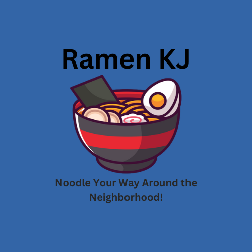

<!DOCTYPE html>
<html lang="en">

<head>
    <meta charset="UTF-8">
    <meta http-equiv="X-UA-Compatible" content="IE=edge">
    <meta name="viewport" content="width=device-width, initial-scale=1.0">
    <title>Ramen KJ Geoguessrr</title>
    <link rel="stylesheet" href="./assets/style.css">
</head>
<body style="background-color: #f4faf8;" onload="resize();authenticateLogin();">
    

        
PLAY

        
STATS

        
TUTORIAL

        
LEADERBOARD

        
        
</body>

</html>

<!-- Start of Website Content

    <h1>RAMEN KJ</h1>
    
4S Ranch/Del Sur Geoguesser

<!--About Our Team-->
<!-- <section class="team">
    <h1>CONTRIBUTORS</h1>
    
description of the team

    

        

            <h1></h1>
            <h3>Evan Aparri</h3>
            
Backend/DevOp

        

        

            <h1></h1>
            <h3>Nathan Kim</h3>
            
Frontend

        

        

            <h1></h1>
            <h3>Max Wu</h3>
            
Frontend

        

    

</section>
<section class="team1">

    

        <h1></h1>
        <h3>Ryan Hakimipour</h3>
        
Frontend

    

    

        <h1></h1>
        <h3>Aniket Chakradeo</h3>
        
Frontend

    

    

        <h1></h1>
        <h3>Kalani Cabral-Omana</h3>
        
Frontend

    

    

        <h1></h1>
        <h3>Jaden Nguyen</h3>
        
Game Developer

    

</section> --> -->